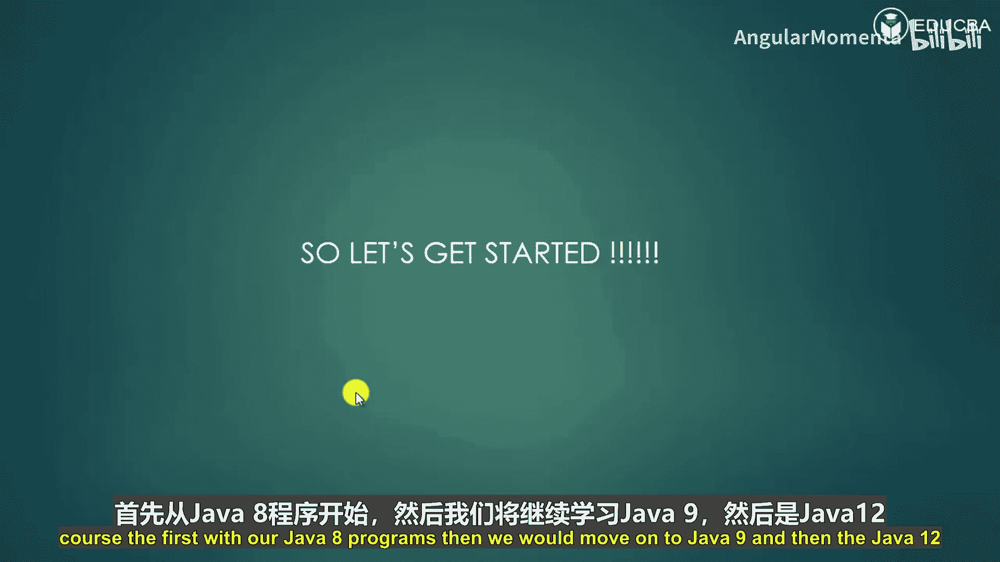
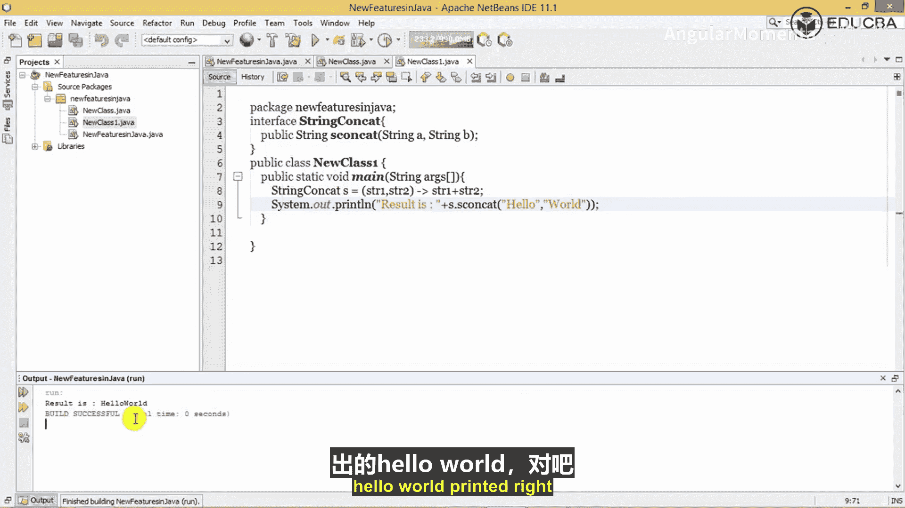

# 001：课程简介

在本课程中，我们将学习Java 8、Java 9和Java 12版本中引入的一些新特性。这些特性旨在帮助开发者编写更简洁、高效的代码。我们将从Java 8的核心概念开始，逐步深入到后续版本的增强功能。

## Java 8 涵盖主题

以下是Java 8部分我们将要学习的主要内容：

*   **Lambda表达式**：一种简洁的匿名函数表示法。
*   **方法引用**：用于直接引用已有方法或构造函数的语法糖。
*   **函数式接口**：只包含一个抽象方法的接口。
*   **Java字符串增强**：对String类的新增方法。
*   **流过滤器**：用于处理集合数据的声明式操作。
*   **接口的默认方法与静态方法**：接口中允许包含具体实现的方法。
*   **For-each循环增强**：迭代操作的改进。
*   **Stream收集器类**：用于将流转换为各种形式的汇总结果。
*   **StringJoiner类**：用于构造由分隔符分隔的字符序列。
*   **Optional类**：用于避免空指针异常的容器类。
*   **并行数组排序**：利用多核处理器进行高效排序。

## Java 9 涵盖主题

上一节我们介绍了Java 8的主要特性，本节中我们来看看Java 9带来的新变化。

*   **接口中的私有方法**：允许在接口中定义私有辅助方法。
*   **Try-with-resources增强**：资源自动管理语句的改进。
*   **匿名内部类的钻石操作符**：允许在匿名类中使用钻石操作符(`<>`)。
*   **Stream API增强**：增加了如`takeWhile`、`dropWhile`等方法。
*   **Java 9模块系统**：引入了模块化系统来管理代码依赖和封装。

## Java 12 涵盖主题

在了解了Java 8和9之后，我们最后将探索Java 12中的一些新特性。

*   **G1 Stream API**：为G1垃圾收集器新增的API。
*   **紧凑数字格式**：用于格式化数字的紧凑表示形式。
*   **字符串新方法**：如`indent()`、`transform()`等。
*   **Switch表达式（预览特性）**：允许`switch`语句有返回值并简化写法。

## 环境准备



要实践本课程的所有示例，你需要准备以下开发环境：

*   **集成开发环境**：你可以从提供的链接免费下载IntelliJ IDEA。
*   **Java开发工具包**：你需要从提供的链接下载并安装JDK 13版本，该版本可在Windows、Mac或Linux操作系统上免费获取。

## 开始实践

现在，让我们开始本课程的实践部分。我们将首先创建Java 8的程序，然后逐步过渡到Java 9和Java 12的特性。

---

## 现代Java特性：02：Lambda表达式入门

在上一节课程简介中，我们概述了将要学习的各个Java版本特性。本节中，我们将深入探讨Java 8引入的第一个核心特性——Lambda表达式。

Lambda表达式是Java 8引入的一个新特性。它是一个匿名函数，即没有名称，也不属于任何类。Lambda表达式的概念最初源自LISP编程语言。

要创建一个Lambda表达式，我们在Lambda操作符（`->`）的左侧指定输入参数（如果有的话），并将表达式或语句块放在操作符的右侧。

### 方法与Lambda表达式对比

我们可以通过对比Java方法和Lambda表达式来理解其结构：

*   **Java方法**主要包含以下部分：
    *   名称
    *   参数列表
    *   方法体
    *   返回类型
*   **Lambda表达式**主要包含以下部分：
    *   参数列表
    *   方法体
    *   （没有名称，因为它是匿名的）
    *   （没有显式的返回类型，Java 8编译器能够通过检查代码推断出返回类型）

### 函数式接口

要使用Lambda表达式，你需要创建一个自己的函数式接口，或者使用Java提供的预定义函数式接口。**函数式接口**是指**只包含一个抽象方法**的接口。例如，`Runnable`、`Callable`、`ActionListener`都是函数式接口。

在Java 8之前，我们使用匿名内部类来实现函数式接口的唯一抽象方法。现在，让我们通过示例来学习如何创建Lambda表达式。

---

### 示例1：无参数的Lambda表达式

首先，我们创建一个无参数的Lambda表达式示例。

1.  **定义函数式接口**：
    ```java
    @FunctionalInterface
    interface MyFunctionalInterface {
        String sayHello();
    }
    ```

2.  **使用Lambda表达式实现接口**：
    ```java
    public class LambdaExample1 {
        public static void main(String[] args) {
            // 使用Lambda表达式实现接口的抽象方法
            MyFunctionalInterface msg = () -> {
                return "Hello";
            };
            // 调用方法
            System.out.println(msg.sayHello()); // 输出: Hello
        }
    }
    ```
    执行这段代码，将在控制台输出字符串“Hello”。

---

### 示例2：单个参数的Lambda表达式

上一节我们创建了无参数的Lambda表达式，本节中我们来看看如何创建带有单个参数的Lambda表达式。

1.  **定义函数式接口**：
    ```java
    @FunctionalInterface
    interface MyFunctionalInterface1 {
        int incrementByFive(int a);
    }
    ```

2.  **使用Lambda表达式实现接口**：
    ```java
    public class LambdaExample2 {
        public static void main(String[] args) {
            // Lambda表达式接收一个参数a，并返回a+5
            MyFunctionalInterface1 f = (a) -> a + 5;
            // 调用方法，传入参数22
            System.out.println(f.incrementByFive(22)); // 输出: 27
        }
    }
    ```
    执行此代码，将计算22 + 5并输出结果27。

---

### 示例3：多个参数的Lambda表达式

最后，我们来看一个传递多个参数的Lambda表达式示例。

1.  **定义函数式接口**：
    ```java
    @FunctionalInterface
    interface StringConcat {
        String sConcat(String a, String b);
    }
    ```

2.  **使用Lambda表达式实现接口**：
    ```java
    public class LambdaExample3 {
        public static void main(String[] args) {
            // Lambda表达式接收两个字符串参数，并将它们连接起来
            StringConcat s = (s1, s2) -> s1 + s2;
            // 调用方法，传入"Hello"和"World"
            String result = s.sConcat("Hello", "World");
            System.out.println("Result is: " + result); // 输出: Result is: HelloWorld
        }
    }
    ```
    执行这段代码，将输出连接后的字符串“HelloWorld”。

---

## 总结



本节课中我们一起学习了Lambda表达式的基础知识。我们了解到Lambda表达式是Java 8引入的匿名函数，它使代码更加简洁。我们通过对比方法与Lambda表达式的结构理解了其组成，并明确了Lambda表达式需要与函数式接口（只有一个抽象方法的接口）配合使用。最后，我们通过三个由浅入深的实践示例，学会了如何创建无参数、单参数以及多参数的Lambda表达式。在接下来的课程中，我们将继续探索Java 8的其他现代特性。