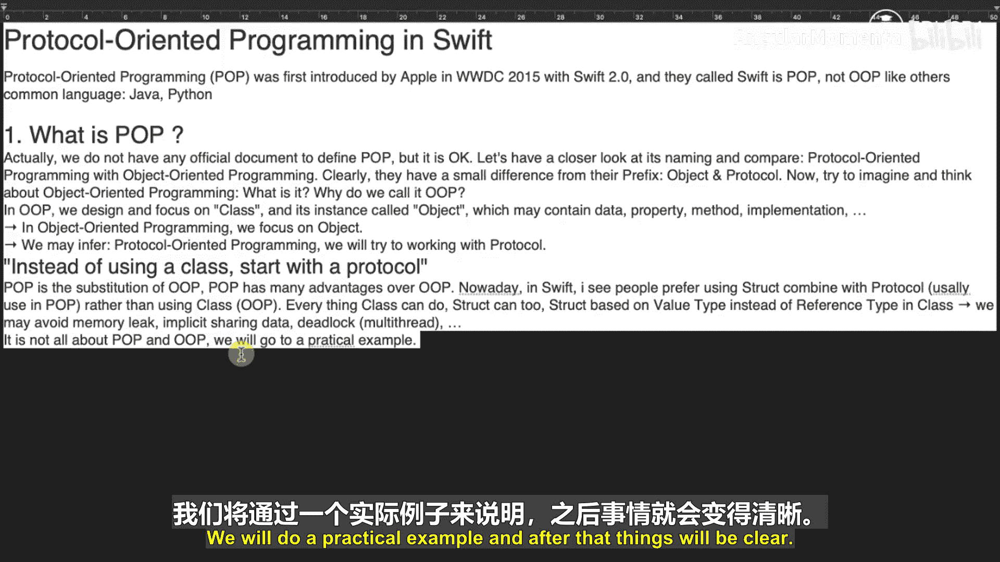
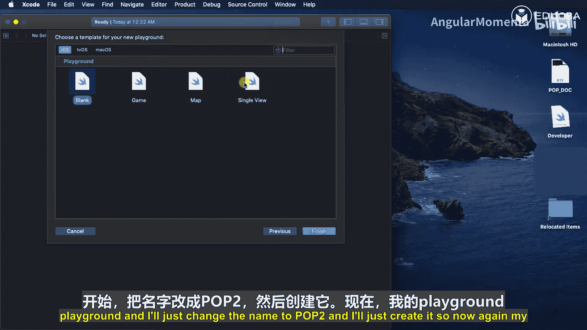
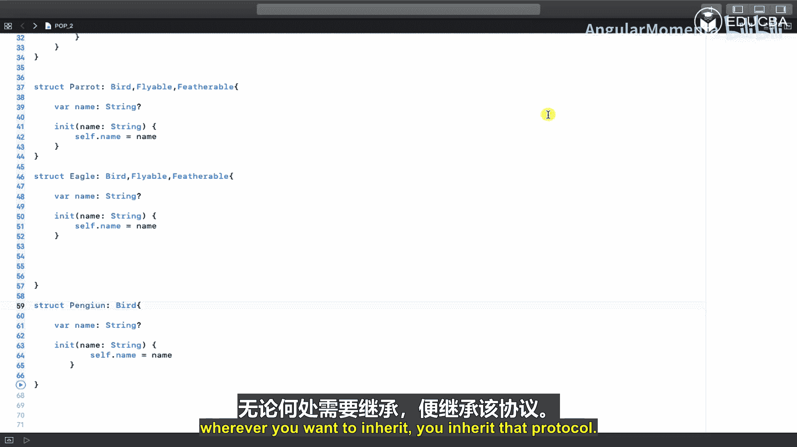

# 001：面向协议编程导论 🐦

在本节课中，我们将要学习Swift中一个非常重要的概念——面向协议编程。我们将通过对比面向对象编程，来理解面向协议编程的核心思想、优势以及基本用法。

面向协议编程，通常简称为POP，是苹果公司在2015年WWDC大会上随Swift 2.0引入的新范式。它与我们熟知的面向对象编程有所不同。在面向对象编程中，我们设计和关注的是**类**及其**实例**（即对象），对象可以包含数据、属性和方法实现。而在面向协议编程中，我们则从**协议**开始构建程序。

面向协议编程可以看作是面向对象编程的一种替代方案，并且在Swift中具有许多优势。如今，许多人更倾向于结合**结构体**使用面向协议编程，而非使用基于**引用类型**的类。结构体基于**值类型**，这有助于避免内存泄漏和隐式共享数据带来的多线程问题。

---

上一节我们介绍了面向协议编程的基本概念，本节中我们来看看一个具体的例子，通过对比两种编程范式来加深理解。

首先，我们使用面向对象编程的方式来建模“鸟”这个类别。



我们创建一个 `Bird` 类，它拥有两个属性：`name`（名字）和 `feather`（羽毛），以及一个 `fly`（飞行）方法。

```swift
class Bird {
    var name: String
    var feather: String

    init(name: String, feather: String) {
        self.name = name
        self.feather = feather
    }

    func fly() {
        // 飞行行为
    }
}
```

接着，我们创建两个子类：`Parrot`（鹦鹉）和 `Eagle`（鹰）。它们继承自 `Bird` 类，并重写了初始化方法。

```swift
class Parrot: Bird {
    override init(name: String, feather: String) {
        super.init(name: name, feather: feather)
    }

    override func fly() {
        // 鹦鹉的飞行行为
    }
}

class Eagle: Bird {
    override init(name: String, feather: String) {
        super.init(name: name, feather: feather)
    }

    override func fly() {
        // 鹰的飞行行为
    }
}
```

现在，问题出现了。当我们想添加一个 `Penguin`（企鹅）类时，我们发现企鹅是鸟，但它**没有羽毛**且**不能飞**。在面向对象编程中，由于继承了 `Bird` 类，我们被迫拥有 `feather` 属性和 `fly` 方法，即使它们对企鹅不适用。我们只能通过重写 `fly` 方法并给出“我不能飞”这样的实现来勉强解决，但这破坏了设计，并且如果子类众多，会带来大量的重复代码。

```swift
class Penguin: Bird {
    override init(name: String, feather: String) {
        super.init(name: name, feather: feather)
    }

    override func fly() {
        print(“I cannot fly.”) // 被迫重写，设计不优雅
    }
}
```

---

上一节我们看到了面向对象编程在应对某些场景时的局限性，本节中我们来看看如何使用面向协议编程优雅地解决这个问题。

面向协议编程的核心是将设计从“类”转变为“协议”和“结构体”。我们不再从一个庞大的基类开始，而是定义一系列细粒度的协议。

首先，我们定义三个协议，分别描述鸟的不同特征：

1.  `Bird` 协议：定义所有鸟都有的基本属性，如名字。
2.  `Flyable` 协议：定义可飞行的能力。
3.  `Featherable` 协议：定义拥有羽毛的特性。


```swift
protocol Bird {
    var name: String { get set }
}



protocol Flyable {
    func fly()
}

protocol Featherable {
    var feather: String { get set }
}
```

我们可以为协议提供默认实现，这通过**扩展**来完成。例如，为 `Flyable` 协议提供一个通用的 `fly` 方法实现。

```swift
extension Flyable {
    func fly() {
        print(“I can fly.”)
    }
}

extension Featherable {
    var feather: String {
        get { return “” }
        set { }
    }
}
```

现在，我们可以通过组合不同的协议来创建具体的类型。以下是使用**结构体**和协议组合的例子：

对于鹦鹉和鹰，它们具有全部三种特征。

```swift
struct Parrot: Bird, Flyable, Featherable {
    var name: String
    var feather: String

    init(name: String) {
        self.name = name
        self.feather = “Colorful feathers”
    }
}

struct Eagle: Bird, Flyable, Featherable {
    var name: String
    var feather: String

    init(name: String) {
        self.name = name
        self.feather = “Brown feathers”
    }
}
```

对于企鹅，它只是一只鸟，既不能飞也没有羽毛。因此，我们只让它遵循 `Bird` 协议。

```swift
struct Penguin: Bird {
    var name: String

    init(name: String) {
        self.name = name
    }
}
```

通过这种方式，`Penguin` 结构体非常简洁，只包含了它确实拥有的属性。它没有被迫实现 `fly` 方法或 `feather` 属性。如果未来有一种鸟（比如鸵鸟）不能飞但有羽毛，我们只需让它遵循 `Bird` 和 `Featherable` 协议即可，设计非常灵活。

---

本节课中我们一起学习了Swift中的面向协议编程。

我们首先了解了POP的基本概念及其与OOP的主要区别：OOP围绕**类**和**对象**构建，而POP围绕**协议**构建。接着，我们通过一个“鸟”的建模示例，对比了两种范式。在OOP中，通过继承导致的“紧耦合”使得像企鹅这样的特例难以优雅处理。而在POP中，我们通过定义细粒度的协议（`Bird`， `Flyable`， `Featherable`）并利用**协议组合**与**扩展**，让每个类型（如 `Parrot`， `Eagle`， `Penguin`）只声明自己真正拥有的能力，实现了“松耦合”和更高的灵活性。



面向协议编程的核心优势在于它鼓励组合而非继承，使代码更模块化、更易于测试和维护，并能更好地利用Swift值类型（如结构体）的优势。在实际项目中，应根据具体需求决定是否采用POP。理解并善用这一范式，将帮助你写出更清晰、更强大的Swift代码。