# 002：显示水果列表 🍎

在本节课中，我们将学习如何使用委托模式和模型类创建一个“最爱水果列表”应用。我们将构建一个显示水果列表的界面，并允许用户选择他们喜欢的水果。被选中的水果将保存在模型类中，并在另一个视图控制器中以表格形式显示。

上一节我们介绍了项目的基本设置，本节中我们来看看如何构建显示水果列表的界面。

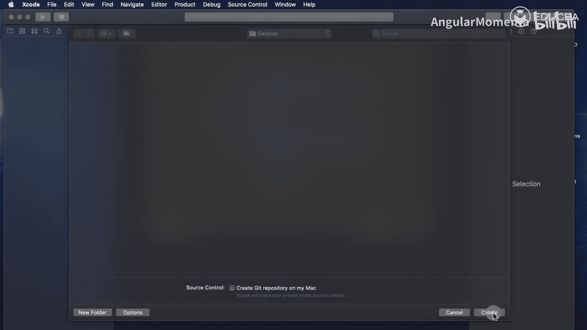

## 创建项目与界面

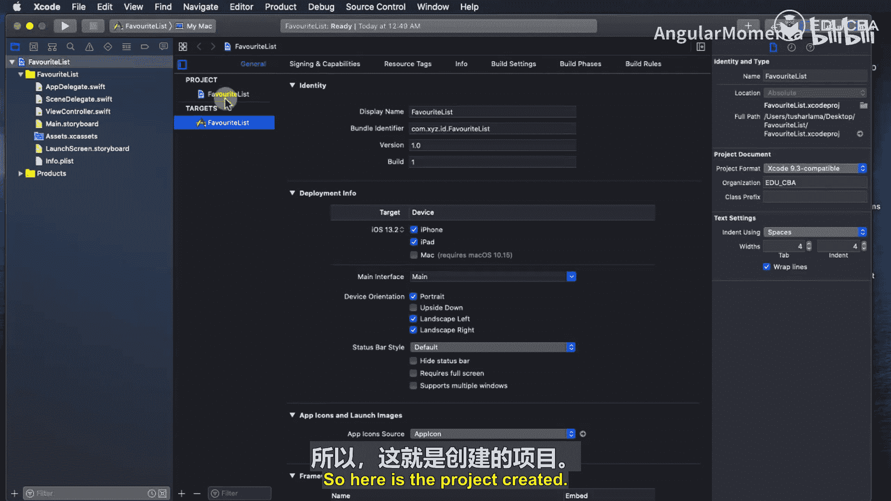

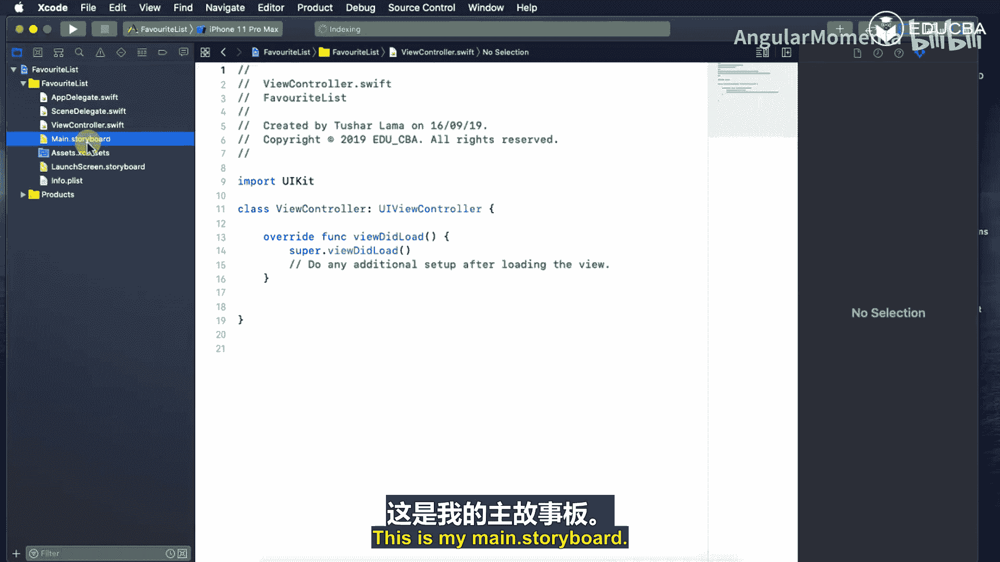

首先，我们创建一个新的Xcode项目。选择“Single View App”模板，将项目命名为“FavouriteList”。在项目设置中，确保界面选项选择了“Storyboard”，并取消勾选“Use Core Data”、“Include Unit Tests”和“Include UI Tests”。

项目创建完成后，我们会在项目导航器中看到以下主要文件：
*   `AppDelegate.swift`：处理应用程序生命周期。
*   `ViewController.swift`：主视图控制器类。
*   `Main.storyboard`：主故事板文件，用于设计用户界面。

## 设计主界面

接下来，我们在故事板中设计主界面。

1.  打开 `Main.storyboard`，从对象库中拖拽一个 `UITableView` 到默认的 `ViewController` 场景中。
2.  使用自动布局约束，让表格视图填满整个安全区域。
3.  在表格视图中，我们需要一个自定义的单元格来显示每种水果。从对象库中拖拽一个 `UITableViewCell` 到表格视图内。
4.  在这个自定义单元格中，我们添加两个UI组件：
    *   一个 `UILabel`，用于显示水果名称。将其字体大小调整为20，并设置一个背景色以便区分。
    *   一个 `UIButton`，作为“收藏”按钮。调整其大小，并设置一个背景色。

为了管理这个自定义单元格，我们需要为其创建一个对应的Swift类。

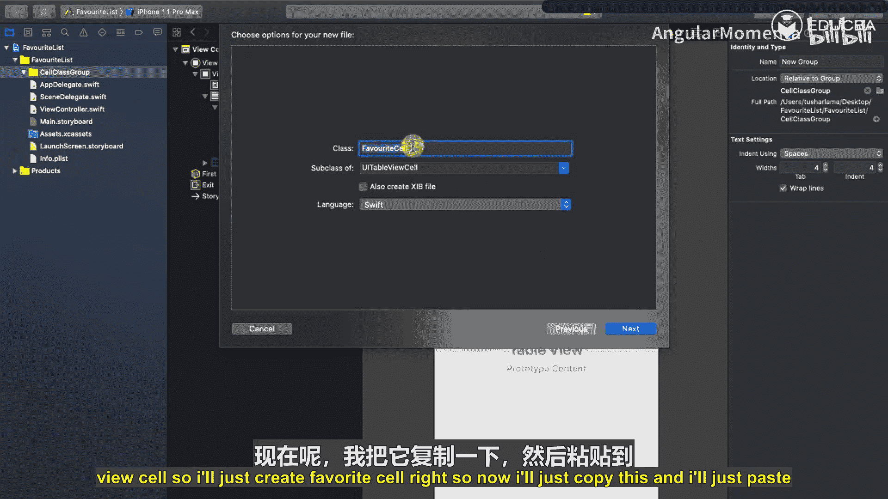

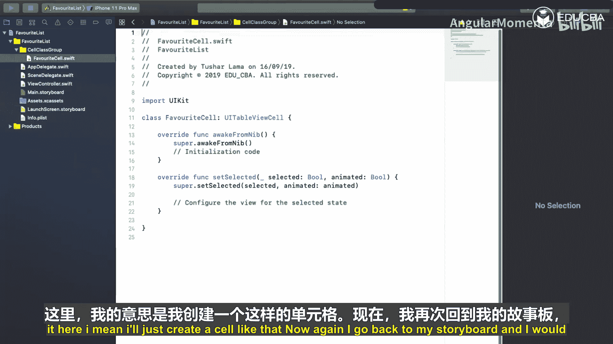

## 创建自定义单元格类

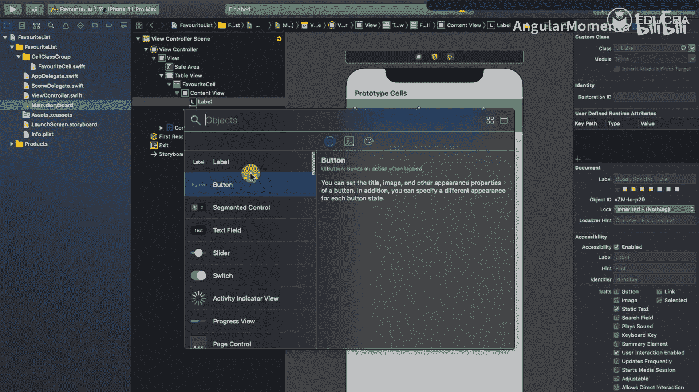

以下是创建自定义单元格类的步骤：

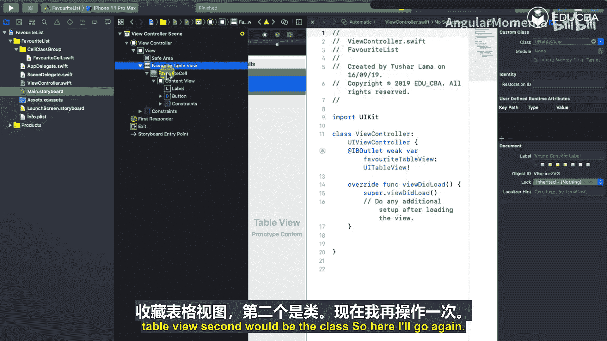

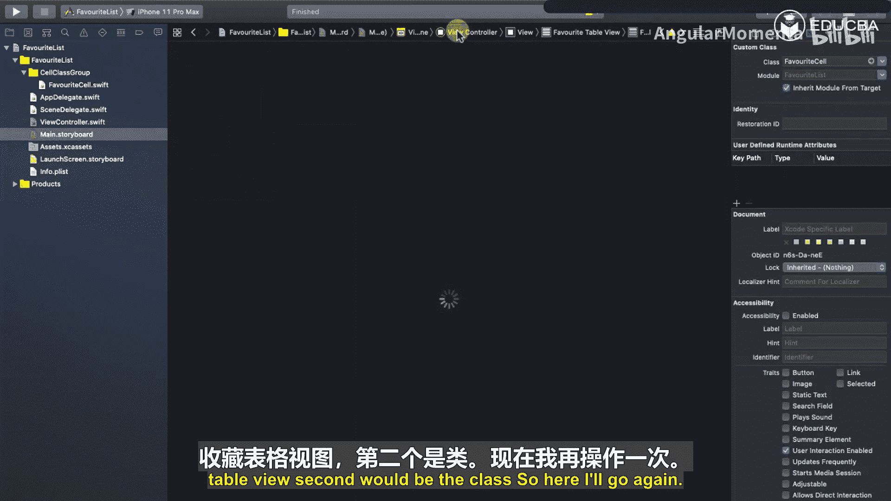

1.  在Xcode中，右键点击项目导航器，选择“New Group”，创建一个名为“Cell Class”的组。
2.  在该组内，选择“File” -> “New” -> “File…”，创建一个新的Cocoa Touch Class。
3.  将类命名为 `FavoriteCell`，并确保其继承自 `UITableViewCell`。
4.  创建完成后，回到故事板。选中我们设计的自定义单元格，在身份检查器中将它的类设置为 `FavoriteCell`，在属性检查器中将它的重用标识符也设置为 `FavoriteCell`。
5.  现在，我们需要将故事板中的UI组件与 `FavoriteCell` 类中的属性和方法连接起来。打开辅助编辑器，确保 `FavoriteCell.swift` 文件在右侧显示。
    *   将单元格中的 `UILabel` 拖拽到代码中，创建一个名为 `fruitNameLabel` 的 `IBOutlet`。
    *   将单元格中的 `UIButton` 拖拽到代码中，创建一个名为 `favoriteButton` 的 `IBOutlet`。
    *   同样为这个按钮创建一个 `IBAction`，命名为 `favoriteButtonAction`。我们稍后将通过这个动作来触发委托。

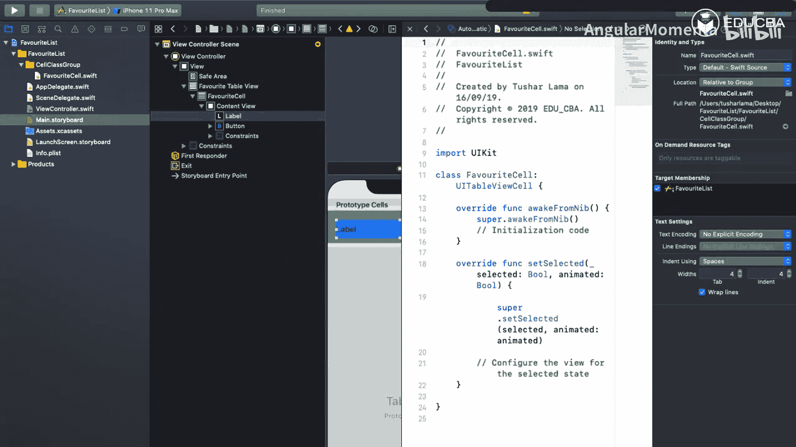

连接完成后，我们可以将单元格和按钮的背景色恢复为白色，并清空标签的默认文本。

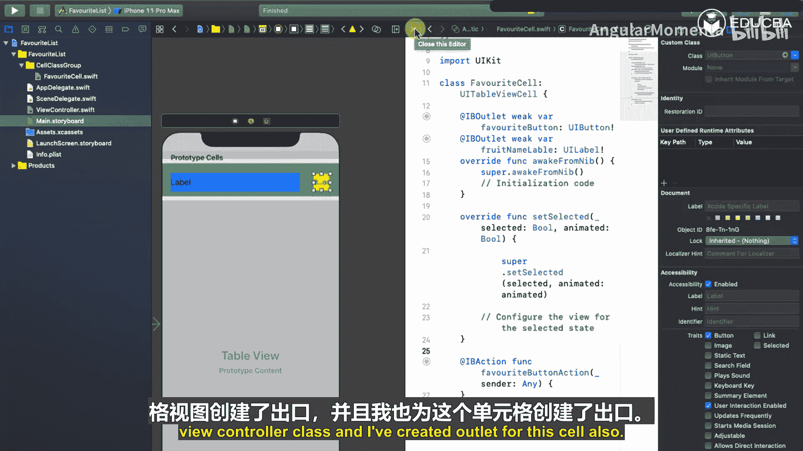

## 配置视图控制器

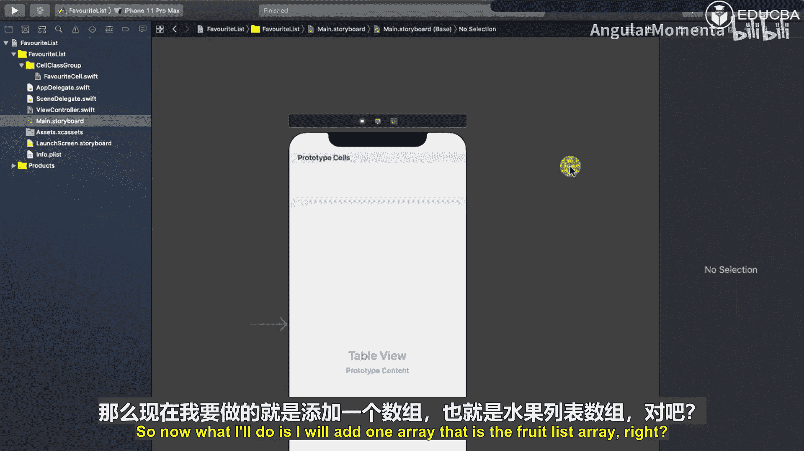

现在，我们需要在主视图控制器中配置表格视图。

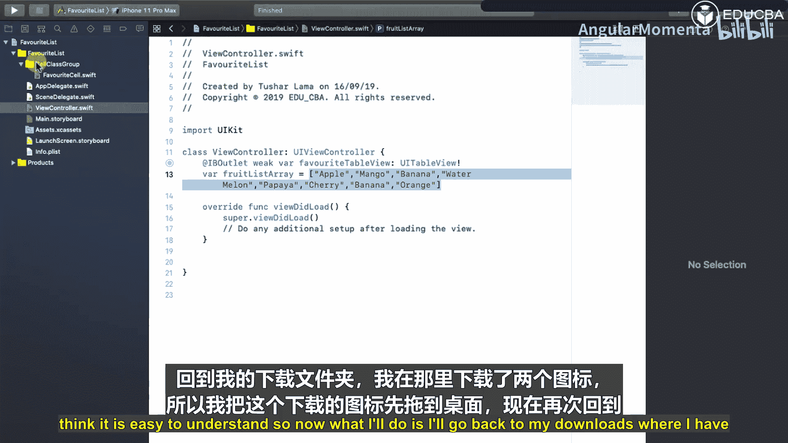

1.  首先，在 `ViewController.swift` 中，为故事板中的表格视图创建一个 `IBOutlet`，命名为 `favoriteTableView`。
2.  接着，我们需要一个数据源来填充表格。在 `ViewController` 类中，定义一个字符串数组 `fruitListArray`，并初始化一些水果名称。

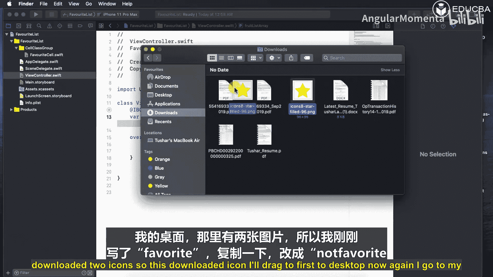

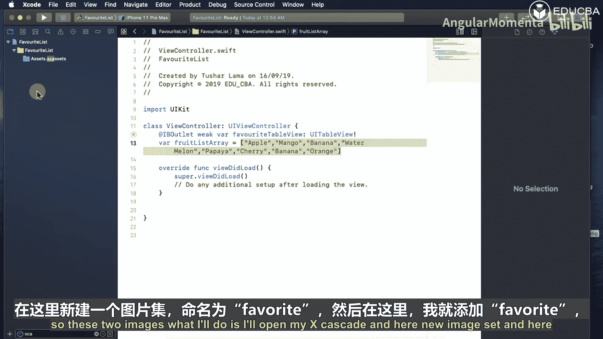

```swift
var fruitListArray: [String] = ["Apple", "Mango", "Banana", "Cherry", "Grapes"]
```

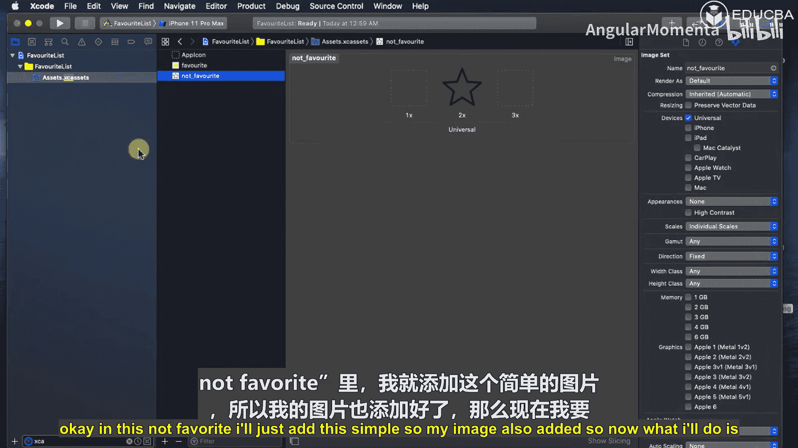

3.  为了让表格视图显示数据，我们需要让 `ViewController` 遵守 `UITableViewDataSource` 协议。通常我们使用扩展来实现协议，使代码结构更清晰。

在 `ViewController.swift` 文件末尾添加以下扩展：

```swift
extension ViewController: UITableViewDataSource {
    // 返回表格的行数，等于水果数组的元素个数
    func tableView(_ tableView: UITableView, numberOfRowsInSection section: Int) -> Int {
        return fruitListArray.count
    }

    // 配置并返回每一行的单元格
    func tableView(_ tableView: UITableView, cellForRowAt indexPath: IndexPath) -> UITableViewCell {
        // 通过重用标识符获取自定义单元格实例
        guard let cell = tableView.dequeueReusableCell(withIdentifier: "FavoriteCell", for: indexPath) as? FavoriteCell else {
            return UITableViewCell()
        }

        // 设置单元格标签的文本为对应位置的水果名称
        cell.fruitNameLabel.text = fruitListArray[indexPath.row]

        // 将按钮的tag设置为当前行号，便于后续识别哪个按钮被点击
        cell.favoriteButton.tag = indexPath.row

        // 为按钮设置默认的“未收藏”状态图片
        cell.favoriteButton.setImage(UIImage(named: "not_favourite"), for: .normal)

        return cell
    }
}
```

4.  最后，在 `ViewController` 的 `viewDidLoad` 方法中，将表格视图的 `dataSource` 属性设置为 `self`。

```swift
override func viewDidLoad() {
    super.viewDidLoad()
    favoriteTableView.dataSource = self
}
```

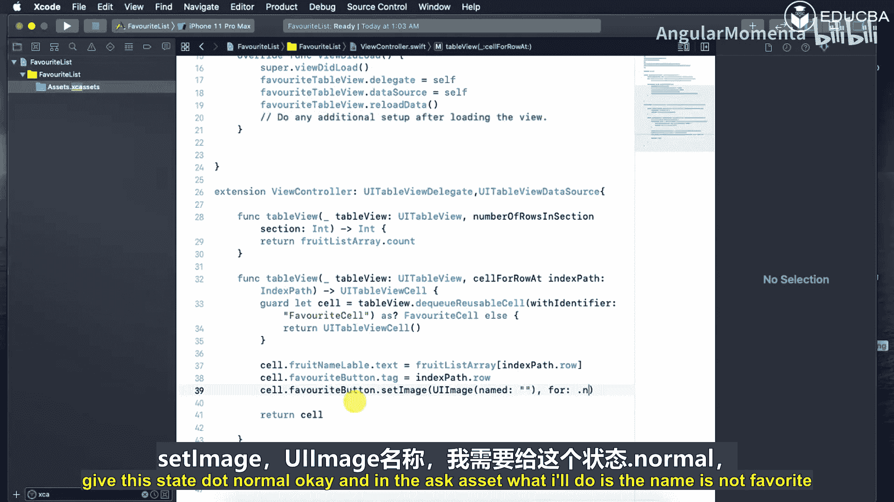

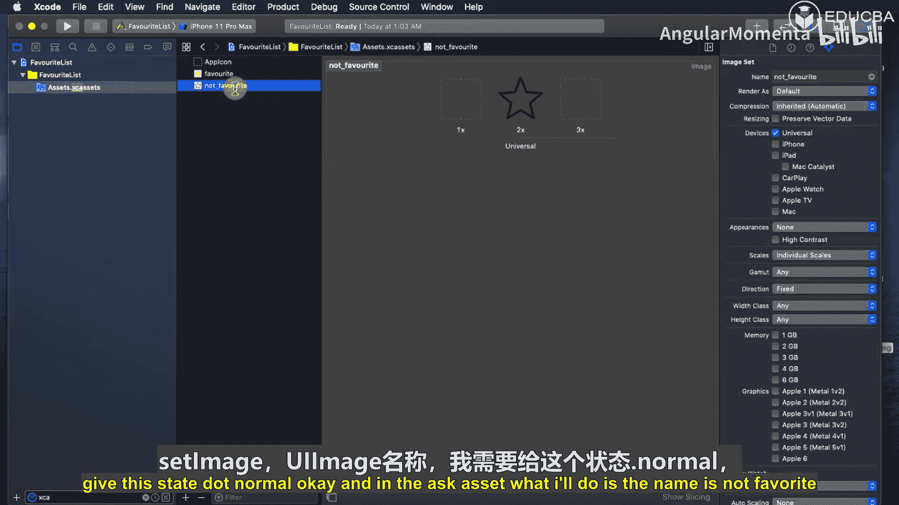

## 添加资源图片

为了区分收藏状态，我们需要两张图片：一颗实心星星（收藏）和一颗空心星星（未收藏）。请确保已将这两张图片（例如命名为 `favourite` 和 `not_favourite`）添加到项目的资源目录（Assets.xcassets）中。

## 运行与预览

至此，显示水果列表的基础功能已经完成。运行应用，你应该能看到一个表格，其中列出了我们在数组中定义的所有水果名称，并且每一行旁边都有一个显示为空心星星的按钮。

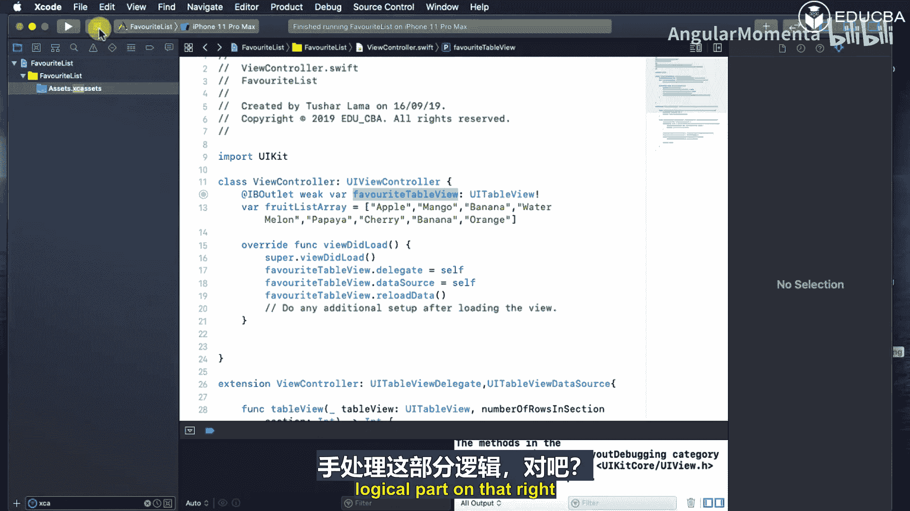

本节课中我们一起学习了如何创建Swift项目、使用故事板设计包含表格视图的界面、创建自定义表格单元格以及配置表格的数据源。在下一节中，我们将为“收藏”按钮添加交互逻辑，实现状态的切换和数据保存。