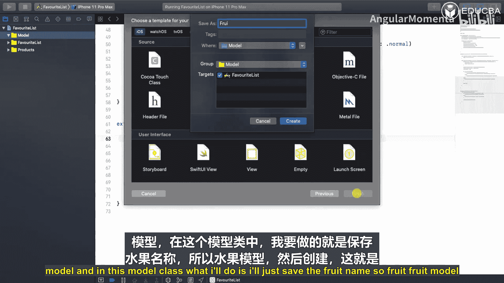
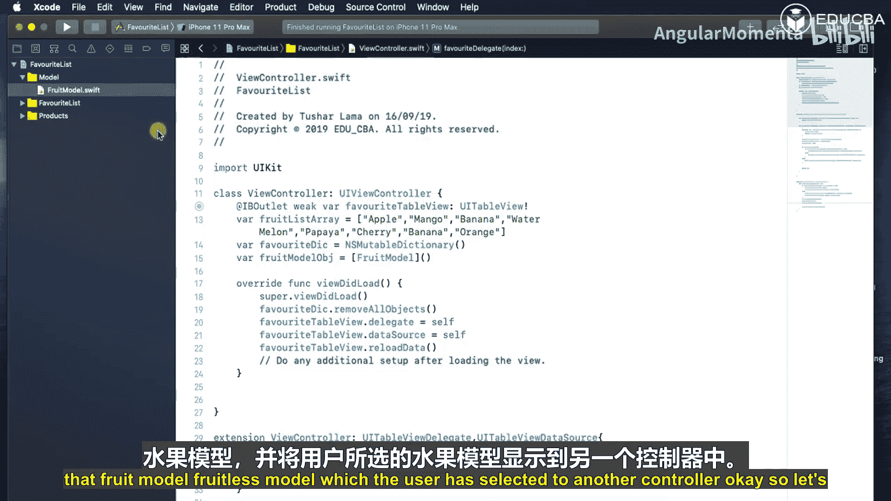
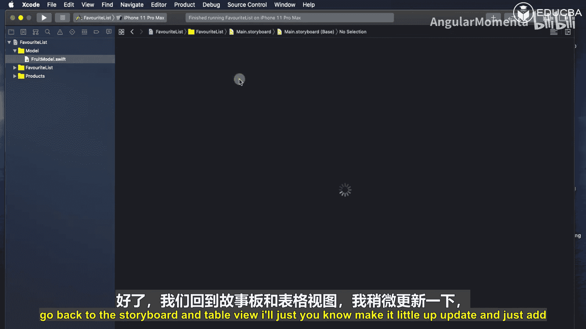
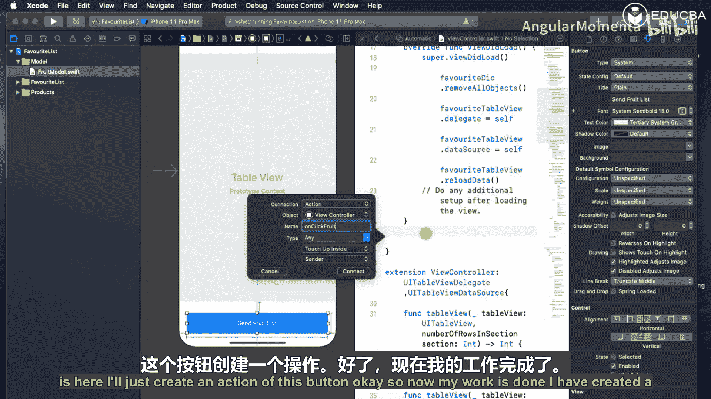
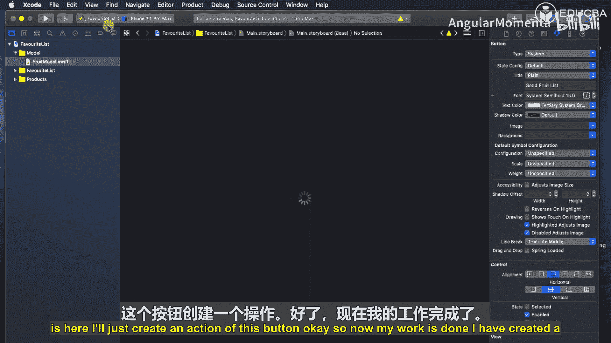
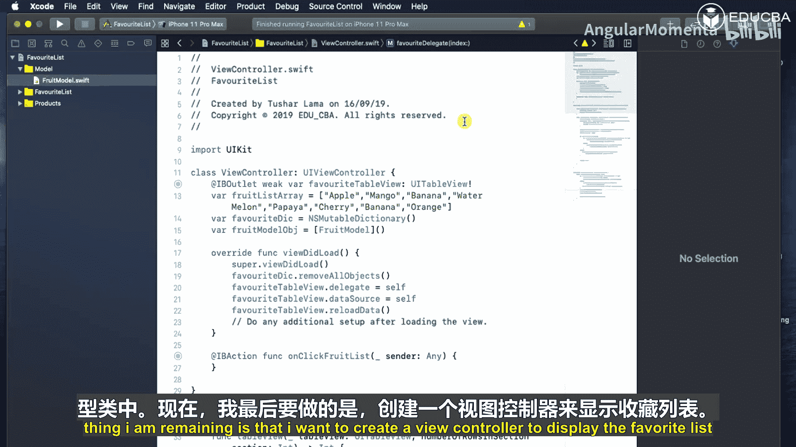

# 003：逻辑与偏好选择

在本节课中，我们将为水果列表视图控制器实现逻辑部分。我们将处理“我的最爱”按钮的点击事件，改变星星图标的颜色，并创建一个模型类来存储用户选择的水果名称，以便在下一个视图控制器中显示。

## 创建协议与委托

上一节我们完成了界面布局，本节中我们来看看如何通过协议和委托模式来处理按钮的交互逻辑。

首先，在自定义单元格类 `FruitCell` 中创建一个协议。协议本质上是一组方法的蓝图，任何采纳该协议的类都必须实现这些方法，从而获得相应的功能。

以下是协议的定义：

```swift
protocol FavoriteDelegate {
    func favoriteTapped(at index: Int)
}
```

在单元格类中，我们创建一个该协议的委托对象：

```swift
var delegate: FavoriteDelegate?
```

接下来，为“最爱”按钮的点击事件设置目标动作。当按钮被点击时，通过委托将按钮的标签（即单元格的索引）传递出去。

```swift
@IBAction func favoriteButtonTapped(_ sender: UIButton) {
    delegate?.favoriteTapped(at: sender.tag)
}
```

## 在视图控制器中实现委托

现在，我们需要在主视图控制器中采纳并实现这个协议，以响应单元格的按钮点击。

首先，让视图控制器采纳 `FavoriteDelegate` 协议：

```swift
class FruitListViewController: UIViewController, FavoriteDelegate {
    // ... 其他代码
}
```

在 `viewDidLoad` 方法中，将表格视图的单元格委托设置为 `self`：

```swift
override func viewDidLoad() {
    super.viewDidLoad()
    // 假设你的tableView变量名为tableView
    // 通常在配置cell时设置delegate，这里是一个概念性步骤
}
```

然后，实现协议要求的方法 `favoriteTapped(at:)`。在这个方法里，我们需要处理用户的选择状态。

## 管理选择状态与数据模型

为了跟踪哪些水果被用户标记为“最爱”，我们需要一个可变的数据结构来存储状态。这里使用 `NSMutableDictionary`，因为它允许我们动态地添加和移除条目。



在视图控制器中声明一个字典：

```swift
var favoriteDictionary = NSMutableDictionary()
```

在 `favoriteTapped(at:)` 方法中，我们根据索引更新这个字典和模型数据：

```swift
func favoriteTapped(at index: Int) {
    let key = String(index)
    
    // 检查该水果是否已被收藏
    if let _ = favoriteDictionary.value(forKey: key) {
        // 如果已存在，则移除（取消收藏）
        favoriteDictionary.removeObject(forKey: key)
        // 同时从模型数组中移除对应水果
        // 假设 fruitModelArray 是存储 FruitModel 的数组
        // fruitModelArray.remove(at: index) // 注意：实际索引可能需要转换
    } else {
        // 如果不存在，则添加（收藏）
        favoriteDictionary.setValue(index, forKey: key)
        // 同时将水果添加到模型数组
        // let fruitName = fruitNamesArray[index] // 假设有一个水果名称数组
        // let newFruit = FruitModel(name: fruitName)
        // fruitModelArray.append(newFruit)
    }
    
    // 刷新表格视图以更新按钮图标
    tableView.reloadData()
}
```

在配置单元格的 `cellForRowAt` 方法中，根据 `favoriteDictionary` 来设置按钮的显示状态（例如，实心星或空心星）。

## 创建数据模型

为了将选中的水果列表传递到下一个界面，我们需要一个数据模型。创建一个名为 `FruitModel` 的类。

以下是模型类的定义：

```swift
class FruitModel {
    var fruitName: String
    
    init(fruitName: String) {
        self.fruitName = fruitName
    }
}
```

在视图控制器中，声明一个 `FruitModel` 类型的数组来存储被选中的水果：

```swift
var selectedFruits = [FruitModel]()
```





在 `favoriteTapped(at:)` 方法中更新这个数组，与更新 `favoriteDictionary` 的逻辑同步。

## 添加导航按钮并传递数据

最后，我们需要一个按钮来跳转到显示“最爱水果列表”的视图控制器。



1.  在故事板中，向 `FruitListViewController` 添加一个按钮，例如命名为“发送水果列表”。
2.  为按钮创建一个 `@IBAction` 方法。
3.  在该方法中，执行跳转（Segue），并在 `prepare(for:sender:)` 方法中将 `selectedFruits` 数组传递给目标视图控制器。



以下是跳转前准备数据的方法：

```swift
override func prepare(for segue: UIStoryboardSegue, sender: Any?) {
    if segue.identifier == "ShowFavoriteFruits" {
        let destinationVC = segue.destination as! FavoriteFruitsViewController
        destinationVC.favoriteFruits = self.selectedFruits
    }
}
```

## 总结



本节课中我们一起学习了如何为Swift应用实现交互逻辑与数据管理。我们首先创建了协议和委托来处理单元格内的按钮点击，然后使用 `NSMutableDictionary` 来管理用户的选择状态。接着，我们构建了 `FruitModel` 数据模型来结构化存储数据，并最终通过Segue将用户选择的“最爱水果”列表传递到新的视图控制器进行展示。通过这一系列步骤，我们完成了从用户交互到数据持久化再到界面跳转的完整逻辑链。