# 004：显示收藏列表 🍎


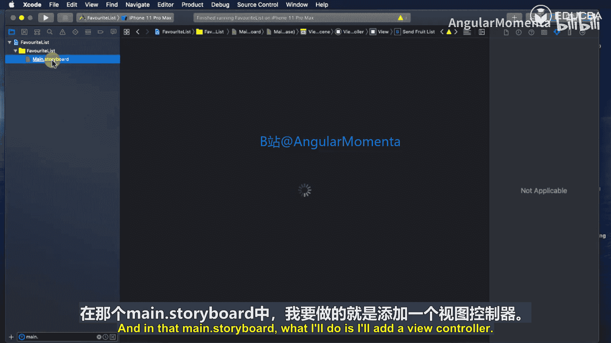

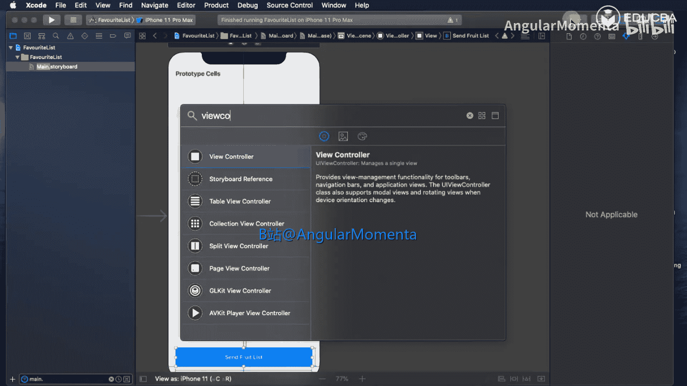

在本节课中，我们将学习如何在一个新的视图控制器中显示用户选择的“最爱水果”列表。我们将通过创建新的界面、设置表格视图、传递数据模型以及实现导航来完成这个功能。

---

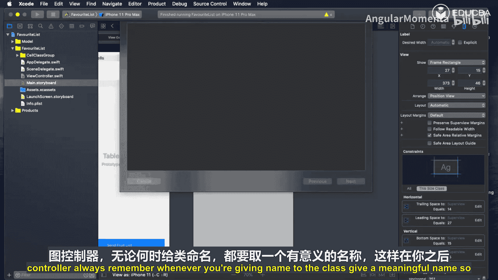

## 创建新视图控制器与界面


上一节我们介绍了如何收集用户的选择。本节中，我们来看看如何创建一个新的界面来展示这些选择。

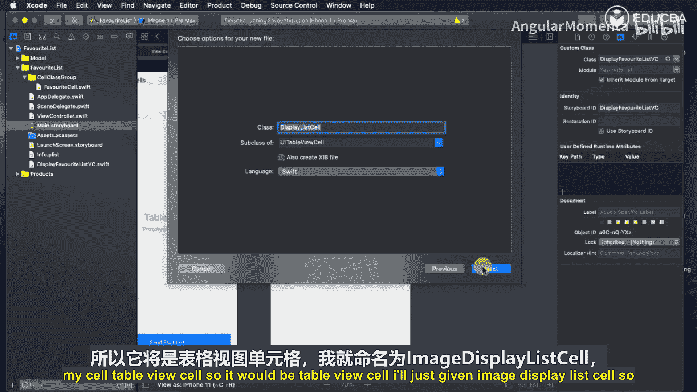

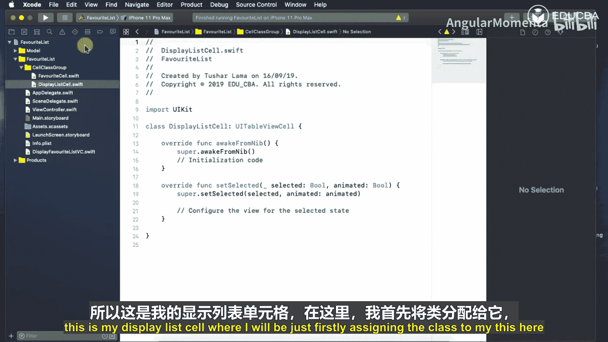

首先，我们需要在 `Main.storyboard` 中添加一个新的视图控制器。

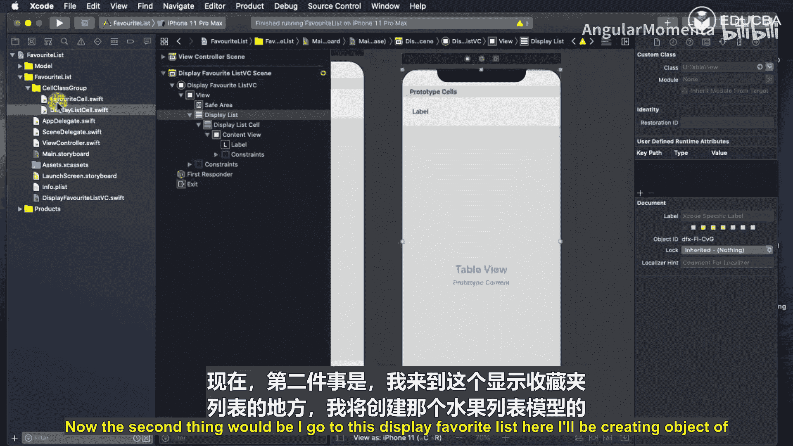

以下是具体步骤：
1.  打开 `Main.storyboard` 文件。
2.  从对象库中拖拽一个 `View Controller` 到画布上。
3.  在新添加的视图控制器中，拖入一个 `Table View`。
4.  在 `Table View` 内部，添加一个 `Table View Cell`。
5.  在 `Table View Cell` 中，添加一个 `Label` 用于显示水果名称。

由于 `Table View` 是 `Table View Cell` 的容器，我们需要为其设置约束以确保布局正确。

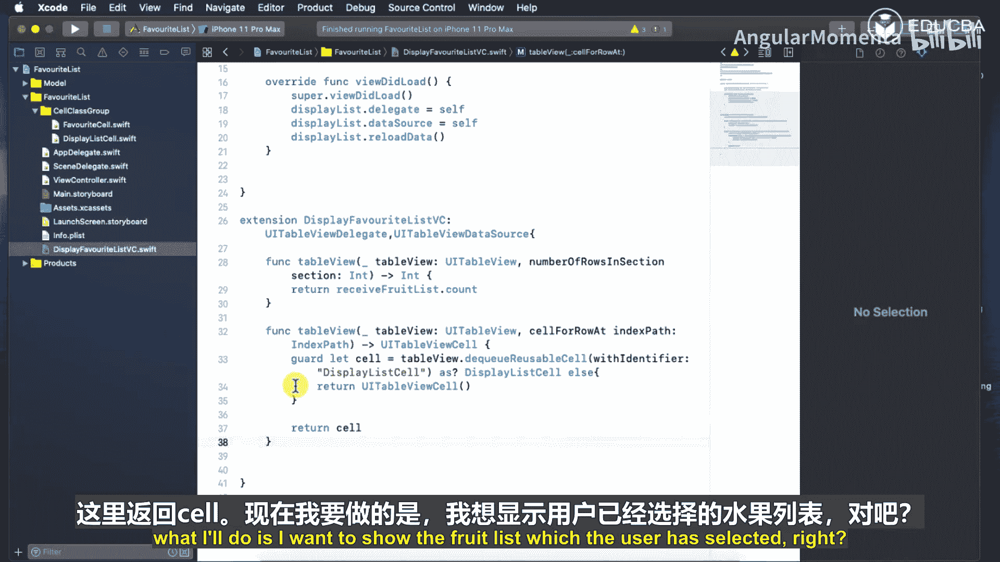

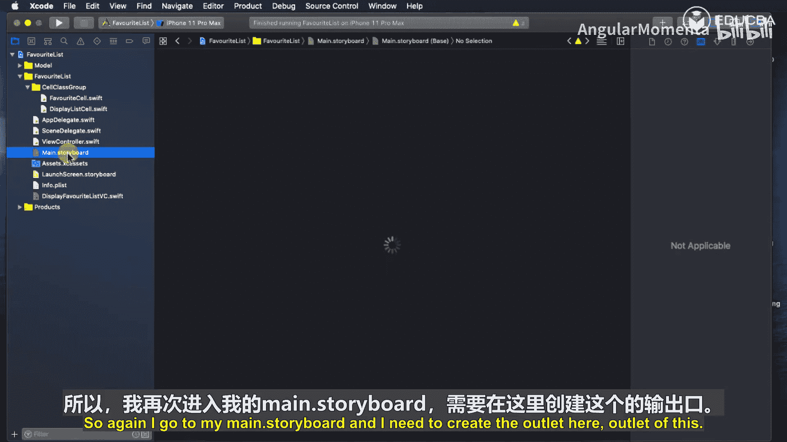

接下来，为 `Table View Cell` 中的 `Label` 设置约束，使其在单元格内正确显示。

---


## 创建视图控制器与单元格类

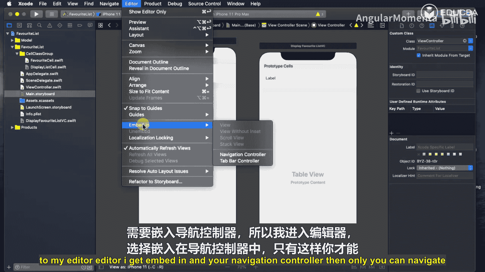

界面搭建完成后，我们需要创建对应的 Swift 类来管理逻辑。

以下是需要创建的类：
1.  **DisplayFavoriteListViewController**：这是一个 `UIViewController` 的子类，将作为新视图控制器的类。
2.  **DisplayCell**：这是一个 `UITableViewCell` 的子类，将作为自定义表格单元格的类。

为 `DisplayFavoriteListViewController` 类命名时，应使用有意义的名称，以便其他开发者理解其用途。

在故事板中，将新视图控制器的 `Class` 设置为 `DisplayFavoriteListViewController`，并将其表格单元格的 `Class` 设置为 `DisplayCell`，同时设置相同的 `Identifier`。

---


## 设置表格视图数据源与代理

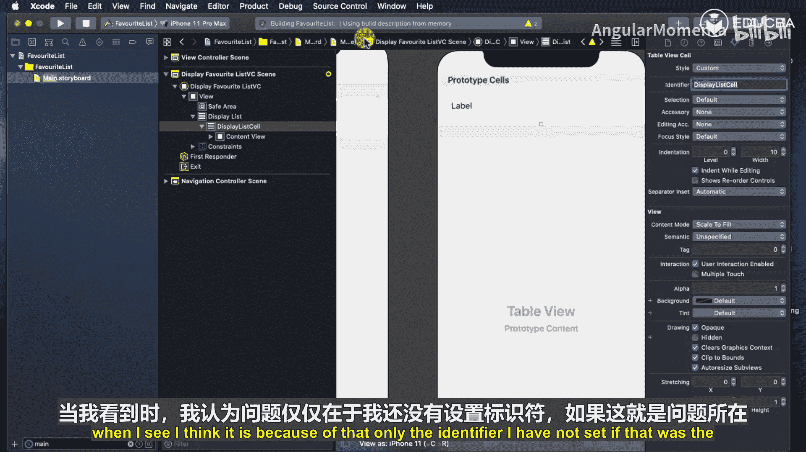

现在，我们需要在 `DisplayFavoriteListViewController` 中设置表格视图，并准备显示数据。

首先，在 `DisplayFavoriteListViewController` 中创建一个 `FruitModel` 类型的数组属性，用于接收从上一个界面传递过来的数据。

```swift
var receivedFruitNames: [FruitModel] = []
```

接着，在 `viewDidLoad` 方法中，将表格视图的 `delegate` 和 `dataSource` 设置为 `self`，并调用 `reloadData()` 方法。

```swift
override func viewDidLoad() {
    super.viewDidLoad()
    displayList.delegate = self
    displayList.dataSource = self
    displayList.reloadData()
}
```

然后，通过扩展来实现 `UITableViewDelegate` 和 `UITableViewDataSource` 协议。

```swift
extension DisplayFavoriteListViewController: UITableViewDelegate, UITableViewDataSource {
    func tableView(_ tableView: UITableView, numberOfRowsInSection section: Int) -> Int {
        return receivedFruitNames.count
    }

    func tableView(_ tableView: UITableView, cellForRowAt indexPath: IndexPath) -> UITableViewCell {
        guard let cell = tableView.dequeueReusableCell(withIdentifier: “DisplayCell”, for: indexPath) as? DisplayCell else {
            return UITableViewCell()
        }
        cell.fruitNameLabel.text = receivedFruitNames[indexPath.row].fruitName
        return cell
    }
}
```

在 `DisplayCell` 类中，为 `Label` 创建一个 `IBOutlet` 连接，以便在代码中设置其文本。

---

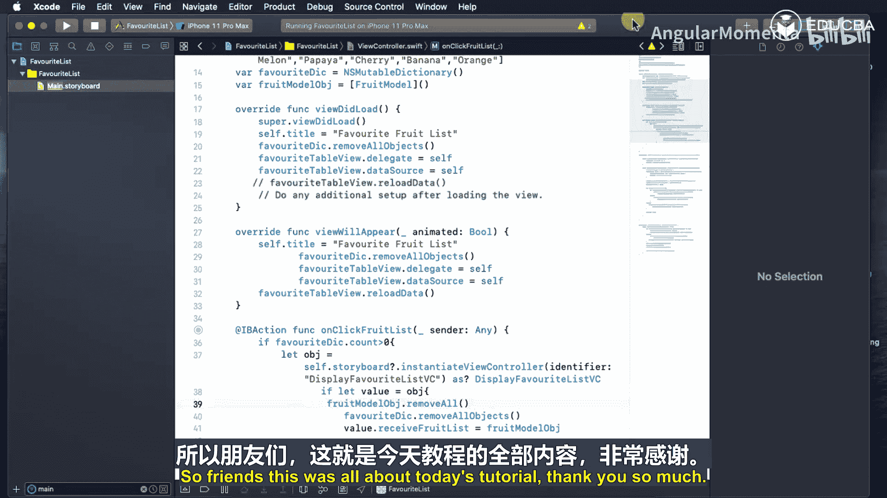

## 实现界面间导航与数据传递

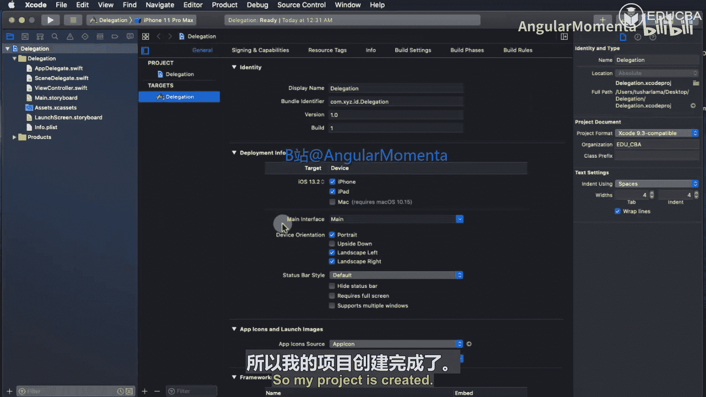

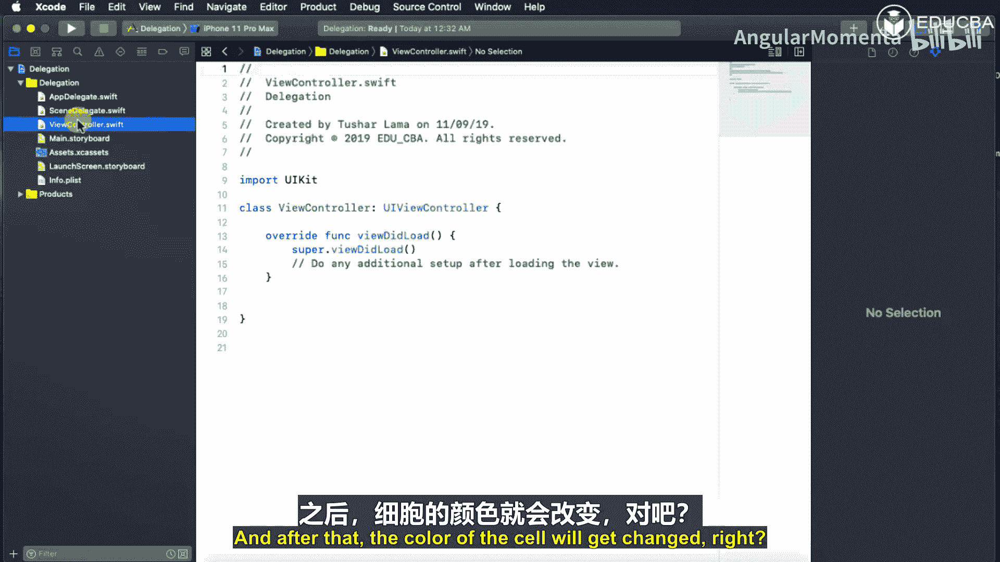

数据展示的逻辑已经完成，现在需要实现从主界面到收藏列表的导航。

首先，为主视图控制器嵌入一个 `Navigation Controller`。在故事板中，选择主 `View Controller`，然后点击 `Editor` -> `Embed In` -> `Navigation Controller`。

在 `DisplayFavoriteListViewController` 的 `viewDidLoad` 中，设置导航栏标题。

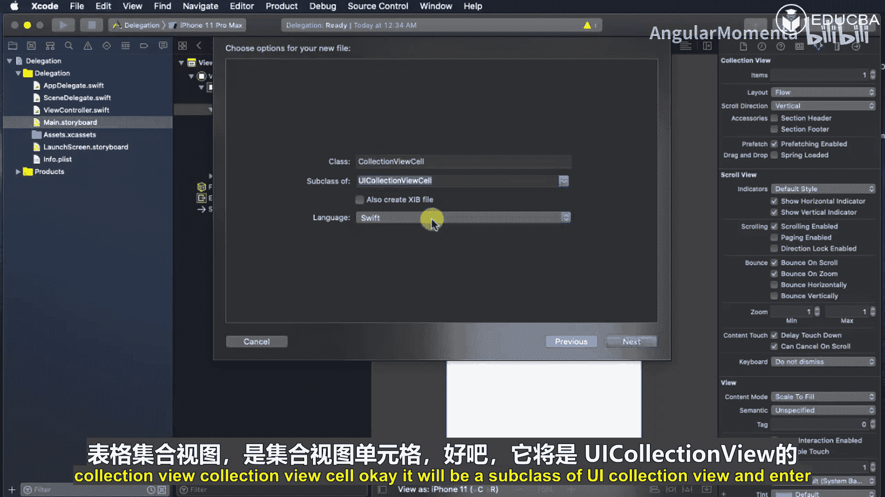

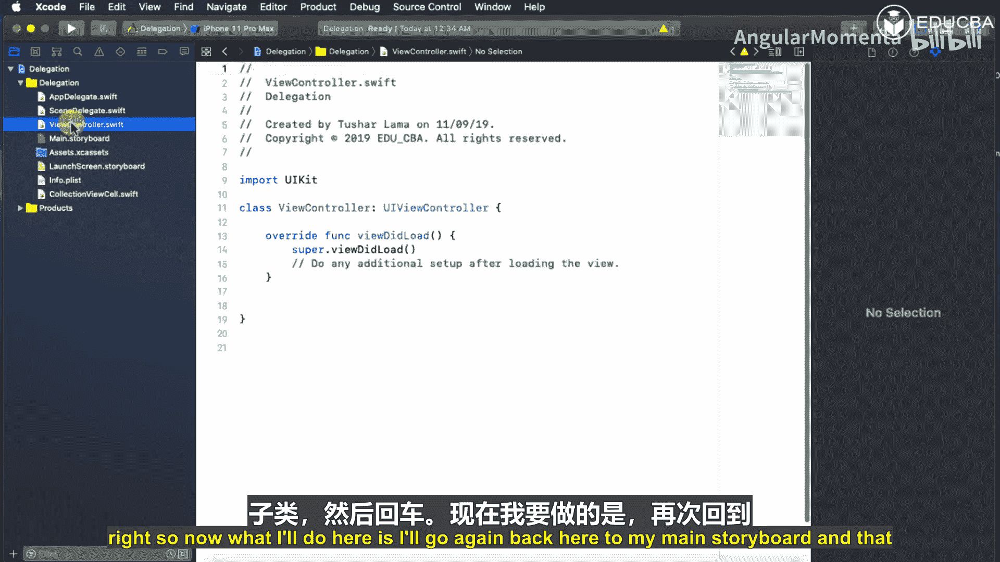

```swift
self.title = “Favorite Fruit List”
```

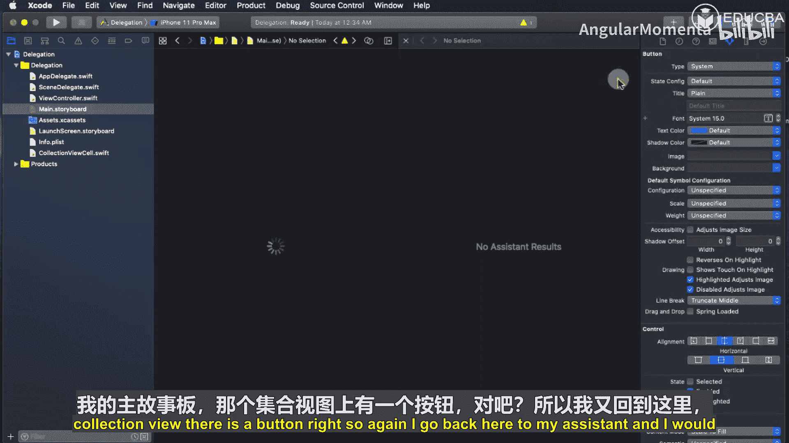

回到主视图控制器，在“发送收藏列表”按钮的 `@IBAction` 方法中，实现导航跳转和数据传递。

```swift
@IBAction func sendFavoriteTapped(_ sender: Any) {
    if favoriteList.count > 0 { // 检查是否有选中的水果
        let storyboard = UIStoryboard(name: “Main”, bundle: nil)
        if let displayVC = storyboard.instantiateViewController(withIdentifier: “DisplayFavoriteList”) as? DisplayFavoriteListViewController {
            displayVC.receivedFruitNames = Array(favoriteList.values) // 传递数据
            self.navigationController?.pushViewController(displayVC, animated: true)
        }
    }
}
```

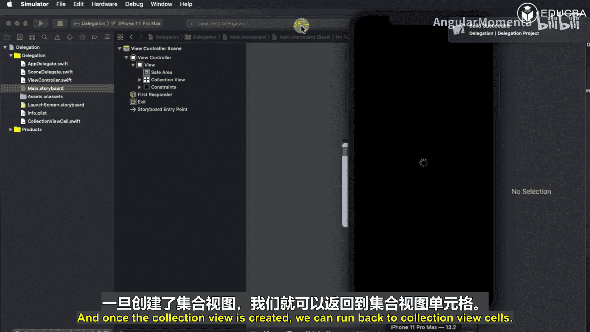

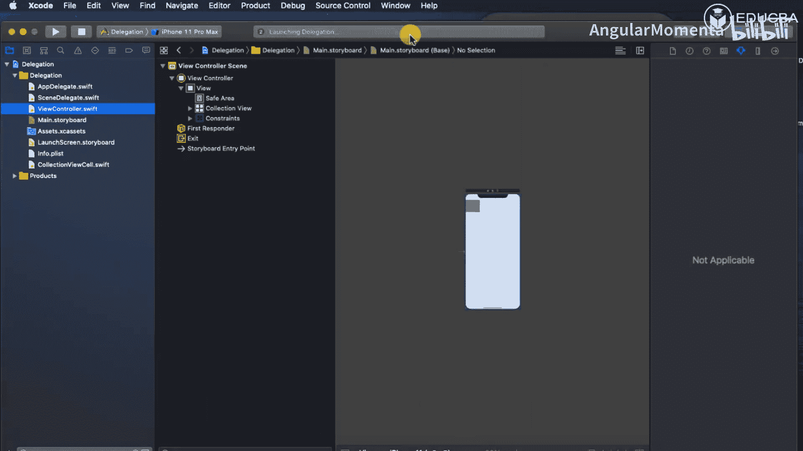

同时，当用户返回主界面时，需要清空临时存储的收藏数据，以便下次重新选择。

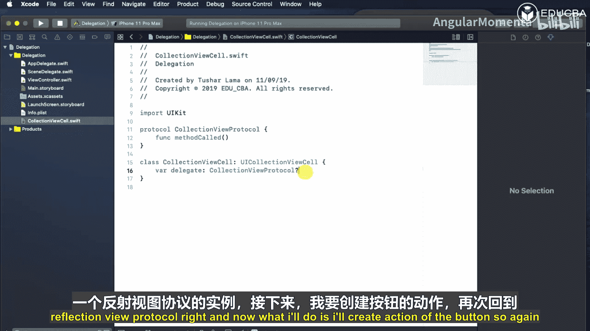

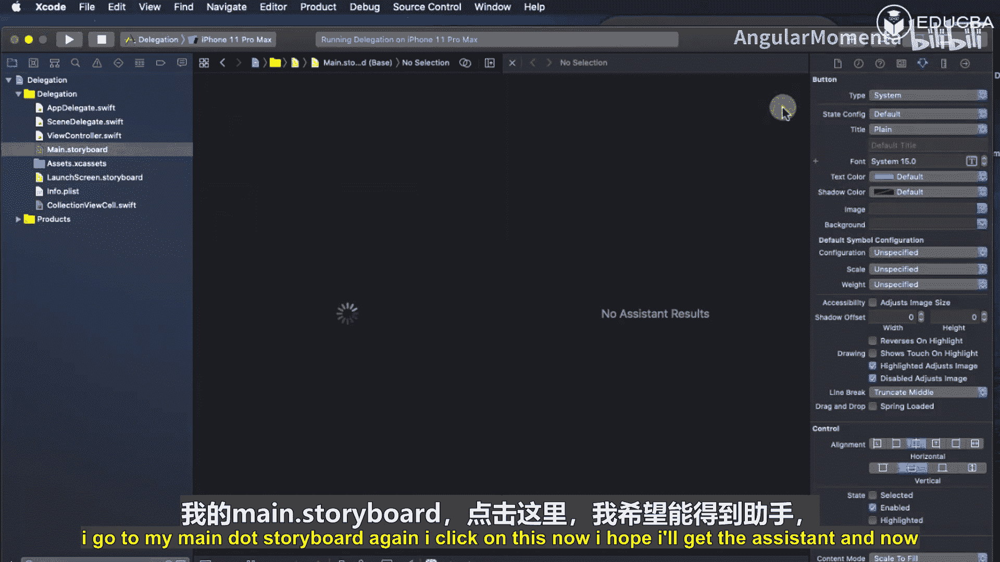

```swift
override func viewWillAppear(_ animated: Bool) {
    super.viewWillAppear(animated)
    favoriteList.removeAll() // 清空字典
    fruitModelArray.removeAll() // 清空模型数组
    self.tableView.reloadData()
}
```

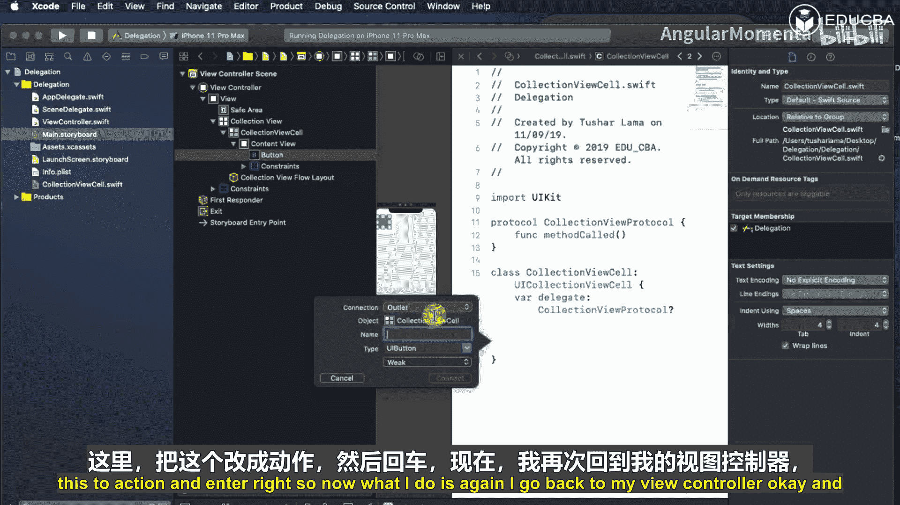

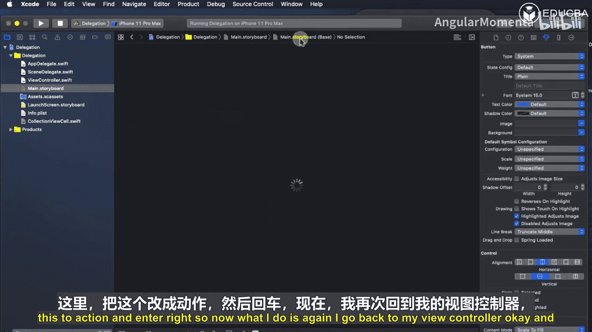

---

## 调试与优化

运行应用时，如果发现数据没有正确显示，需要进行调试。

常见的检查点包括：
1.  确保表格单元格的 `Identifier` 在故事板和代码中完全一致。
2.  在数据传递的关键位置（如 `cellForRowAt` 方法）设置断点，检查 `receivedFruitNames` 数组是否包含数据。
3.  使用 `guard let` 安全地解包单元格是良好的实践，可以避免因标识符错误导致的崩溃。

通过使用 `guard let`，即使未能获取到正确的单元格，也会返回一个默认的 `UITableViewCell`，从而防止应用崩溃。

---

## 总结

本节课中我们一起学习了如何构建一个显示收藏列表的功能。

我们主要完成了以下三件事：
1.  **创建收藏列表界面**：在故事板中添加新的视图控制器和表格视图，并创建对应的类。
2.  **实现数据传递**：通过模型类（`FruitModel`）和属性，将用户在主界面选择的水果数据传递到新界面。
3.  **处理导航与状态**：设置导航控制器，实现界面跳转，并在返回主界面时清空状态，确保用户体验的连贯性。


此外，我们还回顾了委托模式（Delegation）的使用，它允许单元格将用户操作（如点击按钮）通知给视图控制器进行处理。通过本教程，你掌握了使用表格视图、委托和模型类来构建一个完整数据流功能的基本方法。