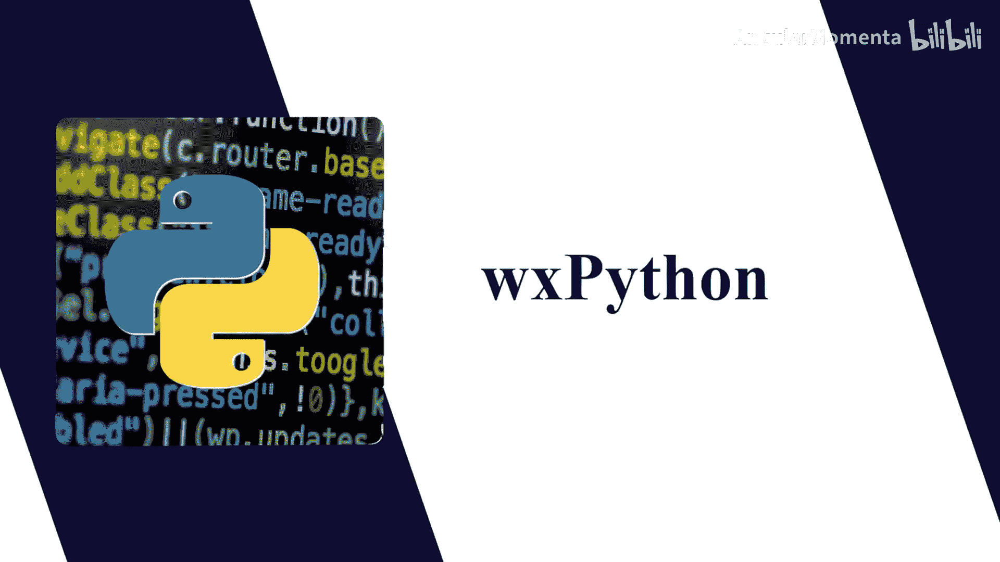
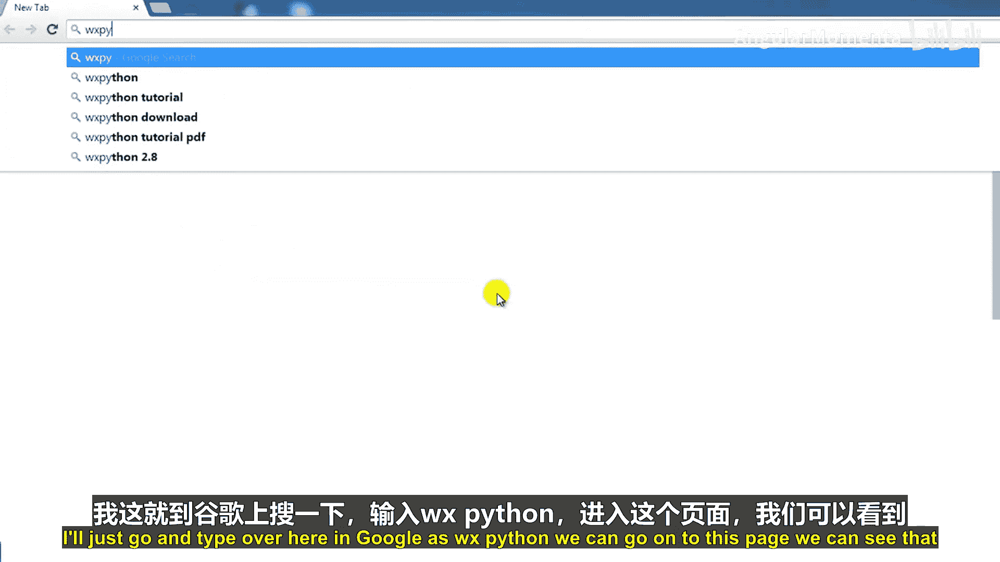
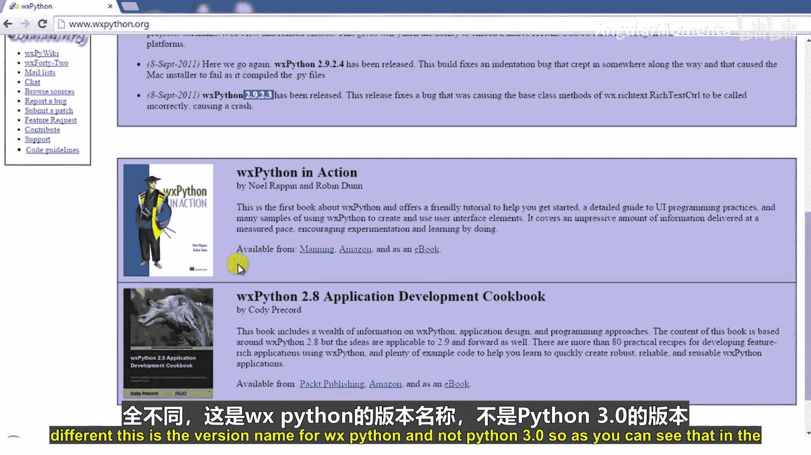
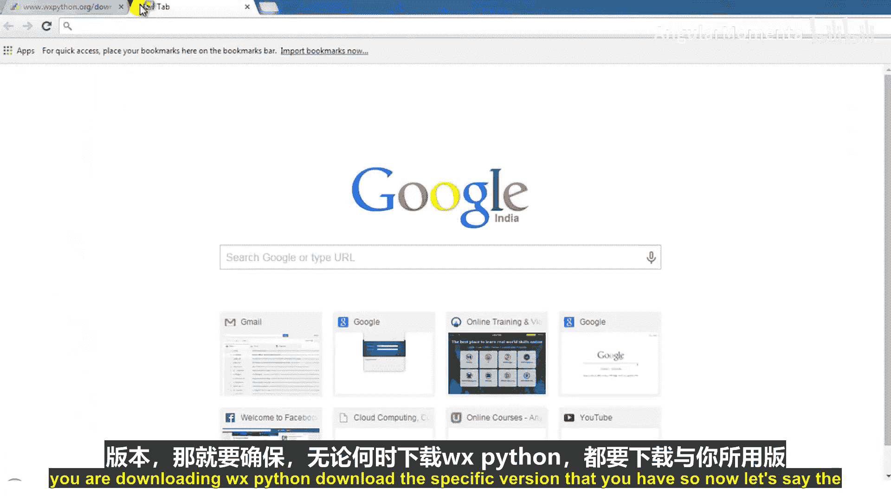
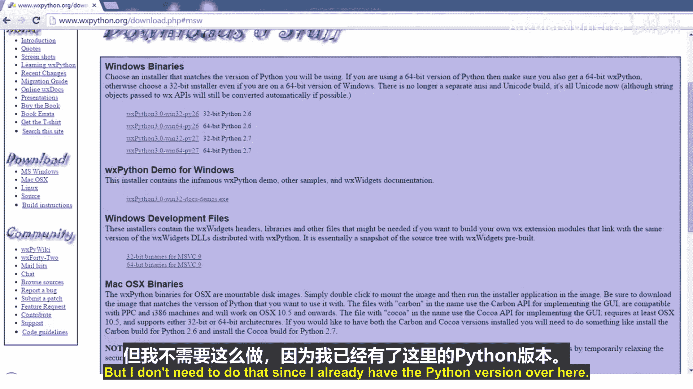
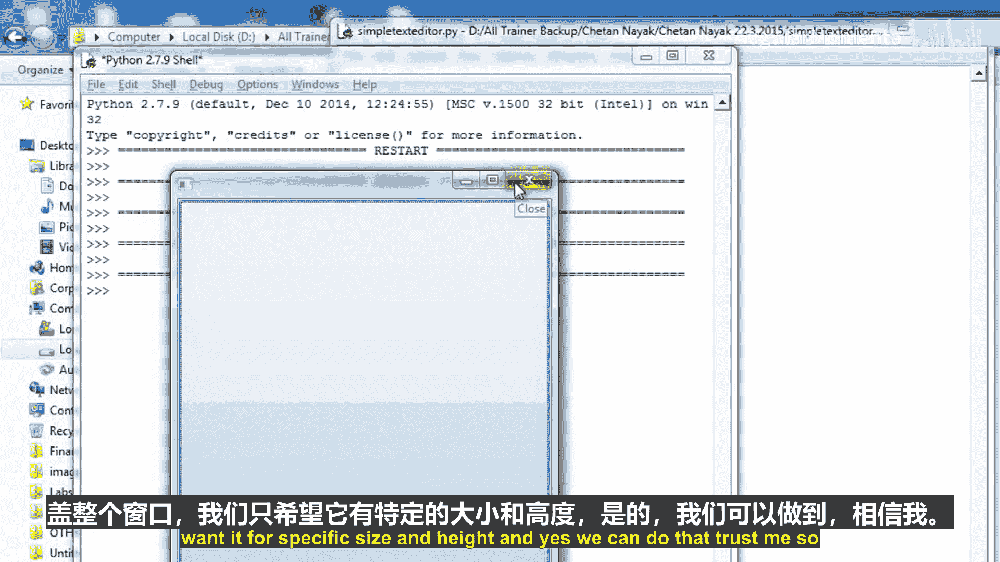
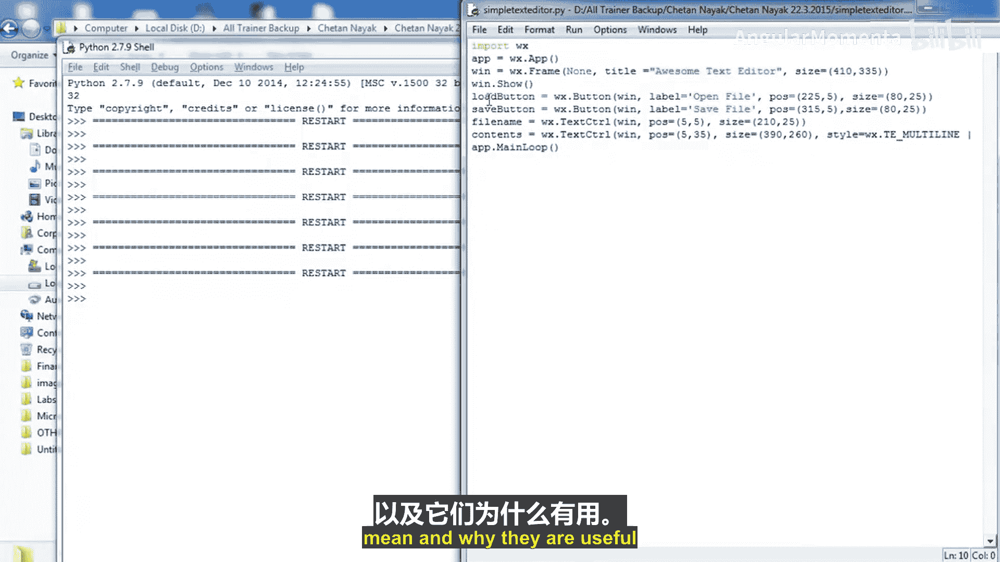

# 001：使用 wxPython 创建图形界面



## 概述

在本节课中，我们将学习如何使用 Python 创建图形用户界面程序。我们将从命令行程序转向窗口化程序，学习如何创建带有按钮、文本框等元素的窗口。我们将使用 wxPython 这个 GUI 工具包来完成这个任务，并最终创建一个简易的文本编辑器。

## GUI 工具包简介

上一节我们介绍了本课程的目标。本节中，我们来看看什么是 GUI 工具包。

Python 有多种图形用户界面工具包，但没有一个被官方认定为标准工具包。这既有优点也有缺点。

以下是几种常见的 Python GUI 工具包：
*   **wxPython**：基于 wxWidgets，跨平台，功能丰富。
*   **Tkinter**：使用 Tk 平台，是 Python 的标准库之一，但功能相对基础。
*   **PyQt/PySide**：基于 Qt 框架，功能强大，在 Linux 上较流行。
*   **PythonWin**：仅适用于 Windows 平台。

在本教程中，我们将使用 **wxPython**。它基于 Windows 风格，是一个标准化的平台，并且非常流行。需要注意的是，wxPython 目前不支持 Python 3.0 以上的版本，因此我们将使用 **Python 2.7.9** 进行教学。了解 Python 2.7 仍然很重要，因为许多地方仍在使用它。

## 下载与安装 wxPython

上一节我们选择了 wxPython 作为工具包。本节中，我们来学习如何下载和安装它。

要编写 GUI 程序，首先需要决定使用哪个 GUI 平台。简单来说，平台就是通过特定 Python 模块（如 GUI 工具包）可以访问的一组图形组件。



由于 wxPython 不支持 Python 3.0 以上版本，我们将使用 Python 2.7.9。请根据你的操作系统和 Python 版本下载对应的 wxPython 安装包。

以下是下载步骤：
1.  在浏览器中搜索 “wxPython”。
2.  访问 wxPython 官方网站。
3.  根据你的操作系统（Windows、Mac、Linux）选择下载链接。
4.  对于 Windows 用户，请确保下载与你的 Python 版本（例如 Python 2.7.9）和系统位数（32位或64位）匹配的安装包。
5.  下载完成后，双击安装文件，按照提示完成安装。





对于 Linux 用户，如果使用带有包管理器（如 `apt-get` 或 `yum`）的发行版，通常可以直接通过命令行安装，系统会自动选择适合的版本。

安装完成后，你可以在 Python 交互式环境中输入 `import wx` 来测试是否安装成功。

## 项目规划：简易文本编辑器



在开始编码之前，规划程序界面和功能很有帮助。我们将创建一个简易的文本编辑器。

为了便于学习，本章将使用一个贯穿始终的示例。我们的任务是创建一个能编辑文本文件的基本程序。编写一个功能完整的文本编辑器超出了本章范围，但我们会涵盖核心机制。

这个简易文本编辑器需要满足以下基本要求：
*   能够打开系统中已存在的文件。
*   允许用户编辑文件内容。
*   能够将编辑后的内容保存到文件。
*   提供程序退出的方式。

在编写 GUI 程序时，先画一个界面草图很有用。我们的编辑器布局将类似一个简单的命令行工具，但带有图形界面。

界面元素规划如下：
*   一个用于输入文件名的文本框。
*   “打开” 和 “保存” 两个按钮。
*   一个大的多行文本框，用于显示和编辑文件内容。
*   用户可以在左侧文本框输入文件名，点击“打开”按钮来打开文件，文件内容会显示在下方的文本框中供编辑。编辑后可以点击“保存”。我们暂时不专门做“退出”按钮，关闭窗口即可退出程序。

## 第一个 wxPython 程序

现在，让我们开始编写程序。首先从导入模块和创建应用对象开始。

要开始创建我们的程序，首先需要导入 wx 模块。我将创建一个新文件并保存为 `simple_text_editor.py`。

一个 wxPython 程序无法绕过的一步是创建应用程序对象。基础的应用程序类叫做 `wx.App`，它在后台处理各种初始化工作。

最简单的 wxPython 程序如下所示：
```python
import wx
app = wx.App()
app.MainLoop()
```
保存并运行这段代码，你会发现程序立即结束，因为没有任何窗口可供用户交互。

从这个例子可以看出，wx 包中的方法名是大写的，这与 Python 常见的命名规范不同。原因是这些方法名映射了底层 C++ 包 wxWidgets 中的方法名。

## 创建窗口和组件

窗口（也称为框架）是 `wx.Frame` 类的实例。现在让我们来创建一个窗口。

在 wx 框架中，组件（Widgets）在创建时，其构造函数的第一个参数通常是它的父组件。对于独立的顶级窗口，则没有父组件，可以使用 `None`。

以下是创建并显示一个基本窗口的代码：
```python
import wx
app = wx.App()
win = wx.Frame(None) # 创建一个没有父窗口的框架
win.Show() # 显示窗口
app.MainLoop() # 启动主事件循环
```
**注意**：必须在调用 `app.MainLoop()` 之前调用窗口的 `Show()` 方法，否则窗口会保持隐藏状态。运行这段代码，你将看到一个空白的窗口。



## 添加按钮并设置属性


现在，让我们为这个窗口添加一个按钮，并设置一些基本属性如标签、位置和大小。

为了向框架添加按钮，我们创建 `wx.Button` 的实例。仅仅创建按钮还不够，我们需要设置标签、位置和大小，否则多个组件会重叠在一起。

我们可以通过构造函数的 `label` 参数设置按钮文本，通过 `pos` 参数设置位置，通过 `size` 参数设置大小。同样，可以使用 `title` 参数设置窗口标题。使用关键字参数可以让代码更清晰。

以下是为窗口添加两个按钮并设置属性的示例代码：
```python
import wx
app = wx.App()
# 创建窗口，设置标题和初始大小
win = wx.Frame(None, title="简易文本编辑器", size=(410, 335))
# 创建“打开文件”按钮，并设置位置和大小
loadButton = wx.Button(win, label=‘打开文件’, pos=(225, 5), size=(80, 25))
# 创建“保存文件”按钮，并设置位置和大小
saveButton = wx.Button(win, label=‘保存文件’, pos=(315, 5), size=(80, 25))
win.Show()
app.MainLoop()
```
运行这段代码，你将看到一个带有标题和两个按钮的窗口。

## 添加文本框

最后，我们来添加用于输入文件名和编辑文件内容的文本框。

除了按钮，我们还需要文本输入框。`wx.TextCtrl` 类用于创建文本框。对于编辑文件内容的大文本框，我们还需要设置多行和滚动条的样式。

以下是添加文件名输入框和内容编辑框的代码：
```python
import wx
app = wx.App()
win = wx.Frame(None, title="简易文本编辑器", size=(410, 335))
loadButton = wx.Button(win, label=‘打开文件’, pos=(225, 5), size=(80, 25))
saveButton = wx.Button(win, label=‘保存文件’, pos=(315, 5), size=(80, 25))
# 创建文件名输入框
filename = wx.TextCtrl(win, pos=(5, 5), size=(210, 25))
# 创建内容编辑框，设置为多行并带垂直滚动条
contents = wx.TextCtrl(win, pos=(5, 35), size=(390, 260), style=wx.TE_MULTILINE | wx.HSCROLL)
win.Show()
app.MainLoop()
```
代码中 `wx.TE_MULTILINE` 样式允许文本框输入多行文本，`wx.HSCROLL` 样式为其添加水平滚动条。运行程序，你将看到简易文本编辑器的完整界面。

## 总结



本节课中，我们一起学习了使用 wxPython 进行 GUI 编程的基础知识。我们从介绍各种 GUI 工具包开始，选择了 wxPython 并完成了其安装。接着，我们规划了一个简易文本编辑器项目，并逐步实现了它：首先创建了应用程序对象和主窗口，然后添加了按钮并设置了它们的属性，最后添加了用于交互的文本框。现在，我们已经拥有了一个具有基本图形界面的程序框架。在下一节课中，我们将为这些按钮添加实际的功能，让我们的编辑器能够真正地打开和保存文件。