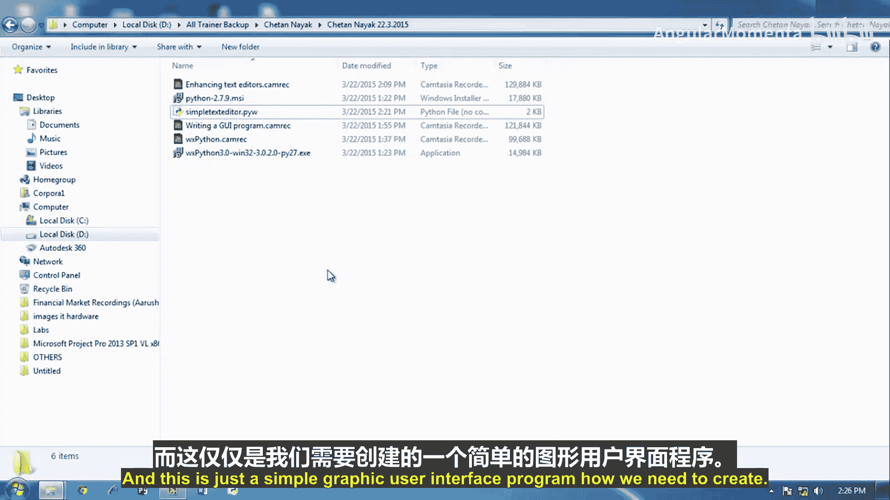
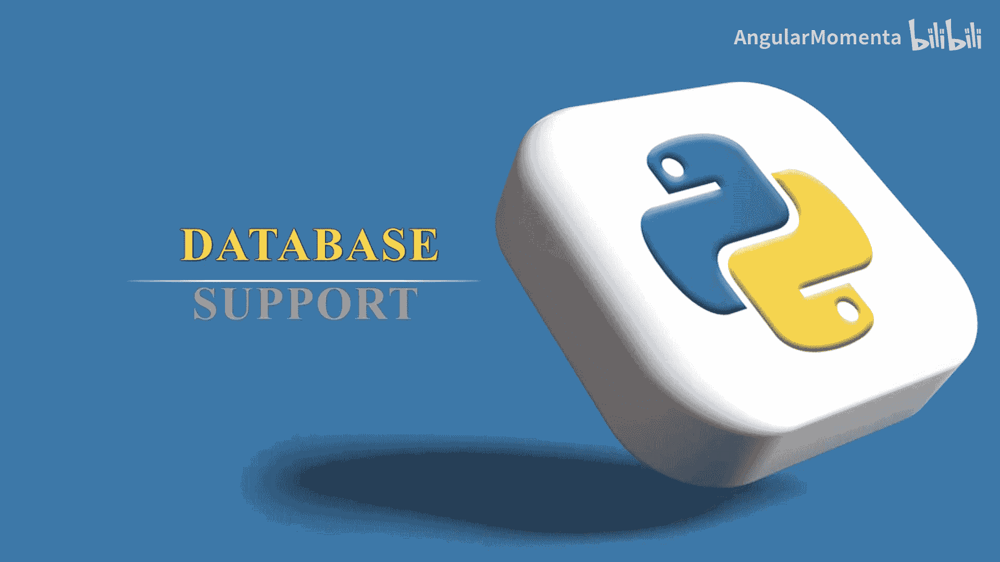
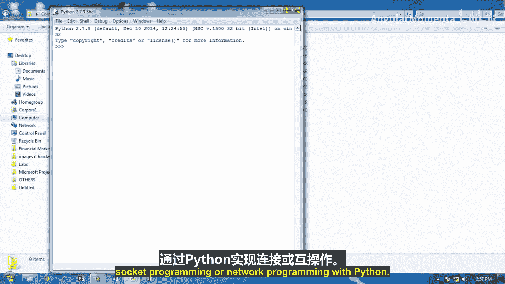

# 002：增强文本编辑器

在本节课中，我们将学习如何改进之前创建的简单文本编辑器，使其界面更美观、布局更灵活，并为其添加事件处理功能，使其成为一个真正可用的图形用户界面应用程序。

## 概述

上一节我们创建了一个基础的文本编辑器，它具备了打开和保存文件的核心功能。本节中，我们将重点优化其用户界面，使用更智能的布局管理器替代硬编码的坐标，并深入讲解如何为按钮绑定事件处理函数，让程序响应用户的操作。

## 优化界面布局

在之前的程序中，我们通过指定每个组件的绝对坐标（`position`）和尺寸（`size`）来排列它们。这种方法虽然直观，但存在明显缺点：当窗口大小改变时，内部组件的位置和大小不会随之调整，导致界面看起来不协调。

### 引入布局管理器：WxPython BoxSizer

为了解决上述问题，WxPython 提供了布局管理器，其中最常用的是 `wx.BoxSizer`。布局管理器负责自动计算和安排组件的位置与大小。

以下是使用 `wx.BoxSizer` 重构布局的核心步骤：

1.  创建一个容器（如 `wx.Panel`）作为所有组件的父级背景。
2.  创建 `wx.BoxSizer` 对象，可以指定为水平（`wx.HORIZONTAL`）或垂直（`wx.VERTICAL`）排列。
3.  使用 `Add()` 方法将组件添加到 Sizer 中，并可以设置比例、对齐方式和边框等参数。
4.  最后，通过容器的 `SetSizer()` 方法应用这个 Sizer。

以下是一个使用 BoxSizer 的代码示例：

```python
import wx

app = wx.App()
win = wx.Frame(None, title="文本编辑器", size=(400, 300))

# 1. 创建面板作为容器
bkg = wx.Panel(win)

# 2. 创建组件，但不指定绝对坐标
loadButton = wx.Button(bkg, label='打开文件')
saveButton = wx.Button(bkg, label='保存文件')
filename = wx.TextCtrl(bkg)
contents = wx.TextCtrl(bkg, style=wx.TE_MULTILINE | wx.HSCROLL)

# 3. 创建水平 BoxSizer 来放置文件名输入框和按钮
hbox = wx.BoxSizer()
hbox.Add(filename, proportion=1, flag=wx.EXPAND)
hbox.Add(loadButton, proportion=0, flag=wx.LEFT, border=5)
hbox.Add(saveButton, proportion=0, flag=wx.LEFT, border=5)

# 4. 创建垂直 BoxSizer 作为主布局
vbox = wx.BoxSizer(wx.VERTICAL)
vbox.Add(hbox, proportion=0, flag=wx.EXPAND | wx.ALL, border=5)
vbox.Add(contents, proportion=1, flag=wx.EXPAND | wx.LEFT | wx.BOTTOM | wx.RIGHT, border=5)

# 5. 将主 Sizer 设置给面板
bkg.SetSizer(vbox)

win.Show()
app.MainLoop()
```

**代码关键参数解释：**
*   `proportion`：定义组件在剩余空间中的分配比例。`proportion=1` 的组件会比 `proportion=0` 的获得更多扩展空间。
*   `flag`：用于控制对齐和边框等行为，常用值如 `wx.EXPAND`（组件填充分配的空间）、`wx.LEFT`（边框应用于左侧）。
*   `border`：设置组件周围的边框宽度（像素）。

使用 Sizer 后，当用户调整窗口大小时，`filename` 输入框会水平拉伸，而 `contents` 文本区域会同时向水平和垂直方向拉伸，按钮则保持原大小，界面变得灵活而美观。

## 添加事件处理

一个只有界面而不能交互的程序是没用的。在 GUI 编程中，用户的操作（如点击按钮）被称为**事件**。我们需要让程序能够“感知”并“响应”这些事件。

### 事件绑定机制

在 WxPython 中，我们通过 `Bind()` 方法将某个**事件**（如按钮点击）与一个**事件处理函数**关联起来。当事件发生时，对应的函数就会被自动调用。

以下是事件绑定的语法：
```python
widget.Bind(event, handler_function)
```
*   `widget`：发生事件的组件，例如一个按钮。
*   `event`：要监听的事件类型，例如 `wx.EVT_BUTTON` 表示按钮点击事件。
*   `handler_function`：当事件发生时要执行的函数。





### 实现文件打开与保存功能

现在，我们为“打开文件”和“保存文件”按钮创建具体的事件处理函数。

**打开文件函数 (`load`) 的逻辑：**
1.  获取文件名输入框中的文本。
2.  以读取模式打开该文件。
3.  将文件内容读入，并设置到主文本区域中。
4.  关闭文件。

**保存文件函数 (`save`) 的逻辑：**
1.  获取文件名输入框中的文本。
2.  以写入模式打开该文件。
3.  将主文本区域中的内容写入文件。
4.  关闭文件。

以下是这两个函数的实现代码：

```python
def load(event):
    """打开文件事件处理函数"""
    file = open(filename.GetValue(), 'r')  # 获取文件名并打开
    contents.SetValue(file.read())         # 读取内容并显示
    file.close()                           # 关闭文件

def save(event):
    """保存文件事件处理函数"""
    file = open(filename.GetValue(), 'w')  # 获取文件名并打开（写入模式）
    file.write(contents.GetValue())        # 将文本区域内容写入文件
    file.close()                           # 关闭文件
```

### 将函数绑定到按钮

创建好处理函数后，需要在程序初始化部分将它们绑定到对应的按钮上：

```python
# 将 load 函数绑定到“打开文件”按钮的点击事件
loadButton.Bind(wx.EVT_BUTTON, load)
# 将 save 函数绑定到“保存文件”按钮的点击事件
saveButton.Bind(wx.EVT_BUTTON, save)
```

完成以上步骤后，一个功能完整、布局灵活的文本编辑器就创建好了。用户可以输入文件名，编辑文本内容，并通过按钮进行文件的打开和保存操作。

## 打包为独立应用

默认情况下，双击 `.py` 文件运行程序会同时打开一个命令行窗口。如果你希望程序像普通桌面应用一样，只显示图形界面，可以将文件后缀从 `.py` 改为 `.pyw`。在 Windows 系统中，`.pyw` 文件会使用 `pythonw.exe` 来运行，从而不显示控制台窗口。

## 总结



本节课中我们一起学习了如何增强一个基础的文本编辑器。我们首先引入了 `wx.BoxSizer` 布局管理器来替代硬编码坐标，使得界面能够自适应窗口大小的变化。接着，我们深入讲解了 GUI 编程的核心概念——事件处理，学习了如何使用 `Bind()` 方法将用户操作（事件）与具体的处理函数关联起来，并实现了文件的打开和保存功能。最后，我们还了解了如何将 Python 脚本打包成不显示命令行窗口的独立应用（`.pyw`）。通过这些步骤，我们成功将一个简单的演示程序转变为一个实用、美观的桌面应用程序。