# 003：联网模块

## 概述

在本章节中，我们将学习Python如何帮助编写使用网络（如互联网）作为重要组件的程序。Python是网络编程的强大工具，也称为套接字编程。Python标准库提供了许多用于常见网络协议和不同抽象层次的预置库，使我们能够专注于程序逻辑，而非处理底层的比特流传输。由于Python擅长处理字节流中的各种模式，并且拥有丰富的网络工具，我们只能简要介绍其网络功能。本章将概述Python标准库中的一些网络模块，讨论SocketServer类及其相关功能，并简要探讨同时处理多个连接的各种方法。

## 网络编程基础

上一节我们介绍了Python网络编程的概览，本节中我们来看看网络编程的基本组件——套接字。

套接字是网络编程的基本组件。套接字是一个两端都有程序的信息通道。程序可能位于不同的计算机上，并通过套接字相互发送信息。Python中的大多数网络编程都隐藏了`socket`模块的基本工作原理，不直接与套接字交互。

套接字有两种类型：**服务器套接字**和**客户端套接字**。创建服务器套接字后，需要告诉它等待连接。它将在某个网络地址（IP地址和端口号的组合）监听，直到客户端套接字连接，然后两者可以进行通信。处理客户端套接字通常比处理服务器端简单得多，因为服务器必须随时准备处理客户端的连接，并且必须处理多个连接，而客户端只需连接、执行操作然后断开连接。

在本章中，我们将通过SocketServer类族来处理服务器端编程。套接字是`socket`模块中`socket`类的一个实例。它使用最多三个参数实例化：地址族、流或数据报套接字类型以及协议。对于普通的旧式套接字，不需要提供任何参数。

以下是创建和使用套接字的基本步骤：

1.  **服务器套接字**：使用`bind`方法绑定地址，然后调用`listen`方法开始监听。
2.  **客户端套接字**：使用`connect`方法连接到服务器，地址与服务器`bind`的地址相同。
3.  **地址格式**：地址是一个元组，形式为`(host, port)`，其中`host`是主机名，`port`是端口号（整数）。
4.  **监听队列**：`listen`方法接受一个参数，即其积压连接数（允许排队等待接受的连接数量）。
5.  **接受连接**：服务器套接字监听后，可以使用`accept`方法开始接受客户端连接。该方法会阻塞直到有客户端连接，然后返回一个形式为`(client, address)`的元组，其中`client`是客户端套接字，`address`是地址。
6.  **处理连接**：服务器处理完一个客户端后，可以通过再次调用`accept`来等待新的连接。这通常在一个无限循环中完成。这种形式的服务器编程称为**阻塞**或**同步**网络编程。

## 数据传输

上一节我们介绍了套接字的基本连接过程，本节中我们来看看如何在已建立的连接上发送和接收数据。

套接字有两个用于数据传输的方法：`send`和`recv`。你可以使用字符串参数调用`send`来发送数据，并使用期望的字节数调用`recv`来接收数据。如果不确定使用多少字节，1024通常是一个不错的选择。

如果你在同一台机器上运行客户端和服务器对，服务器应该打印一条关于获得连接的消息，然后客户端应该打印出从服务器接收到的消息。你可以在服务器仍在运行时运行多个客户端，只需将客户端中调用`gethostname()`的部分替换为客户端运行机器的实际主机名即可。然而，你也可以让两个程序通过网络从一台机器连接到另一台机器。

以下是关于端口号的注意事项：
*   在Linux/Unix系统上，端口号通常受到限制。你需要管理员权限才能使用1024以下的端口。
*   这些低编号端口用于标准服务，例如端口80用于Web服务器。
*   如果你用`Ctrl+C`停止服务器，可能需要等待一段时间才能再次使用相同的端口号。

## 简单服务器与客户端示例

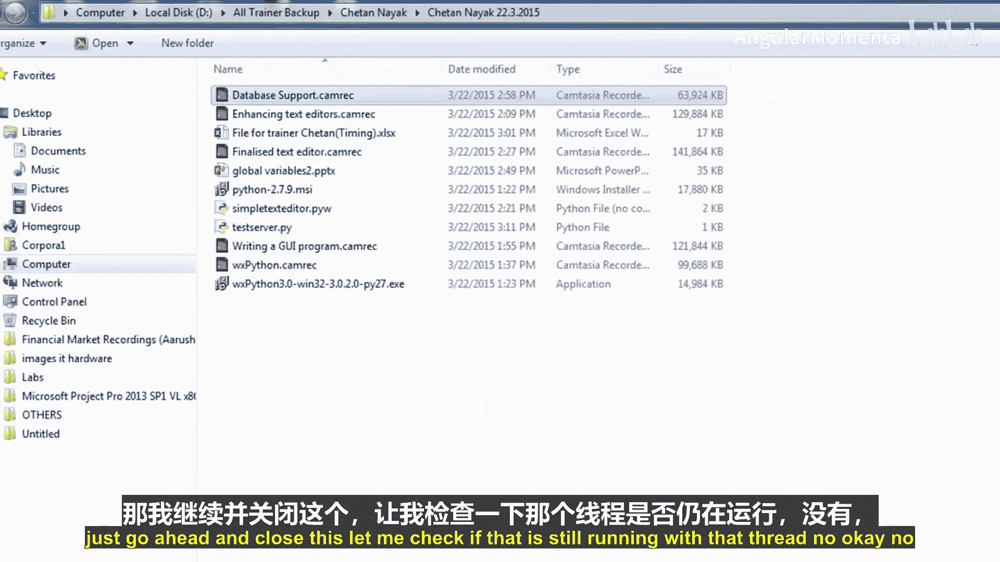

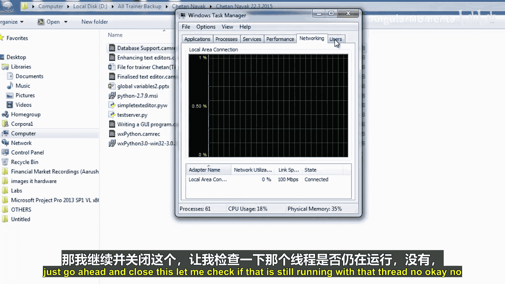

前面我们了解了套接字通信的理论，现在让我们通过代码示例来看看一个简单的服务器和客户端是如何实现的。

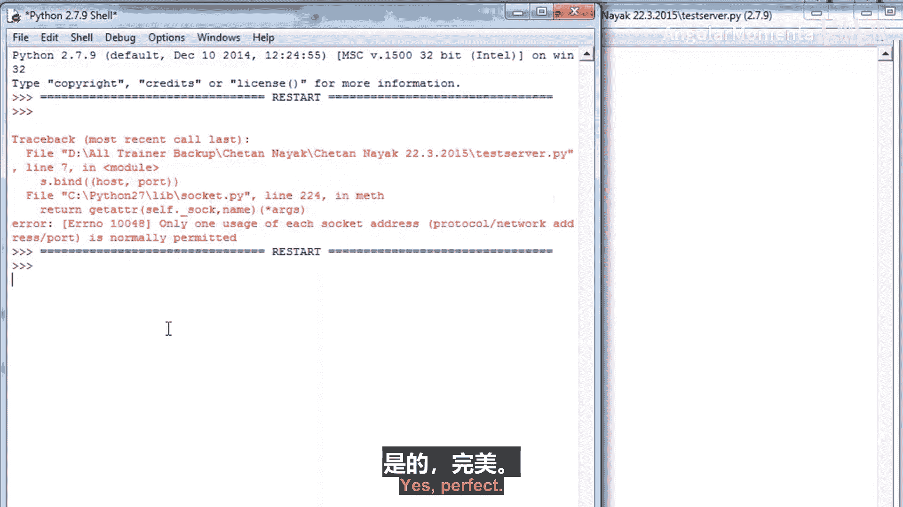

以下是一个极简的服务器示例。网络编程常用于创建数据库（如谷歌的信息收集数据库），或主要用于道德黑客等领域。病毒实际上并不常用，更多的是用于创建特洛伊木马主机。这是一个更好的例子，当你进入他人的计算机时，你可以将其计算机作为主机，并直接访问其中的所有信息。

```python
import socket

s = socket.socket()
host = socket.gethostname()
port = 12345
s.bind((host, port))
s.listen(5)
while True:
    c, addr = s.accept()
    print('Got connection from', addr)
    c.send('Thank you for connecting'.encode())
    c.close()
```

运行此服务器时，防火墙可能会警告并阻止连接。你需要配置防火墙以允许Python进行网络工作，或者直接断开网络。请注意，任何连接到网络的软件都存在潜在的安全风险，即使是你自己编写的软件。

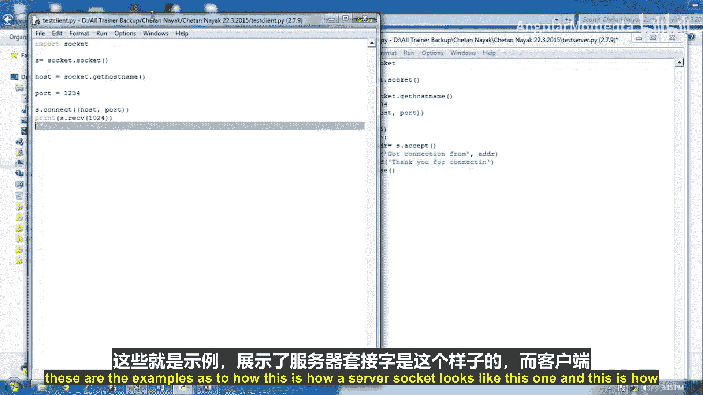

以下是对应的极简客户端示例：

```python
import socket

s = socket.socket()
host = socket.gethostname()
port = 12345
s.connect((host, port))
print(s.recv(1024).decode())
```

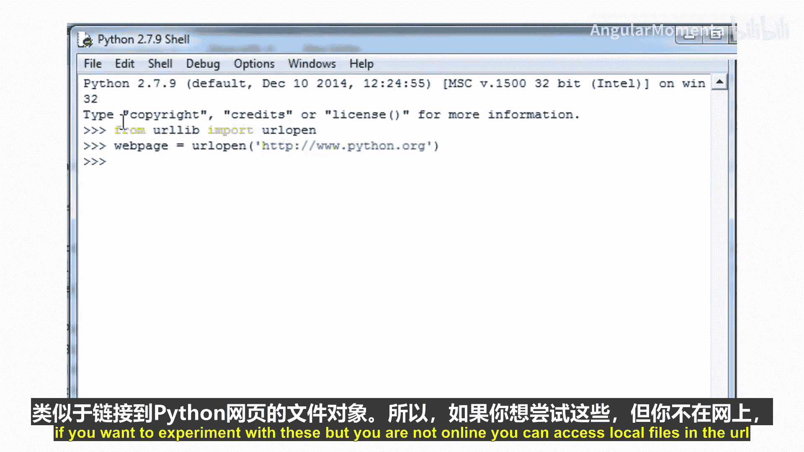

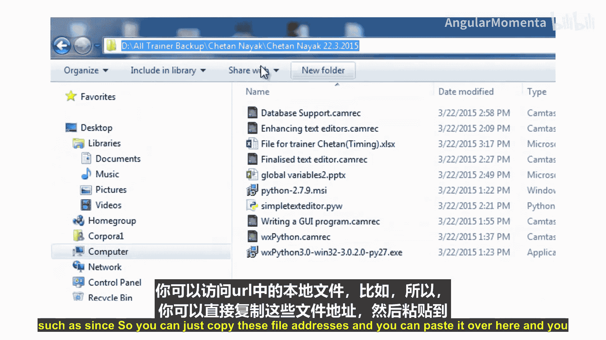

## 使用urllib访问网络资源

在众多可用的网络库中，`urllib`和`urllib2`可能为我们提供了最高的性价比。它们使我们能够像访问本地计算机上的文件一样，通过简单的函数调用访问网络上的文件。几乎所有你可以用统一资源定位符（URL）引用的内容都可以作为我们程序的输入。想象一下，如果结合正则表达式模块，你可以下载网页、提取信息并自动生成报告。

这两个模块的功能大致相同。然而，`urllib2`稍微更高级一些。对于简单的下载，我们可以只使用`urllib`。如果我们需要HTTP身份验证、Cookie，或者想要编写扩展来处理我们自己的协议，那么`urllib2`可能更适合。

以下是打开远程文件的基本命令：

```python
from urllib.request import urlopen
webpage = urlopen('http://www.python.org')
```

如果你在线，变量`webpage`现在将显示一个类似文件的对象，链接到Python网页。如果你想实验但不在线，可以使用`file://` URL访问本地文件。

假设我们想提取刚刚打开的Python网页上教程链接的URL。我们也可以使用正则表达式来实现。

```python
import re
text = webpage.read()
m = re.search(b'<a href="([^"]+)" .*?>about</a>', text, re.IGNORECASE)
print(m.group(1))
```


## 检索和保存远程文件

`urlopen`函数为我们提供了一个类似文件的对象，我们可以从中读取。如果我们更希望`urllib`为我们下载文件，并在本地文件中存储一个副本，我们可以使用`urlretrieve`。它不返回类似文件的对象，而是返回一个元组`(filename, headers)`，其中`filename`是本地文件的名称（由`urllib`自动创建），`headers`包含有关远程文件的一些信息。

如果你想为下载的副本指定文件名，也可以提供第二个参数：

```python
from urllib.request import urlretrieve
urlretrieve('http://www.python.org', 'C:\\python_webpage.html')
```

这将检索Python主页并将其存储在C盘，命名为`python_webpage.html`。如果不指定文件名，文件将被放在某个临时位置。完成后，你可能希望将其删除，以免占用硬盘空间。要清理此类临时文件，可以调用`urlcleanup()`函数，它会为我们处理其他事情。

## 使用SocketServer框架

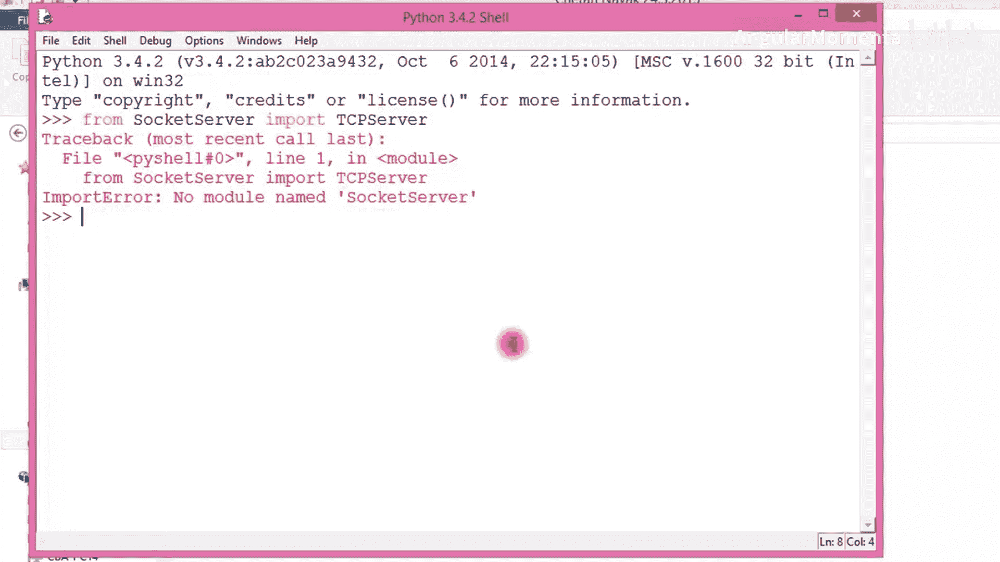

到目前为止，你可能觉得编写套接字服务器代码并不难。但如果我们想超越基础，获得一些帮助会很好。`socketserver`模块是标准库中几个服务器类的基础，包括`BaseHTTPServer`、`SimpleHTTPServer`、`CGIHTTPServer`等。`socketserver`包含四个基本的服务器类：`TCPServer`用于TCP流套接字，`UDPServer`用于UDP数据报套接字，以及更晦涩的`UnixStreamServer`和`UnixDatagramServer`。你可能不需要后两个，但很可能需要`TCPServer`，甚至可能不需要`UDPServer`。

使用`socketserver`风格编写服务器时，你将大部分代码放在一个请求处理程序中。每次服务器收到请求时，都会实例化请求处理程序，并根据特定服务器和处理程序类的不同，调用其上的各种处理方法。你还可以子类化它们以创建具有自定义处理程序集的服务器。一个基本的处理程序类将所有操作放在一个名为`handle`的方法中，该方法由服务器调用。此方法可以通过属性`self.request`访问客户端套接字。

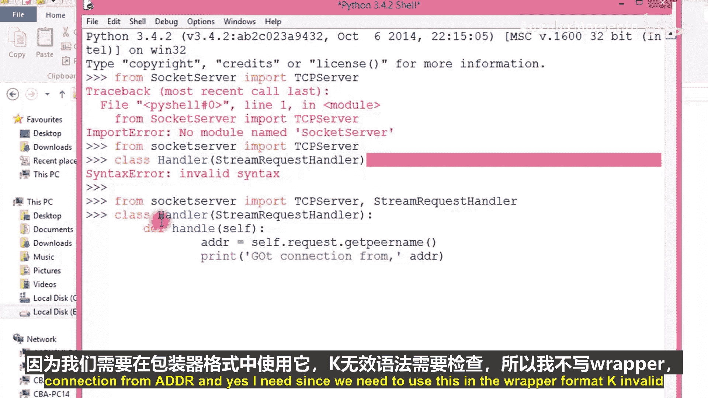

如果你使用流（如TCP），可以使用`StreamRequestHandler`，它设置了另外两个属性`self.rfile`和`self.wfile`，用于读写。你可以使用这些类似文件的对象与客户端通信。

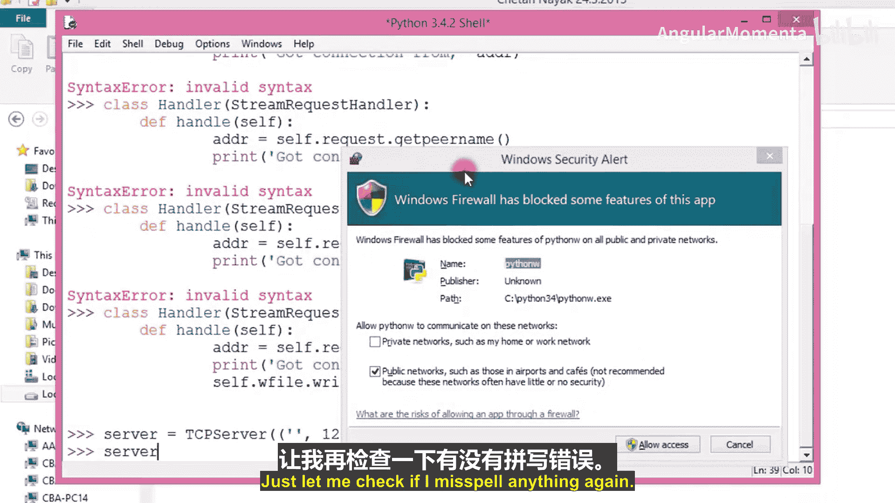

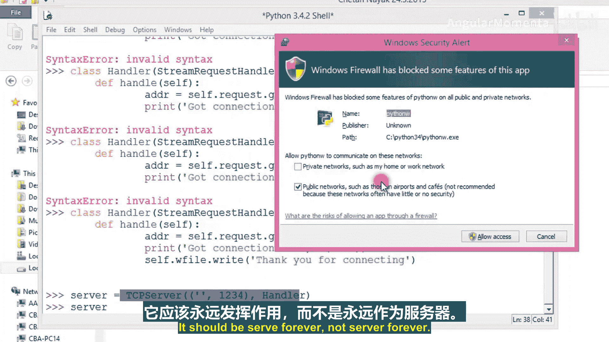

以下是如何创建一个基于`socketserver`的最小服务器：

```python
from socketserver import TCPServer, StreamRequestHandler

class Handler(StreamRequestHandler):
    def handle(self):
        addr = self.request.getpeername()
        print('Got connection from', addr)
        self.wfile.write('Thank you for connecting'.encode())

server = TCPServer(('', 12345), Handler)
server.serve_forever()
```

你可以在标准库文档中找到关于`socketserver`框架的更多信息。使用这些框架可以更轻松地连接客户端并创建自己的网络模块。

## 处理多个连接

到目前为止讨论的服务器解决方案都是同步的，一次只能有一个客户端连接并处理其请求。如果一个请求需要一些时间（例如，一个完整的聊天会话），那么能够处理多个连接就很重要，因为我们不希望只与一个人聊天。

实现这一目标主要有三种方式：
1.  **分叉 (Forking)**
2.  **线程 (Threading)**
3.  **异步I/O (Asynchronous I/O)**

分叉和线程可以通过使用`socketserver`模块中的混合类与任何套接字服务器类结合来简单实现。如果你想自己实现它们，这些方法也相当容易使用，但它们也有缺点。

分叉会占用大量资源，如果客户端很多，可能无法很好地扩展。然而，对于合理数量的客户端，或者在现代Unix/Linux系统上，分叉效率相当高，如果你有多CPU系统，效率会更高。但线程通常更好，尽管线程可能导致同步问题。

异步I/O在底层实现起来更困难。基本机制是`select`模块的`select`函数，处理起来相当棘手。幸运的是，我们有一些框架在更高层次上处理异步I/O，为我们提供了一个简单抽象的接口，以实现非常强大和可扩展的机制。标准库中包含的一个基本框架是`asyncore`和`asynchat`模块。另一个非常强大的异步网络编程框架是`Twisted`模块，我将在本章末尾讨论它。

如果你不了解分叉或线程，这里简单说明一下：
*   **分叉**：当你分叉一个进程（一个正在运行的程序）时，它基本上被复制，两个结果进程都从当前执行点继续，各自拥有自己的内存、变量等副本。在服务器中，为每个客户端连接创建一个子进程（分叉），父进程继续监听新连接。当客户端满意时，子进程退出。客户端不必相互等待。
*   **线程**：线程是轻量级进程或子进程，它们存在于同一进程内并共享相同的内存。这种资源消耗的减少带来了缺点：因为它们共享内存，你必须确保它们不会相互干扰变量或试图同时修改相同的东西。这些问题属于同步的范畴。

在现代操作系统（除了不支持分叉的Windows）和现代硬件上，分叉实际上相当快，可以轻松处理此类资源消耗。如果你不想处理同步问题，并且处理器有足够的性能，分叉可能是一个很好的选择。

然而，最好的方法是避免线程和分叉的思考，转而使用**Stackless Python**。这是Python的一个版本，旨在能够快速、无痛地在不同上下文之间切换，并支持一种类似线程的并行形式，称为微线程，其扩展性比真实线程好得多。例如，Stackless Python微线程已在《EVE Online》中用于服务数千用户，比普通线程或分叉高效得多。

## 总结

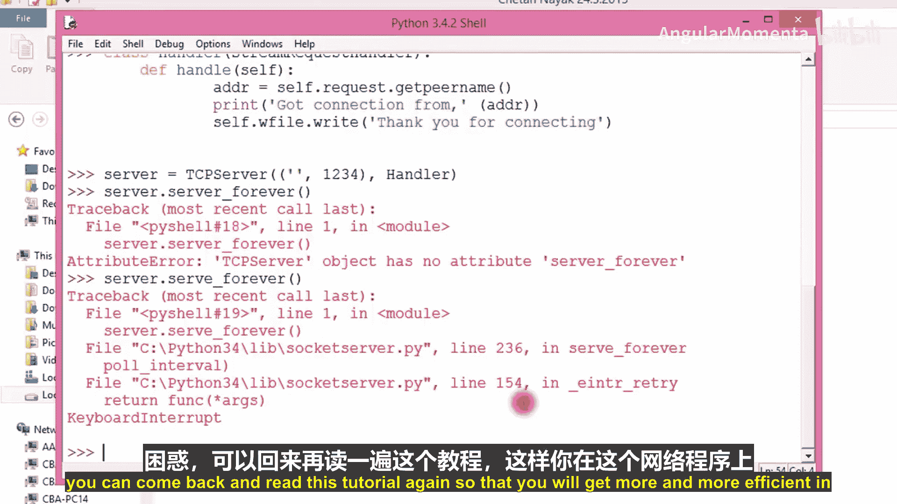

在本章中，我们一起学习了Python网络编程的基础知识。我们从套接字的概念讲起，了解了服务器套接字和客户端套接字的区别，以及如何建立连接和传输数据。我们通过简单的代码示例演示了服务器和客户端的实现。接着，我们探讨了使用`urllib`和`urllib2`库方便地访问网络资源。然后，我们介绍了更高级的`socketserver`框架，它简化了服务器端的开发。最后，我们讨论了处理多个客户端连接的三种主要策略：分叉、线程和异步I/O，并简要提及了Stackless Python作为高性能的替代方案。掌握这些内容，你将能够使用Python开发各种网络应用程序。