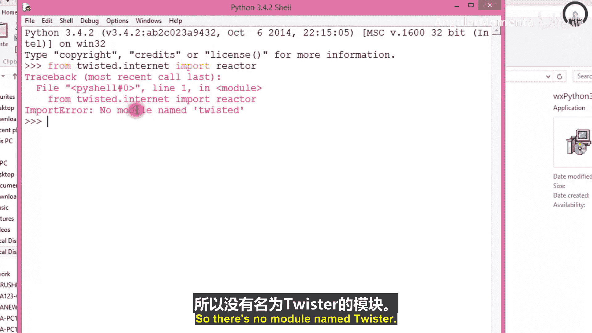
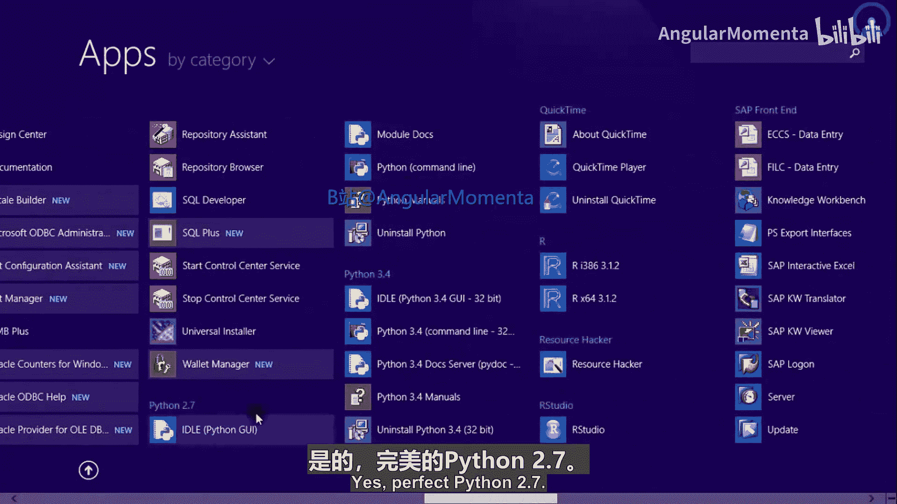
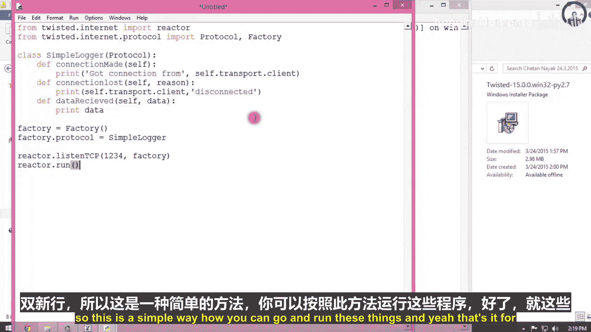

# 004：异步输入输出 第一部分

在本节课中，我们将要学习如何使用Python的`socketserver`框架创建支持多进程（`forking`）和多线程（`threading`）的服务器，以及如何使用`select`和`poll`模块实现异步I/O来处理多个客户端连接。我们还将初步了解`Twisted`这个强大的异步网络框架。

## 使用Forking和Threading的Socket服务器

上一节我们介绍了基础的Socket编程。本节中我们来看看如何使用`socketserver`框架轻松地创建支持并发处理的服务器。

使用`socketserver`框架创建支持`forking`或`threading`的服务器非常简单。

以下是创建这两种服务器的步骤：

1.  **导入必要的模块**：需要从`socketserver`模块导入`TCPServer`、`ForkingMixIn`/`ThreadingMixIn`以及`StreamRequestHandler`。
2.  **定义请求处理类**：创建一个继承自`StreamRequestHandler`的类，并重写其`handle`方法。这个方法定义了服务器如何处理每个客户端的连接。
3.  **创建并启动服务器**：使用`TCPServer`和相应的`Mixin`类来实例化服务器对象，并调用`serve_forever`方法启动。

需要注意的是，`forking`行为仅在`handle`方法需要较长时间完成时才有用。另外，`forking`在Windows系统上无法工作，它主要用于Unix/Linux系统。

### Forking服务器示例

以下是创建一个`Forking`服务器的代码示例：

```python
from socketserver import TCPServer, ForkingMixIn, StreamRequestHandler

class Server(ForkingMixIn, TCPServer):
    pass

class Handler(StreamRequestHandler):
    def handle(self):
        addr = self.request.getpeername()
        print('Got connection from', addr)
        # 这里可以编写处理客户端请求的具体逻辑

server = Server(('', 1234), Handler)
server.serve_forever()
```

### Threading服务器示例

创建一个`Threading`服务器的代码与`Forking`服务器几乎相同，唯一的区别是使用的`Mixin`类：

```python
from socketserver import TCPServer, ThreadingMixIn, StreamRequestHandler

class Server(ThreadingMixIn, TCPServer):
    pass

class Handler(StreamRequestHandler):
    def handle(self):
        addr = self.request.getpeername()
        print('Got connection from', addr)
        # 这里可以编写处理客户端请求的具体逻辑

server = Server(('', 1234), Handler)
server.serve_forever()
```

这两种服务器都能同时处理多个客户端连接。它们的核心区别在于，`Forking`服务器为每个连接创建一个新的进程，而`Threading`服务器为每个连接创建一个新的线程。

## 使用Select和Poll的异步I/O

上一节我们介绍了使用多进程和多线程处理并发。本节中我们来看看另一种更高效的异步I/O方法。

当服务器与客户端通信时，从客户端接收的数据可能是断断续续的。使用`forking`和`threading`时，这不是问题，因为一个进程/线程等待数据时，其他进程/线程可以继续处理自己的客户端。

然而，另一种方法是只处理在给定时刻真正有数据要说的客户端。我们不需要完全听完一个客户端，而是听一点，然后把它放回队列，再去处理其他客户端。这就是`select`和`poll`框架（如`asyncore`和`Twisted`模块的基础）所采用的策略。

这种功能的基础是`select`模块中的`select`函数，或者在可用的情况下使用`poll`函数。`poll`的可扩展性更强，但仅在Unix系统上可用。

### Select函数的工作原理

`select`函数接受三个序列作为其强制参数，第四个可选参数是超时时间（秒）。这三个序列分别代表需要监视的输入、输出和异常条件的文件描述符（整数）。

函数会阻塞，直到至少一个文件描述符准备好进行读/写操作，或者超时发生。`select`的返回值是一个三元组，每个元素都是一个列表，包含对应参数中处于活动状态的子集。

例如，返回的第一个列表将包含有数据可读的输入文件描述符。

### 一个使用Select的简单日志服务器

以下是一个简单的日志服务器示例，它打印出从所有客户端接收到的所有数据。我们可以使用Telnet建立多个连接来测试它是否能同时服务多个客户端。

```python
import socket
from select import select

s = socket.socket()
host = socket.gethostname()
port = 1234
s.bind((host, port))
s.listen(5)
inputs = [s]

while True:
    rs, ws, es = select(inputs, [], [])
    for r in rs:
        if r is s:
            c, addr = s.accept()
            print('Got connection from', addr)
            inputs.append(c)
        else:
            try:
                data = r.recv(1024)
                if data:
                    print(data)
                else:
                    print('Client disconnected')
                    inputs.remove(r)
                    r.close()
            except:
                inputs.remove(r)
```

### Poll方法

`poll`方法比`select`更容易使用。当我们调用`poll()`时，会得到一个`poll`对象。然后可以使用`register`方法向这个`poll`对象注册文件描述符或具有`fileno()`方法的对象。之后还可以使用`unregister`方法移除这些对象。

注册了一些对象（例如套接字）后，我们可以调用`poll`对象的`poll`方法（可带超时参数）。它会返回一个可能为空的列表，列表中的元素是`(fd, event)`形式的元组。其中`fd`是文件描述符，`event`是一个位掩码，表示实际发生的事件。

`select`模块中定义了各种`poll`事件常量，例如：
*   `POLLIN`：有数据可读。
*   `POLLPRI`：有紧急数据可读。
*   `POLLOUT`：文件描述符已准备好写入数据且不会阻塞。
*   `POLLERR`：与文件描述符关联的某些错误条件。
*   `POLLHUP`：连接已挂断。
*   `POLLNVAL`：请求无效（例如，连接未打开）。

### 使用Poll重写服务器

以下示例是使用`poll`方法重写的服务器，它比使用`select`的版本更高效。

```python
import socket
import select

s = socket.socket()
host = socket.gethostname()
port = 1234
s.bind((host, port))
s.listen(5)

p = select.poll()
p.register(s, select.POLLIN)

# 使用字典映射文件描述符到套接字对象
fd_to_socket = {s.fileno(): s}

while True:
    events = p.poll()
    for fd, event in events:
        sock = fd_to_socket[fd]
        if sock is s:
            # 有新连接
            c, addr = s.accept()
            print('Got connection from', addr)
            p.register(c, select.POLLIN)
            fd_to_socket[c.fileno()] = c
        elif event & select.POLLIN:
            # 有数据可读
            data = sock.recv(1024)
            if data:
                print(data)
            else:
                # 连接关闭
                print('Client disconnected')
                p.unregister(sock)
                sock.close()
                del fd_to_socket[fd]
```

关于`select`和`poll`的更多信息，可以参考Python标准库文档，或者阅读`asyncore`、`asynchat`等标准库模块的源代码，这有助于深入理解它们之间的区别。

## Twisted网络框架简介

上一节我们探讨了底层的`select`和`poll`机制。本节中我们来看看一个更高级、功能更丰富的异步网络框架——`Twisted`。

`Twisted`源自Twisted Matrix Laboratories，是一个用Python编写的事件驱动网络框架。它最初是为网络游戏开发的，但现在被用于各种网络软件。

在`Twisted`中，我们可以实现事件处理器，类似于在图形用户界面工具包中的用法。事实上，`Twisted`可以与多个GUI工具包很好地协同工作。

`Twisted`是一个非常丰富的框架，支持许多协议，如Web服务器/客户端、HTTP、SMTP、POP3、IMAP、Jabber、IRC、MSN、NTP、DNS等等，兼容性很强。

### 基本概念

编写一个基本的`Twisted`服务器，我们需要实现处理以下情况的事件处理器：新客户端连接、新数据到达、客户端断开连接。专门的类可以从这些基本事件中构建出更精细的事件。





所有事件处理程序都在一个`Protocol`类中定义。我们还需要一个`Factory`（工厂），当新连接到达时，它能构造这样的协议对象。如果我们想创建自定义协议类的实例，可以使用`Twisted`内置的工厂类`Factory`。

要编写自己的协议，需要使用`twisted.internet.protocol.Protocol`作为父类。当建立连接时，会调用事件处理器`connectionMade`；当连接丢失时，调用`connectionLost`；当从客户端接收到数据时，调用`dataReceived`。我们可以使用`self.transport`对象向客户端发送数据，它有一个`write`方法。`self.transport`还有一个`client`属性，包含客户端地址。

`Twisted`还有一个核心概念是`Deferred`（延迟执行），用于处理异步操作的回调，更多细节可以参考其文档。

### 一个简单的Twisted服务器示例

以下是一个使用`Twisted`编写的简单日志服务器示例。你会发现`Twisted`版本更加简洁和易读。

```python
from twisted.internet import reactor, protocol
from twisted.internet.protocol import Protocol, Factory

class SimpleLogger(Protocol):
    def connectionMade(self):
        print('Connection from', self.transport.client)

    def connectionLost(self, reason):
        print('Disconnected from', self.transport.client)

    def dataReceived(self, data):
        print(data)

factory = Factory()
factory.protocol = SimpleLogger

reactor.listenTCP(1234, factory)
reactor.run()
```

要测试这个服务器，可以使用Telnet连接。你可能会看到每行输出都有一个额外的换行符，这取决于缓冲等因素。当然，你可以使用`sys.stdout.write`代替`print`来避免这个问题。

在许多情况下，你可能希望每次获取一行数据，而不是任意数据块。为此编写一个自定义协议很容易，但事实上，`twisted.protocols.basic`模块中已经存在这样一个有用的类：`LineReceiver`。它实现了`dataReceived`，并在收到完整一行时调用事件处理器`lineReceived`。如果你在接收数据时除了使用`lineReceived`外还需要其他操作，可以使用`LineReceiver`定义的另一个新事件处理器`rawDataReceived`。

切换到这个协议只需要很少的工作。使用这个服务器时，你会看到换行符被剥离了，但使用`print`不会给你双换行符。

---



本节课中我们一起学习了多种在Python中实现并发网络服务器的方法。我们从使用`socketserver`框架的`forking`和`threading`服务器开始，然后深入探讨了更底层的异步I/O机制`select`和`poll`，最后介绍了功能强大的高级异步网络框架`Twisted`的基本用法。每种方法都有其适用场景，`Twisted`为复杂的网络应用提供了最全面的解决方案。