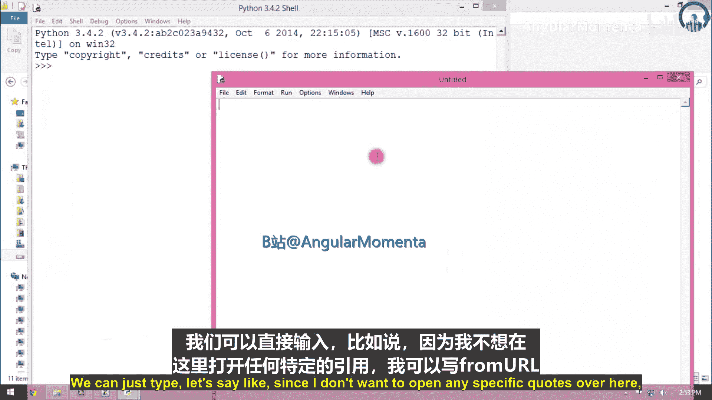
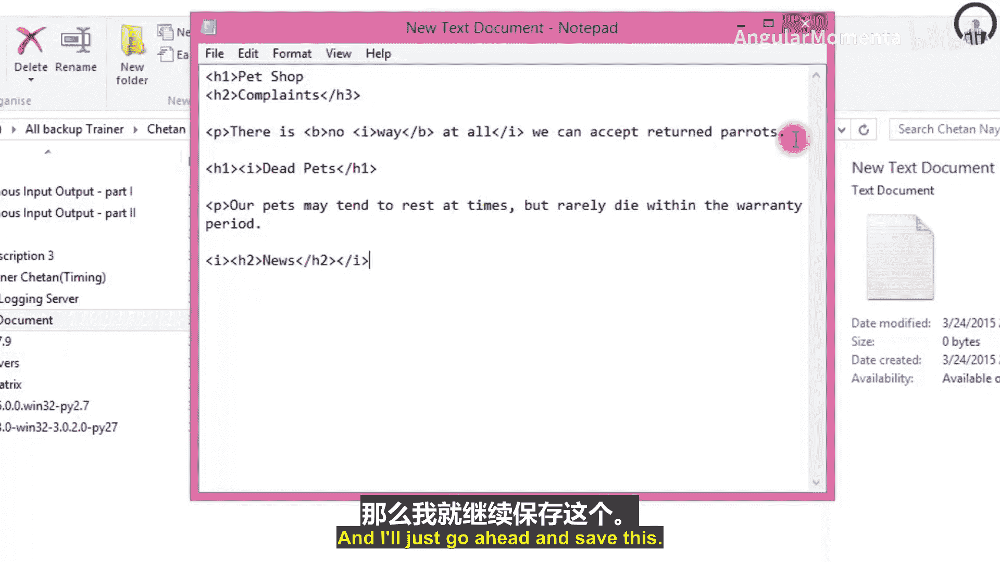
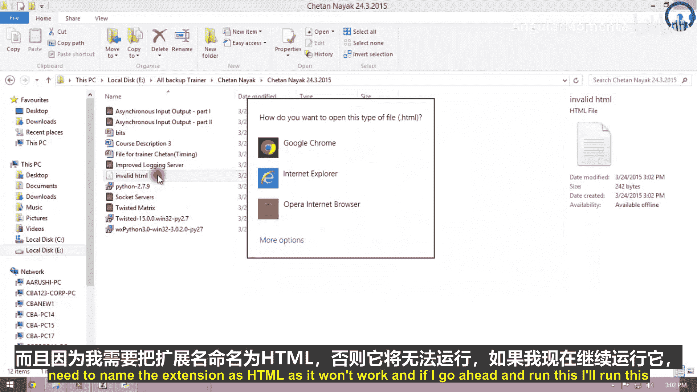
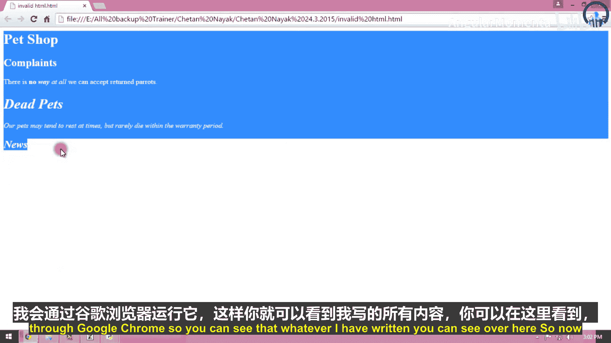
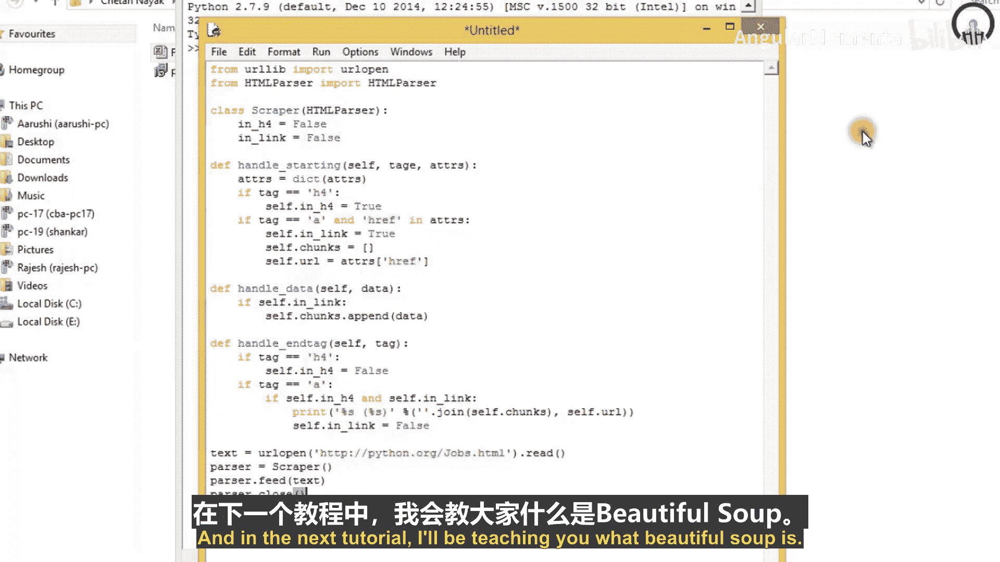

# 005：改进型日志服务器与Web数据抓取入门 🚀

在本章中，我们将学习两个核心主题。首先，我们将改进上一节创建的简单服务器，使用Twisted框架的`LineReceiver`协议构建一个更高效的日志服务器。随后，我们将进入Web编程领域，初步探索如何使用Python从网页中提取信息，即“屏幕抓取”。

---

## 改进型日志服务器 📡

上一节我们介绍了如何使用Twisted的`Protocol`类构建一个基础服务器。本节中，我们将利用`LineReceiver`协议来创建一个改进版本，它能按行接收和处理数据，使日志记录更加清晰。

以下是构建此服务器的步骤：

1.  **导入必要模块**：我们需要从`twisted.internet`导入`reactor`和`factory`，并从`twisted.protocols.basic`导入`LineReceiver`。
    ```python
    from twisted.internet import reactor
    from twisted.internet.protocol import Factory
    from twisted.protocols.basic import LineReceiver
    ```

2.  **定义协议处理类**：创建一个继承自`LineReceiver`的类，并重写连接建立、连接断开以及行数据接收的方法。
    ```python
    class SimpleLogger(LineReceiver):
        def connectionMade(self):
            print(f'Connection from {self.transport.getPeer()}')

        def connectionLost(self, reason):
            print(f'Disconnected from {self.transport.getPeer()}')

        def lineReceived(self, line):
            print(f'Received line: {line}')
    ```

3.  **创建工厂并启动服务器**：创建一个工厂类，将其协议设置为我们的`SimpleLogger`，然后使用reactor监听TCP端口。
    ```python
    factory = Factory()
    factory.protocol = SimpleLogger

    reactor.listenTCP(8000, factory)
    reactor.run()
    ```



**核心改进**：与使用`dataReceived`方法处理原始数据流不同，`LineReceiver`的`lineReceived`方法确保每次接收到以换行符结尾的完整一行数据时才触发处理，这简化了基于行的协议（如日志记录）的开发。

---

## Web数据抓取入门 🌐

从网络服务器获取数据后，我们常常需要从网页中提取特定信息。这个过程称为“屏幕抓取”。本节我们将了解其基本概念和一种简单实现方法。

屏幕抓取的核心是下载网页并从中提取信息。一个直接的方法是使用`urllib`获取HTML源码，然后用正则表达式匹配所需内容。

例如，假设我们要从某个招聘页面提取公司名称和网站：



```python
import urllib.request
import re





# 打开网页并读取内容
url = 'http://example.com/jobs.html'
html = urllib.request.urlopen(url).read().decode('utf-8')

# 使用正则表达式查找模式（示例模式，实际需根据网页结构调整）
pattern = re.compile(r'<h4>(.*?)</h4>.*?<a href="(.*?)">')
for name, link in pattern.findall(html):
    print(f'Company: {name}, URL: {link}')
```

**然而，这种方法存在三个主要弱点**：
1.  复杂的正则表达式难以编写和维护。
2.  无法妥善处理HTML的异常情况，如CDATA节或字符实体（如`&amp;`）。
3.  代码高度依赖网页的具体结构，页面布局微调就可能导致抓取失败。

为了解决这些问题，通常有两种更健壮的方案：
1.  结合使用`Tidy`等工具清理HTML，然后使用标准库的`HTMLParser`等模块进行解析。
2.  使用专为抓取设计的第三方库，如`Beautiful Soup`。

在接下来的课程中，我们将深入探讨这些更强大的工具。

---

## 本章总结 📝

本节课我们一起学习了两个重要部分。

首先，我们改进了网络服务器，利用Twisted框架的`LineReceiver`协议构建了一个按行接收数据的日志服务器，这比处理原始数据流更为简便和清晰。

接着，我们初步进入了Web数据抓取领域。我们了解了屏幕抓取的基本概念，即下载并解析网页以提取信息。我们看到了使用`urllib`和正则表达式的简单方法，同时也认识到这种方法在可读性、健壮性和可维护性上的局限性，并引出了使用`HTMLParser`或`Beautiful Soup`等更优解决方案的必要性。



在下一节中，我们将学习如何使用`Tidy`工具和`HTMLParser`来更有效地解析网页内容。