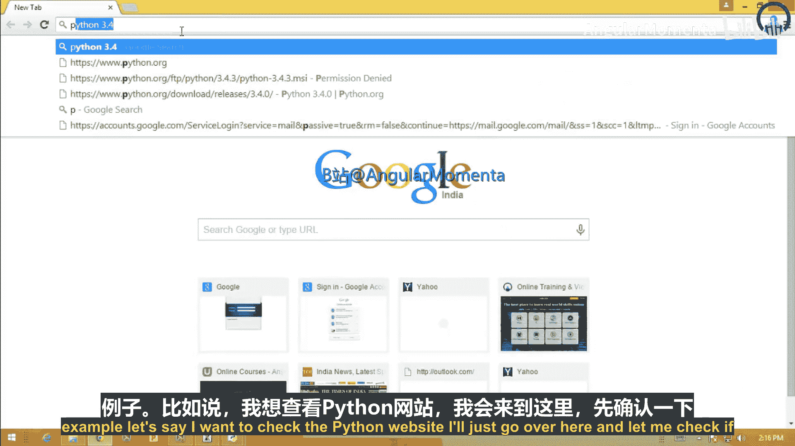
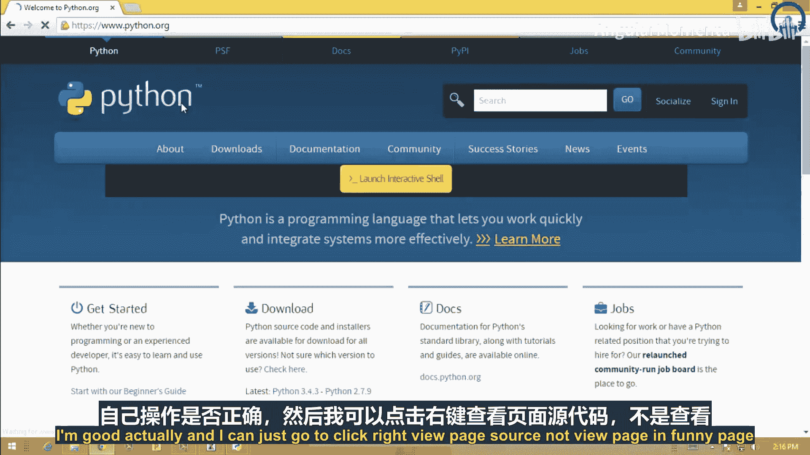
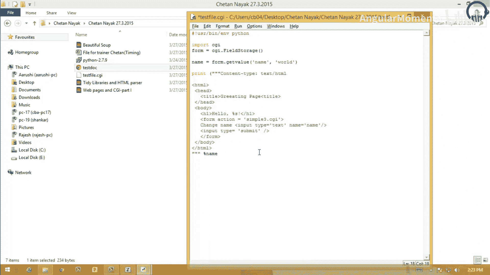

# 006：Beautiful Soup与CGI编程

## 概述
在本节课中，我们将学习两个重要的Python Web开发工具：Beautiful Soup库和CGI（通用网关接口）编程。首先，我们将了解如何使用Beautiful Soup从杂乱的HTML/XML文档中提取所需数据。接着，我们将探索如何使用CGI创建动态网页，处理用户输入并生成响应。

---

## Beautiful Soup：06-01：数据提取利器

上一节我们介绍了使用正则表达式解析网页，本节中我们来看看一个更强大的工具：Beautiful Soup。

Beautiful Soup是一个Python库，用于从HTML或XML文件中提取数据。它能够解析杂乱的标记文档，并从中提取出我们关心的数据，而不关心文档本身的格式或外观是否美观。

### 安装Beautiful Soup
你可以从其官方网站下载Beautiful Soup。以下是安装方式：

*   访问网站：`https://www.crummy.com/software/BeautifulSoup/`
*   下载压缩包，并将其放入你的Python包目录中。
*   对于Linux或Unix系统，可以使用安装脚本进行安装。

### 使用Beautiful Soup清理文档
在之前的例子中，我们使用`xml.etree.ElementTree`解析文档，代码较为复杂。现在，我们使用Beautiful Soup来简化这一过程。

以下是使用Beautiful Soup的基本步骤：

1.  导入必要的模块。
2.  打开并读取文档。
3.  创建Beautiful Soup对象。
4.  使用其方法提取数据。

```python
from bs4 import BeautifulSoup
import urllib.request

url = "你的目标网址"
response = urllib.request.urlopen(url)
html = response.read()
response.close()

soup = BeautifulSoup(html, 'html.parser')
```

### 提取特定元素
创建Soup对象后，我们可以轻松地提取文档树中的特定部分。

例如，要获取所有`<h4>`标题元素，可以这样做：

```python
headers = soup.find_all('h4')
for header in headers:
    print(header.get_text())
```

要获取某个元素的所有子元素，可以访问其属性。使用CSS选择器类属性可以让操作变得更简单。

```python
# 假设我们想从具有特定类的元素中提取链接
link_elements = soup.select('.reference-class a')
for link in link_elements:
    print(link.get('href'))
```

### 优化输出结果
为了使程序更有用，我们可以在提取数据后进行处理，例如使用`set`去除重复项，并使用`sorted`对结果进行排序。这虽然与Beautiful Soup本身无关，但能提升输出质量。

```python
unique_links = sorted(set(link.get('href') for link in link_elements))
for link in unique_links:
    print(link)
```

**总结**：本节我们一起学习了Beautiful Soup库。它通过几行代码就能帮助我们解析和提取HTML/XML文档中的数据，比手动解析要简单高效得多。接下来，我们将进入动态网页的世界。

---

## CGI编程：06-02：创建动态网页

上一节我们介绍了静态数据提取，本节中我们来看看如何让网页“动”起来，即创建动态网页。

CGI（通用网关接口）是一种标准机制，Web服务器通过它可以将用户通过网页表单提交的查询，传递给专门的程序（如Python脚本）进行处理，并将处理结果返回显示为网页。这是一种无需编写专用应用服务器即可创建Web应用的简单方法。

### CGI编程核心：`cgi`模块
Python中进行CGI编程的关键工具是`cgi`模块。你可以在Python库参考中找到其详细描述。另一个在开发CGI脚本时非常有用的模块是`cgitb`，我们稍后会介绍。

### 部署CGI脚本的三个步骤
要让CGI脚本能被Web访问，你需要完成以下三个准备步骤：

**步骤一：将脚本放入Web服务器可访问的目录**
你的CGI程序必须放在一个可以通过Web访问的目录中。通常，这类似于将网页和图片放在一个特定目录（例如`public_html`）中。如果你不知道如何操作，请联系你的网络服务提供商或系统管理员。

此外，必须让Web服务器能识别出这是CGI脚本，而不是普通的源代码文件。有两种常见方法：

*   将脚本放在名为`cgi-bin`的子目录中。
*   给脚本文件加上`.cgi`扩展名。

具体配置方式因服务器而异，例如使用Apache服务器可能需要启用`ExecCGI`选项。

**步骤二：添加“Shebang”行**
在脚本的正确位置放置好后，必须在脚本开头添加一行特殊的注释，称为“Shebang”行。这行代码告诉系统使用哪个解释器来执行脚本。

对于Python脚本，Shebang行通常如下所示：

```python
#!/usr/bin/env python
```

如果上述方式不工作，你可能需要指定Python解释器的完整路径：

```python
#!/usr/local/bin/python3
```

**步骤三：设置正确的文件权限**
你需要设置适当的文件权限，确保Web服务器能够读取和执行你的脚本文件，同时只有你（脚本所有者）可以写入（编辑）它。

在Unix/Linux系统中，可以使用`chmod`命令来添加执行权限：

```bash
chmod +x your_script.cgi
```

完成所有准备工作后，你应该能够通过完整的URL（而不是本地文件路径）在浏览器中访问脚本，并看到它被执行。

### CGI脚本的安全风险
使用CGI程序涉及许多安全问题。如果允许你的CGI脚本在服务器上写入文件，除非编码非常谨慎，否则这种能力可能被用来破坏数据。同样，如果将用户提供的数据作为Python代码或Shell命令来执行，将面临执行任意命令的巨大风险。关于Web安全的更多信息，可以参考万维网联盟（W3C）的安全常见问题解答。

**总结**：本节我们一起学习了部署CGI脚本的三个关键步骤：放置脚本、添加Shebang行和设置权限，并了解了相关的安全注意事项。接下来，我们将动手编写一个简单的CGI脚本。

---

## 第一个CGI脚本：06-03：Hello, CGI World!

上一节我们了解了CGI的部署基础，本节中我们来看看如何编写一个最简单的CGI脚本。

一个最基本的CGI脚本看起来像这样：

```python
#!/usr/bin/env python
print("Content-Type: text/plain")
print()
print("Hello, World!")
```

### 代码解析
1.  `#!/usr/bin/env python`: Shebang行，指定使用Python解释器。
2.  `print("Content-Type: text/plain")`: 输出HTTP头。`Content-Type`告诉浏览器返回的内容类型是纯文本。如果要返回HTML，则应使用`text/html`。
3.  `print()`: 输出一个空行，这是HTTP协议中头部结束和正文开始的标志。
4.  `print("Hello, World!")`: 输出网页的实际内容。

将这个文件保存为`simple.cgi`，并通过Web服务器访问其URL，你将在浏览器中看到一个只包含“Hello, World!”纯文本的网页。

### 使用`cgitb`进行调试
在开发过程中，程序可能会因为异常而终止，并产生难以理解的服务器错误。为了获得更详细的错误信息，可以导入`cgitb`模块并调用其`enable()`函数。

```python
#!/usr/bin/env python
import cgitb
cgitb.enable() # 启用详细错误报告

print("Content-Type: text/plain")
print()

# 故意制造一个错误
result = 1 / 0
print("Hello, World!")
```

访问这个脚本，浏览器将显示一个详细的错误追踪页面，指出是`ZeroDivisionError`，并显示导致错误的函数调用序列。请注意，在产品环境中应关闭`cgitb`功能，因为追踪页面不适合普通用户查看。

**总结**：本节我们一起编写并分析了第一个CGI脚本，了解了其基本结构，并学会了使用`cgitb`模块来辅助调试。接下来，我们将学习如何处理用户输入。

---

## 处理用户输入：06-04：与表单交互

上一节我们创建了只输出的脚本，本节中我们来看看如何让CGI脚本接收和处理用户的输入。

用户通过HTML表单提交的数据，会以“键-值”对的形式传递给CGI脚本。我们可以在脚本中使用`cgi`模块的`FieldStorage`类来获取这些数据。

### 获取表单数据
创建`FieldStorage`实例后，它会从请求中获取输入变量，并通过一个类似字典的接口呈现给你的程序。

以下是两种获取特定字段值的方法：

**方法一：直接通过键查找**
```python
#!/usr/bin/env python
import cgi



form = cgi.FieldStorage()
# 获取名为‘name’的字段值
user_name = form.getvalue('name', 'Unknown') # ‘Unknown’是默认值
```



**方法二：使用`getvalue`方法**
`getvalue`方法与字典的`get`方法类似，但它直接返回字段的`value`属性。第二个参数可以指定默认值。

```python
user_name = form.getvalue('name', 'Guest')
```

### 创建交互式页面
我们可以将表单和处理逻辑放在同一个脚本中。以下是一个完整的例子，它显示一个问候语和一个可以修改名字的表单：

```python
#!/usr/bin/env python
import cgi

form = cgi.FieldStorage()
name = form.getvalue('name', 'World')

print("Content-Type: text/html")
print()
print("""
<html>
<head><title>Greeting Page</title></head>
<body>
<h1>Hello, {}!</h1>
<form action="this_script.cgi" method="post">
Change name: <input type="text" name="name" />
<input type="submit" value="Submit" />
</form>
</body>
</html>
""".format(name))
```

### 代码解析
1.  `form = cgi.FieldStorage()`: 获取用户提交的表单数据。
2.  `name = form.getvalue('name', 'World')`: 尝试获取名为`name`的字段值，如果用户没有输入，则使用默认值`"World"`。
3.  输出HTML页面，其中：
    *   标题`<h1>`中动态插入了`name`变量的值。
    *   包含一个HTML表单，其`action`属性指向脚本自身（`this_script.cgi`需要替换为实际脚本名）。这意味着提交表单后会重新加载此脚本。
    *   表单中有一个文本输入框（`name="name"`）和一个提交按钮。

当用户在文本框中输入新名字并提交后，`name`参数就有了新值，页面刷新后标题就会随之改变。

### 学习HTML表单
要创建更复杂的表单，你需要了解HTML表单的各种元素（如文本框、单选按钮、复选框、下拉列表等）。一个很好的学习方法是查看其他网站的页面源代码。在浏览器中右键点击页面，选择“查看页面源代码”或类似选项，可以研究其HTML结构。



**总结**：本节课我们一起学习了Beautiful Soup和CGI编程。我们掌握了使用Beautiful Soup从网页中提取数据的简洁方法，并学会了如何通过CGI创建能处理用户输入、生成动态内容的Web应用程序。从解析静态数据到创建交互式网页，你已经迈出了Python Web开发的重要一步。