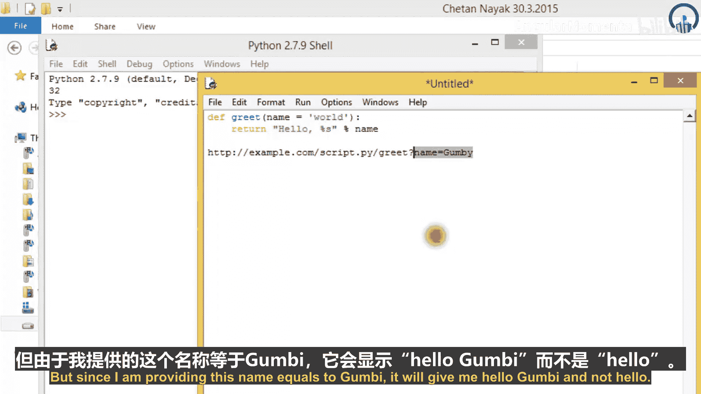

# 007：CGI处理器与Apache配置 🚀

在本教程中，我们将学习如何配置Apache服务器以使用`mod_python`模块，并探索其提供的三种主要处理器：CGI处理器、PSP处理器和发布处理器。我们将了解它们的基本概念、配置方法以及各自的适用场景。

---

## 概述

上一节我们介绍了CGI的基本概念。本节中，我们将进一步探讨`mod_python`模块。如果你喜欢CGI，那么你很可能也会喜欢`mod_python`。它是Apache Web服务器的一个扩展，可以从`mod_python`网站获取。它使Python解释器直接成为Apache的一部分，从而开启了许多不同的可能性。其核心是让你能够用Python（而非通常的C语言）编写Apache处理器。`mod_python`处理器框架为你提供了访问丰富API的能力，涵盖了Apache内部机制等更多内容。

除了基本功能外，它还附带几个处理器，可以使Web开发任务更加便捷。这些处理器包括：
*   **CGI处理器**：让你可以使用`mod_python`解释器运行CGI脚本，显著提升执行速度。
*   **PSP处理器**：让你可以将HTML和Python代码混合在一起，创建可执行的网页。
*   **发布处理器**：让你可以通过URL调用Python函数。

现在你可能会想，仅通过URL就能调用Python函数，这听起来太棒了。在本节中，我将重点介绍这三种标准处理器。如果你想编写自己的自定义处理器，可以查阅`mod_python`文档。

---

## 安装与配置 `mod_python`

首先，我们来看看如何安装`mod_python`并使其正常工作，这是最重要的部分。这比我们之前发现的任何其他软件包安装都要困难一些。你至少需要让它与Apache协同工作。如果你能自己安装`mod_python`，你应该使用某种包管理器系统来自动安装和运行它，或者确保你对运行和维护Apache Web服务器有所了解。如果你不能，那么你需要先去学习，然后再回到本教程。当然，如果你幸运的话，你可能已经可以访问一台安装了`mod_python`的机器。如果你不确定，可以尝试安装并运行它。如果无法安装或运行，请保存本教程视频，去学习Apache Web服务器或获取相关知识，然后再回来。如果你不想自己安装，可以从`mod_python`文档中获取所需信息，这些文档显然可以在线获取或从其特定网站下载。我将其称为`mod_python`，但有时会简称为`mod_python`。

安装过程根据你使用的是Unix服务器还是Windows而略有不同。

### 在Linux/Unix系统上安装

如果你在类Unix系统上安装，并且已经编译了Apache Web服务器并拥有Apache源代码，以下是编译和安装`mod_python`的要点：

1.  下载`mod_python`源代码。
2.  解压归档文件并进入目录。
3.  运行`mod_python`的配置脚本。你可以这样添加脚本：`./configure --with-apxs=/usr/local/apache/bin/apxs`。记下你遇到的任何有用信息，例如关于加载模块的消息。
4.  配置完成后，在终端中输入`make`来编译所有内容。
5.  编译完成后，输入`make install`。这三步将在你的Linux或Unix发行版下安装所有内容。

### 在Windows系统上安装

在Windows上安装有点棘手。适用于Windows的`mod_python`二进制版本要求你使用Python 2.3版本，不能使用2.4、3.4等版本。因此，请从Apache.org下载`mod_python`安装程序并双击它。安装过程是直接的，它会引导你完成步骤。但在此之前，你需要安装Python 2.3，否则在过程结束时可能会出错。如果你没有为Python安装Tcl/Tk，安装程序会告诉你如何手动完成安装。为此，只需将`mod_python.pyd`从Python的`Lib/site-packages`文件夹复制到Apache根目录下的`modules`目录。

---

## 配置Apache

假设到目前为止我告诉你的一切都进展顺利，并且你知道如何配置Apache以使用`mod_python`。找到用于特定模块的Apache配置文件，它通常被称为`httpd.conf`或`apache.conf`。根据你的操作系统添加相应的行。

如果你使用的是Linux，你需要在配置文件中添加这样一行：
```apache
LoadModule python_module /usr/lib/apache2/modules/mod_python.so
```
请确保在此行中没有拼写错误，否则它将无法运行。

如果你使用的是Windows，那么你的行可能如下所示：
```apache
LoadModule python_module modules/mod_python.so
```
你可能看不到太多区别，但这造成了很大的不同。编写此文件的方式可能会有细微变化，例如`mod_python.so`的确切路径。如果无法运行，请检查系统中`mod_python.so`的正确路径。Unix的正确版本实际上应该作为运行`configure`的结果报告出来。如果你正确运行了此操作并且没有出现任何错误，你可能不需要运行此操作或将其复制到你的配置文件中。

现在，Apache会尝试查找`mod_python`，但它没有理由使用它。这意味着我们需要给它一个理由去查找和使用这一特定行。为此，我们必须在你的Apache配置中添加行，可以是在某个主配置文件中，也可以是在你放置网页的目录中一个名为`.htaccess`的文件中。我假设你使用的是`.htaccess`，因为大多数时候它们都在那里。否则，你必须在你的Windows或Unix用户目录中指定位置。

---

## 使用CGI处理器

这是本教程中我将教授的第一个处理器。在下一个教程中，我将教授PSP和发布处理器。

CGI处理器模拟了我们的程序运行的环境，就像我们实际使用CGI一样。因此，我们实际上是使用`mod_python`来运行程序，但我们仍然可以像使用CGI脚本一样编写它，例如使用`cgi`和`cgitb`模块。因此，与普通CGI相比，使用CGI处理器的主要原因是性能。根据`mod_python`文档中的一个简单测试，你可以将性能提高大约一个数量级，甚至更多。然而，发布处理器比这个模块快得多，而编写你自己的处理器可能比CGI处理器快三倍。如果你追求速度，CGI处理器不是你的选择。但如果你正在编写新代码，并且想要功能性和灵活性的结合，并使用其他解决方案之一，那么这可能是一个好主意。使用CGI处理器是因为它并没有真正挖掘出`mod_python`的巨大潜力，但它最适合与遗留代码一起使用。

无论如何，为了让CGI处理器开始工作，我们在存放CGI脚本的目录中放入以下`.htaccess`文件。对于调试信息，你可以添加以下行：
```apache
AddHandler mod_python .py
PythonHandler mod_python.cgihandler
PythonDebug On
```
你应该在开发完成后删除此目录。在程序实际公开或开源之前，没有理由将程序的内部暴露给公众。一旦你正确设置了这六行，你应该能够像以前一样运行你的CGI脚本。为了使此工作正常，你可能需要为你的脚本添加`.py`扩展名，即使你使用以`.cgi`结尾的URL访问它。`mod_python`在查找文件以满足请求时会将`.cgi`转换为`.py`。这就是原因。

本教程到此结束。在下一个教程中，我将教你如何使用PSP和发布模块来编写CGI脚本。如果你无法正确理解这一点，或者现在对你来说有点困难，谷歌是你获取所需更多信息的最佳选择。最后我想告诉你一件事，无论你看多少教程，你仍然需要自己动手，创建自己的示例，这样对你来说处理示例会更容易。并非每个教程都相同，你需要从自身获得一些帮助，以便能够从所有教程中获取信息，使用谷歌获取更多模块或更简单的方法。当你阅读这些教程时，可能有些内容已经再次更新，我现在教给你的一些东西可能无法工作，因为它们可能已经更新。因此，你需要保持自己的知识是最新的，以便知道如何使用每个教程和每个模块。本教程到此结束，下一个教程将是关于PSP和发布处理器的。

---

## 使用PSP处理器

欢迎来到下一个Python编程教程。在本教程中，我将教你如何使用CGI处理器以及一些例外情况。在本教程中，我将教你PSP，当我说PSP时，请记住这不是你的PlayStation PSP，而是我将要教你的不同的东西。我将教你PSP以及发布处理器，这是剩下的两个模块。

如果你使用过PHP（超文本预处理器，最初称为个人主页）、Microsoft ASP（活动服务器页面）、JSP（Java服务器页面）或类似的东西，那么PSP（Python服务器页面）背后的概念对你来说应该很熟悉。PSP文档是HTML和Python代码的混合体，Python代码包含在特殊用途的标签中。任何HTML都将转换为对输出函数的调用。

设置Apache以提供你的PSP页面非常简单，只需在你的`.htaccess`文件中添加一行，例如：
```apache
AddHandler mod_python .psp
PythonHandler mod_python.psp
```
但请记住，在开发PSP页面时使用指令`PythonDebug On`可能对你有用。不过，当系统实际使用时不应保持开启，因为PSP页面中的任何错误都会导致异常回溯，包括正在使用的源代码被用户看到。因此，潜在地说，让恶意用户看到我们程序的源代码是我们不应掉以轻心的事情，因为你不想让程序的源代码被他人获取，他们以后可能会将其用于任何非法目的。如果你故意发布代码，其他人可能会发现你的安全漏洞，这绝对是开源软件开发的一个强烈动机。然而，让用户通过错误消息窥见你的代码可能没有用处，并且存在潜在风险。

PSP主要有两组标签：一组用于语句，另一组用于表达式。表达式标签中的表达式值直接放入输出文档中。让我展示一个简单的PSP代码示例：
```psp
<html>
<head><title>My PSP Page</title></head>
<body>
<p>
<%
# 这是一个Python代码块
import time
current_time = time.ctime()
%>
The current time is: <%= current_time %>
</p>
</body>
</html>
```
这是一个简单的PSP示例，它执行一些代码，然后使用表达式标签输出一些数据作为网页的一部分。你可以以任何你喜欢的方式混合输出、语句和表达式。你可以这样写注释：
```psp
<%-- 这是一个注释 --%>
```
这是你编写PSP页面时写注释的方式。除了这些基础之外，编程内容真的很少。不过，你需要注意一个问题：如果语句中的代码开始了一个缩进块，该块将持续到HTML被放入块内。确保这一点最简单的方法是，你需要关闭块才能插入注释，否则它将无法工作。通常，如果你使用过PHP或JSP，你可能没有注意到PSP对换行和缩进更加挑剔。当然，这是Python本身的一个特性，即Python更关心换行和缩进。

有许多其他系统在某种程度上类似于`mod_python`的PSP，甚至有些几乎完全相同。例如，Web开发系统Zope有自己的模板语言，与Webware的PSP系统有些相似。因此，你可以访问Python的Web类别，或者只需进行Web搜索“Python模板系统”，这应该会指向其他几个有趣的系统。但这不是我在这里的目的。我在这里是为了教你一些你不知道的东西，所有那些额外的东西你需要自己处理。我们可以将其视为类似课后作业，在你观看教程后，去搜索这些东西。

---

## 使用发布处理器

现在我来教你什么是发布处理器。发布处理器是`mod_python`真正发挥其作用的地方。它提供了一个比CGI脚本更有趣的环境。要使用发布处理器，你需要在你的`.htaccess`文件中添加以下行：
```apache
AddHandler mod_python .py
PythonHandler mod_python.publisher
```
你需要输入这两行来创建这个处理器。Python将是一个小程序。这将使用发布处理器运行任何以`.py`结尾的文件作为Python脚本。

关于发布处理器，首先要知道的是它将函数作为文档暴露给Web。例如，假设你有一个名为`xyz.py`的脚本，位于`http://example.com/script`，即在这个网站的`example.com`中，你有一个名为`xyz.py`的脚本，其中包含一个函数，比如`read`，它打开URL `abc.com`。那么，发布处理器将首先运行这个函数，然后将返回的任何内容作为文档显示给用户。换句话说，如果有一个函数，它将首先运行该函数，然后将文档中的任何内容显示给用户。这类似于普通的Web文档，但默认文档在这里被称为`index`，而函数内的特定名称，例如`example.com/xyz.py`（这是我们的脚本），将作为该名称的函数被调用。换句话说，类似以下内容就足以让用户发布你的处理器：
```python
def index(req):
    return "Hello, World!"
```
这里的`req`（请求）对象让你可以访问有关接收到的请求的多个信息片段，以及设置自定义HTTP头部等。你可以查阅`mod_python`文档。

你也可以这样写：
```python
def index():
    return "Hello, World!"
```
但这里的发布处理器实际上会检查给函数传递了多少参数，它们被称为什么，以及它可以接受什么参数。当你输入`req`时，它让你访问有关接收到的请求的多个信息片段，这是两者之间的区别。如果你愿意，也可以进行某种检查。它不一定在所有Python实现中都可移植，但如果你坚持使用CPython，你也可以使用`inspect`模块来探查函数的某些角落，看看它们接受多少参数以及参数叫什么。

你可以给函数更多参数，然后请求对象。你可以这样调用它，例如：
```python
def read(name="World"):
    return "Hello, %s!" % name
```
而不是写那个你只是“Hello, World!”的地方。注意，这里的调度器使用参数的名称。因此，当没有名为`req`的参数时，你将不会收到请求对象。

你可以使用URL访问此函数并提供参数，例如`http://example.com/xyz.py/read?name=Gumby`。那么你的页面现在将包含文本“Hello, Gumby!”，而不是“Hello, World!”。原因是我之前在这里提到了它有`name`参数，但由于我给了它一个名字`Gumby`，函数将输出它。让我展示给你看，如果我尝试访问类似这样的URL：`http://example.com/script/read?name=Gumby`，那么它将给你类似“Hello, Gumby!”的内容。注意，默认文档在用户不提供任何参数时非常有用。这意味着如果我不提供任何参数，比如这里的`Gumby`，它将简单地显示“Hello, World!”。但由于我提供了`name=Gumby`，它将给我“Hello, Gumby!”而不是“Hello, World!”。

---

## 总结

在本节课中，我们一起学习了如何配置Apache服务器以使用`mod_python`模块。我们详细探讨了其三种核心处理器：
1.  **CGI处理器**：用于提升传统CGI脚本的性能，配置简单，适合遗留代码。
2.  **PSP处理器**：允许混合HTML和Python代码创建动态页面，类似于PHP或JSP。
3.  **发布处理器**：功能强大，允许通过URL直接调用Python函数，提供了更灵活和高效的Web开发环境。




我们还介绍了在Linux和Windows系统上安装`mod_python`的步骤，以及如何通过修改Apache配置文件（`httpd.conf`或`.htaccess`）来启用这些处理器。理解这些工具将帮助你根据项目需求选择合适的技术，并构建更高效的Python Web应用程序。