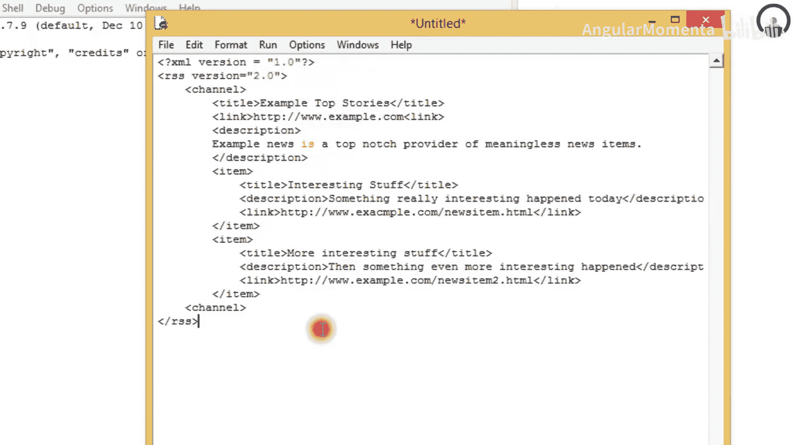
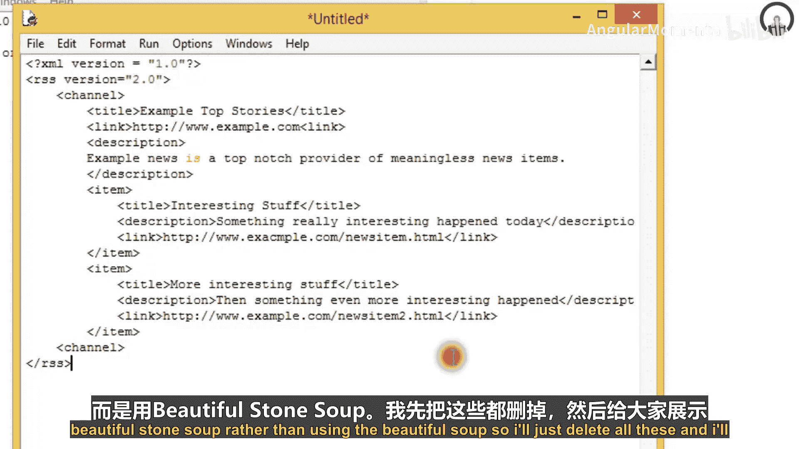
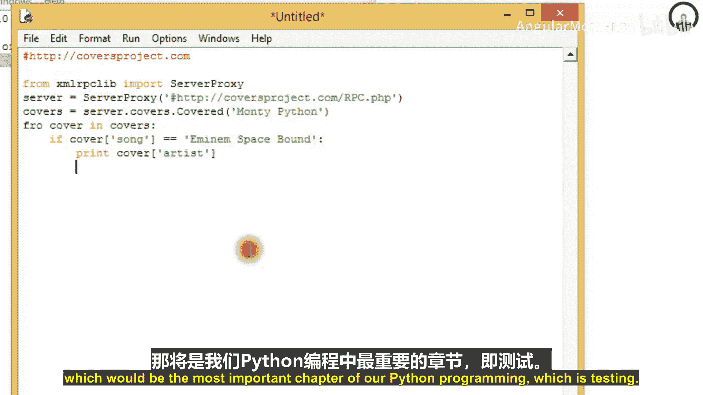

# 008：带标识的RSS订阅源

## 概述
在本教程中，我们将学习Web服务，特别是RSS（简易信息聚合）和XML-RPC（远程过程调用）协议。我们将了解它们是什么，如何工作，并通过Python代码示例来演示如何解析RSS订阅源以及如何与XML-RPC服务器进行交互。

---

## Web服务简介
上一节我们介绍了网络编程的基础概念。本节中，我们来看看Web服务。Web服务类似于计算机友好的网页。

它们基于标准和协议，使得程序能够通过网络交换信息。通常，一个程序（称为客户端）向另一个程序（称为服务提供者）请求信息或服务，而服务提供者则提供这些信息或服务。

Web服务的工作原理与之前章节讨论过的网络编程非常相似。由于您正在学习本教程，我们假设您已经了解网络编程。Web服务通常在较高层次上抽象，它们使用HTTP作为底层协议，并在此基础上使用更面向内容的协议（例如XML格式）来编码请求和响应。

这意味着Web服务器可以作为Web服务的平台。正如本节标题所示，我们可以将Web服务视为动态网页，但其设计目标是计算机而非人类。存在多种Web服务标准，涵盖了各种复杂性，但您也可以从简单应用开始。

---

## 重要Web服务协议
以下是两种重要的Web服务协议，我们将从最简单的一种开始。

### RSS（简易信息聚合）
RSS，全称为Rich Site Summary（丰富站点摘要）或Really Simple Syndication（简易信息聚合），是一种用于聚合新闻条目的XML格式。

RSS文档与普通HTML文档的区别在于，它们被期望定期或不定期更新。它们甚至可以是动态生成的，例如代表博客的最新文章。市面上有许多RSS阅读器。由于RSS格式简单，很容易为其找到新的应用。例如，某些浏览器允许您将RSS订阅源添加为书签，并提供一个包含各个新闻条目的动态子菜单。

RSS的一个稍显混乱之处在于其版本。版本0.9和2.0（现在主要称为简易信息聚合）彼此兼容，但它们与版本1.0完全不兼容。此外，还有其他格式用于新闻订阅和站点聚合，例如Atom。

问题是，如果您想编写一个处理多个站点订阅源的客户端程序，您必须准备解析几种不同的格式。您甚至可能需要在消息本身中解析XML片段。在本节中，我们将使用RSS 2.0的一个小子集，并向您展示一个RSS文件的实际样子。

一个基本的RSS 2.0文档结构如下：
```xml
<?xml version="1.0"?>
<rss version="2.0">
    <channel>
        <title>Example Top Stories</title>
        <link>http://example.com</link>
        <description>Meaningless news items</description>
        <item>
            <title>Interesting Stuff</title>
            <link>http://example.com/item1</link>
            <description>Today's interesting news.</description>
        </item>
        <item>
            <title>More Interesting Stuff</title>
            <link>http://example.com/item2</link>
            <description>Another piece of news.</description>
        </item>
    </channel>
</rss>
```
RSS 2.0标准规定了一些必需元素和许多可选元素。您可以依赖`<channel>`元素包含`<title>`、`<link>`和`<description>`。您可以拥有一个或多个`<item>`元素，每个至少包含`<title>`或`<description>`。

如果您编写程序来处理特定的订阅源，一个好方法是先查明它提供了哪些元素。另一个使解析具有挑战性的事实是，尽管RSS应该是有效的XML，但您很可能会遇到格式不规范的RSS订阅源。新闻消息本身可能包含未转义的“&”符号等非法字符。

幸运的是，我们有Beautiful Soup库，它可以处理XML和HTML，并且不会对RSS订阅源中的一些小问题抱怨。以下是一个从新闻网站获取头条新闻的示例程序，它使用了`BeautifulStoneSoup`类（专门用于XML）而非`BeautifulSoup`（专门用于HTML）。

```python
from BeautifulSoup import BeautifulStoneSoup
from urllib import urlopen
from textwrap import wrap

url = 'http://www.example.com/feed/rss2'
soup = BeautifulStoneSoup(urlopen(url).read())





for item in soup('item'):
    title = item.title.string
    print '\n'.join(wrap(title))
    print '-' * len(title)
    description = item.description.string
    print '\n'.join(wrap(description))
    print item.link.string
```

---

## XML-RPC（远程过程调用）
上一节我们介绍了RSS。本节中，我们来看看XML-RPC。XML-RPC代表远程过程调用，XML是您已经多次遇到的语言。

Python标准库中的`xmlrpclib`模块用于连接RPC服务器。一个简单的XML-RPC服务器是一个类。在后续教程中，我将教您如何编写此类服务器。

为了展示XML-RPC库的易用性，我将创建一个连接到RPC服务器并查询信息的示例。假设我们有一个网站，它拥有所有歌曲的封面数据库。

```python
from xmlrpclib import ServerProxy

server = ServerProxy("http://coversproject.com/xmlrpc.php")
covers = server.coverart.getCover

artist = covers("Monty Python", "Bicycle")
if artist:
    print artist
```
服务器代理对象看起来像一个普通对象，您可以调用其各种方法。实际上，调用`covers.coverart.getCover`会向服务器发送请求，服务器响应请求并返回答案。从某种意义上说，您是在服务器本身上调用方法。

网络编程可以比这更简单。您阅读的相关资料越多，就越容易理解更复杂的示例。

---



## 总结
在本教程中，我们一起学习了Web服务，特别是RSS订阅源和XML-RPC协议。我们了解了它们的基本概念，查看了RSS的XML结构，并使用Beautiful Soup库编写了解析RSS订阅源的Python代码。我们还通过一个示例演示了如何使用`xmlrpclib`模块与XML-RPC服务器进行交互，调用远程方法并获取结果。这些知识为进一步学习更复杂的网络服务和应用程序测试奠定了基础。