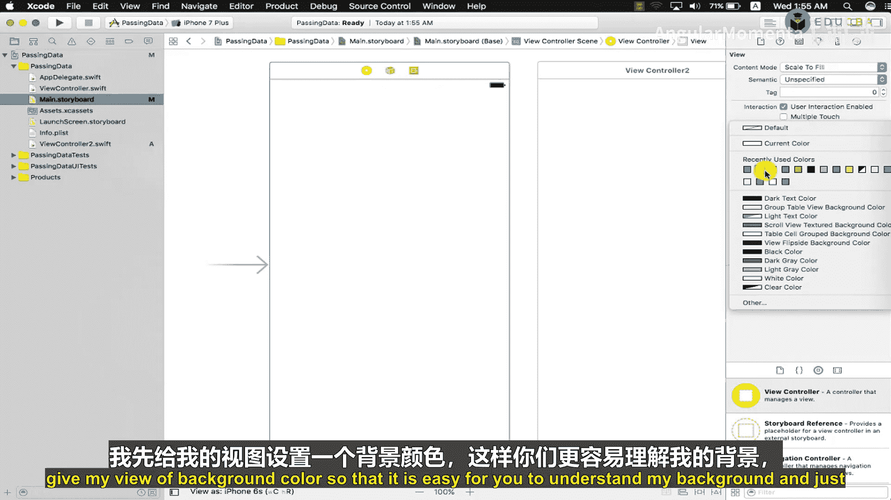
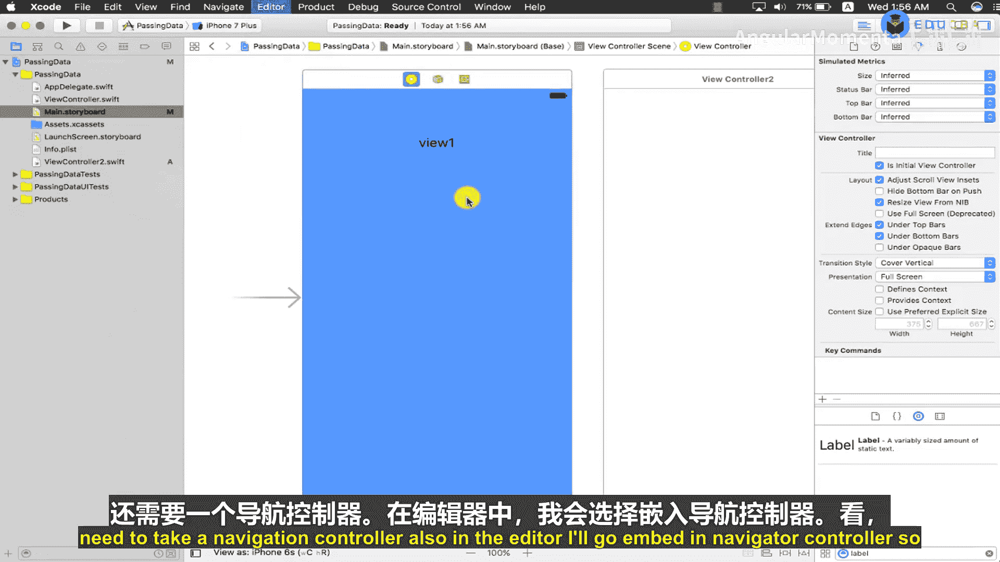
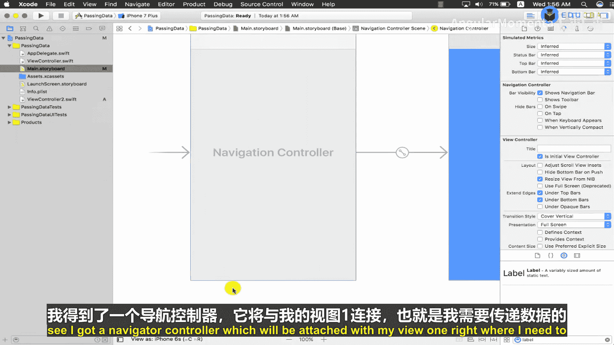
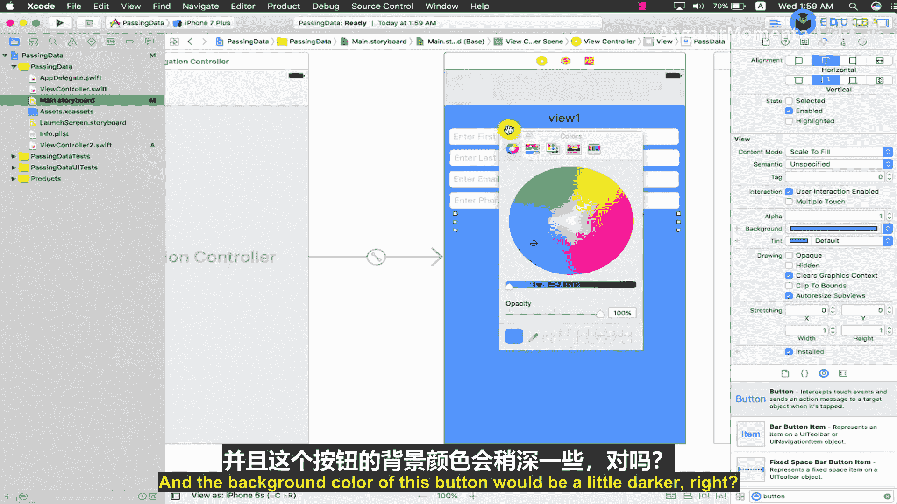
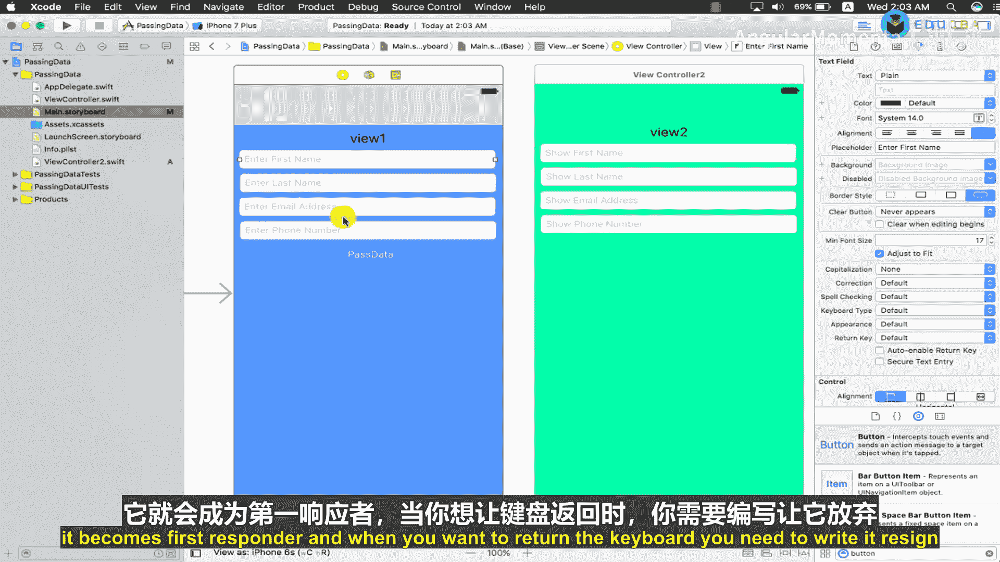
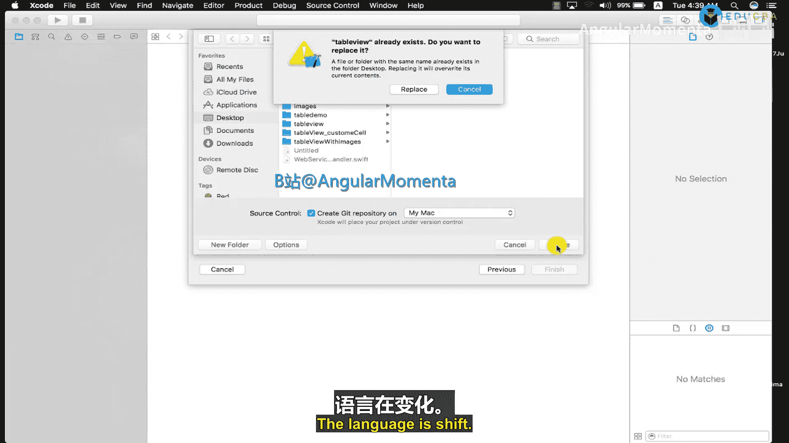
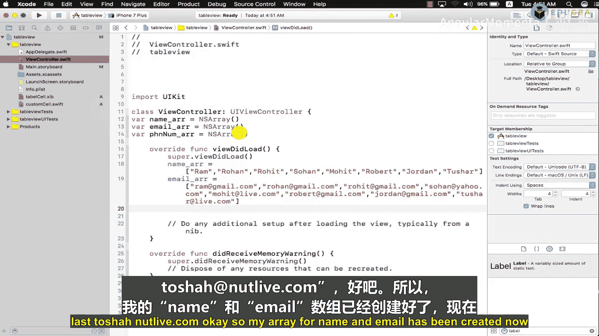

# 001：视图控制器间数据传递入门 🚀

在本节课中，我们将学习如何在iOS应用的两个视图控制器之间传递数据。我们将使用文本字段（UITextField）作为数据输入和接收的界面元素，并学习如何为这些文本字段设置基本的数据验证规则，例如确保字段不为空以及验证电子邮件格式。

---

## 项目创建与设置 🛠️

首先，我们需要创建一个新的Xcode项目。Xcode是苹果公司提供的集成开发环境（IDE），用于为iPhone、Mac和Apple Watch等设备开发应用程序。

以下是创建项目的步骤：
1.  打开Xcode，选择“Create a new Xcode project”。
2.  选择“Single View App”模板。
3.  将项目命名为“PassingData”。
4.  确保编程语言选择为“Swift”。
5.  完成创建。

项目创建后，你会看到一个名为`ViewController`的类和一个对应的故事板（Storyboard）文件。故事板中的视图控制器（View Controller）将由`ViewController`类来管理其事件和生命周期。

---

## 添加第二个视图控制器 ➕

由于我们的主题是在两个视图控制器间传递数据，因此需要创建第二个视图控制器。

以下是添加第二个视图控制器的步骤：
1.  从对象库（Object Library）中拖拽一个新的“View Controller”到故事板上。
2.  创建一个新的Cocoa Touch Class文件，继承自`UIViewController`，例如命名为`View2ViewController`。
3.  回到故事板，选中新添加的视图控制器，在身份检查器（Identity Inspector）中，将其类（Class）设置为`View2ViewController`。

现在，我们有了两个视图控制器：`ViewController`（视图1）和`View2ViewController`（视图2）。数据将从视图1传递到视图2。

---



## 设计用户界面 🎨

接下来，我们需要为两个视图控制器设计用户界面。

### 设计第一个视图控制器（ViewController）



首先，为视图1设置一个背景色以便区分。然后，从对象库中拖拽以下元素到视图上：
*   一个标签（UILabel），将其文本改为“Enter Details”，并调整其大小和位置。
*   四个文本字段（UITextField）。文本字段会在界面中创建一个可编辑的文本区域，点击时会弹出键盘。我们将使用它们的`placeholder`属性来显示提示文本。
*   一个按钮（UIButton），将其标题改为“Pass Data”，并设置其背景色和文字颜色。



为了能够导航到第二个视图，我们需要为第一个视图控制器嵌入一个导航控制器（Navigation Controller）。在编辑器中，选择第一个视图控制器，然后点击菜单栏的 “Editor” -> “Embed In” -> “Navigation Controller”。

以下是四个文本字段的`placeholder`建议：
*   第一个：`First Name`
*   第二个：`Last Name`
*   第三个：`Email`
*   第四个：`Phone`

### 设计第二个视图控制器（View2ViewController）

为了节省时间，我们可以复制视图1中的界面元素到视图2，并进行调整：
1.  为视图2设置一个不同的背景色（例如绿色）。
2.  复制视图1中的标签和四个文本字段到视图2。
3.  删除“Pass Data”按钮，因为视图2仅用于显示数据。
4.  将四个文本字段的`placeholder`分别改为 `Display First Name`， `Display Last Name`， `Display Email`， `Display Phone`。同时，将这些文本字段的`enabled`属性取消勾选，使其变为不可编辑的只读状态，仅用于显示。

---

## 核心概念与代码准备 💡



在开始编写连接和传递数据的代码之前，理解几个核心概念很重要。

**文本字段（UITextField）**：它是一个用于显示可编辑文本的控件。当用户点击文本字段时，它会成为“第一响应者”（First Responder），并自动弹出键盘。当你想关闭键盘时，需要调用该文本字段的`resignFirstResponder()`方法。

**数据传递**：我们的目标是将视图1中四个文本字段里用户输入的内容，在点击“Pass Data”按钮后，传递并显示在视图2对应的四个文本字段中。这通常通过**属性（Properties）**和** segue（转场）** 来实现。

**验证**：我们将为视图1的文本字段添加简单的验证，例如检查是否为空，以及验证电子邮件格式是否正确。

在下一节中，我们将创建界面元素与代码之间的连接（IBOutlet和IBAction），并实现数据传递的逻辑。

---

## 连接界面与代码 🔗

现在，我们需要将故事板中的界面元素与Swift代码连接起来，以便控制它们。

### 为第一个视图控制器创建连接

在`ViewController.swift`文件中，我们需要为四个文本字段和“Pass Data”按钮创建出口（IBOutlet）和动作（IBAction）。



以下是需要创建的连接：
1.  为四个UITextField创建IBOutlet，分别命名为 `firstNameTextField`, `lastNameTextField`, `emailTextField`, `phoneTextField`。
2.  为“Pass Data”按钮创建一个IBAction方法，例如命名为`passDataButtonTapped`。



### 为第二个视图控制器创建连接

在`View2ViewController.swift`文件中，我们需要为四个用于显示的文本字段创建IBOutlet，以便接收来自第一个视图控制器的数据。

以下是需要创建的连接：
1.  为四个UITextField创建IBOutlet，分别命名为 `displayFirstNameTextField`, `displayLastNameTextField`, `displayEmailTextField`, `displayPhoneTextField`。

创建连接的方法是：在Xcode中打开助理编辑器（Assistant Editor），按住Ctrl键，从故事板上的控件拖拽到相应的Swift类文件中。

---

## 实现数据传递与验证 ✅

所有连接创建完毕后，我们就可以实现核心功能了。

### 第一步：执行导航与准备数据传递

在第一个视图控制器的`ViewController.swift`中，我们需要为“Pass Data”按钮和第二个视图控制器之间创建一个segue（例如，Show segue）。然后，在`passDataButtonTapped` IBAction方法中，我们可以触发这个segue。

但在触发之前，我们应该先进行数据验证。我们将在`passDataButtonTapped`方法中添加验证逻辑。

### 第二步：编写验证逻辑

验证逻辑包括：
*   **非空检查**：确保所有文本字段都不为空。
*   **邮箱格式验证**：使用简单正则表达式检查电子邮件文本字段的格式。
*   **电话号码键盘**：将电话号码文本字段的`keyboardType`属性设置为`.phonePad`，这样会弹出数字键盘。

如果验证失败，则弹出一个警告框（UIAlertController）提示用户，并**不执行**页面跳转。

以下是验证函数的框架：
```swift
func validateData() -> Bool {
    // 检查 firstNameTextField.text 是否为空
    // 检查 lastNameTextField.text 是否为空
    // 检查 emailTextField.text 是否符合邮箱格式
    // 检查 phoneTextField.text 是否为空
    // 如果任何一项失败，返回 false
    // 全部成功，返回 true
}
```

### 第三步：通过Segue传递数据

当验证通过后，segue会被触发。在跳转到第二个视图控制器之前，系统会调用`prepare(for:sender:)`方法。这是我们传递数据的关键位置。

在`ViewController.swift`中重写`prepare(for:sender:)`方法：
```swift
override func prepare(for segue: UIStoryboardSegue, sender: Any?) {
    if segue.identifier == "YourSegueIdentifier" { // 替换为你的segue标识符
        let destinationVC = segue.destination as! View2ViewController
        destinationVC.receivedFirstName = firstNameTextField.text
        destinationVC.receivedLastName = lastNameTextField.text
        destinationVC.receivedEmail = emailTextField.text
        destinationVC.receivedPhone = phoneTextField.text
    }
}
```
注意：你需要在`View2ViewController`类中定义`receivedFirstName`， `receivedLastName`等属性来接收这些数据。

### 第四步：在第二个视图中显示数据

最后，在`View2ViewController`的`viewDidLoad`方法中，将接收到的数据设置到对应的显示文本字段中：
```swift
override func viewDidLoad() {
    super.viewDidLoad()
    displayFirstNameTextField.text = receivedFirstName
    displayLastNameTextField.text = receivedLastName
    displayEmailTextField.text = receivedEmail
    displayPhoneTextField.text = receivedPhone
}
```

---

## 总结 📝

本节课中，我们一起学习了iOS开发中视图控制器间数据传递的基础知识。我们完成了以下任务：
1.  创建了一个包含两个视图控制器的项目。
2.  设计了两个视图的用户界面，使用了文本字段、标签和按钮。
3.  理解了文本字段和第一响应者的概念。
4.  通过IBOutlet和IBAction将界面与代码连接。
5.  实现了对用户输入数据的非空验证和邮箱格式验证。
6.  利用`prepare(for:sender:)`方法，通过segue将数据从第一个视图控制器传递到第二个视图控制器。
7.  在第二个视图控制器中成功接收并显示了传递过来的数据。



通过这个完整的流程，你已经掌握了在iOS应用中处理表单输入、验证和页面间数据传递的基本技能。