# 002：使用文本字段传递数据的关键要点 📱

在本节课中，我们将学习如何在iOS应用中使用文本字段（UITextField）来传递数据。我们将涵盖对象的基本概念、数据传递方法、键盘管理以及输入验证。

---

## 概述

在面向对象编程语言中，例如Swift，一切操作都围绕对象进行。假设我们有一个类，并创建了该类的对象。通过这个对象，我们可以访问类中的数据和方法。这就是创建对象的原因。

上一节我们介绍了对象的基本概念，本节中我们来看看如何在视图控制器之间传递文本字段的数据。

---

## 创建对象与传递数据

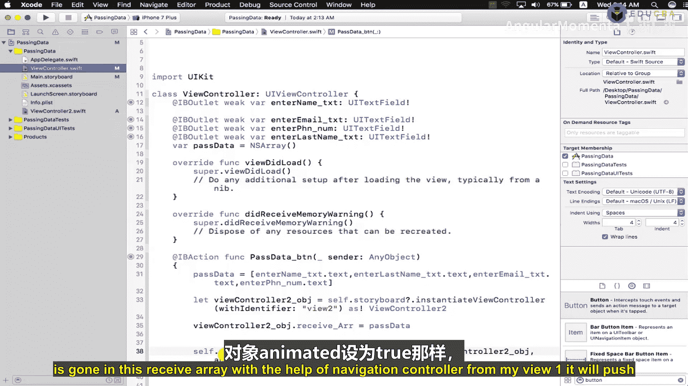

首先，我创建了一个数组。当按下按钮时，按钮触发的操作会将所有文本字段的数据存储到这个数组中。接着，我创建了当前视图控制器类的对象。通过这个对象，我调用了接收数据的数组。

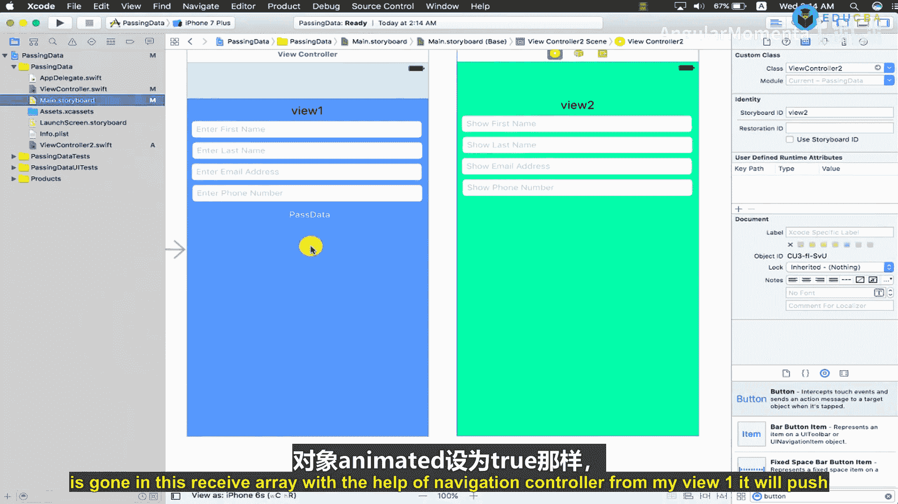

当按钮被调用时，传递的数据数组会自动赋值给接收数组。数据进入接收数组后，借助导航控制器，视图将从View1推送到View2。

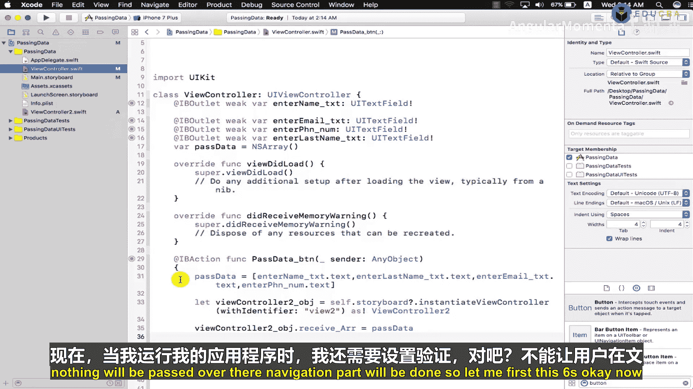

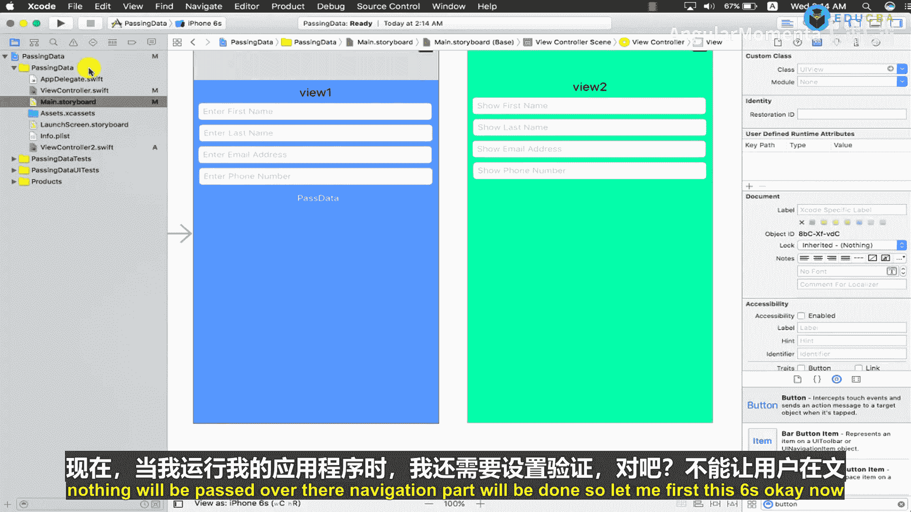

以下是核心的数据传递逻辑示例：

```swift
// 假设在第一个视图控制器中
@IBAction func passDataButtonTapped(_ sender: UIButton) {
    let dataToPass = [firstNameTextField.text, lastNameTextField.text, emailTextField.text]
    let destinationVC = storyboard?.instantiateViewController(withIdentifier: "SecondVC") as! SecondViewController
    destinationVC.receivedDataArray = dataToPass
    navigationController?.pushViewController(destinationVC, animated: true)
}
```

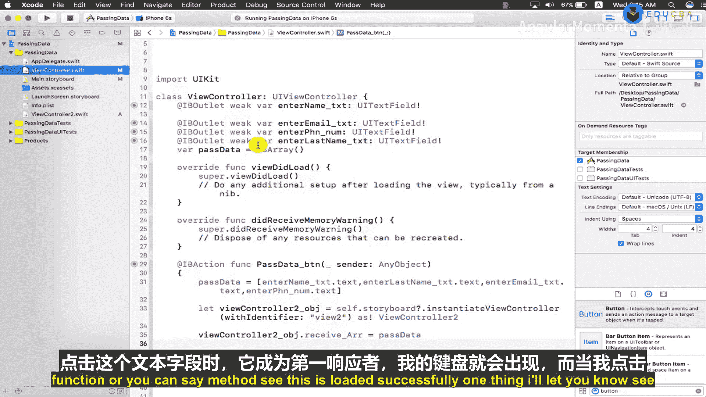

如果没有数据，则不会传递任何内容，仅执行导航部分。

---

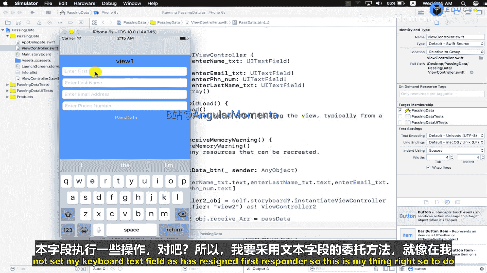

## 管理键盘

当点击文本字段时，它会成为第一响应者，键盘随之出现。然而，如果未设置文本字段放弃第一响应者状态，键盘可能不会自动消失。

为了解决这个问题，我们需要使用文本字段的委托方法。与表格视图类似，文本字段也有委托和数据源方法。我们将使用 `textFieldShouldReturn` 方法。

以下是实现步骤：

1.  设置文本字段的委托为当前视图控制器。
2.  在 `textFieldShouldReturn` 方法中，让文本字段放弃第一响应者状态，从而使键盘消失。

以下是实现代码：

```swift
class ViewController: UIViewController, UITextFieldDelegate {

    @IBOutlet weak var firstNameTextField: UITextField!

    override func viewDidLoad() {
        super.viewDidLoad()
        firstNameTextField.delegate = self
    }

    func textFieldShouldReturn(_ textField: UITextField) -> Bool {
        textField.resignFirstResponder() // 隐藏键盘
        return true
    }
}
```

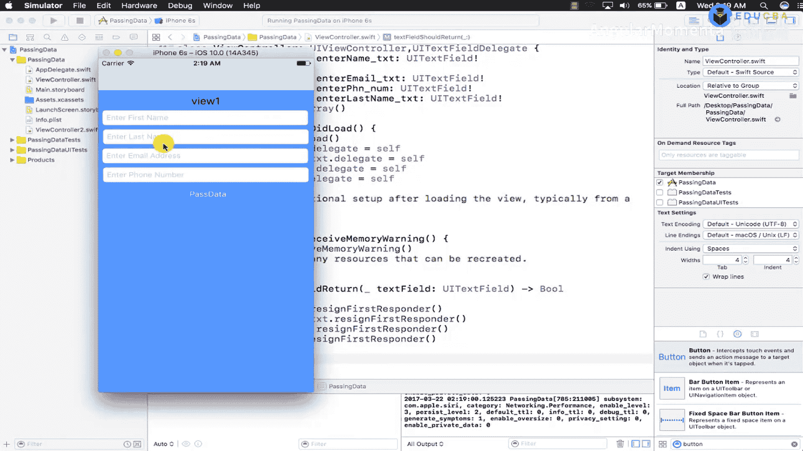

通过设置文本字段的委托，当用户按下键盘上的“返回”键时，键盘会消失。你可以在该方法中设置断点进行测试。

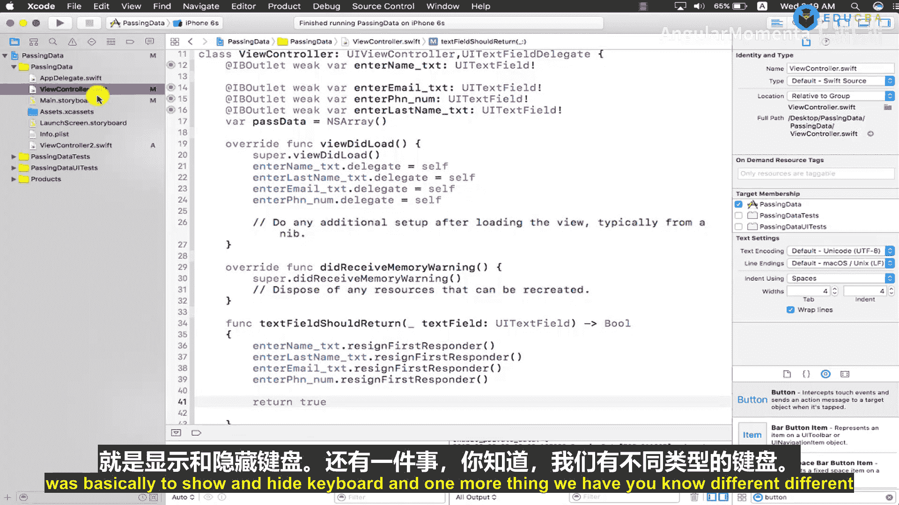

---

## 使用不同类型键盘

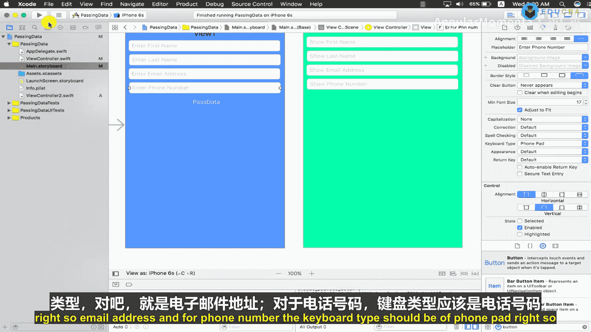

文本字段可以配置为显示不同类型的键盘，以适应不同的输入内容，如电子邮件地址或电话号码。

以下是配置方法：

1.  在故事板中，选择文本字段。
2.  在属性检查器中，找到“Keyboard Type”选项。
3.  根据需要选择类型，例如“Email Address”或“Phone Pad”。

例如，电子邮件地址的键盘会包含“@”和“.”符号，而电话键盘则显示数字。

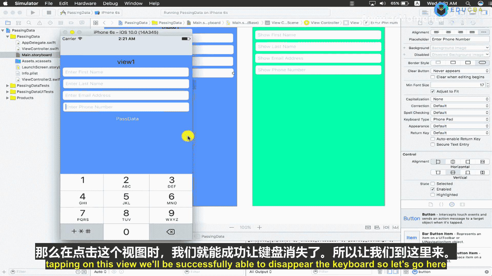

然而，像“Phone Pad”这类键盘没有“返回”键。因此，我们需要另一种方式来隐藏键盘。

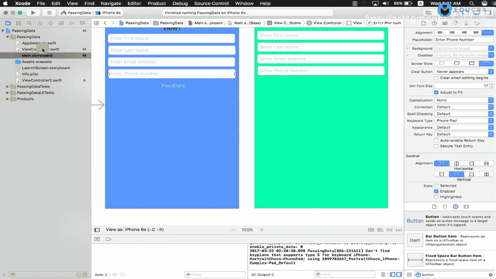

---

## 使用点击手势隐藏键盘

当键盘没有“返回”键时，我们可以通过点击视图的其他部分来隐藏键盘。这可以通过添加点击手势识别器来实现。

以下是实现步骤：

1.  在 `viewDidLoad` 方法中创建点击手势识别器对象。
2.  将目标设置为当前视图控制器，并指定一个选择器方法（例如 `didTapView`）。
3.  将该手势识别器添加到主视图上。

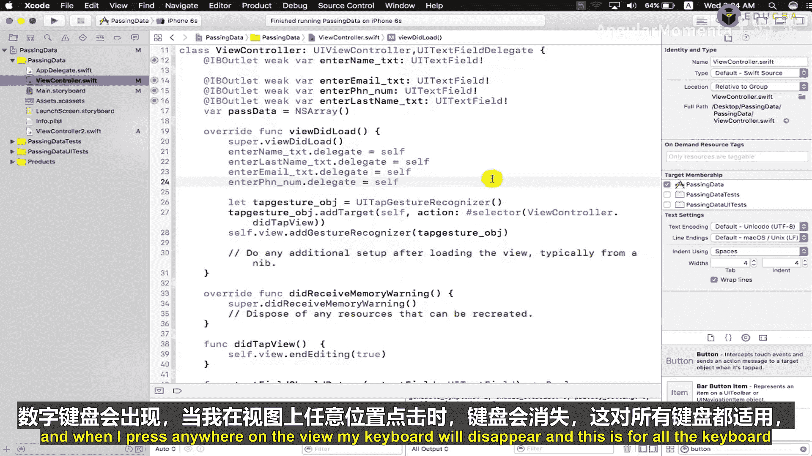

以下是实现代码：

```swift
override func viewDidLoad() {
    super.viewDidLoad()
    // ... 其他代码 ...

    let tapGesture = UITapGestureRecognizer(target: self, action: #selector(didTapView))
    self.view.addGestureRecognizer(tapGesture)
}

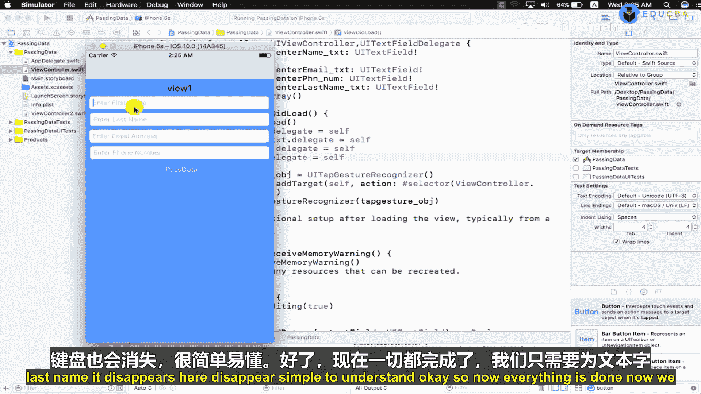

@objc func didTapView() {
    self.view.endEditing(true) // 隐藏所有键盘
}
```

现在，当数字键盘或其他任何键盘出现时，点击视图的任何地方都可以使键盘消失。这个方法适用于所有文本字段。

---

## 添加输入验证

最后，我们需要为文本字段添加验证，确保用户不会传递空数据。

以下是验证逻辑的步骤：

1.  检查所有必需的文本字段是否为空。
2.  使用逻辑运算符（`||` 或 `&&`）来决定验证条件。
    *   **`&&` (AND 运算符)**：所有条件都必须为真，整个表达式才为真。
    *   **`||` (OR 运算符)**：只要有一个条件为真，整个表达式就为真。
3.  如果验证失败（例如字段为空），则向用户显示一个警告框。

以下是验证和显示警告的示例代码：

```swift
@IBAction func submitButtonTapped(_ sender: UIButton) {
    if firstNameTextField.text?.isEmpty == true ||
       lastNameTextField.text?.isEmpty == true ||
       emailTextField.text?.isEmpty == true {

        // 创建警告框
        let alert = UIAlertController(title: "错误", message: "所有字段都必须填写。", preferredStyle: .alert)
        let okAction = UIAlertAction(title: "确定", style: .default, handler: nil)
        alert.addAction(okAction)
        self.present(alert, animated: true, completion: nil)
    } else {
        // 所有字段都有数据，执行数据传递等操作
        // ... 传递数据的代码 ...
    }
}
```

在这个例子中，我们使用了 `||` 运算符。只要有一个文本字段为空，条件就为真，并显示警告。我们还需要为电子邮件格式等添加更复杂的验证，但基本逻辑与此类似。

---

## 总结

本节课中我们一起学习了使用文本字段传递数据的几个关键要点：
1.  **对象与数据传递**：理解了如何通过对象在视图控制器间传递数组数据。
2.  **键盘管理**：学会了使用委托方法 `textFieldShouldReturn` 来响应返回键并隐藏键盘。
3.  **键盘类型**：了解了如何为不同输入场景配置特定的键盘类型。
4.  **手势识别**：掌握了通过添加点击手势来隐藏没有返回键的键盘。
5.  **输入验证**：实现了基本的非空验证，并使用警告框向用户提供反馈。

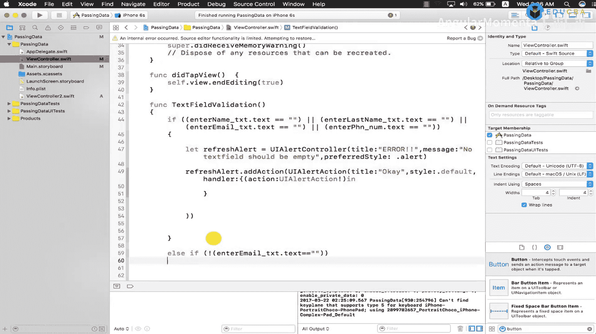

通过结合这些技术，你可以创建出交互更友好、数据更可靠的iOS应用界面。