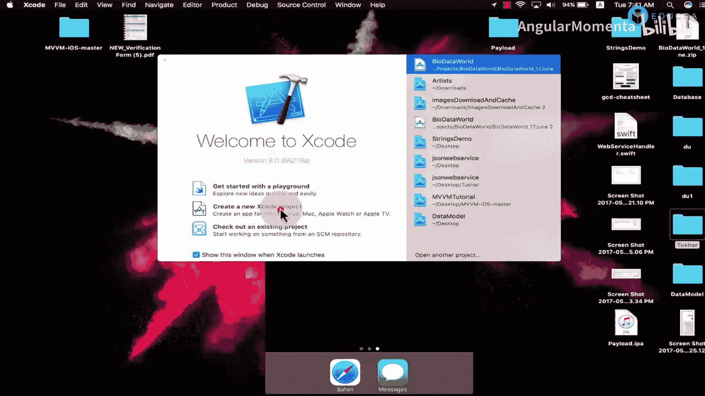
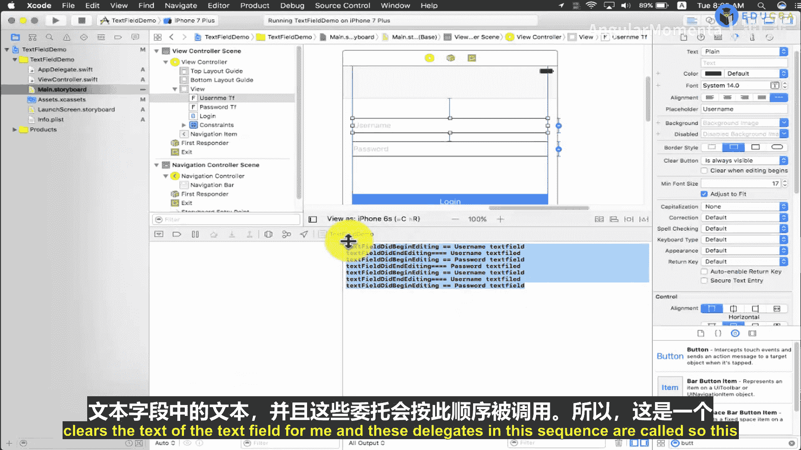

# 003：文本字段控制器导论 📝

在本节课中，我们将学习iOS开发中一个非常基础但至关重要的控件：**文本字段**。我们将通过创建一个简单的登录表单演示，来深入了解文本字段的属性、配置方法以及如何通过委托来响应用户交互。课程内容将涵盖从界面布局到功能实现的完整流程。

---

## 界面搭建与基础属性

上一节我们概述了课程目标，本节中我们来看看如何搭建一个包含两个文本字段和一个按钮的简单登录界面。

首先，我们在主视图控制器上放置两个文本字段。文本字段是UIKit提供的一个基础控件，其主要作用是**接收用户的输入**，并将用户输入的数据用于程序逻辑或应用程序的运行过程中。

从iOS 8开始，我们可以结合使用自动布局和Auto Layout来适配不同屏幕尺寸。接下来，我将为第二个文本字段和按钮设置Auto Layout约束，并将按钮的背景色从白色改为更醒目的颜色。

文本字段有多种边框样式可供选择，以适应不同的UI设计需求。

以下是主要的边框样式类型：
*   **圆角样式**：边框为圆角矩形。
*   **阴影样式**：矩形边框，但带有阴影效果。
*   **直角样式**：标准的直角矩形边框。
*   **无边框样式**：不显示任何边框。

您可以在界面上清晰地看到这些样式的区别。我将选择直角样式进行演示。

文本字段另一个非常重要的属性是**占位符文本**。占位符文本在用户未输入任何内容时显示，用于提示用户该字段需要输入什么内容。

---

## 连接代码与委托

为了在控制器类中访问界面元素，我们需要为文本字段创建出口。遵循良好的命名约定是一个好习惯，这能使其他开发者更容易理解你的代码。我使用“Tf”作为文本字段的缩写前缀。

同时，我也会为按钮创建一个动作。

接下来，我将为文本字段设置委托。**委托**机制允许我们的控制器类遵循并实现文本字段定义的一系列协议方法，从而响应用户的交互事件。我将在后面简要介绍文本字段的主要委托方法。

---

## 核心功能与属性配置

文本字段包含许多控制其行为和外观的属性。

一个重要的属性是**清除按钮**。我们可以设置它在编辑时出现、除非编辑否则不出现，或者始终可见。当用户点击清除按钮时，它会清空文本字段中已输入的内容。

另一个相关属性是**“编辑开始时清除”**。如果启用此功能，当用户结束编辑后再次开始编辑时，之前输入的内容会被自动清除。让我通过编译程序来演示其效果。

现在，当我输入文字并点击清除按钮时，文字被清空，占位符文本重新显示。但当我再次点击文本字段开始输入时，之前的文字“test”并未被清除，因为我尚未启用“编辑开始时清除”功能。启用该功能后再次编译，可以看到差异：再次开始编辑时，原有文本会被自动清除。

我现在将禁用此功能。

另一个重要功能是**最小字体大小**。例如，在屏幕较大的iPhone 6上，长文本可能不会被截断，但在屏幕较小的iPhone 4s上，同样的文本可能会被截断。设置最小字体大小可以确保在屏幕缩小时，字体自动缩小以避免文本被截断。

其他属性还包括：
*   **自动大写**：设置首字母是否自动大写。
*   **自动更正**：启用或禁用自动更正功能。
*   **拼写检查**：启用或禁用拼写检查。

这些功能在启用后，文本字段会自动处理相应的任务。

一个非常关键的属性是**键盘类型**。例如，默认打开的是字母键盘。通过将键盘类型设置为“电话键盘”，文本字段将默认打开数字键盘，用户只能输入数字。这在需要输入电话号码、社保号或卡号时非常有用。

我们还可以设置键盘的**外观**为深色或浅色。

**回车键**属性可以改变键盘右下角按钮的文本，默认是“换行”。我们可以将其改为“下一个”等其他选项。

**自动启用回车键**功能决定了回车键何时可用。通常，当有文本输入时，回车键才变为可点击状态。

**安全文本输入**是文本字段的一个非常重要的特性。当我们需要接收用户的敏感信息（如密码）时，可以启用此功能。启用后，输入的文字会显示为圆点，从而防止他人窥视。

---

## 文本字段委托详解

为了让文本字段响应更复杂的交互，我们需要让控制器遵循`UITextFieldDelegate`协议。

以下是几个基本的文本字段委托方法及其调用时机：
*   `textFieldShouldBeginEditing:`：当我们点击文本字段准备开始编辑时调用。它询问代理是否允许开始编辑。
*   `textFieldDidBeginEditing:`：当我们已经开始在文本字段中输入文本时调用。
*   `textFieldShouldEndEditing:`：当我们按下回车键或结束编辑，键盘即将隐藏时调用。它询问代理是否允许结束编辑。
*   `textFieldDidEndEditing:`：在键盘隐藏之后调用。
*   `textField:shouldChangeCharactersInRange:replacementString:`：当文本字段的内容即将改变时调用。常用于限制输入字符的长度或格式。
*   `textFieldShouldClear:`：当清除按钮被点击时调用。通常用于在清空前执行一些逻辑。
*   `textFieldShouldReturn:`：当用户按下键盘上的回车键时调用。通常在此方法中隐藏键盘。

为了演示这些委托方法的调用流程，我将在方法中添加打印日志，输出当前文本字段的占位符文本，以便清晰了解是哪个文本字段的哪个方法被调用了。

让我运行程序并展示其效果。当我点击第一个文本字段（用户名）时，控制台会打印`textFieldDidBeginEditing`被调用。当我点击第二个文本字段（密码）时，会先调用第一个文本字段的`textFieldDidEndEditing`，再调用第二个文本字段的`textFieldDidBeginEditing`。当我点击回车键时，会触发`textFieldShouldReturn`，然后是`textFieldDidEndEditing`。

---

## 功能集成演示

最后，我将把密码文本字段标记为安全输入字段。当我输入用户名，然后点击密码字段输入时，可以看到密码被隐藏为圆点。点击之前创建的按钮，可以清空两个文本字段的内容。整个过程中，委托方法会按照上述序列被调用。

---

本节课中我们一起学习了文本字段的基础知识，包括其属性配置、键盘类型设置、安全输入以及如何通过委托方法响应用户交互。这是一个关于文本字段如何工作的基础演示，在接下来的课程中，我们将继续深入探讨iOS的其他控件和高级特性。