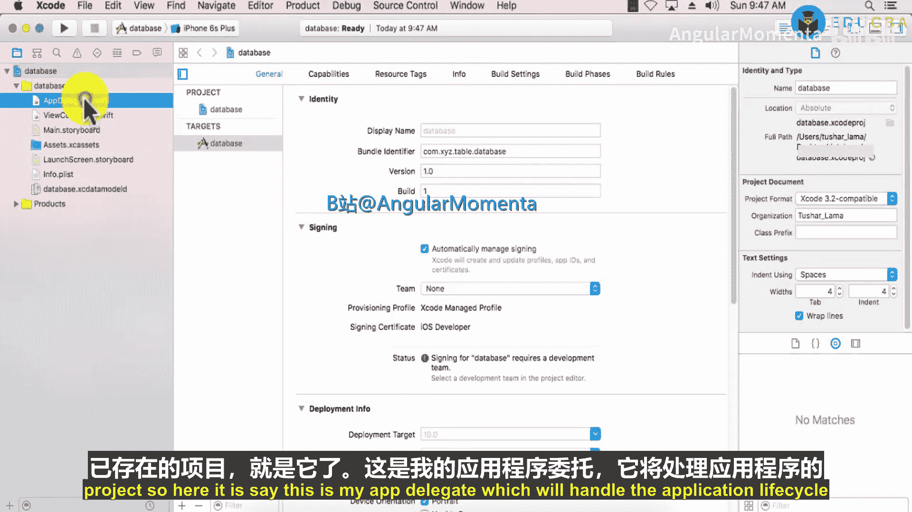
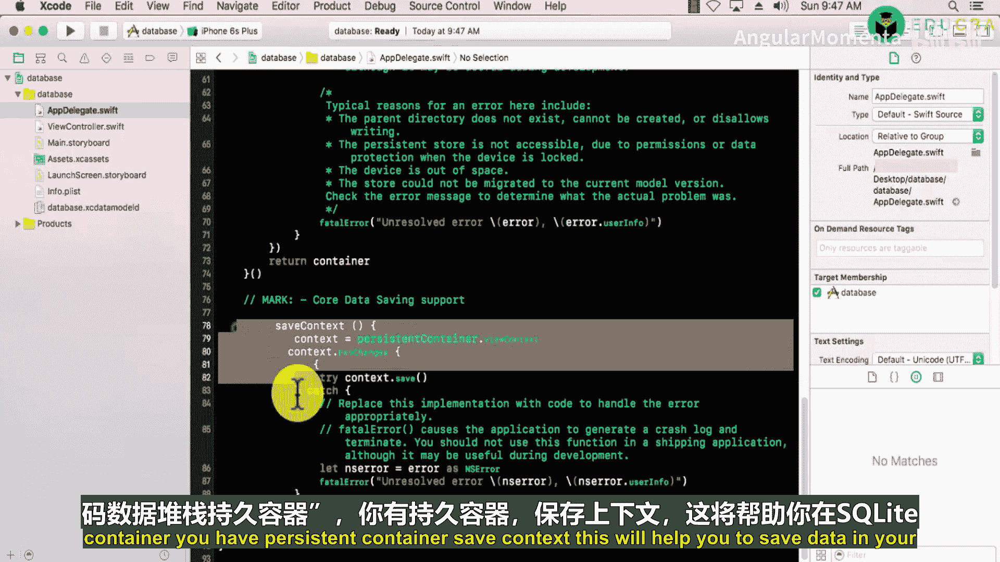
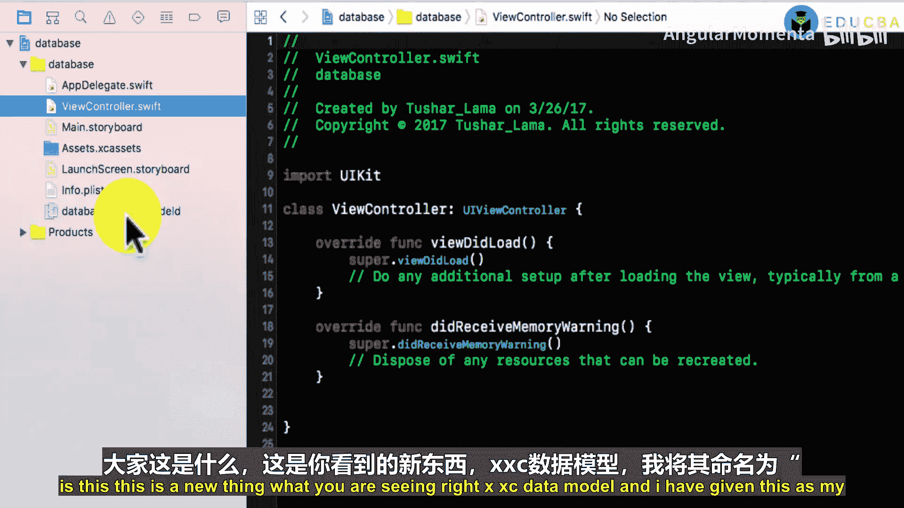
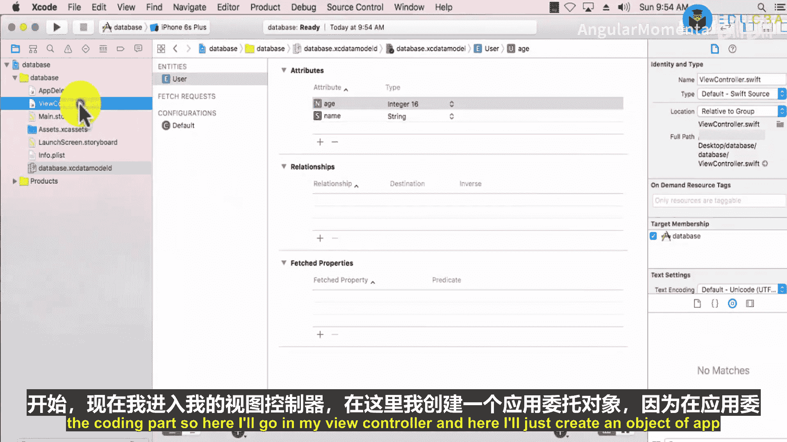
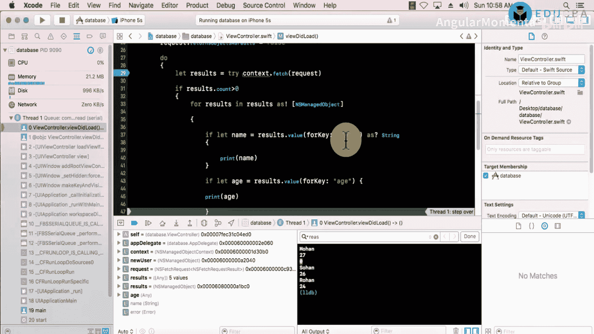

# 004：Core Data入门指南 🗄️





在本节课中，我们将学习如何在iOS应用中使用Core Data框架。Core Data是一个强大的对象图管理和持久化框架，它允许开发者以面向对象的方式操作数据，而无需直接编写SQL语句。我们将从创建一个支持Core Data的项目开始，逐步讲解其核心概念和基本操作。



## 概述

我们将创建一个简单的项目来演示Core Data的基本用法。首先，需要创建一个新的Xcode项目，并确保勾选“Use Core Data”选项。这将在项目中自动集成Core Data所需的初始配置和文件。

## 创建项目与数据模型

上一节我们介绍了课程概述，本节中我们来看看如何创建项目并设置数据模型。

1.  打开Xcode，选择“Create a new X project”。
2.  选择“Single View Application”模板。
3.  将项目命名为“Database”。
4.  在项目设置中，**务必勾选“Use Core Data”**选项。
5.  将语言设置为Swift。

创建完成后，Xcode会自动生成一个名为`Database.xcdatamodeld`的文件，这是Core Data的数据模型文件。同时，在`AppDelegate.swift`中，也会生成管理Core Data栈的相关代码。

## 理解Core Data的核心组件

在开始编码之前，理解Core Data的几个核心概念至关重要。

*   **实体 (Entity)**：实体类似于数据库中的表或面向对象编程中的类。它定义了要存储的数据结构。
*   **属性 (Attribute)**：属性是实体的组成部分，用于存储具体的数据，类似于类中的实例变量。例如，一个“用户”实体可以有“姓名”（字符串类型）和“年龄”（整数类型）属性。
*   **托管对象 (Managed Object)**：托管对象是实体的实例。**`let newUser = User(context: context)`** 这行代码就创建了一个`User`实体的托管对象。我们通过操作这个对象来保存或修改数据。
*   **持久化存储协调器 (Persistent Store Coordinator)** 与 **托管对象上下文 (Managed Object Context)**：Core Data通过一个“栈”来工作。我们通常不直接与底层的SQLite数据库（持久化存储）交互，而是通过**托管对象上下文**来操作。上下文管理着所有托管对象的生命周期，并将更改保存到持久化存储中。在`AppDelegate`中，可以通过 **`persistentContainer.viewContext`** 来获取主上下文。

## 设计数据模型



现在，我们在图形化界面中设计数据模型。

1.  打开`Database.xcdatamodeld`文件。
2.  点击左下角的“Add Entity”按钮。
3.  将实体名称重命名为“User”。
4.  在“Attributes”区域，点击“+”号添加两个属性：
    *   第一个属性：名称 `name`，类型 `String`。
    *   第二个属性：名称 `age`，类型 `Integer 16`。

至此，我们已定义好一个简单的`User`实体。

## 保存数据到Core Data

上一节我们设计了数据模型，本节中我们来看看如何编写代码将数据保存到Core Data中。

首先，在需要使用Core Data的视图控制器（如`ViewController.swift`）顶部导入框架并获取上下文。

```swift
import UIKit
import CoreData

class ViewController: UIViewController {
    // 获取应用委托实例以访问Core Data栈
    let appDelegate = UIApplication.shared.delegate as! AppDelegate
    // 获取托管对象上下文
    let context = (UIApplication.shared.delegate as! AppDelegate).persistentContainer.viewContext

    override func viewDidLoad() {
        super.viewDidLoad()
        // 调用保存数据的方法
        saveUserData()
    }

    func saveUserData() {
        // 1. 创建User实体的一个托管对象
        let newUser = User(context: context)

        // 2. 为托管对象的属性赋值
        newUser.name = "Rohan"
        newUser.age = 24

        // 3. 通过上下文保存数据到持久化存储
        do {
            try context.save()
            print("数据保存成功！")
        } catch {
            print("保存数据时出错: \(error)")
        }
    }
}
```

以下是代码执行步骤的分解：

1.  使用`User(context: context)`在指定的上下文中创建一个新的`User`托管对象。
2.  像设置普通对象属性一样，为`newUser`的`name`和`age`赋值。
3.  调用`context.save()`方法。此操作可能抛出错误，因此需要用`do-try-catch`块包裹。

## 从Core Data中获取数据

数据保存后，我们需要能够将其读取出来。这通过**获取请求 (Fetch Request)** 来实现。

在`ViewController`中添加一个方法来获取并打印所有用户数据：

```swift
func fetchUserData() {
    // 1. 创建一个针对User实体的获取请求
    let fetchRequest: NSFetchRequest<User> = User.fetchRequest()

    do {
        // 2. 执行获取请求，返回一个结果数组
        let users = try context.fetch(fetchRequest)

        // 3. 遍历并处理结果
        if users.count > 0 {
            for user in users {
                if let userName = user.name {
                    print("姓名: \(userName), 年龄: \(user.age)")
                }
            }
        } else {
            print("没有找到用户数据。")
        }
    } catch {
        print("获取数据时出错: \(error)")
    }
}
```

可以在`viewDidLoad`中调用`fetchUserData()`来测试。执行后，控制台应输出之前保存的用户信息。

## 调试与验证

为了验证保存操作是否真正触发了Core Data的持久化流程，可以在`AppDelegate.swift`的`saveContext()`方法中设置一个断点。

1.  在Xcode中打开`AppDelegate.swift`。
2.  找到`saveContext()`函数。
3.  在其内部代码行左侧的边栏点击，设置一个断点（蓝色箭头）。
4.  再次运行应用并执行保存操作。
5.  如果程序在断点处暂停，说明保存流程已成功调用至Core Data栈的底层。

## 总结



本节课中我们一起学习了Core Data的基础知识。我们创建了一个支持Core Data的iOS项目，定义了包含属性的数据模型实体，并编写代码实现了数据的保存与获取。关键点在于理解**托管对象上下文**作为我们与数据库交互的主要接口，以及**托管对象**作为实体实例的角色。通过`save()`和`fetchRequest`，我们可以轻松地管理应用中的持久化数据，而无需处理复杂的SQL语句。在接下来的教程中，我们将探讨如何更新和删除Core Data中的数据。