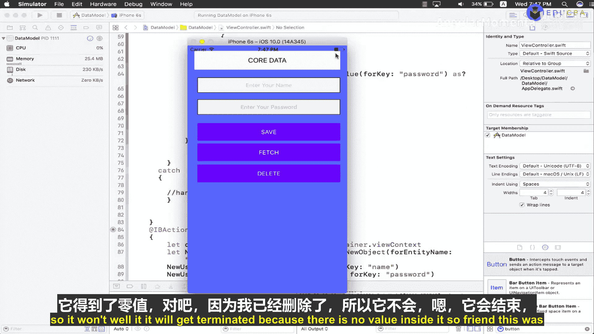
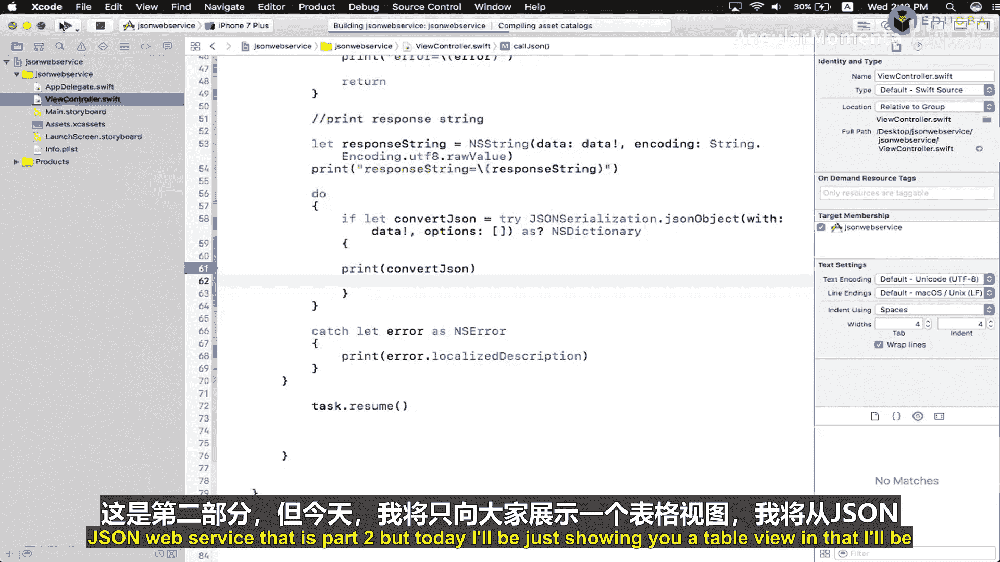
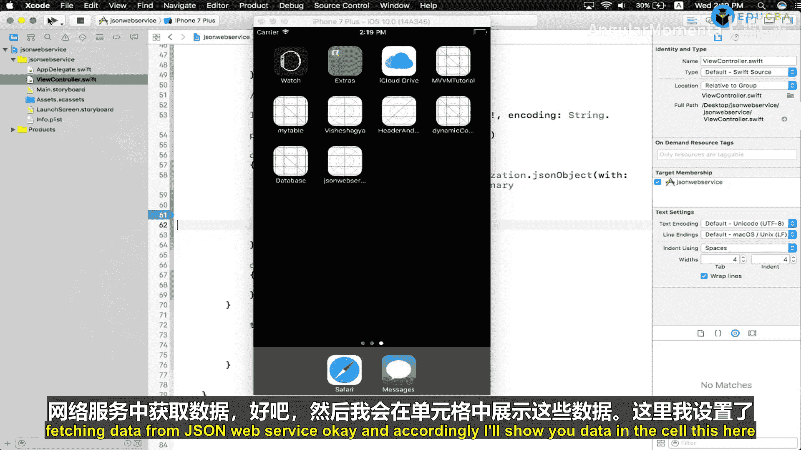
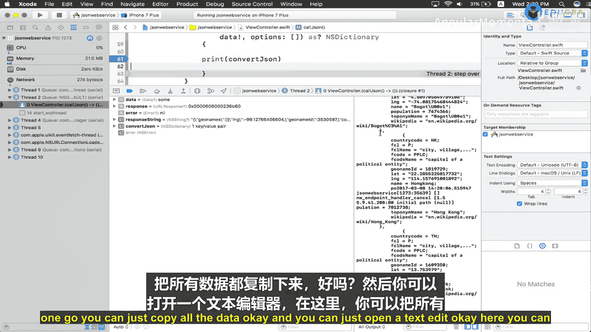
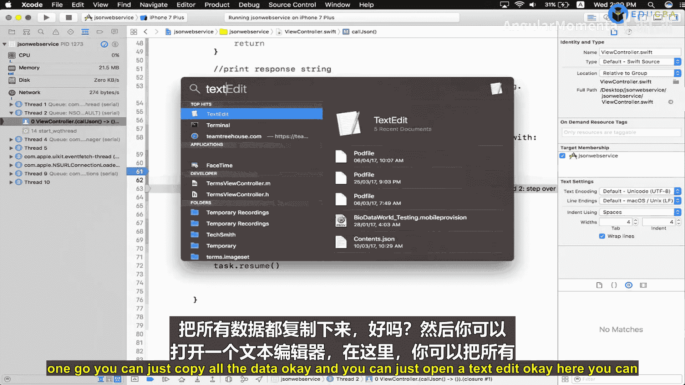
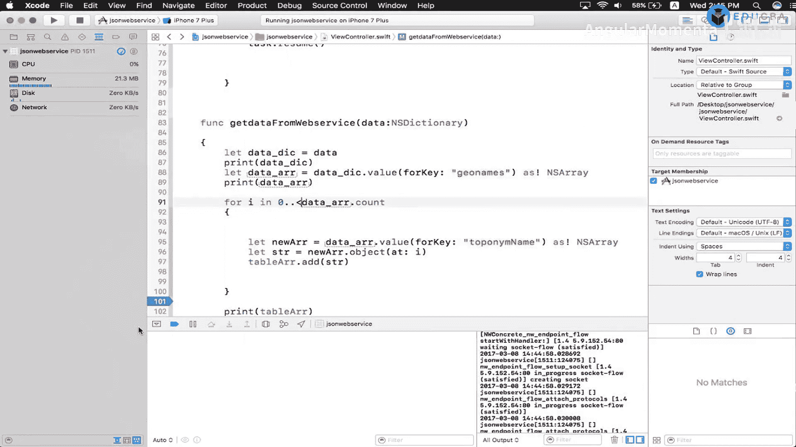

# 005：Core Data数据删除与JSON数据解析

## 概述

在本节课中，我们将学习两个重要的iOS开发技能：如何使用Core Data删除数据，以及如何从JSON Web服务中解析数据并在表格视图中显示。我们将通过具体的代码示例来演示这两个过程。

---

## Core Data数据删除操作

上一节我们介绍了如何使用Core Data添加和获取数据。本节中，我们来看看如何从Core Data中删除数据。

首先，我们需要创建一个获取请求来找到要删除的数据。

```swift
let fetchRequest = NSFetchRequest<NSFetchRequestResult>(entityName: "User")
```

接下来，我们需要获取持久化容器或视图上下文。

```swift
let context = persistentContainer.viewContext
```

为了安全地执行获取操作，我们使用do-catch语句来处理可能出现的错误。

```swift
do {
    let results = try context.fetch(fetchRequest)
    if results.count > 0 {
        for object in results {
            if let managedObject = object as? NSManagedObject {
                context.delete(managedObject)
            }
        }
    }
} catch {
    print("获取数据时出错: \(error)")
}
```

以下是删除操作的关键步骤：

1.  创建针对特定实体（如"User"）的获取请求。
2.  获取持久化上下文。
3.  执行获取操作，获取所有匹配的对象。
4.  遍历结果数组中的每个对象。
5.  对每个托管对象调用`context.delete()`方法。



**重要提示**：删除数据后，必须保存上下文才能使更改永久生效。

```swift
do {
    try context.save()
    print("数据删除并保存成功")
} catch {
    print("保存上下文时出错: \(error)")
}
```



如果不保存上下文，数据实际上并没有从持久化存储中移除，下次获取时仍然会看到这些数据。



---

## JSON数据解析与表格显示





现在我们已经了解了Core Data的数据删除操作，接下来让我们看看如何从JSON Web服务获取数据并在表格视图中显示。

首先，为了避免频繁请求网络服务，我们可以将获取的JSON数据保存到本地文本文件中供开发使用。

创建一个方法来处理从Web服务接收到的JSON数据：

```swift
func getData(data: [String: Any]) {
    // 处理接收到的字典数据
}
```

这个方法接收一个字典类型的参数，因为从JSON解析得到的数据通常是字典格式。

以下是解析JSON数据的关键步骤：

```swift
func getData(data: [String: Any]) {
    let dataDict = data
    
    if let geoArray = dataDict["geonames"] as? [[String: Any]] {
        var tableArray = [String]()
        
        for item in geoArray {
            if let cityName = item["toponymName"] as? String {
                tableArray.append(cityName)
            }
        }
        
        // 现在tableArray包含了所有城市名称
        print("获取到的城市: \(tableArray)")
    }
}
```

让我们详细分析这个过程：

1.  首先，我们将传入的字典数据赋值给局部变量。
2.  从字典中提取"geonames"键对应的值，这是一个包含多个字典的数组。
3.  创建一个可变数组来存储城市名称。
4.  遍历"geonames"数组中的每个元素。
5.  从每个元素中提取"toponymName"键对应的字符串值（城市名称）。
6.  将每个城市名称添加到数组中。

通过这种方式，我们可以从复杂的JSON结构中提取出需要的数据（如城市名称），并将其整理成适合在表格视图中显示的格式。

---

## 总结

本节课中我们一起学习了两个重要的iOS开发技能：

1.  **Core Data数据删除**：我们了解了如何创建获取请求、执行删除操作，以及**最重要**的是，删除后必须保存上下文才能使更改生效。

2.  **JSON数据解析**：我们学习了如何从Web服务获取JSON数据，解析复杂的嵌套结构，提取所需信息，并将其转换为适合在表格视图中显示的格式。



这两个技能在实际的iOS应用开发中非常实用，能够帮助你构建功能更完整、用户体验更好的应用程序。记住，处理数据时始终要考虑错误处理和边界情况，确保应用的稳定性和可靠性。