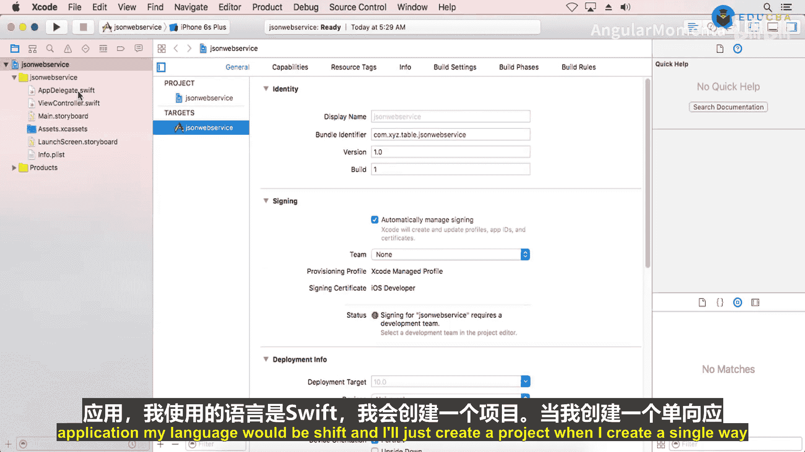
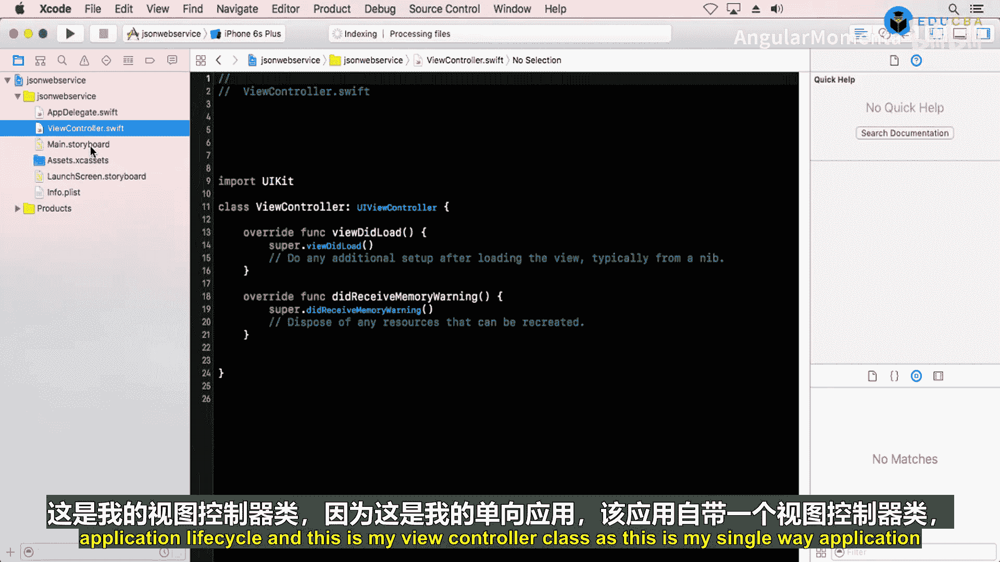
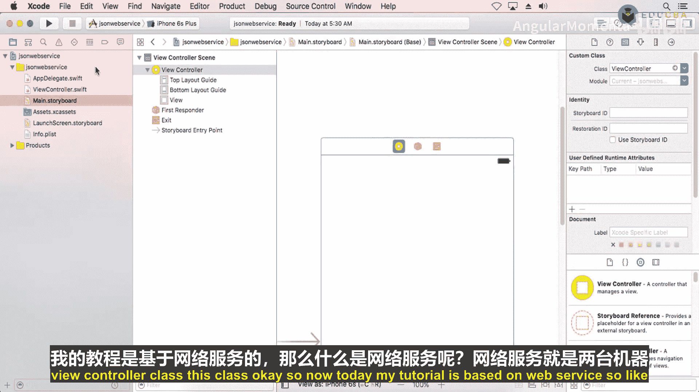
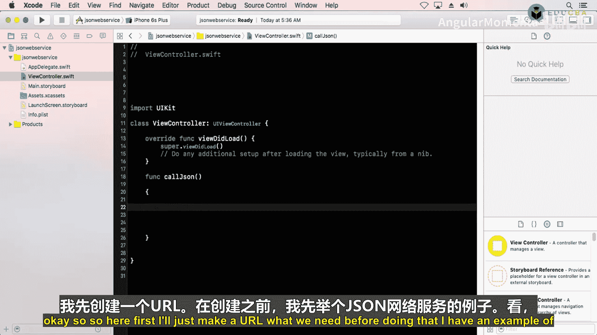
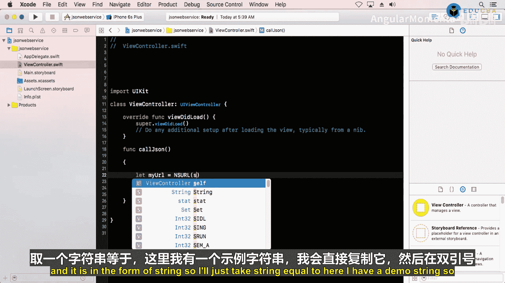
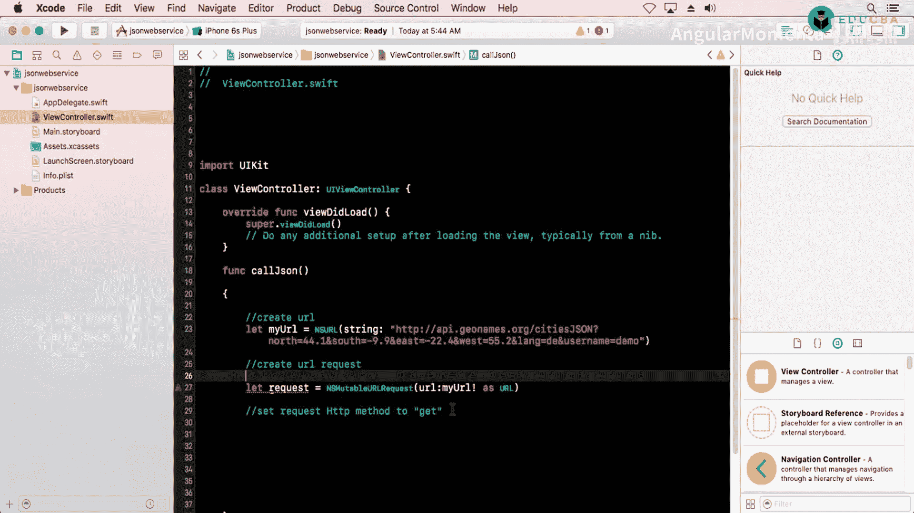

# 006：在表格视图中展示JSON数据（续） 🚀

在本节课中，我们将继续学习如何从JSON网络服务获取数据，并将其展示在iOS应用的表格视图中。我们将涵盖创建表格视图、设置数据源和代理方法，以及将获取到的数据填充到表格的每个单元格中。

---

## 概述 📋

上一节我们介绍了如何发起网络请求并获取JSON数据。本节中，我们来看看如何将这些数据展示在一个表格视图中。我们将创建一个表格视图，设置其约束，并实现必要的数据源方法，以便动态显示从网络服务获取的信息。

## 创建表格视图 📱

首先，我们需要在故事板中添加一个表格视图。从对象库中拖拽一个表格视图到视图控制器上。

以下是设置表格视图约束的步骤：

1.  将表格视图的顶部、底部、左侧和右侧约束设置为0，确保它适应不同尺寸的设备。
2.  为表格视图创建一个原型单元格，并设置其标识符为“cell”。
3.  将表格视图的`delegate`和`dataSource`连接到视图控制器。

接下来，我们需要为表格视图创建一个出口（Outlet）。在视图控制器中，添加以下代码：

```swift
@IBOutlet weak var myTable: UITableView!
```





## 实现表格视图数据源方法 📊



在`viewDidLoad`方法中，设置表格视图的代理和数据源：

```swift
override func viewDidLoad() {
    super.viewDidLoad()
    myTable.delegate = self
    myTable.dataSource = self
}
```

现在，我们需要实现两个必需的表格视图数据源方法：`numberOfRowsInSection`和`cellForRowAt`。

以下是这两个方法的实现：

```swift
func tableView(_ tableView: UITableView, numberOfRowsInSection section: Int) -> Int {
    return dataArray.count
}

func tableView(_ tableView: UITableView, cellForRowAt indexPath: IndexPath) -> UITableViewCell {
    let cell = tableView.dequeueReusableCell(withIdentifier: "cell", for: indexPath)
    cell.textLabel?.text = dataArray[indexPath.row]
    return cell
}
```

在`numberOfRowsInSection`方法中，我们返回数据数组`dataArray`的元素数量。在`cellForRowAt`方法中，我们使用标识符“cell”出列一个可重用的单元格，并将数据数组中的相应文本设置为单元格的文本标签。

## 获取并展示数据 🌐

我们之前已经创建了一个方法来获取网络服务数据。该方法接收一个字典参数，并从字典中提取所需的数据，将其添加到`dataArray`中。



以下是获取数据并重新加载表格视图的步骤：

1.  调用获取数据的方法。
2.  在数据获取成功后，将数据添加到`dataArray`。
3.  调用`myTable.reloadData()`方法刷新表格视图。

```swift
fetchWebServiceData { dictionary in
    // 从字典中提取数据并添加到 dataArray
    self.dataArray.append(contentsOf: extractedData)
    DispatchQueue.main.async {
        self.myTable.reloadData()
    }
}
```

## 运行与测试 🧪


移除所有断点，运行应用。如果网络连接正常，表格视图将成功加载并显示从JSON网络服务获取的数据。




## 总结 🎯

本节课中，我们一起学习了如何将从JSON网络服务获取的数据展示在表格视图中。我们创建了表格视图，设置了其约束，并实现了必要的数据源方法。通过这种方式，我们可以动态地展示网络数据，使应用内容更加丰富和交互性更强。



在下一节教程中，我们将学习如何从网络服务获取图片，并在集合视图中展示它们。感谢观看，祝您有美好的一天！