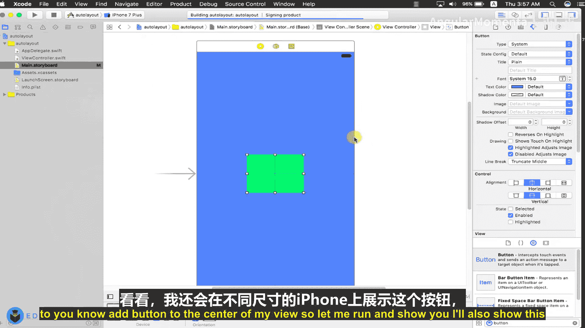
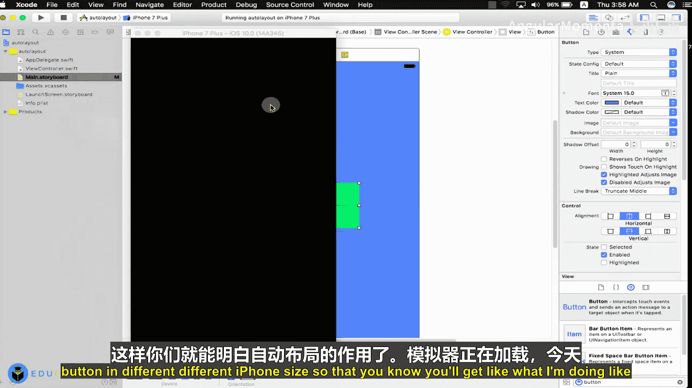
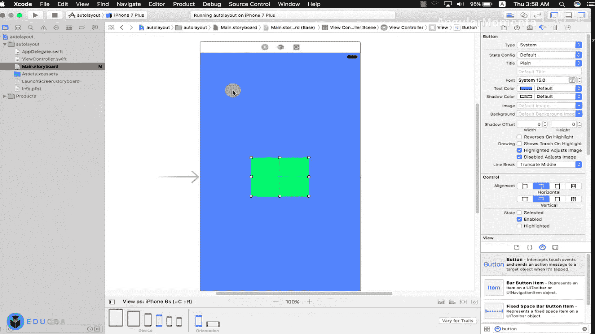
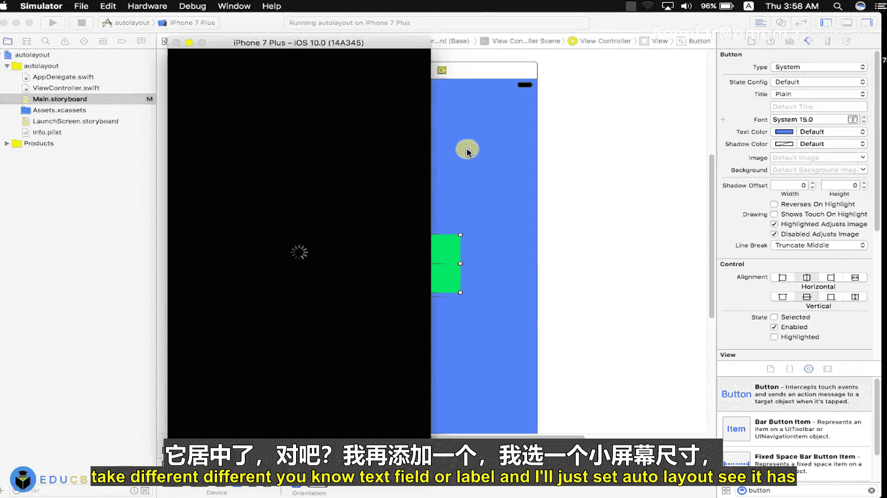
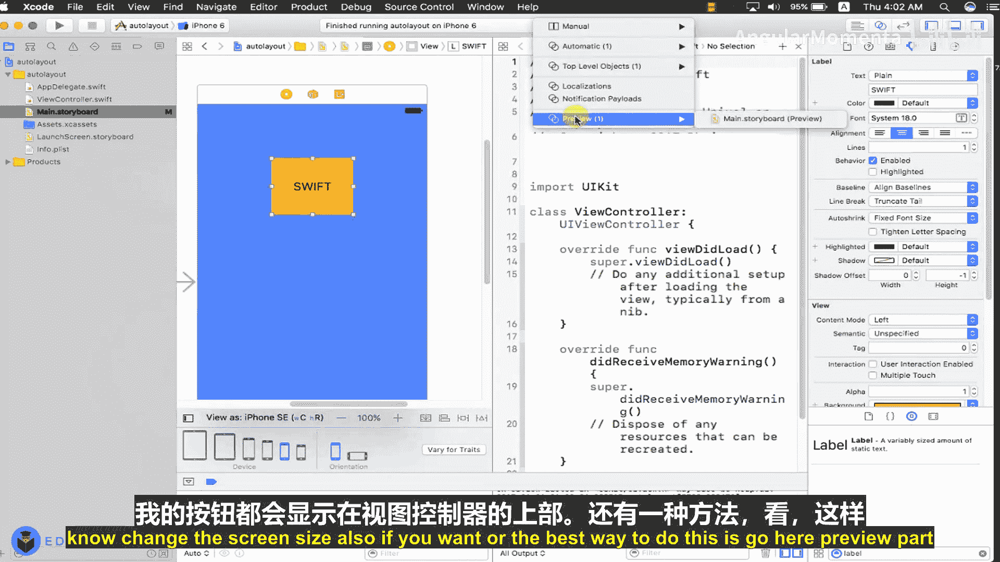
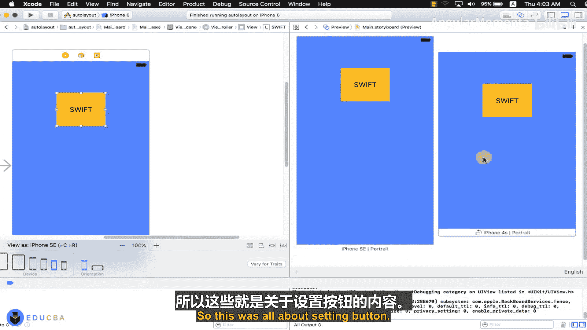
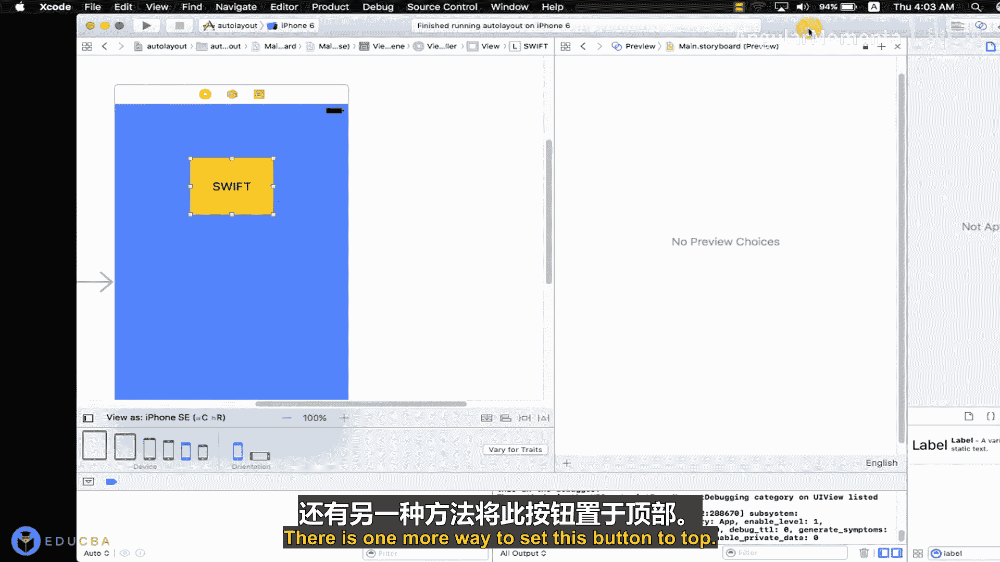
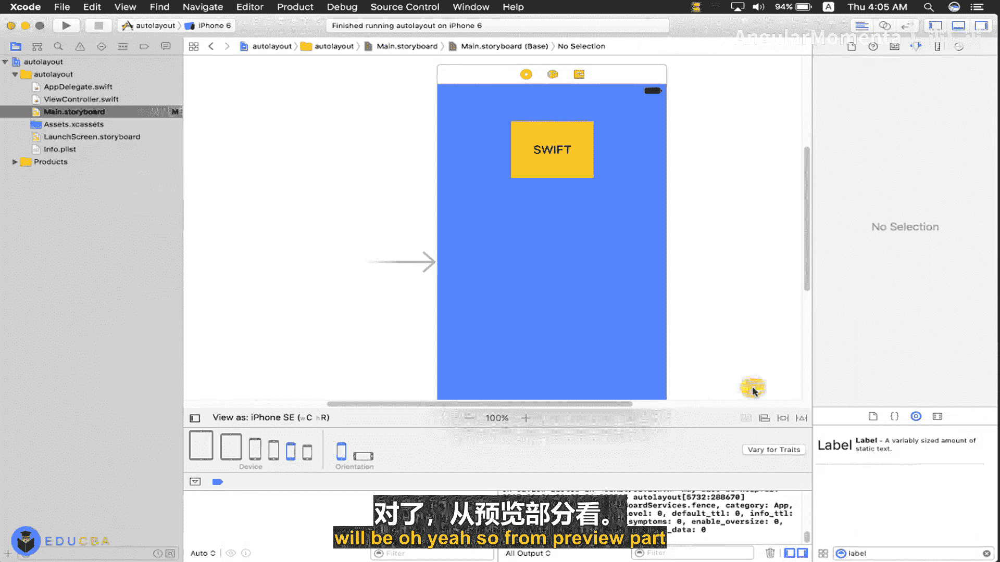

# 007：自动布局与Core Data数据删除

在本节课中，我们将学习两个核心主题：如何使用自动布局创建自适应界面，以及如何在Core Data中删除所有数据对象。我们将从理论讲解开始，然后通过实践项目来巩固理解。

## 自动布局简介 🎯

上一节我们介绍了Core Data的基本概念，本节中我们来看看如何构建用户界面。自动布局是一个基于约束的布局系统，它允许开发者创建自适应的用户界面。例如，我们希望一个按钮在不同尺寸的iPhone屏幕上都能居中显示。自动布局通过设置约束来实现这一目标，它简化了开发者过去需要为不同屏幕尺寸编写大量代码的工作。

### 创建项目与界面

首先，我们创建一个新的单视图应用项目，语言选择Swift。在项目创建时，我们暂时不勾选“使用Core Data”选项，因为本节重点在于界面布局。

在故事板中，我们开始设计界面。以下是我们将添加到视图控制器中的组件：

*   一个标签，用作标题。
*   两个文本字段，分别用于输入用户名和密码。
*   三个按钮，分别用于保存、获取和删除数据。

### 设置自动布局约束

为了让界面元素在不同屏幕尺寸上正确显示，我们需要为它们设置约束。以下是设置约束的关键步骤：

1.  **居中元素**：对于需要居中的元素（如标题标签），我们设置“垂直居中”和“水平居中”约束。
2.  **固定尺寸**：为元素设置固定的“高度”和“宽度”约束，确保其大小不变。
3.  **相对位置**：对于需要固定在某个位置的元素（如顶部的标签），我们设置“顶部间距”、“左侧间距”和“右侧间距”约束，使其与父视图边缘保持固定距离。

设置完成后，我们可以在不同设备尺寸的预览中查看效果，确保布局正确无误。通过自动布局，我们无需编写任何代码即可实现界面的自适应。

## Core Data数据删除 🗑️

在上一部分，我们构建了用户界面。现在，我们将学习如何使用Core Data删除所有保存的数据对象。首先，我们需要理解Core Data的几个核心组件。

### Core Data核心概念

*   **实体**：类似于类，它描述了一个对象的结构。在我们的例子中，我们创建了一个名为“User”的实体。
*   **属性**：实体中的属性用于存储数据，其功能类似于Objective-C中的实例变量。我们为“User”实体添加了“name”和“password”两个字符串类型的属性。
*   **托管对象**：是实体的具体实例。我们通过`NSManagedObject`来操作实体中的数据。
*   **持久化存储**：默认情况下，Core Data使用SQLite数据库作为后端存储，数据文件位于应用的文档目录中。
*   **上下文**：管理对持久化存储的访问。所有数据的增、删、改、查操作都通过`NSManagedObjectContext`来完成。





### 实现删除功能





为了演示删除功能，我们需要先完成数据保存和获取的代码。这通常涉及从文本字段获取数据，创建`NSManagedObject`实例，并通过上下文保存到持久化存储中。

删除所有数据的逻辑如下：

1.  创建一个获取请求，指定要获取的实体（例如“User”）。
2.  通过上下文执行该请求，获取所有`NSManagedObject`对象的数组。
3.  遍历这个数组，对每个对象调用上下文的`delete(_:)`方法。
4.  最后，调用上下文的`save()`方法将删除操作提交到持久化存储。

核心代码片段如下：
```swift
// 假设 context 是 NSManagedObjectContext 实例
let fetchRequest: NSFetchRequest<NSManagedObject> = NSFetchRequest(entityName: "User")
do {
    let users = try context.fetch(fetchRequest)
    for user in users {
        context.delete(user)
    }
    try context.save()
    print("所有数据已删除")
} catch {
    print("删除数据时出错: \(error)")
}
```



通过这段代码，我们可以清空“User”实体中的所有记录。





## 总结 📝



本节课中我们一起学习了两个重要的iOS开发技能。首先，我们掌握了如何使用自动布局系统来创建能够自适应不同屏幕尺寸的用户界面，这通过设置约束而非硬编码坐标来实现。接着，我们深入探讨了Core Data框架，理解了实体、托管对象和上下文等核心概念，并最终实现了从Core Data中删除所有数据对象的功能。结合界面操作与数据管理，我们能够构建出功能完整的应用程序。