# 008：适用于纵向布局的自动布局 🧩

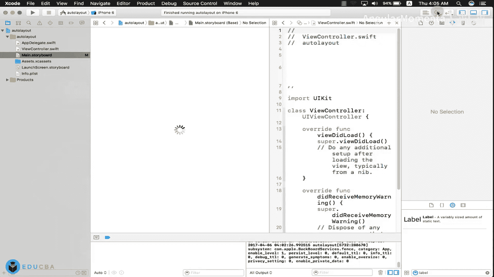

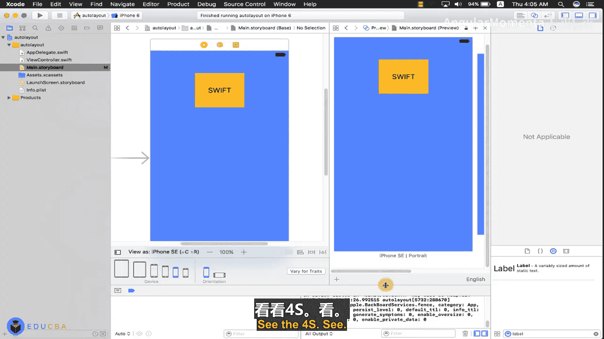

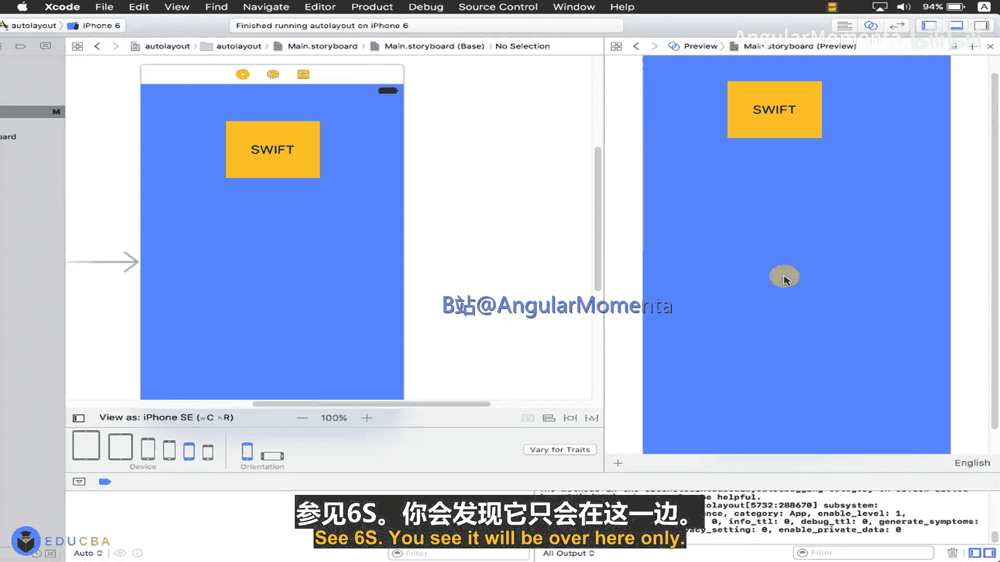

在本节课中，我们将学习如何为纵向布局的界面设置自动布局约束。我们将通过一个包含多个控件的例子，演示如何添加和调整约束，以确保界面在不同屏幕尺寸上都能正确显示。

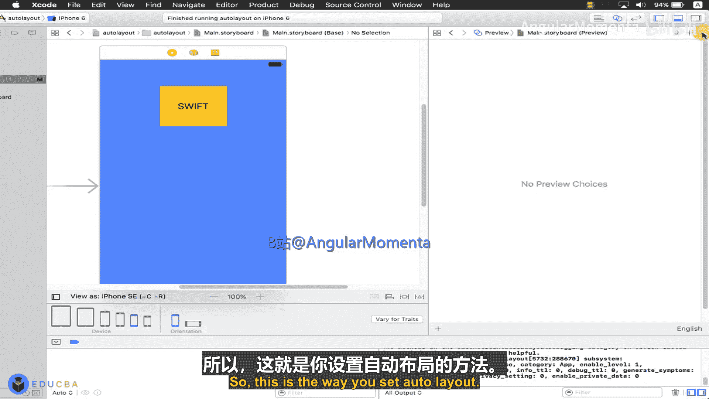

---

## 概述

自动布局是iOS开发中用于创建自适应界面的强大工具。它通过定义视图之间的相对关系（约束），而不是固定的坐标和尺寸，来确保界面在各种屏幕尺寸和方向上都能正确布局。本节将重点讲解纵向布局中常用的约束类型及其设置方法。

上一节我们介绍了自动布局的基本概念，本节中我们来看看如何为一个包含多个元素的复杂界面设置约束。

---

## 设置单个视图的约束

首先，我们从一个简单的按钮开始。将按钮拖入视图控制器，并为其设置约束。

1.  选中按钮。
2.  点击界面右下角的“添加新约束”按钮（或使用菜单）。
3.  我们需要设置按钮与父视图顶部的垂直间距、左侧（Leading）和右侧（Trailing）的间距。
4.  同时，可以设置一个固定的高度（Height）和宽度（Width）。

以下是设置约束的步骤描述：
-   设置垂直间距到顶部布局参考线（Top Layout Guide）。
-   设置左侧（Leading）和右侧（Trailing）空间到容器边缘。
-   设置固定的高度和宽度。

设置完成后，可以在预览（Preview）中查看效果。如果按钮位置不正确，可以删除现有约束并重新设置。

所以，这就是设置自动布局的基本方法。

---

## 为多个视图设置约束

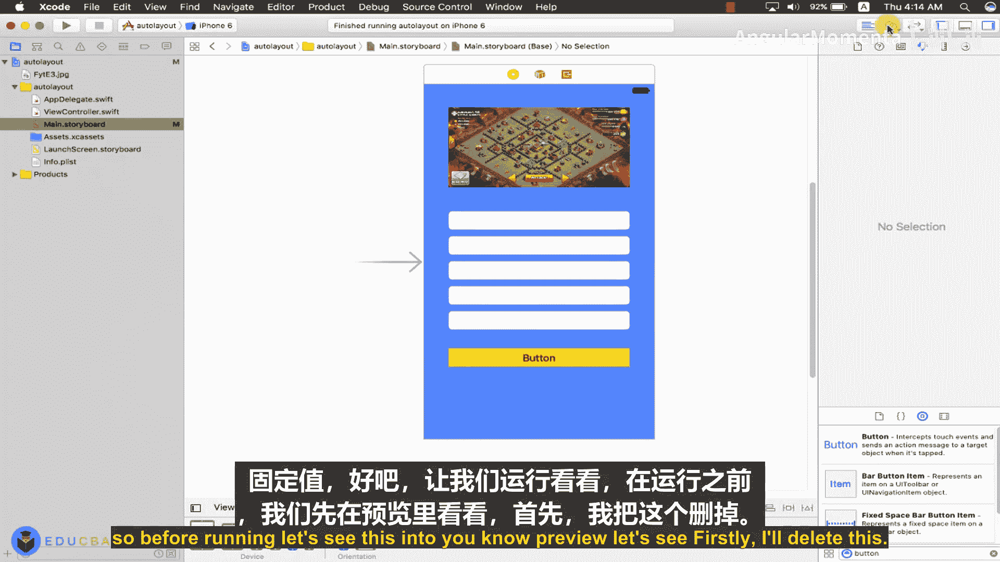

现在，假设界面中有多个视图。例如，我们有一个图像视图（ImageView）、五个文本输入框（TextField）和一个按钮（Button）。

以下是界面元素的列表：
-   1个图像视图
-   5个文本输入框
-   1个按钮

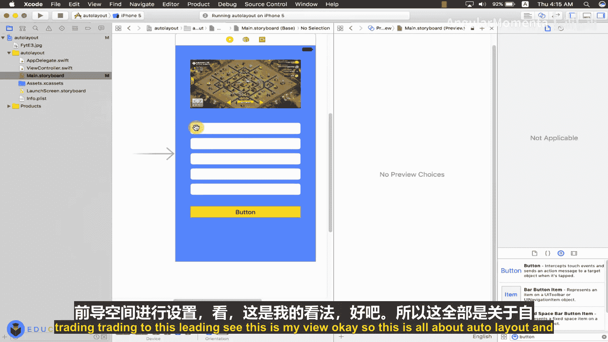

首先，为按钮设置一个醒目的背景色（例如橙色）和文字颜色（例如黑色）。

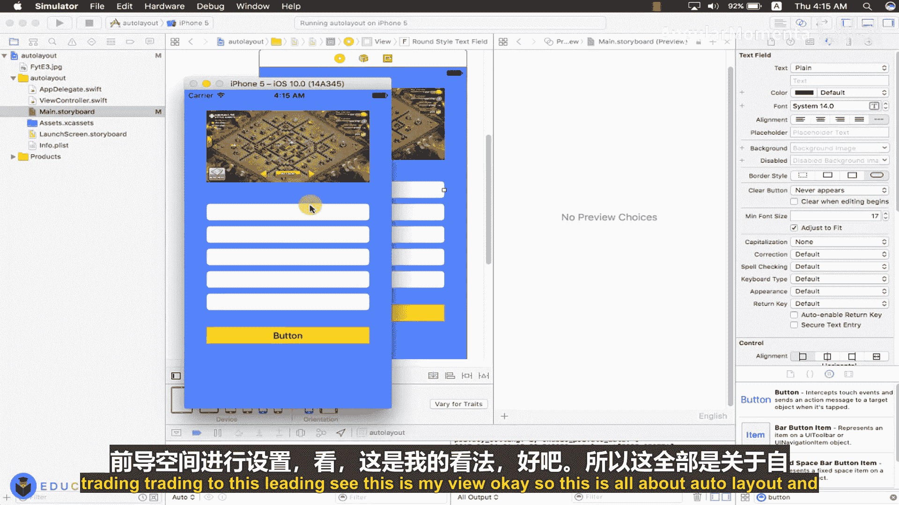

接着，为图像视图添加一张图片。可以从桌面或其他位置选择图片并拖入项目的资源目录，然后在图像视图的属性检查器中设置该图片。

现在，我们需要为所有元素设置自动布局约束。

### 设置图像视图约束

首先设置图像视图的约束。

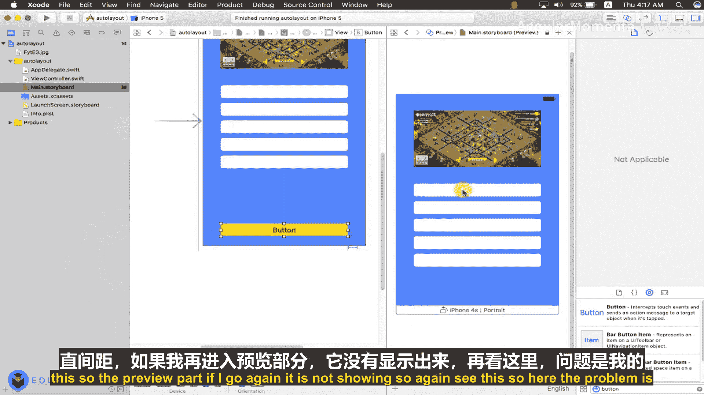

以下是图像视图的约束设置：
1.  设置其顶部与父视图顶部的垂直间距。
2.  设置其左侧（Leading）与容器边缘的间距。
3.  设置一个固定的高度和宽度。

### 设置文本输入框约束

接下来，为五个文本输入框设置约束。我们需要确保它们在垂直方向上均匀分布，并且水平方向对齐。

以下是文本输入框的约束设置步骤：
1.  为第一个文本输入框设置其顶部与图像视图底部的垂直间距。
2.  设置其左侧（Leading）和右侧（Trailing）与容器边缘的间距。
3.  为后续的每个文本输入框重复此过程：设置其顶部与前一个视图底部的垂直间距，并设置左右间距。

通过这种方式，所有文本输入框将垂直堆叠并水平对齐。

### 设置按钮约束

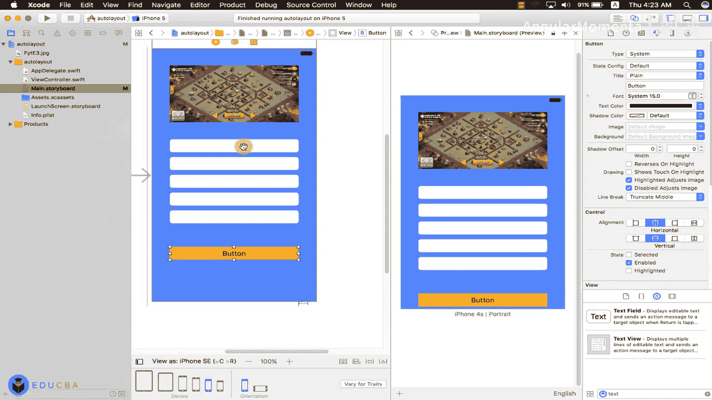

最后，为按钮设置约束。

以下是按钮的约束设置：
1.  设置其顶部与最后一个文本输入框底部的垂直间距。
2.  设置其左侧（Leading）和右侧（Trailing）与容器边缘的间距。
3.  设置一个固定的高度。

### 调整垂直间距常量

为了使布局更美观，我们可以调整视图之间的垂直间距常量。

以下是调整间距的步骤：
1.  在文档大纲或画布上选中代表两个视图之间垂直间距的约束线。
2.  在属性检查器中，将“Constant”值修改为合适的数值，例如30。

现在，运行应用或在预览中查看，界面应该在不同模拟器（如iPhone 4s, 5, 6 Plus）上都能正确显示。

---

## 高级约束技巧：对齐与底部固定

我们还可以进行更精细的控制。例如，如果我们希望所有视图的左侧边缘严格对齐，可以为它们设置“Leading”空间到图像视图，而不是容器。

此外，如果我们希望按钮始终固定在屏幕底部，可以修改其约束。

以下是修改按钮到底部的方法：
1.  删除按钮当前的顶部垂直间距约束。
2.  为按钮添加一个“垂直间距到底部布局参考线（Bottom Layout Guide）”的约束。
3.  同时保留其左侧（Leading）和右侧（Trailing）约束，并设置一个固定高度。

如果按钮位置没有立即更新，可以尝试以下操作：
-   在画布上选择视图控制器。
-   点击菜单栏中的 “Editor” -> “Resolve Auto Layout Issues” -> “Update Frames”。
-   或者，在预览中切换到不同设备查看效果，系统可能会提示更新约束。

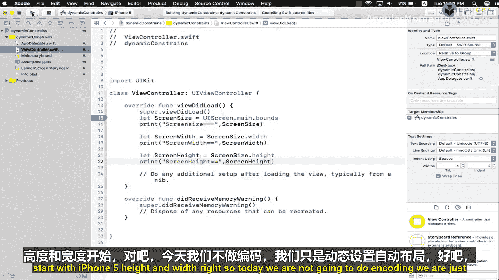

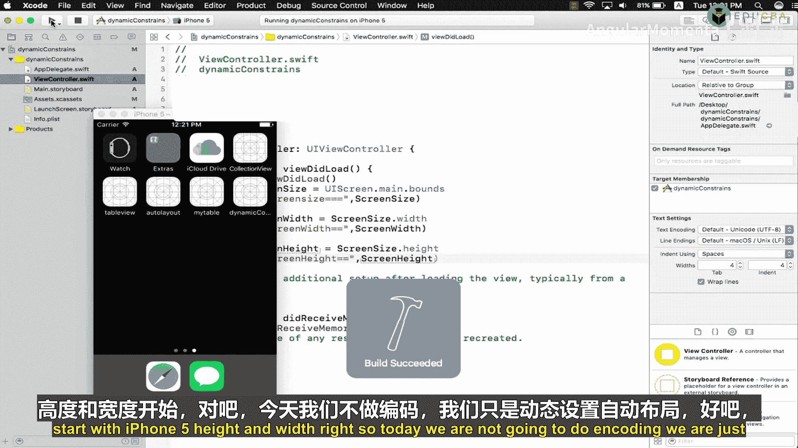

---

## 核心概念总结

本节课的核心是理解几种基本的约束类型及其含义：

*   **Leading（左侧）与 Trailing（右侧）**：定义视图的水平位置，通常相对于父视图或其他视图的边缘。
*   **垂直间距到顶部（Vertical Spacing to Top）**：定义视图与父视图或上方视图顶部的距离。
*   **垂直间距到底部（Vertical Spacing to Bottom）**：定义视图与父视图或下方视图底部的距离。

用代码描述一个简单的顶部约束关系（概念上）：
```swift
// 伪代码，表示“按钮顶部距离父视图顶部20点”
button.topAnchor.constraint(equalTo: superview.topAnchor, constant: 20).isActive = true
```

---

## 动态约束与屏幕适配预览

自动布局的美妙之处在于，无需为不同尺寸的iPhone创建多个故事板或XIB文件。在一个故事板中，通过合理设置约束，就能适配所有屏幕。

为了进行更精确的动态控制（例如，根据不同屏幕尺寸调整按钮高度），我们可以在代码中获取屏幕尺寸。

以下是获取屏幕尺寸的示例代码，写在 `viewDidLoad` 方法中：
```swift
let screenSize = UIScreen.main.bounds
print("Screen Size: \(screenSize)")
let screenWidth = screenSize.width
let screenHeight = screenSize.height
print("Screen Width: \(screenWidth), Screen Height: \(screenHeight)")
```
通过判断 `screenHeight` 的值，我们可以得知当前是哪种iPhone型号（例如，iPhone 5/5s高度为568.0，iPhone 6/6s/7/8高度为667.0，iPhone 6+/6s+/7+/8+高度为736.0），从而在代码中动态调整约束常量。这将是下一节课的内容。

---

## 总结

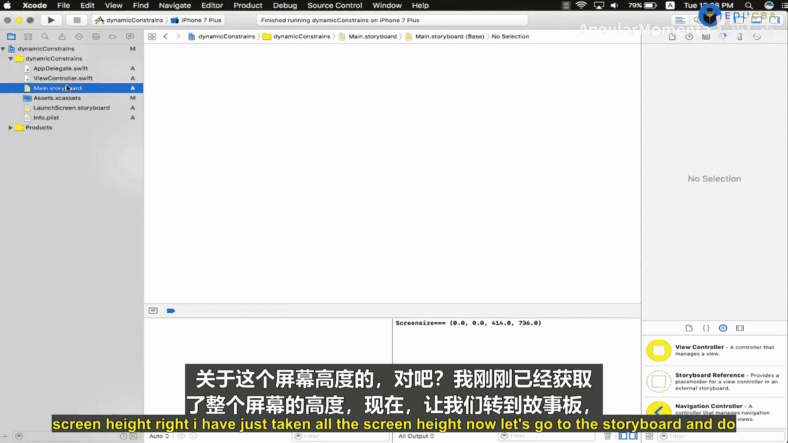

本节课中我们一起学习了如何为纵向布局界面设置自动布局。我们从设置单个按钮的约束开始，逐步扩展到包含图像、多个文本输入框和按钮的复杂界面。我们掌握了如何添加垂直间距、左右边距约束，并了解了如何将按钮固定到屏幕底部。最后，我们预览了自动布局在不同屏幕尺寸上的效果，并简要介绍了通过代码获取屏幕尺寸以进行更高级动态适配的思路。掌握这些基础约束是构建自适应iOS界面的关键。