# 010：表格视图单元格中的集合视图简介 📱

在本节课中，我们将学习如何在表格视图的单元格内嵌入并显示一个集合视图。这是一种常见的界面设计模式，例如用于展示图片画廊或产品列表。我们将结合之前学习的表格视图和集合视图知识，创建一个复合视图。

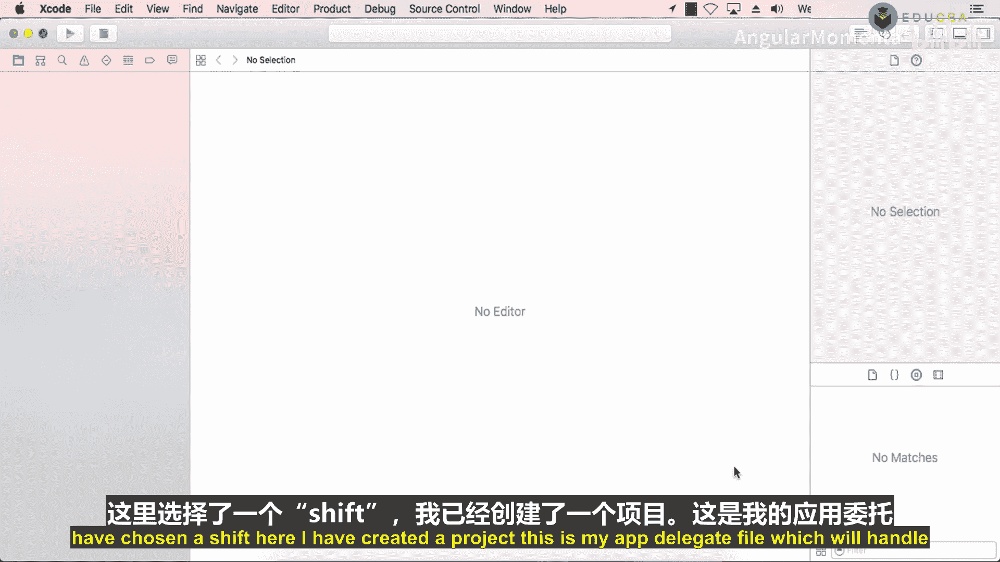

## 项目创建与界面搭建

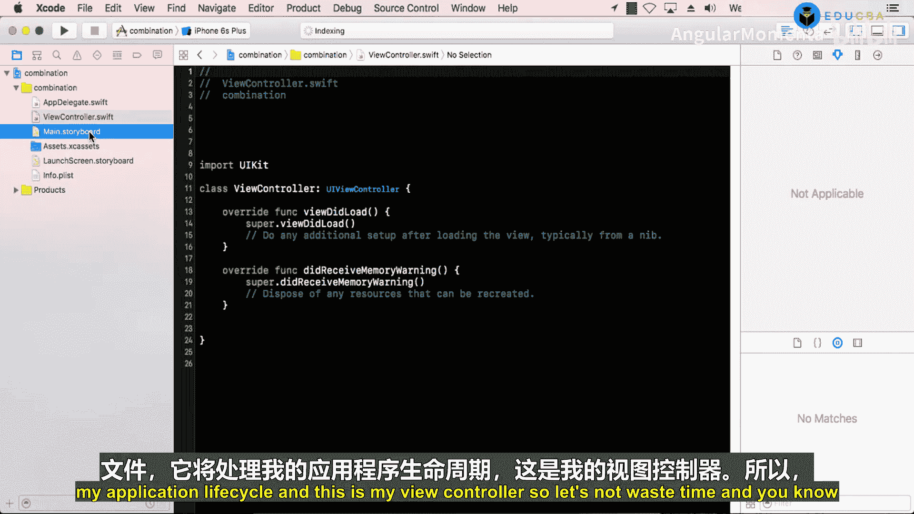

首先，我们创建一个新的Xcode项目，并将其命名为“Combination”。

在项目创建后，我们进入主故事板文件。从对象库中，将一个表格视图拖拽到视图控制器上。

为了让表格视图填满整个屏幕，我们需要为其设置约束。选中表格视图，点击右下角的约束按钮，设置其与容器视图的**前导**、**尾随**、**顶部**和**底部**空间均为0。

接下来，我们需要为表格视图配置一个原型单元格。在表格视图的属性面板中，将原型单元格的数量设置为1，并调整其高度。

然后，我们为这个原型单元格设置一个重用标识符，例如“cell”。

现在，关键的一步来了：我们要在这个表格视图单元格内部添加一个集合视图。再次从对象库中，将一个集合视图拖拽到刚才的表格视图单元格上。

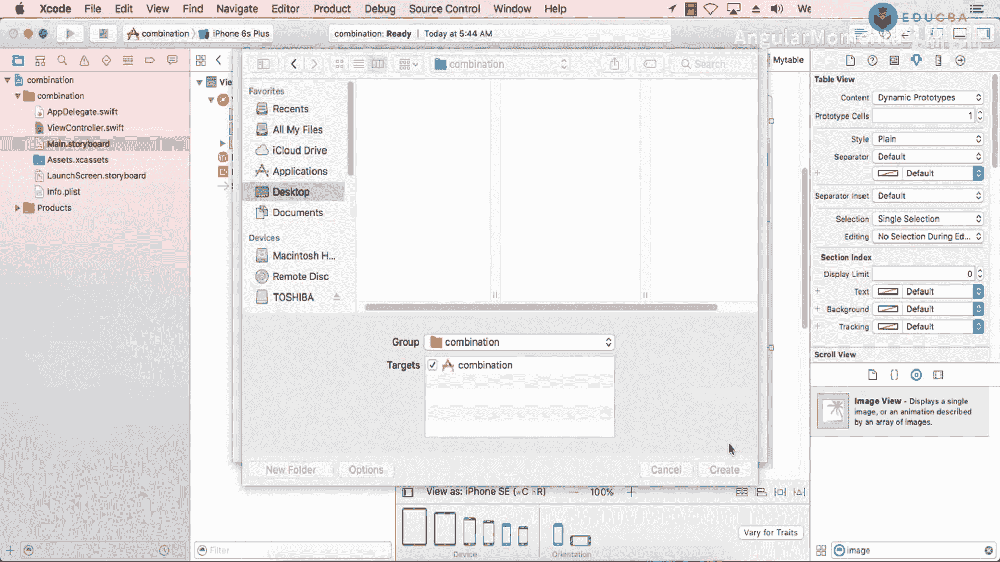

调整集合视图的大小，使其适应单元格。同样，我们需要为这个集合视图单元格设置一个重用标识符，例如“CollectionCell”。

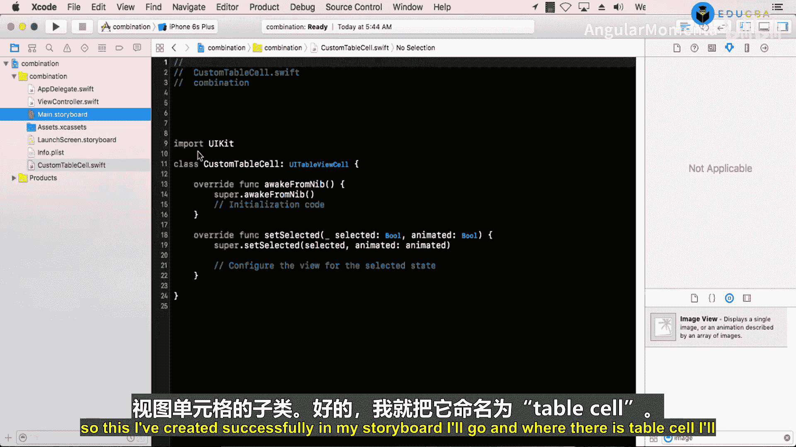

在集合视图单元格内部，我们添加一个图像视图，用于后续显示图片。

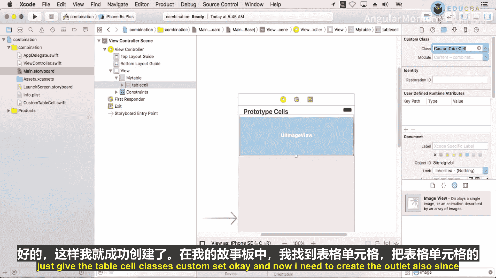

## 建立连接与创建类文件

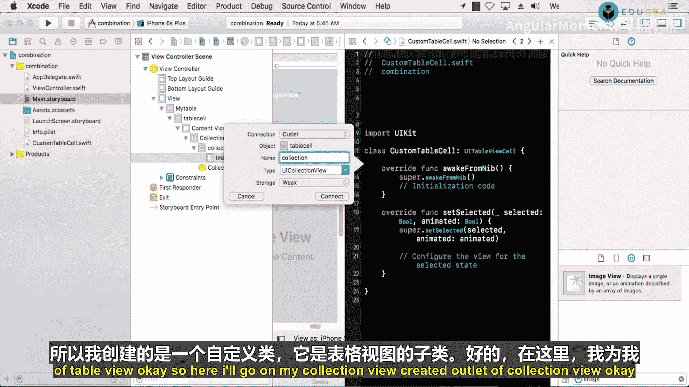

界面搭建完成后，我们需要建立代码与界面元素的连接。

首先，在视图控制器中，为表格视图创建一个出口连接，命名为`tableView`。同时，将表格视图的`delegate`和`dataSource`属性设置为这个视图控制器。

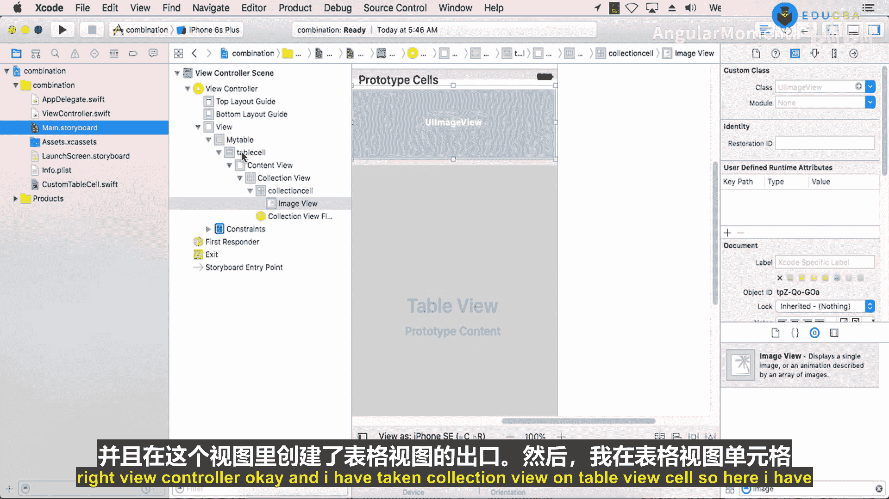

由于集合视图是内嵌在表格视图单元格中的，我们需要为这个自定义的单元格创建一个单独的类。新建一个Cocoa Touch Class文件，将其命名为`CustomTableViewCell`，并使其继承自`UITableViewCell`。

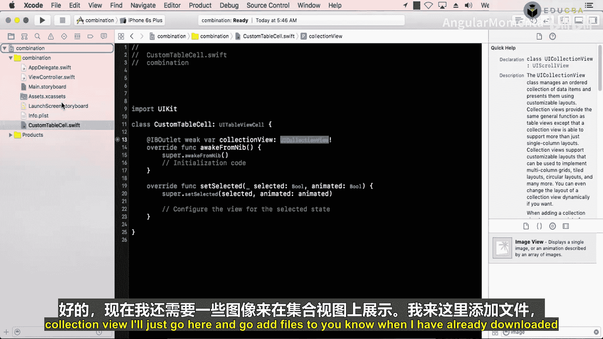

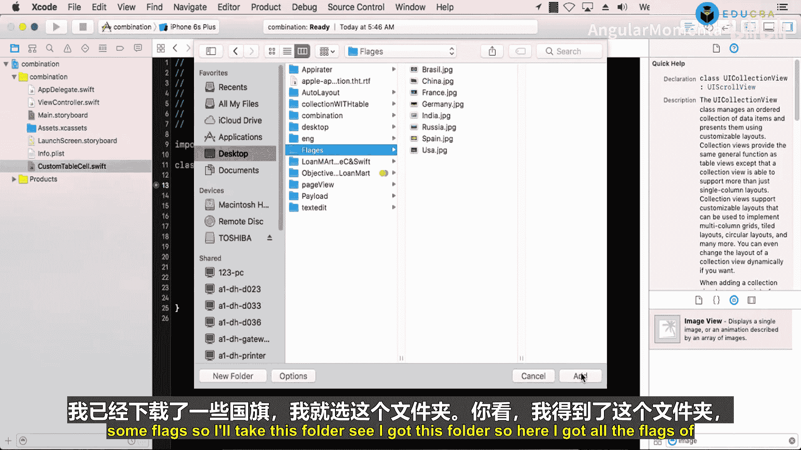

回到故事板，选中表格视图的原型单元格，在身份检查器中，将其类设置为`CustomTableViewCell`。

然后，在`CustomTableViewCell`类中，为单元格内的集合视图创建一个出口连接，命名为`collectionView`。

## 准备数据与实现集合视图协议

为了在集合视图中显示内容，我们需要准备一些图片资源。这里我们使用一组国家旗帜的图片，并将它们的文件名存储在一个数组中。

在`CustomTableViewCell`类中，我们定义一个图片名称数组：
```swift
let imageArr = ["Brazil.jpg", "China.jpg", "France.jpg", "Germany.jpg", "India.jpg", "Russia.jpg", "Spain.jpg", "US.jpg", "UK.jpg"]
```

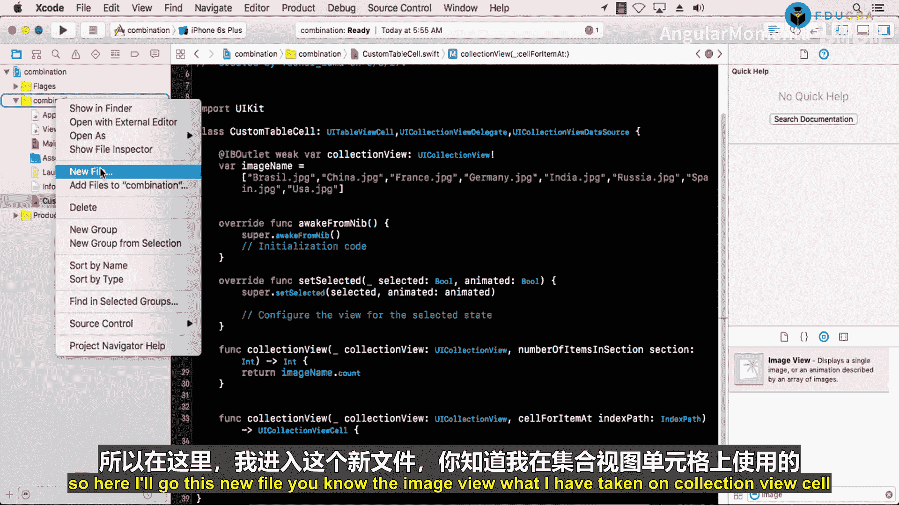

接下来，我们需要让`CustomTableViewCell`类遵循集合视图的协议，并实现必要的方法。在类声明中添加`UICollectionViewDelegate`和`UICollectionViewDataSource`。

在`awakeFromNib`方法中，设置集合视图的代理和数据源：
```swift
override func awakeFromNib() {
    super.awakeFromNib()
    collectionView.delegate = self
    collectionView.dataSource = self
}
```

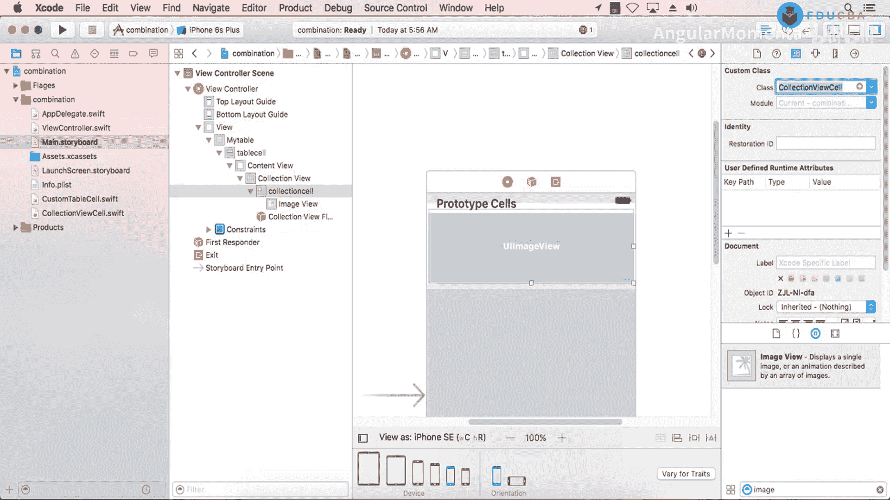

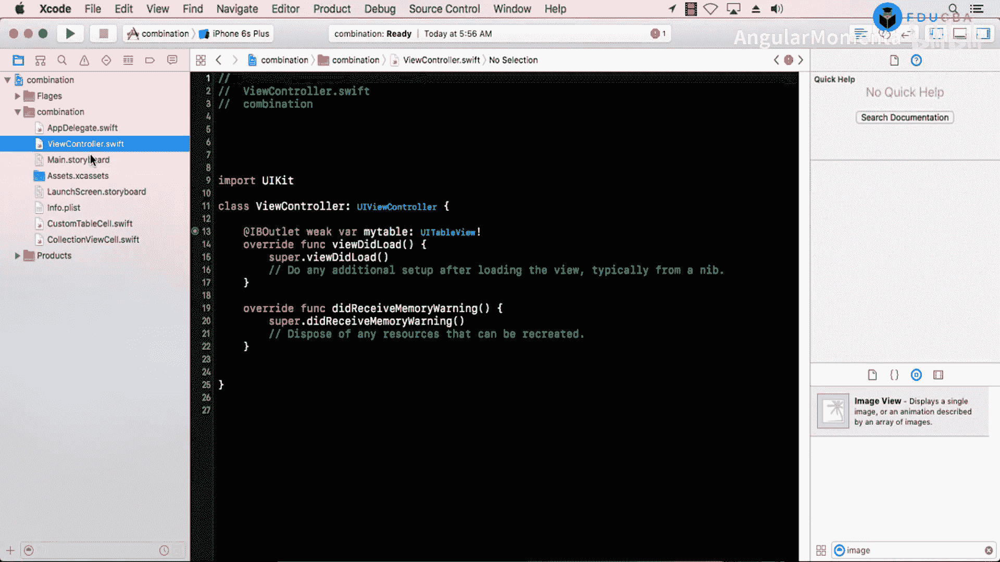

然后，实现集合视图数据源的两个核心方法：
1.  `numberOfItemsInSection`：返回数组`imageArr`的元素数量。
2.  `cellForItemAt`：出列一个标识符为“CollectionCell”的集合视图单元格，并根据索引路径设置其图像视图的图片。

为了能在`cellForItemAt`方法中访问集合视图单元格内的图像视图，我们需要为它创建一个类。新建一个`UICollectionViewCell`的子类，例如`CollectionViewCell`，并在其中为图像视图创建出口连接`imgView`。

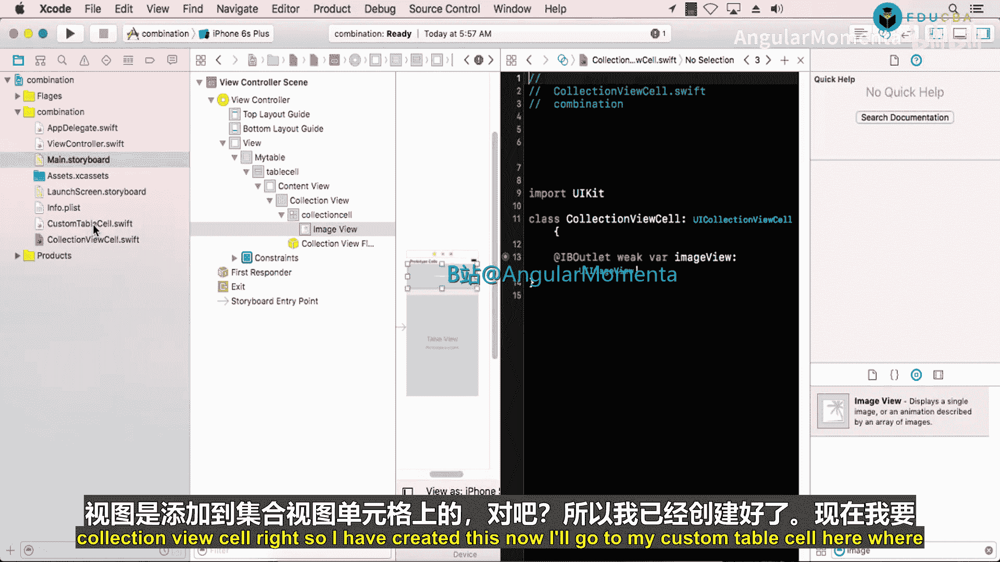

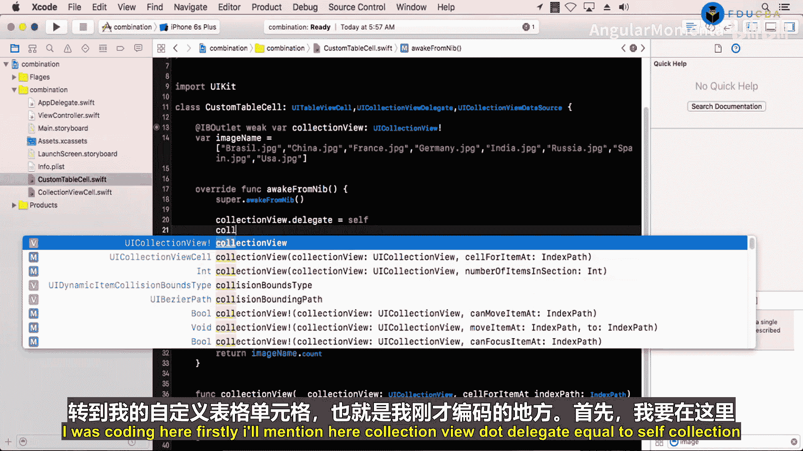

回到故事板，将集合视图原型单元格的类设置为`CollectionViewCell`。

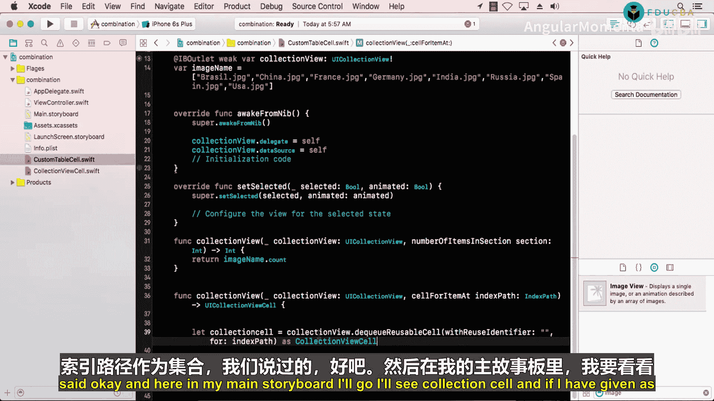

现在，我们可以在`CustomTableViewCell`的`cellForItemAt`方法中，安全地配置每个集合视图单元格了。

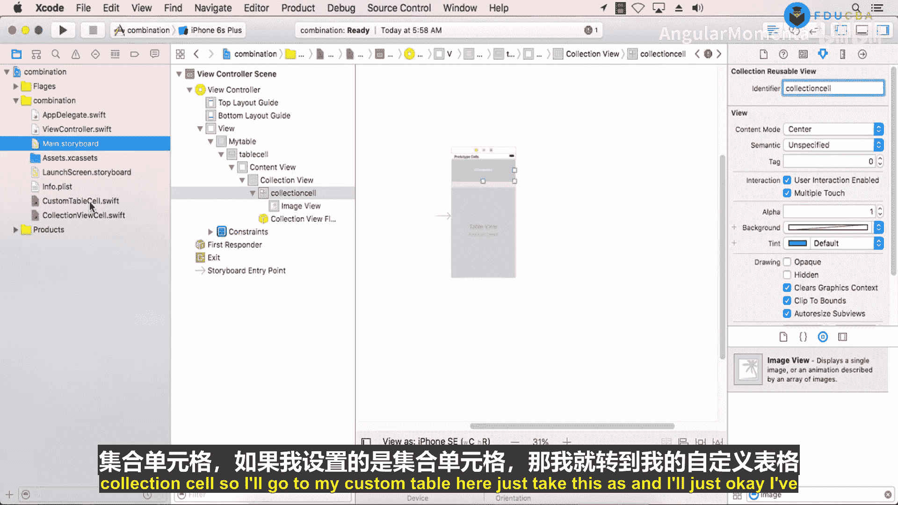

## 实现表格视图协议

上一节我们完成了单元格内部集合视图的配置，现在回到主视图控制器，实现表格视图的协议。

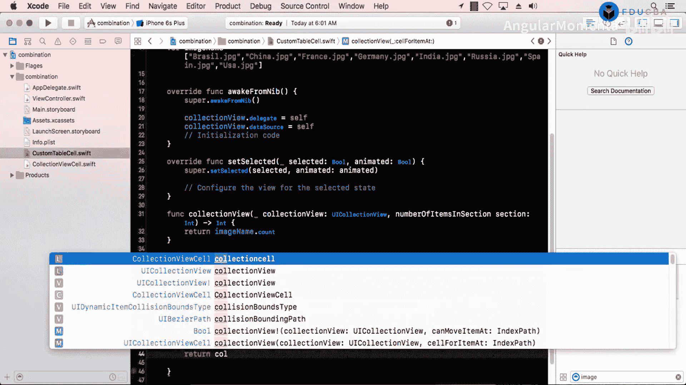

首先，确保视图控制器类声明中遵循了`UITableViewDelegate`和`UITableViewDataSource`协议。

在`viewDidLoad`方法中，设置表格视图的代理和数据源：
```swift
override func viewDidLoad() {
    super.viewDidLoad()
    tableView.delegate = self
    tableView.dataSource = self
}
```

然后，实现表格视图数据源方法：
1.  `numberOfSections`：返回1，表示只有一个分区。
2.  `numberOfRowsInSection`：返回一个数字，例如5，表示表格有5行。
3.  `cellForRowAt`：出列一个标识符为“cell”的表格视图单元格（即我们的`CustomTableViewCell`），并返回它。

由于集合视图的内容已经在`CustomTableViewCell`内部配置好，这里我们不需要对单元格做额外设置。表格的行高可以通过`heightForRowAt`代理方法设置，这里我们可以返回一个固定值，例如200。

## 运行与总结

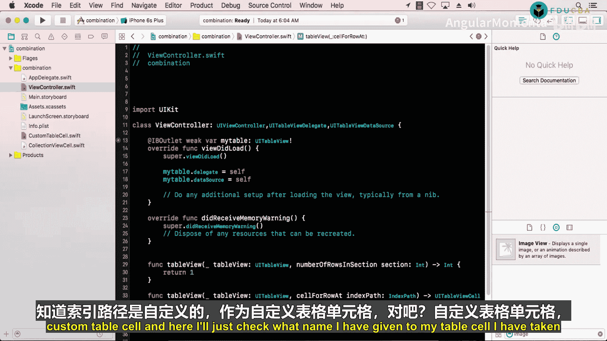

至此，所有代码部分已完成。现在可以运行应用程序，查看最终效果。你应该能看到一个表格，每一行内部都包含一个水平滚动的集合视图，展示不同的国家旗帜图片。

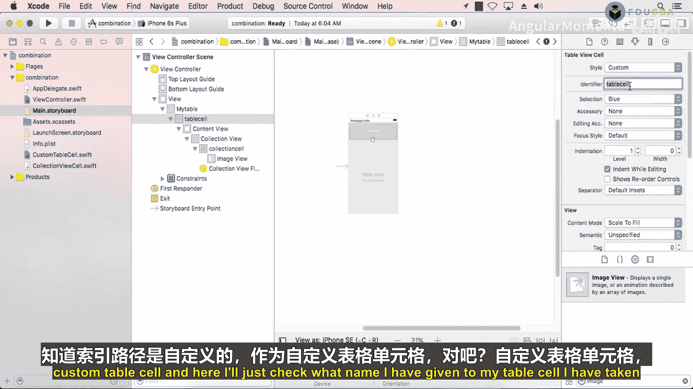

本节课中，我们一起学习了如何将集合视图嵌入到表格视图的单元格中。关键步骤包括：
1.  在故事板中搭建嵌套的视图层次结构。
2.  为自定义的表格视图单元格和集合视图单元格创建独立的类文件并建立连接。
3.  在自定义单元格类中实现集合视图的协议来管理内部内容。
4.  在主视图控制器中实现表格视图的协议来管理外部行。

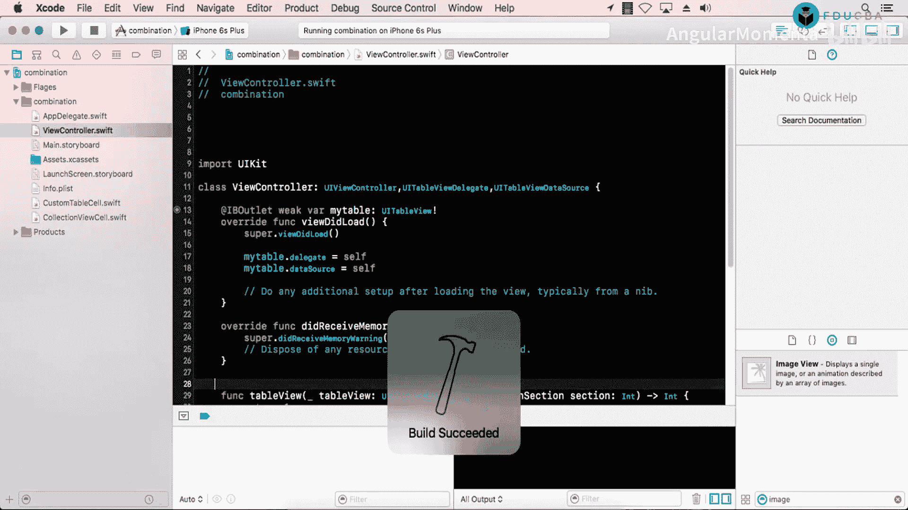

这种组合视图的技术非常实用，可以帮你构建出信息丰富且布局灵活的iOS应用界面。