# 011：在TableView中嵌入CollectionView 📱

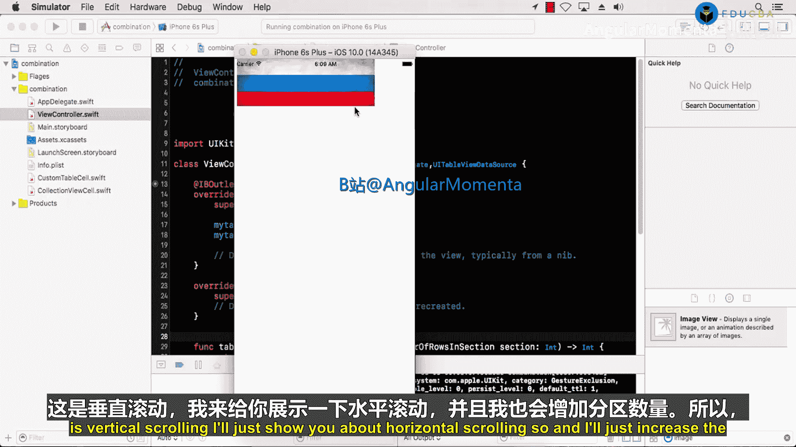

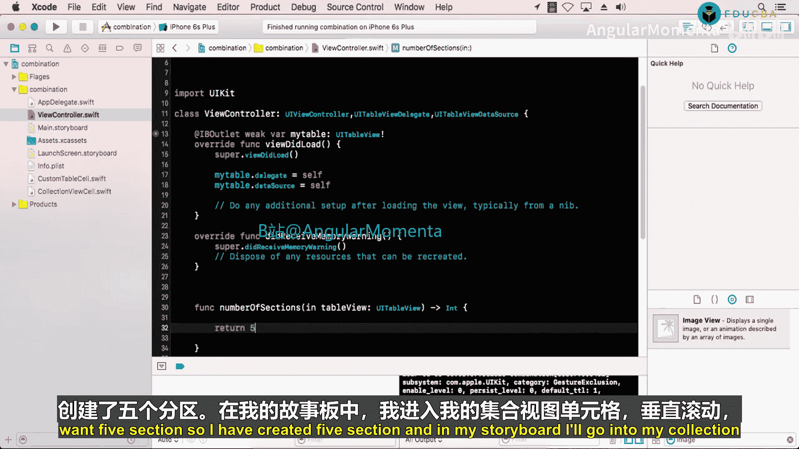

## 概述
在本节课中，我们将学习如何在UITableView的单元格内嵌入一个UICollectionView。这是一种常见的iOS界面设计模式，用于创建可垂直滚动的列表，其中每个列表项内部又包含一个可水平滚动的图片集。我们将通过修改数据源、调整滚动方向以及设置自动布局来完成这个功能。

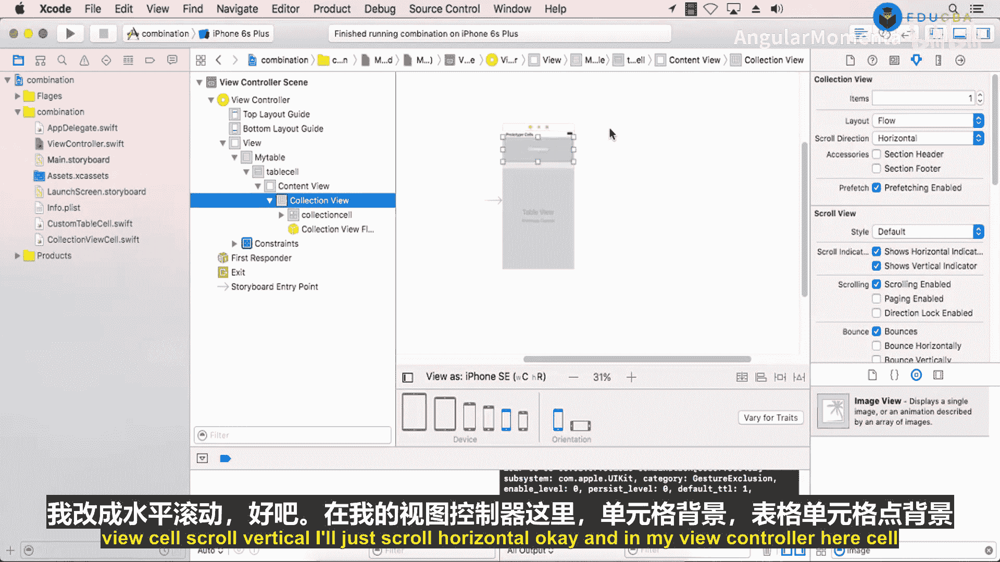

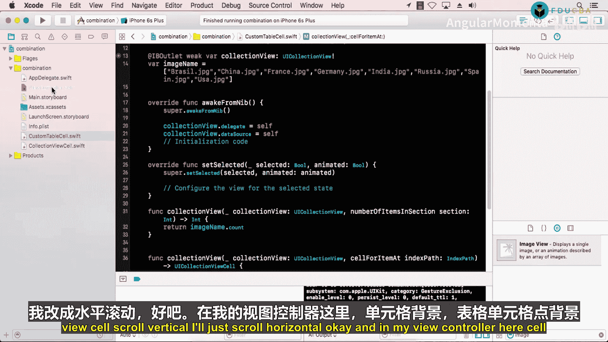

---

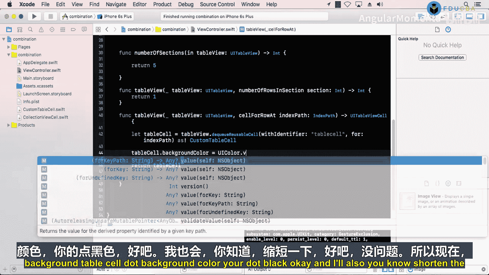

## 创建多个分区
上一节我们设置了基础的TableView和CollectionView。本节中，我们来看看如何为TableView创建多个分区，以展示更多内容。

在视图控制器中，我们需要实现`numberOfSections(in:)`方法。以下代码将TableView的分区数量设置为5：

```swift
func numberOfSections(in tableView: UITableView) -> Int {
    return 5
}
```

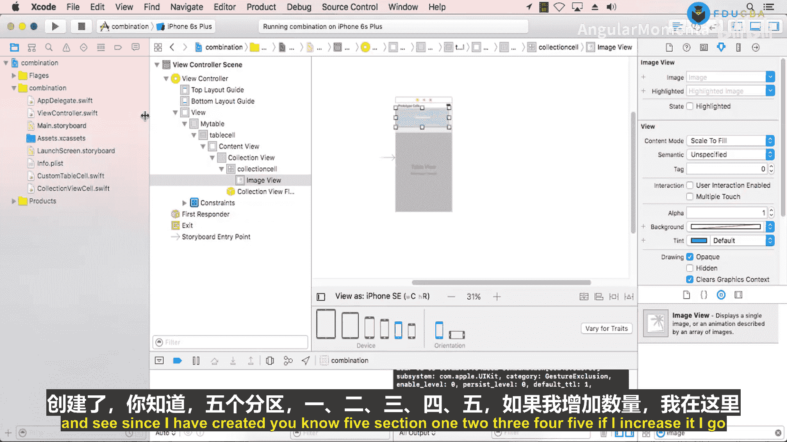

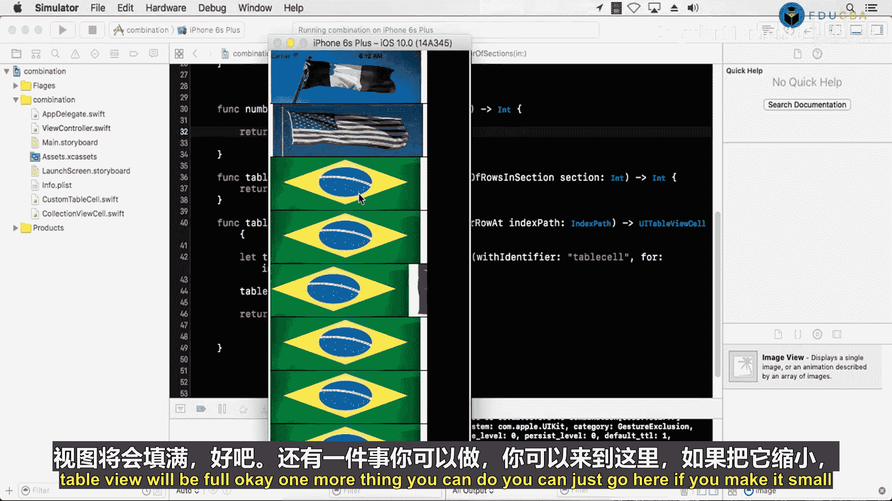

执行此操作后，TableView将包含5个独立的分区。


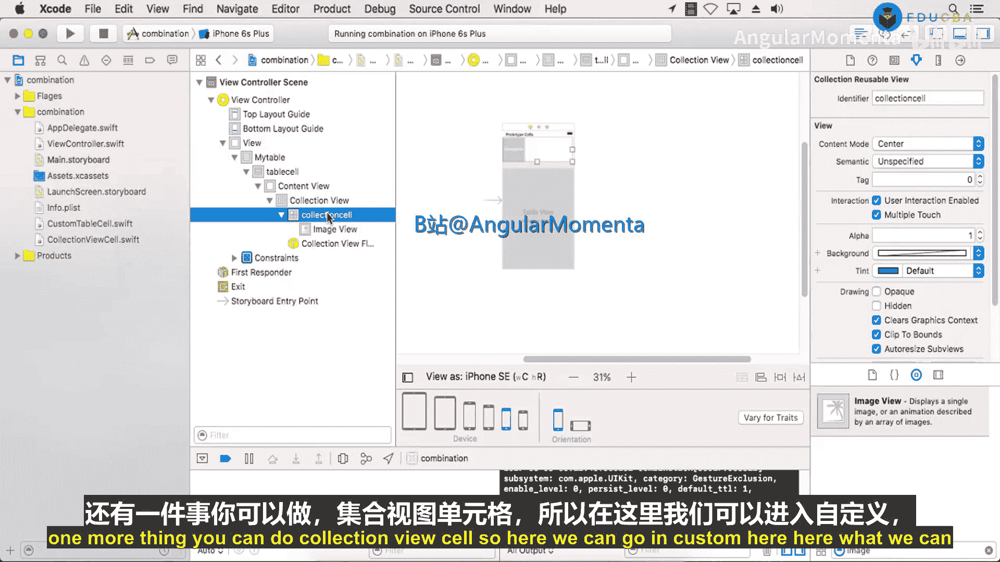


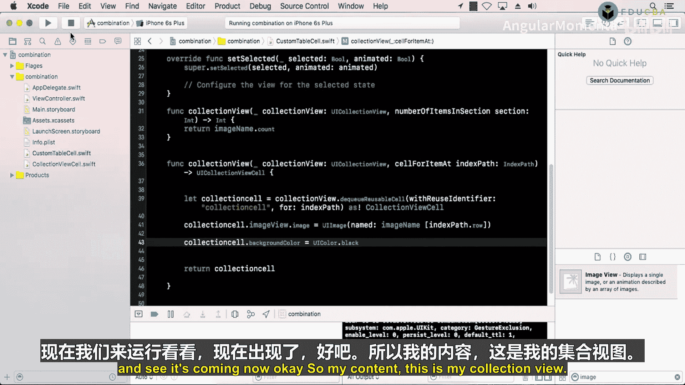

---

## 调整CollectionView的滚动方向
目前，CollectionView是垂直滚动的。为了让每个分区内的图片可以水平滑动浏览，我们需要修改它的滚动方向。

在Storyboard中，按以下步骤操作：
1.  选中CollectionView。
2.  在属性检查器中，找到“Scroll Direction”选项。
3.  将“Vertical”改为“Horizontal”。


---

## 设置单元格背景色
为了更好地区分CollectionView的单元格，我们可以为其设置背景颜色。

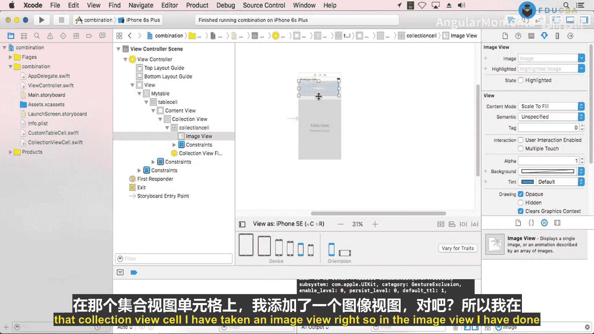

在自定义的CollectionViewCell类中，我们可以通过`cellForItemAt`数据源方法设置背景色。例如，将背景色设置为浅灰色：

```swift
func collectionView(_ collectionView: UICollectionView, cellForItemAt indexPath: IndexPath) -> UICollectionViewCell {
    let cell = collectionView.dequeueReusableCell(withReuseIdentifier: "YourCellIdentifier", for: indexPath) as! YourCustomCell
    cell.backgroundColor = UIColor.lightGray
    // ... 其他配置代码
    return cell
}
```


---

## 运行与测试
完成以上步骤后，运行应用程序。现在你应该能看到一个包含5个分区的TableView。每个分区内都有一个CollectionView，可以水平滚动查看多张图片，而整个列表则可以垂直滚动。

如果增加`numberOfSections(in:)`方法的返回值（例如改为9），TableView将显示更多的分区。


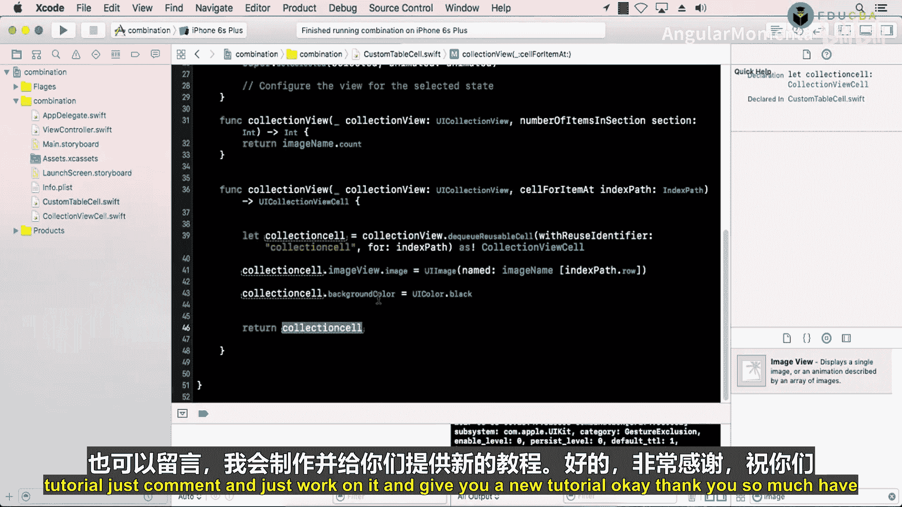


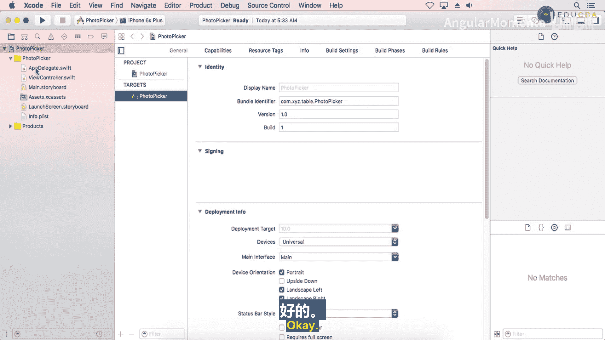

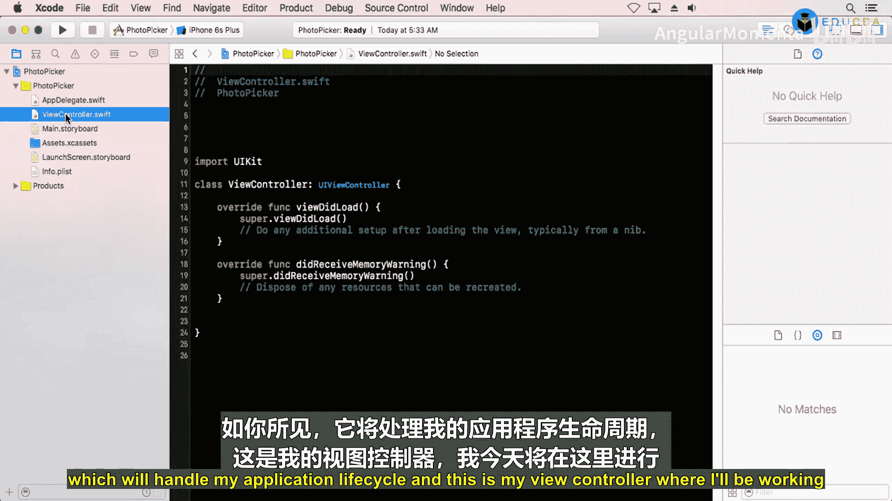

---

## 添加自动布局约束
为了确保界面在不同尺寸的设备上都能正确显示，我们需要为CollectionView添加自动布局约束。

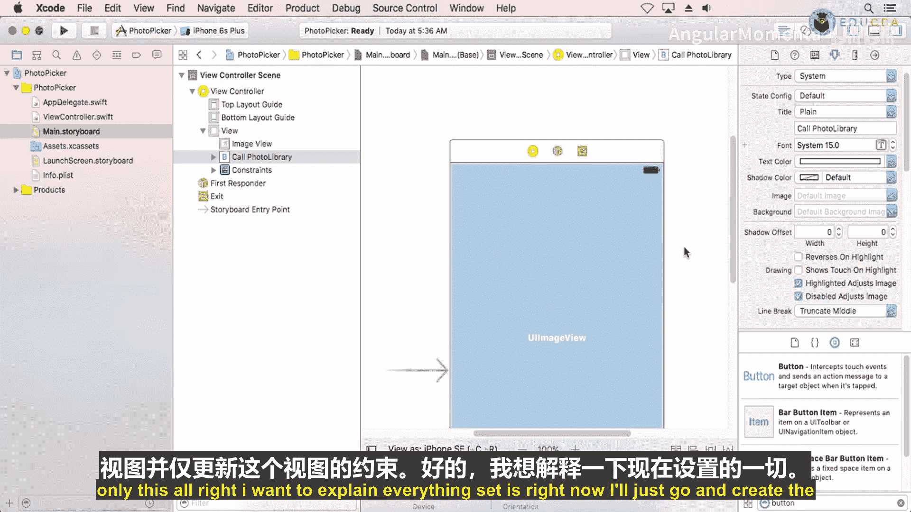

以下是需要添加的约束：
*   **Leading**（左对齐）： 与TableView单元格的左边缘对齐。
*   **Trailing**（右对齐）： 与TableView单元格的右边缘对齐。
*   **Top**（顶部对齐）： 与TableView单元格的顶部对齐。
*   **Bottom**（底部对齐）： 与TableView单元格的底部对齐。

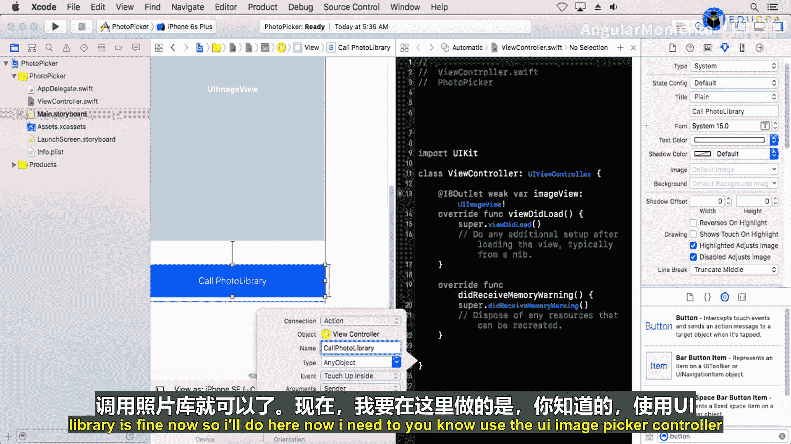

这些约束确保了CollectionView会跟随其所在的TableView单元格的大小变化而调整自身大小。


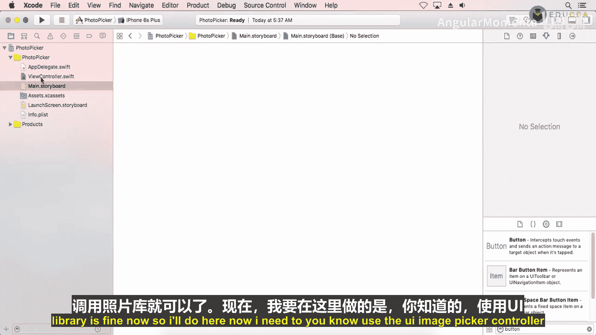


---

## 实现原理总结
本节课中我们一起学习了组合使用TableView和CollectionView的方法。让我们回顾一下整个实现的层次结构和关键代码：

1.  **界面层次**： 在ViewController上放置一个TableView。在TableView的Cell中，嵌入一个CollectionView。最后，在CollectionView的Cell中放置用于显示图片的ImageView。
2.  **TableView数据源**： 在ViewController中，实现了`tableView(_:numberOfRowsInSection:)`和`tableView(_:cellForRowAt:)`方法来配置TableView。
3.  **CollectionView数据源**： 在自定义的TableViewCell类中：
    *   创建了一个IBOutlet来连接Storyboard中的CollectionView。
    *   定义了一个图片数组作为数据源。
    *   设置CollectionView的委托和数据源为自己。
    *   实现了`collectionView(_:cellForItemAt:)`方法，在其中出列单元格、设置图片和背景色，并返回配置好的单元格。

核心关系可以概括为：**ViewController 管理 TableView -> TableViewCell 内包含并管理 CollectionView -> CollectionViewCell 显示最终内容（如图片）**。

---

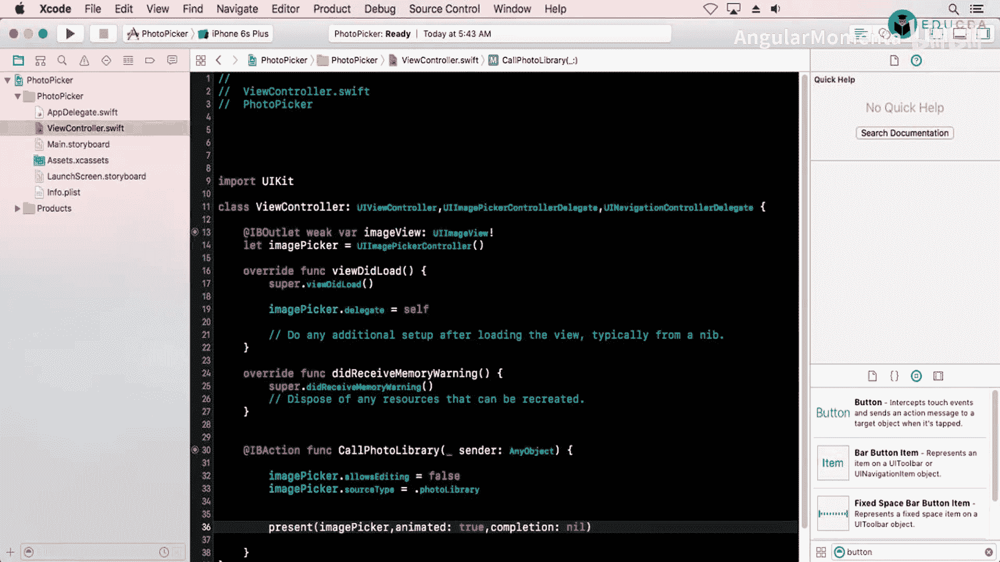

## 总结
本节课中，我们深入探讨了如何在UITableView中嵌套UICollectionView来创建复杂的滚动界面。我们完成了创建多个TableView分区、将CollectionView的滚动方向改为水平、设置单元格样式以及添加自动布局约束等关键步骤。掌握这种组合视图的技术，能够极大地丰富你应用的界面表现力和用户体验。