# 012：相机、照片库与图像视图 📸

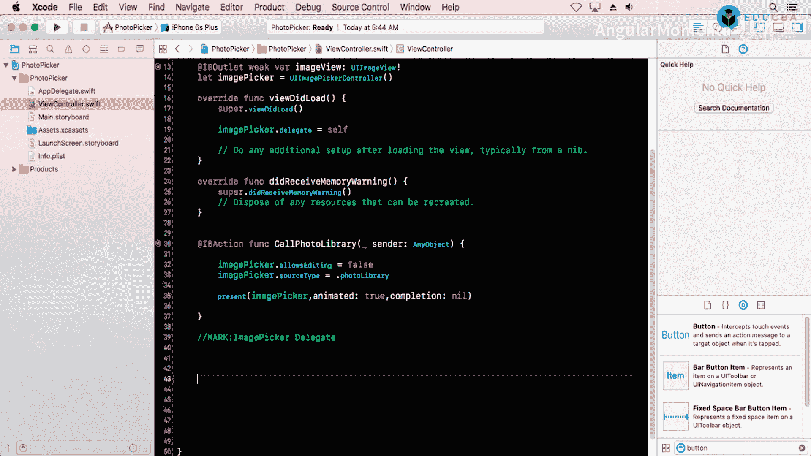

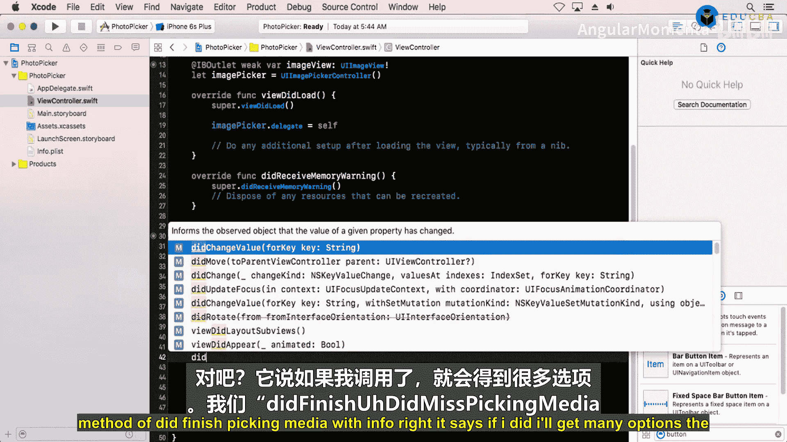

在本节课中，我们将学习如何从设备的相机或照片库中获取图片，并将其显示在应用的图像视图（`UIImageView`）中。整个过程涉及创建图像选择器控制器、处理用户授权以及实现必要的代理方法。

---

## 创建图像选择器控制器

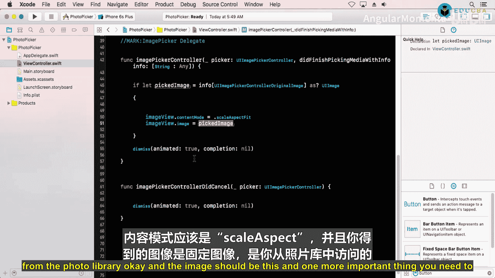

首先，我们需要创建一个图像选择器控制器（`UIImagePickerController`）的实例。这个控制器负责管理从相机或照片库选择媒体的界面。

以下是创建和配置图像选择器控制器的步骤：

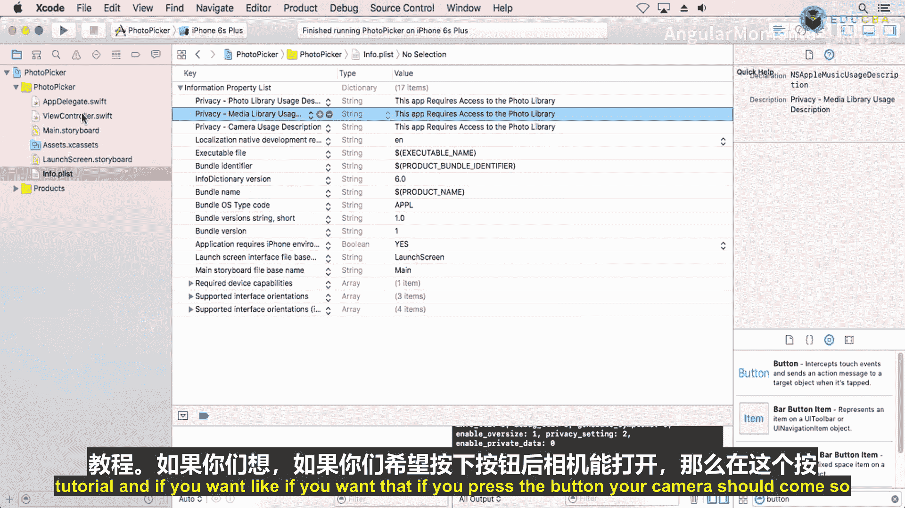

1.  **初始化选择器**：创建一个 `UIImagePickerController` 的实例。
2.  **设置来源类型**：指定图片来源是相机（`.camera`）还是照片库（`.photoLibrary`）。
3.  **设置代理**：将当前视图控制器设置为选择器的代理，以便接收用户操作的结果。
4.  **模态呈现**：将选择器控制器以模态方式呈现给用户。

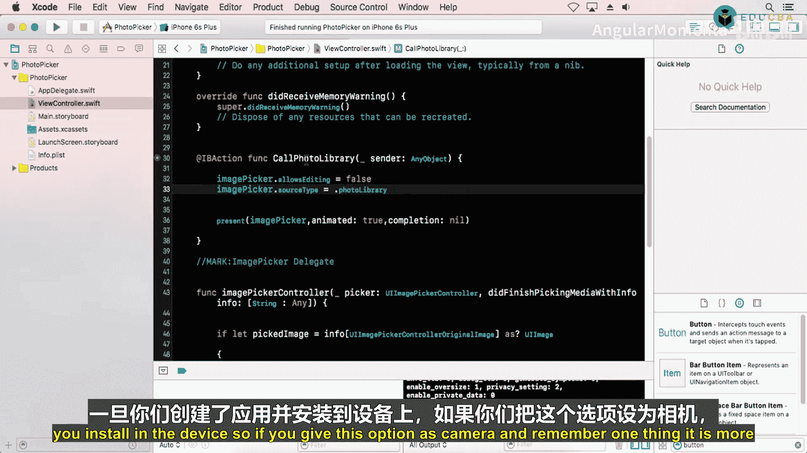

```swift
let imagePicker = UIImagePickerController()
imagePicker.sourceType = .photoLibrary // 或 .camera
imagePicker.delegate = self
self.present(imagePicker, animated: true, completion: nil)
```

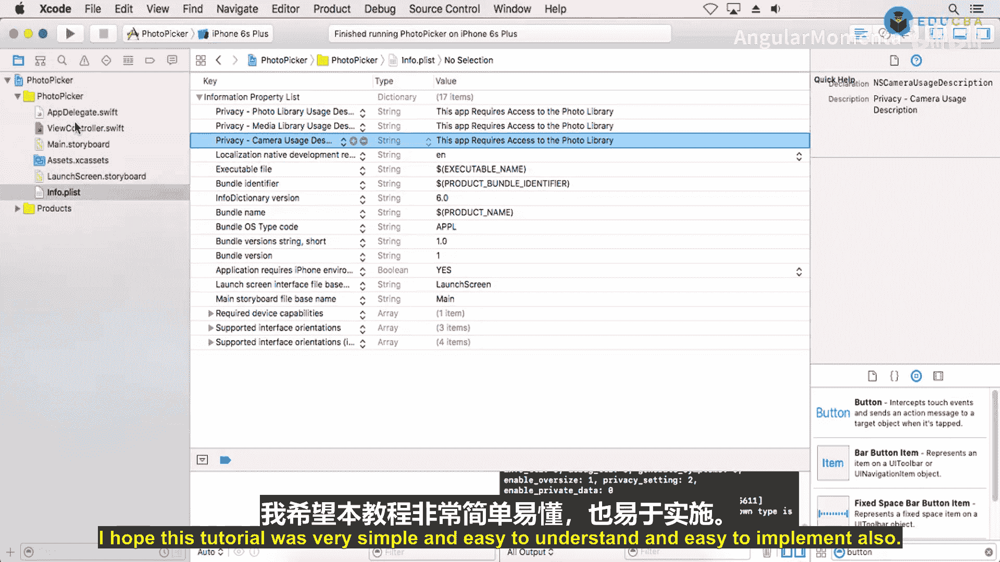

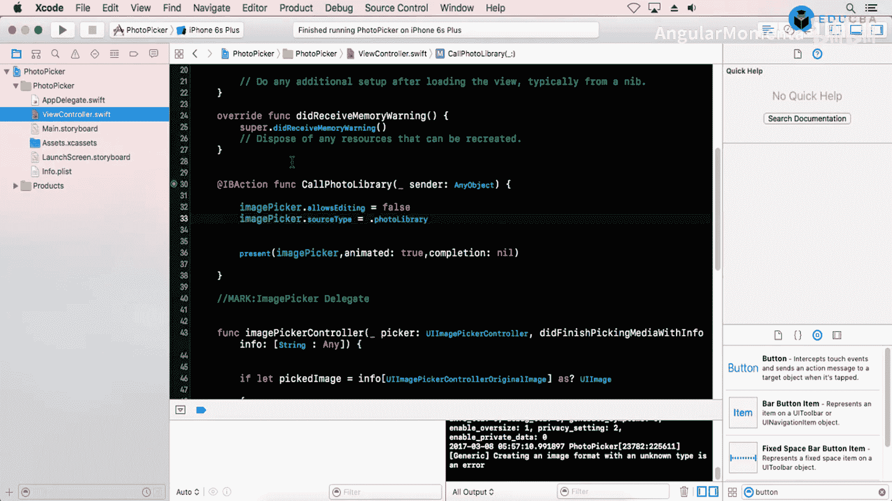

---

## 实现代理方法

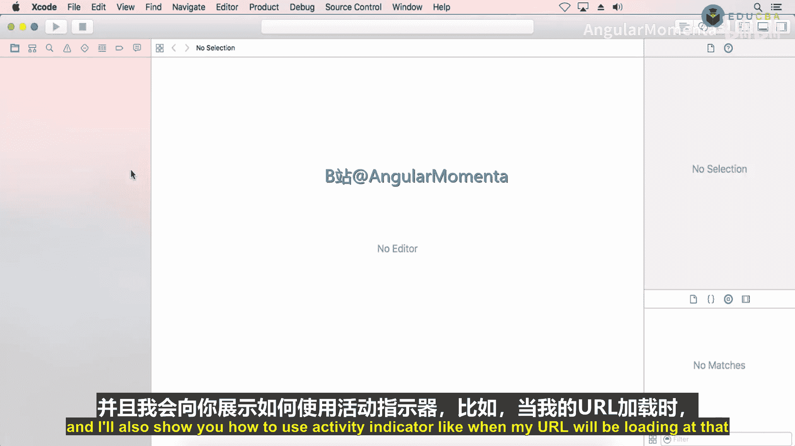

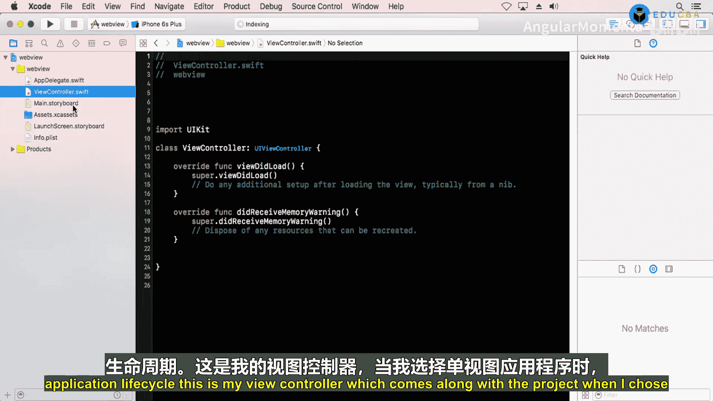

图像选择器控制器通过代理方法将用户的选择结果返回给我们的应用。我们需要实现两个核心的代理方法。

以下是必须实现的 `UIImagePickerControllerDelegate` 方法：

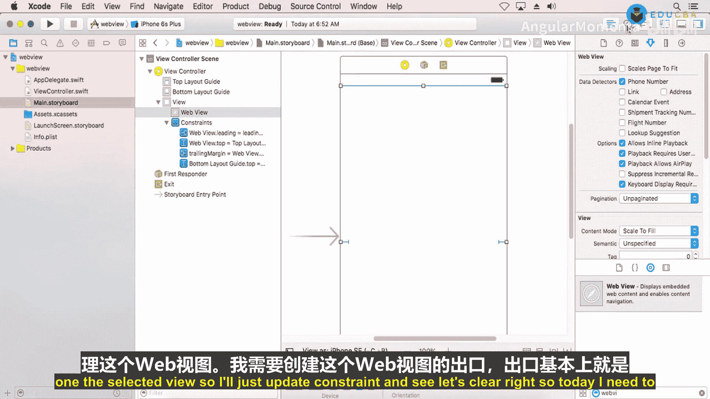

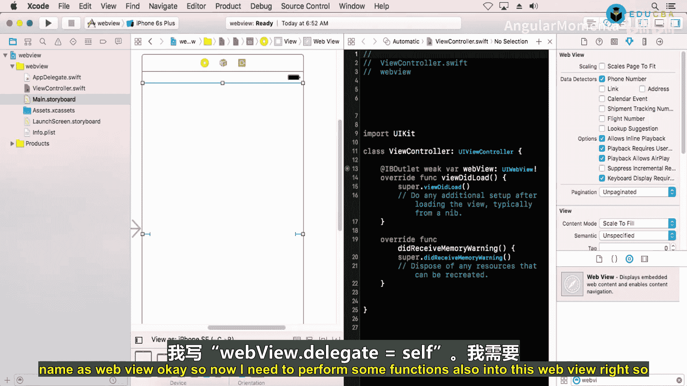

*   **`imagePickerController(_:didFinishPickingMediaWithInfo:)`**：当用户成功选择一张图片（或视频）时调用。我们需要从这个方法中获取选中的图片。
*   **`imagePickerControllerDidCancel(_:)`**：当用户取消选择操作时调用。我们需要在这个方法中关闭选择器界面。

```swift
// 处理选中的媒体
func imagePickerController(_ picker: UIImagePickerController, didFinishPickingMediaWithInfo info: [UIImagePickerController.InfoKey : Any]) {
    // 从 info 字典中获取原始图片
    if let selectedImage = info[.originalImage] as? UIImage {
        // 将图片设置到图像视图
        myImageView.image = selectedImage
        // 设置图像视图的内容模式为等比例适应
        myImageView.contentMode = .scaleAspectFit
    }
    // 关闭选择器
    picker.dismiss(animated: true, completion: nil)
}

// 处理取消操作
func imagePickerControllerDidCancel(_ picker: UIImagePickerController) {
    // 关闭选择器
    picker.dismiss(animated: true, completion: nil)
}
```

---

## 配置图像视图

在成功获取图片后，我们需要将其显示在用户界面上。这通常通过一个 `UIImageView` 组件来完成。

配置图像视图的关键点如下：

*   **设置图片**：将从代理方法中获取的 `UIImage` 对象赋值给图像视图的 `image` 属性。
*   **调整显示模式**：将图像视图的 `contentMode` 属性设置为 `.scaleAspectFit`，这可以确保图片在不失真的情况下适应视图的边界。

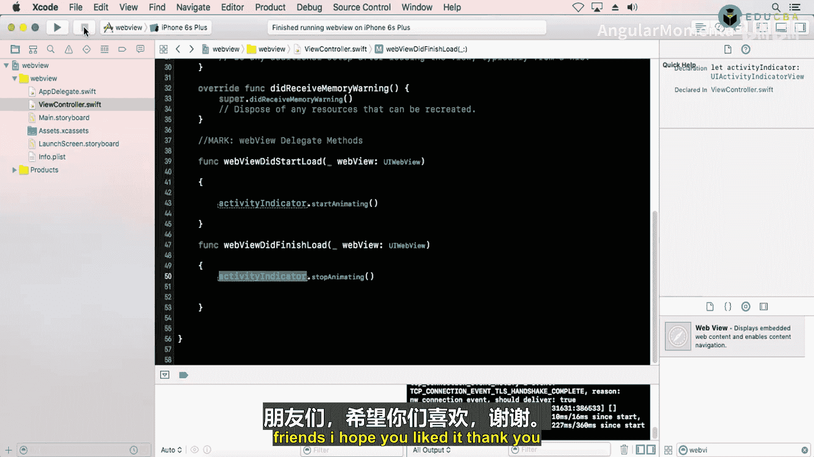

```swift
myImageView.image = selectedImage
myImageView.contentMode = .scaleAspectFit
```

---

## 请求用户权限

在访问设备的相机或照片库之前，应用必须获得用户的明确许可。这需要在 `Info.plist` 文件中添加相应的权限描述。

以下是需要在 `Info.plist` 中添加的键值对：

*   **访问相机**：键为 `NSCameraUsageDescription`，值为描述用途的字符串，例如“此应用需要使用相机来拍摄照片”。
*   **访问照片库**：键为 `NSPhotoLibraryUsageDescription`，值为描述用途的字符串，例如“此应用需要访问您的照片库来选择图片”。

当用户首次尝试使用相关功能时，系统会自动弹出授权对话框。用户必须点击“允许”，应用才能正常使用相机或照片库。

---

## 运行与测试

完成以上所有步骤后，我们可以运行应用进行测试。

测试流程如下：

1.  点击触发按钮，调用图像选择器。
2.  首次使用时，系统会请求访问照片库（或相机）的权限，请点击“允许”。
3.  在照片库中选择一张图片。
4.  观察图片是否正确显示在应用的图像视图中。图片可能不会填满整个视图，这是由 `.scaleAspectFit` 模式决定的，目的是保持图片比例。

如果选择相机作为来源，在真实设备上运行时，点击按钮会直接打开相机界面。

---

## 总结

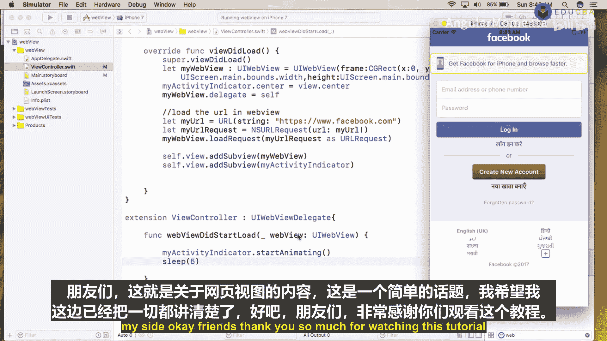

本节课中我们一起学习了如何集成 iOS 设备的媒体选择功能。我们掌握了创建和配置 `UIImagePickerController` 的方法，实现了处理选择结果和取消操作的代理方法，学会了将获取的图片显示在 `UIImageView` 中，并了解了为访问隐私敏感功能（相机和照片库）配置应用权限的必要步骤。通过本课的知识，你可以为应用轻松添加从相册选图或拍照上传的功能。