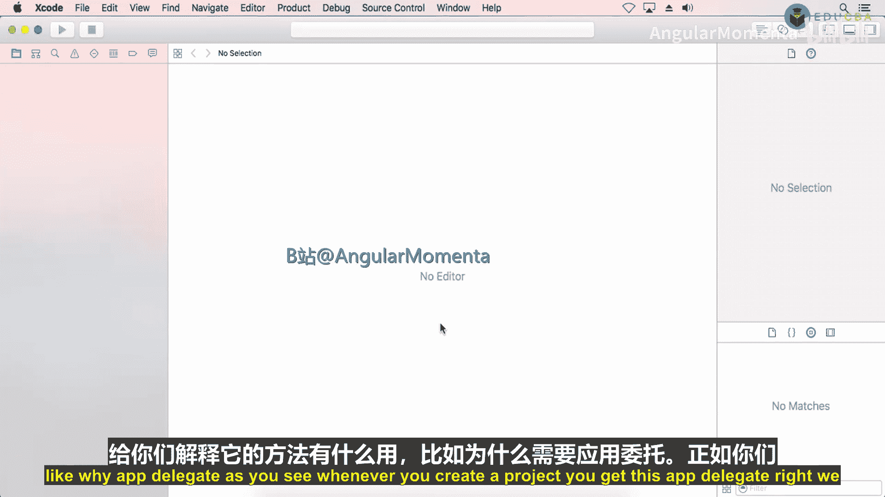
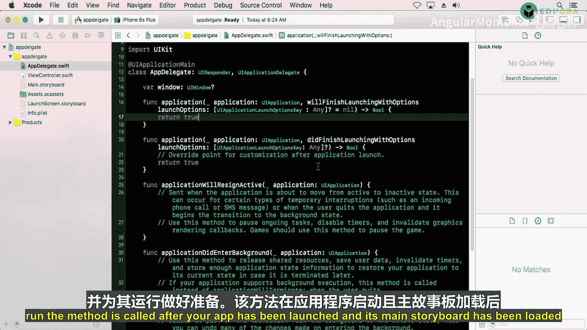
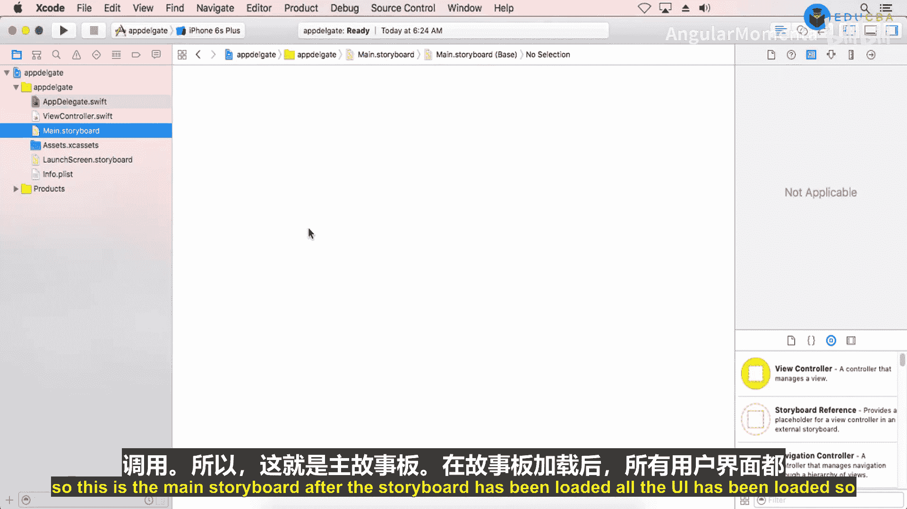
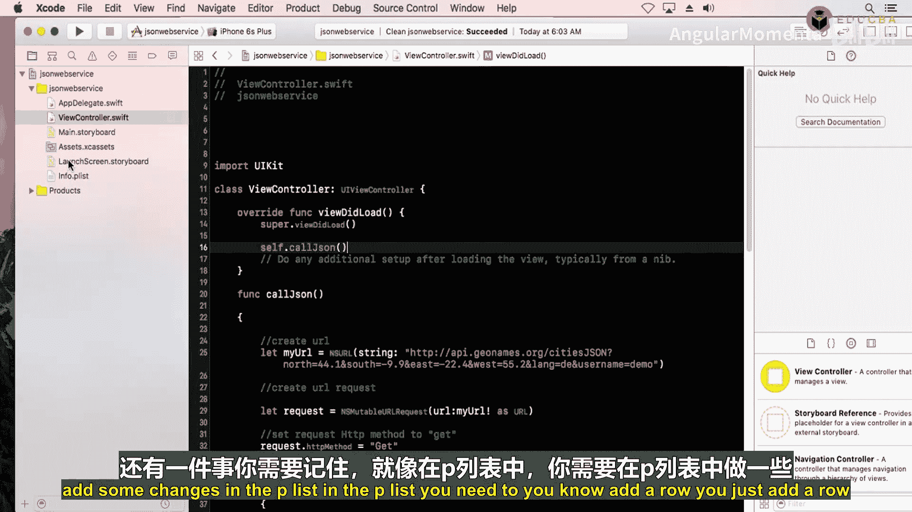
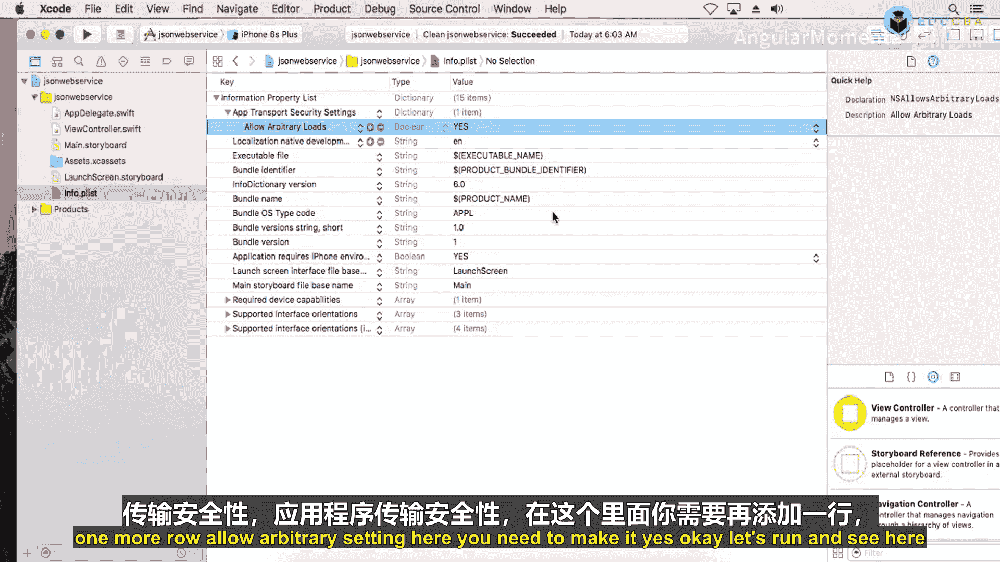
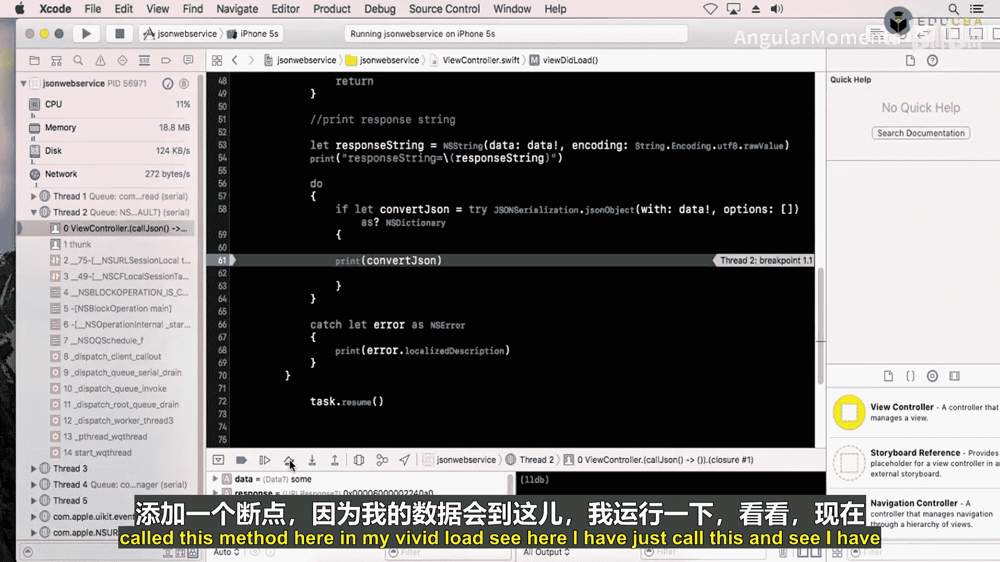
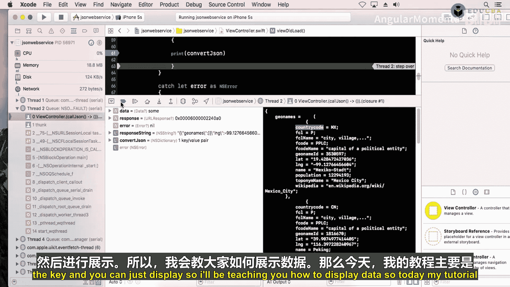
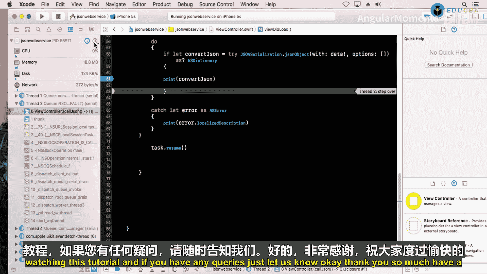

# 013：应用委托与网络请求基础



## 概述

在本节课中，我们将学习iOS应用开发中的两个核心概念：**应用委托（App Delegate）** 和**网络请求基础**。应用委托负责管理应用的生命周期，而网络请求则是从服务器获取数据的关键技术。我们将分别探讨这两个主题，帮助你理解它们的工作原理和基本用法。

---

## 应用委托：13.1：应用生命周期详解 🌀

上一节我们介绍了课程的整体结构，本节中我们来看看iOS应用的核心管理者——应用委托。

应用委托与应用程序对象协同工作，确保你的应用能与系统及其他应用正确交互。它的核心职责是处理应用的整个生命周期。

一个iOS应用在其生命周期中会经历五种不同的状态：





以下是应用的五种状态：
1.  **未运行（Not Running）**：应用尚未启动，或已被用户或系统终止。
2.  **未激活（Inactive）**：应用在前台运行，但未接收事件（例如，应用启动后、切换到其他应用前的短暂瞬间）。
3.  **激活（Active）**：应用在前台运行并正常接收事件。这是前台应用的常规模式。
4.  **后台（Background）**：应用在后台执行代码，但屏幕不可见（例如，正在下载内容）。用户退出应用时，系统会先将应用移至后台状态，再将其挂起。
5.  **挂起（Suspended）**：应用停留在内存中，但不再执行任何代码。

为了响应应用在不同状态间的转换，应用委托提供了一系列方法。

以下是应用委托的关键方法及其调用时机：
*   **`application(_:willFinishLaunchingWithOptions:)`**：应用启动后、主故事板加载完成时调用。此时界面已加载，但应用状态尚未恢复。你可以在此进行初始化工作。
*   **`application(_:didFinishLaunchingWithOptions:)`**：在 `willFinishLaunchingWithOptions` 之后、应用状态恢复后调用。它告知你启动过程基本完成，应用即将启动，你仍有最后机会进行一些调整。
*   **`applicationDidBecomeActive(_:)`**：当应用从“未激活”状态进入“激活”状态时调用。例如，应用启动完成，或用户接完电话后返回应用。
*   **`applicationWillResignActive(_:)`**：当应用即将从“激活”状态进入“未激活”状态时调用。这通常发生在有临时中断时，如来电、收到短信，或用户开始将应用切换到后台。
*   **`applicationDidEnterBackground(_:)`**：应用进入后台时调用。你可以在此释放共享资源或保存用户数据。
*   **`applicationWillEnterForeground(_:)`**：应用即将从后台进入前台时调用。
*   **`applicationWillTerminate(_:)`**：应用即将终止时调用。这是你保存数据的最后机会。

**典型流程示例**：用户启动应用时，会依次调用 `willFinishLaunching` -> `didFinishLaunching` -> `didBecomeActive`。如果此时有来电，则会调用 `willResignActive` -> `didEnterBackground`。通话结束后，调用 `willEnterForeground` -> `didBecomeActive`。最后用户关闭应用时，会调用 `willTerminate`。

理解应用委托和生命周期对于应对面试和开发健壮的应用至关重要。

---

## 网络请求：13.2：使用URLSession获取数据 🌐

上一节我们深入了解了应用的生命周期管理，本节中我们将转向另一个基础技能：如何从网络服务（Web Service）获取数据。

我们将学习如何使用 `URLSession` 发起一个简单的HTTP GET请求，并解析返回的JSON数据。

首先，需要创建一个URL请求。以下是创建请求的基本代码：

```swift
let url = URL(string: "https://api.example.com/data")!
var request = URLRequest(url: url)
request.httpMethod = "GET"
```

接下来，使用 `URLSession` 创建一个数据任务来执行这个请求，并在闭包中处理响应。

以下是执行网络请求和处理响应的步骤：
1.  使用 `URLSession.shared.dataTask` 方法创建任务。
2.  在完成处理闭包中，检查错误（`error`）和响应数据（`data`）。
3.  将接收到的二进制数据（`Data`）转换为字符串，以便初步查看。
4.  使用 `JSONSerialization` 将数据转换为Swift可用的对象（如字典或数组）。

核心的网络请求代码如下：

```swift
let task = URLSession.shared.dataTask(with: request) { data, response, error in
    // 检查是否有错误
    if let error = error {
        print("请求错误: \(error.localizedDescription)")
        return
    }
    
    // 确保收到了数据
    guard let data = data else {
        print("未收到数据")
        return
    }
    
    // 将数据转换为字符串并打印（用于调试）
    if let responseString = String(data: data, encoding: .utf8) {
        print("原始响应字符串: \(responseString)")
    }
    
    // 尝试将JSON数据解析为对象
    do {
        if let jsonObject = try JSONSerialization.jsonObject(with: data, options: []) as? [String: Any] {
            print("解析后的JSON对象: \(jsonObject)")
            // 后续可以在这里根据键名提取具体数据
        }
    } catch {
        print("JSON解析错误: \(error)")
    }
}
task.resume() // 不要忘记启动任务
```



**重要配置**：为了允许HTTP请求（而非安全的HTTPS），你需要在项目的 `Info.plist` 文件中添加一个例外。添加 `App Transport Security Settings` 字典，并在其下添加一个布尔键 `Allow Arbitrary Loads`，将其值设置为 `YES`。**请注意，这仅适用于开发测试，上架App Store前应移除或配置更安全的ATS规则。**





运行应用并触发网络请求后，你将在控制台看到从服务器获取的原始字符串和解析后的JSON对象。通常，JSON数据是嵌套的字典和数组结构。在后续教程中，我们将学习如何从中提取特定字段（如“name”），并将其显示在表格视图（UITableView）中。

---

## 总结





本节课中我们一起学习了iOS开发的两个重要基础。
首先，我们详细探讨了**应用委托（App Delegate）**，它是应用生命周期的管理者，定义了应用从启动到终止的各个状态（未运行、未激活、激活、后台、挂起）以及状态转换时调用的对应方法。
其次，我们介绍了如何使用 **`URLSession`** 发起基本的网络GET请求，获取JSON格式的数据，并通过 `JSONSerialization` 进行初步解析。理解这些概念是构建功能完整、交互流畅的iOS应用的基石。在接下来的课程中，我们将学习如何利用获取的数据来填充用户界面。