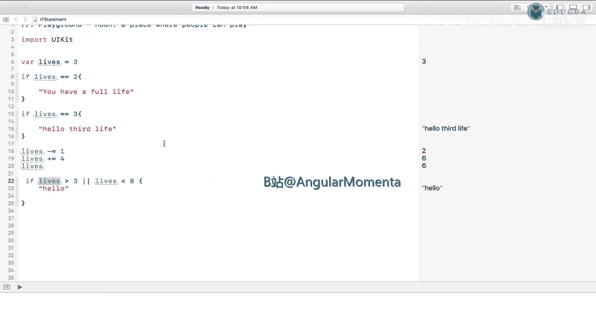
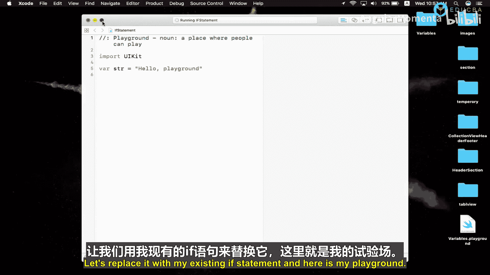
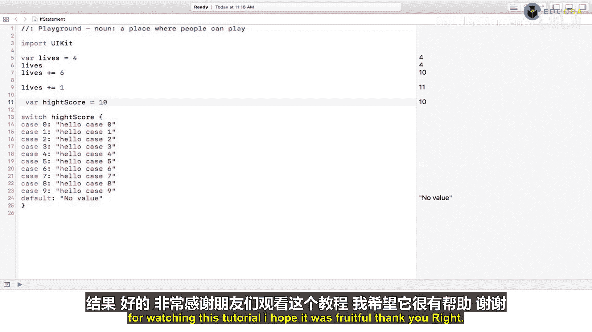
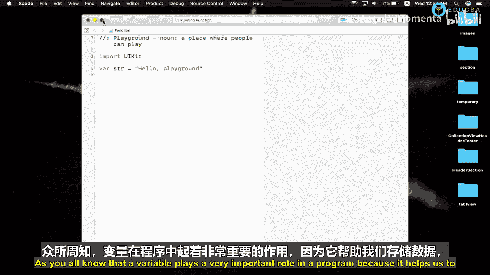
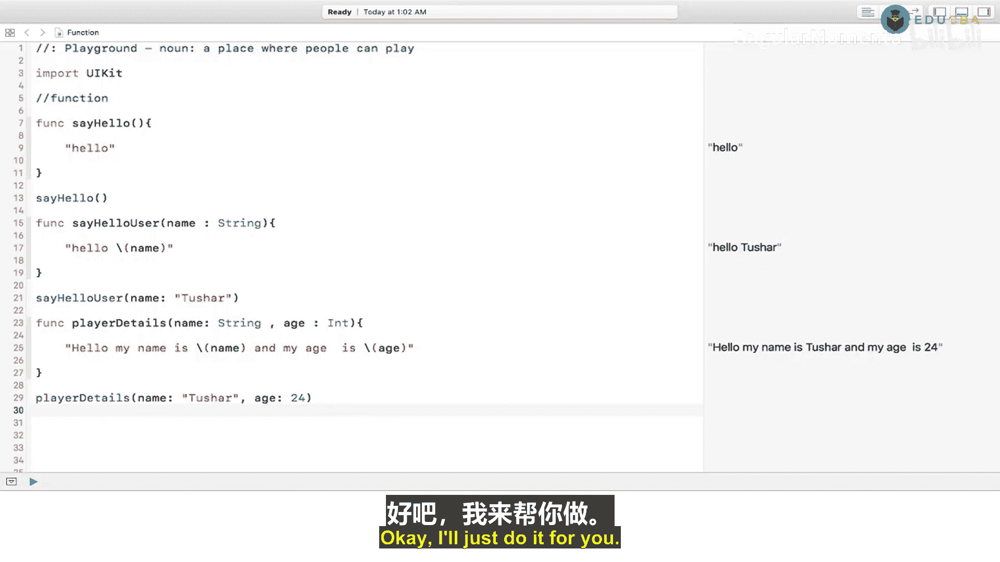

# 014：条件语句与函数

在本章中，我们将学习 Swift 编程中的两个核心概念：**条件语句**和**函数**。条件语句（如 `if`、`else` 和 `switch`）用于根据不同的条件执行不同的代码块。函数则是一段可重复使用的代码，用于执行特定任务。掌握这些概念是构建复杂 iOS 应用的基础。



## 第 2.1 节：`if` 与 `else` 语句

上一节我们介绍了变量和数据类型。本节中，我们来看看如何使用 `if` 和 `else` 语句来控制程序的执行流程。



`if` 语句是一种条件判断语句，它根据一个条件是否为真来决定是否执行其内部的代码块。其基本结构如下：

```swift
if 条件 {
    // 如果条件为真，则执行这里的代码
}
```

例如，我们创建一个变量 `lives` 并赋值为 4：

```swift
var lives = 4
```

现在，如果我们想检查 `lives` 是否等于 10，可以这样写：

```swift
if lives == 10 {
    print(“Hello 10”)
}
```

请注意，这里使用了双等号 `==`。它与单等号 `=` 有重要区别：
*   **单等号 `=`**：用于赋值，例如 `var lives = 4` 是将值 `4` 赋给变量 `lives`。
*   **双等号 `==`**：用于比较，例如 `lives == 10` 是判断变量 `lives` 的值是否等于 `10`。

如果条件不满足，我们可能希望执行另一段代码。这时就需要 `else` 语句。

```swift
if lives == 6 {
    print(“Value is 6”)
} else {
    print(“Value is not 6”)
}
```

当需要检查多个条件时，可以使用 `else if`。

以下是 `if`、`else if` 和 `else` 组合使用的示例：

```swift
if lives == 5 {
    print(“Hello 5”)
} else if lives == 6 {
    print(“Hello 6”)
} else if lives == 7 {
    print(“Hello 7”)
} else if lives == 8 {
    print(“Hello 8”)
} else if lives == 9 {
    print(“Hello 9”)
} else {
    print(“Hello 10”)
}
```

程序会从上到下依次检查每个条件，一旦某个条件为真，就会执行对应的代码块，然后跳过其余检查。

## 第 2.2 节：逻辑运算符

在 `if` 语句中，我们经常需要组合多个条件。这时就需要用到逻辑运算符。

最常见的两种逻辑运算符是 **与（`&&`）** 和 **或（`||`）**。

*   **与运算符 `&&`**：要求**所有**条件都为真，整个表达式才为真。
*   **或运算符 `||`**：要求**至少一个**条件为真，整个表达式就为真。

让我们通过例子来理解。假设 `lives` 的值是 11。

**使用 `&&`（与）的示例：**

```swift
if lives > 10 && lives < 15 {
    print(“Success: lives is between 10 and 15”)
}
```
因为 `lives > 10` 为真，**并且** `lives < 15` 也为真，所以整个条件为真，会打印 “Success”。

**使用 `||`（或）的示例：**

```swift
if lives > 20 || lives == 11 {
    print(“Success: lives is either greater than 20 OR equal to 11”)
}
```
虽然 `lives > 20` 为假，但 `lives == 11` 为真。因为**至少有一个**条件为真，所以整个条件为真，会打印 “Success”。

## 第 2.3 节：`switch` 语句

当我们需要基于同一个变量的多种可能值执行不同操作时，使用多个 `else if` 会显得冗长。`switch` 语句提供了更清晰、更简洁的写法。

`switch` 语句将一个值与多个可能的模式进行比较，然后执行第一个匹配的模式所对应的代码块。

其基本结构如下：
```swift
switch 要判断的值 {
case 值1:
    // 匹配值1时执行的代码
case 值2:
    // 匹配值2时执行的代码
default:
    // 所有case都不匹配时执行的代码
}
```

让我们看一个例子。假设我们有一个变量 `highScore`：

```swift
var highScore = 8
```

使用 `switch` 语句来根据分数输出不同信息：

```swift
switch highScore {
case 0:
    print(“Score is zero”)
case 1:
    print(“Hello case 1”)
case 2:
    print(“Hello case 2”)
case 3:
    print(“Hello case 3”)
case 4:
    print(“Hello case 4”)
case 5:
    print(“Hello case 5”)
case 6:
    print(“Hello case 6”)
case 7:
    print(“Hello case 7”)
case 8:
    print(“Hello case 8”) // 因为 highScore 是 8，所以会执行这一行
case 9:
    print(“Hello case 9”)
default:
    print(“No match found”)
}
```

与一系列 `if-else if` 语句相比，`switch` 的代码结构更整齐，也更易于阅读和维护。

## 第 2.4 节：函数基础

前面我们学习了变量和条件逻辑。现在，我们来看看如何将这些代码组织成可重用的单元——**函数**。



函数是一段完成特定任务的独立代码块。通过给函数起一个名字，我们可以在需要时多次“调用”它，而无需重复编写相同的代码。

定义一个函数使用 `func` 关键字。一个最简单的函数如下：

```swift
func sayHello() {
    print(“Hello”)
}
```

要执行这个函数里的代码，需要调用它：



```swift
sayHello() // 输出：Hello
```

## 第 2.5 节：带参数的函数

函数可以接收输入值，这些输入值称为**参数**。参数让函数变得更加灵活和强大。

定义一个带参数的函数：

```swift
func helloUser(name: String) {
    print(“Hello \(name)”)
}
```

在这个函数中，`name` 是一个类型为 `String` 的参数。调用时，我们必须提供一个字符串：

```swift
helloUser(name: “Tisha”) // 输出：Hello Tisha
```

函数也可以有多个参数。以下是带有两个参数的函数示例：

```swift
func playerDetails(name: String, age: Int) {
    print(“My name is \(name) and my age is \(age).”)
}
```

调用这个函数时，需要按顺序提供两个参数：

```swift
playerDetails(name: “Tisha”, age: 24) // 输出：My name is Tisha and my age is 24.
```

通过使用参数，我们可以用同一个函数处理不同的数据。例如，在创建注册表单时，我们可以编写一个函数来验证用户输入的用户名、密码、邮箱等信息，然后在需要验证的任何地方调用这个函数。

---

**本章总结**

在本章中，我们一起学习了 Swift 中控制程序流和代码组织的核心工具。

1.  **条件语句**：我们掌握了 `if`、`else if` 和 `else` 语句，用于基于不同条件执行不同代码。同时，我们学习了逻辑运算符 `&&`（与）和 `||`（或）来组合多个条件。
2.  **`switch` 语句**：我们了解了如何使用 `switch` 语句来清晰地处理一个变量对应多种可能值的情况，这比使用多个 `else if` 更简洁。
3.  **函数**：我们学习了如何定义和调用函数。函数通过将代码封装成可重用的块，极大地提高了代码的整洁性和可维护性。我们还学会了如何定义带参数的函数，使其能够接收外部输入并执行特定任务。



结合第一章的变量知识，你现在已经掌握了编写具有基本逻辑和结构的小程序所需的核心技能。在接下来的章节中，我们将利用这些基础来探索更复杂的 iOS 开发概念。