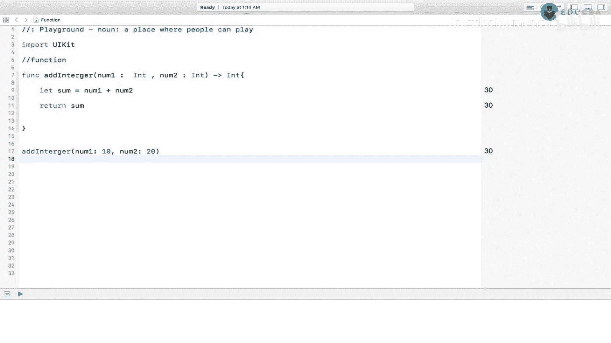
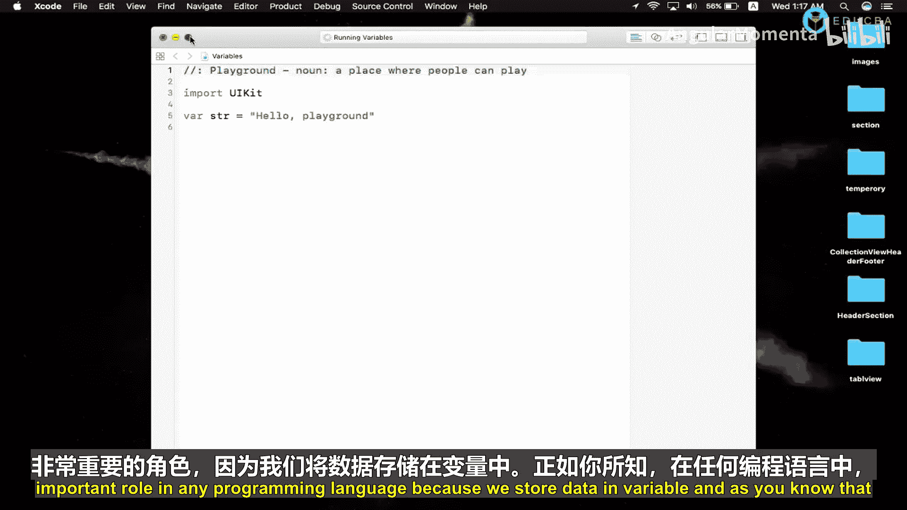
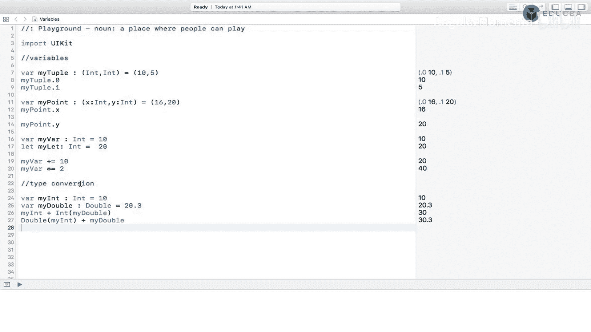
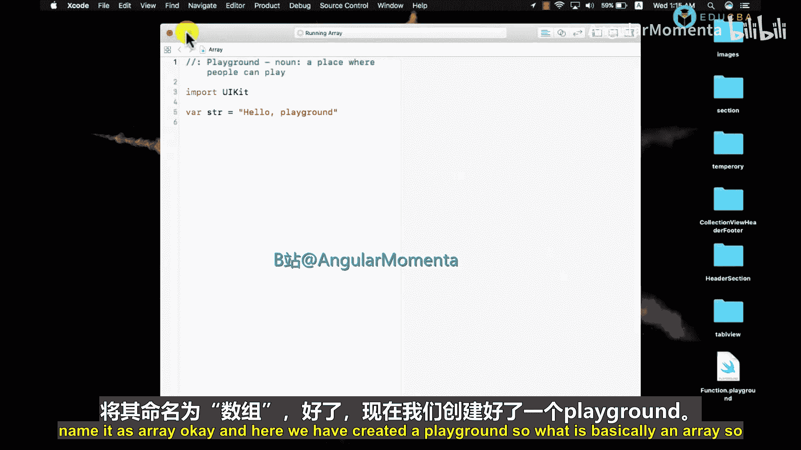
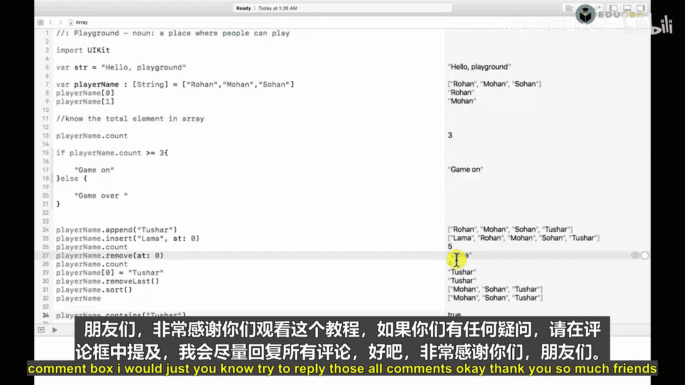
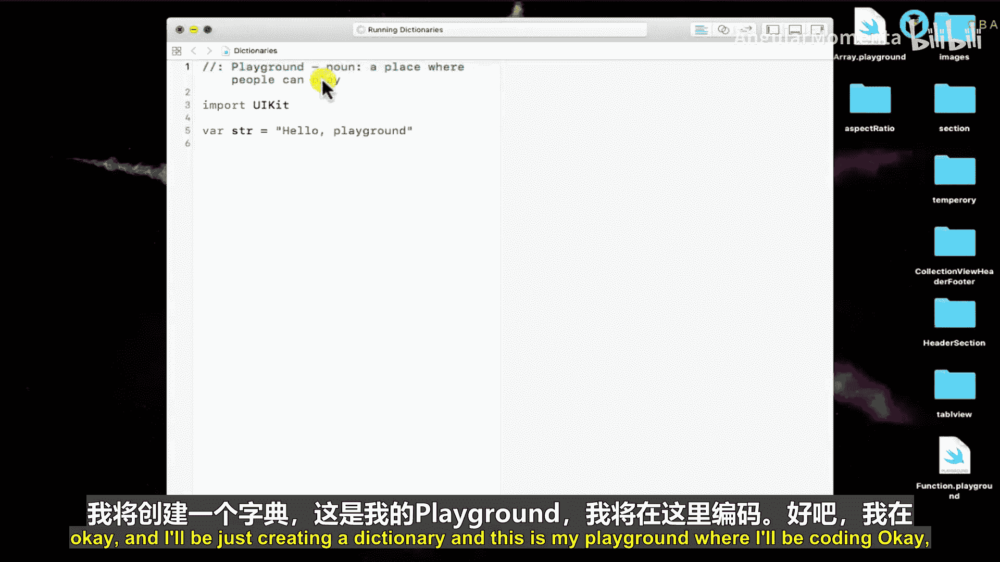
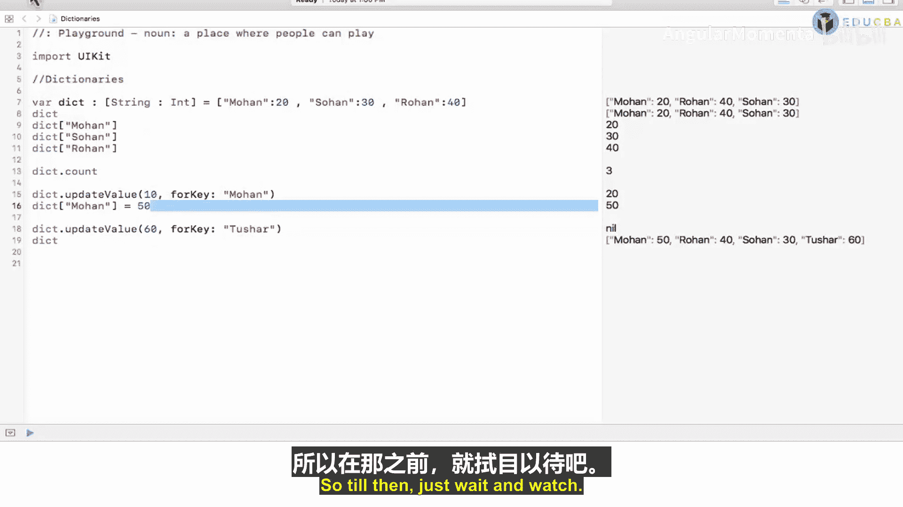
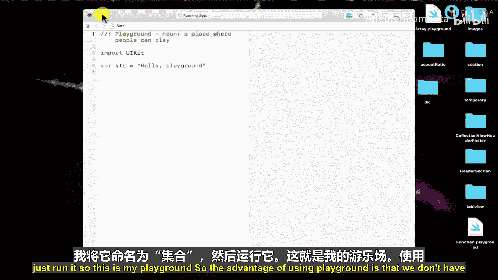
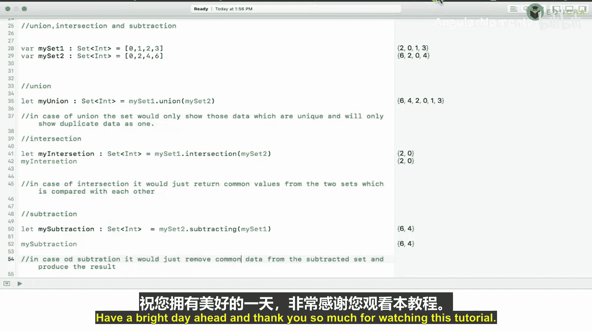

# 015：中级iOS开发教程

在本教程中，我们将学习Swift编程语言中的几个核心概念，包括函数、变量、数组、字典和集合。这些是构建iOS应用程序的基础。我们将从简单的概念开始，逐步深入到更复杂的数据结构。

## 章节1：函数

上一节我们介绍了教程的概述，本节中我们来看看Swift中的函数。函数是一段执行特定任务的代码块，可以接受输入参数并返回结果。

### 创建与调用函数

以下是创建一个简单函数的方法：

```swift
func greet() {
    print("Hello, World!")
}
greet() // 调用函数
```

### 带参数的函数



函数可以接受多个参数。以下是创建一个接受多个参数的函数的方法：

```swift
func details(name: String, age: Int, hobby: String, dream: String) {
    print("My name is \(name).")
    print("My age is \(age).")
    print("My hobby is \(hobby).")
    print("I want to become a \(dream).")
}
details(name: "John", age: 24, hobby: "coding", dream: "software engineer")
```



### 带返回值的函数

函数可以返回一个值。以下是创建一个返回整数的函数的方法：

```swift
func addIntegers(number1: Int, number2: Int) -> Int {
    let sum = number1 + number2
    return sum
}
let result = addIntegers(number1: 10, number2: 20)
print(result) // 输出 30
```

### 函数的作用域

变量的作用域决定了它在代码中的可访问性。在函数内部声明的变量只能在该函数内部访问。

```swift
func abc() {
    let myVariable = 24 // 此变量仅在函数内部可访问
}
// print(myVariable) // 这里会报错，因为myVariable在函数外部不可访问

let globalVariable = 24 // 此变量在全局范围内可访问
func xyz() {
    print(globalVariable) // 可以访问全局变量
}
xyz()
```

## 章节2：变量与数据类型

上一节我们介绍了函数，本节中我们来看看Swift中的变量和基本数据类型。变量用于存储数据，是编程的基础。

### 整数

整数用于存储没有小数点的数字。

```swift
var score: Int = 10
score += 5 // score 现在是 15
score -= 2 // score 现在是 13
score *= 2 // score 现在是 26
score /= 2 // score 现在是 13
```

### 双精度浮点数

双精度浮点数用于存储带小数点的数字，提供比单精度浮点数更精确的结果。

```swift
var myDouble: Double = 10.2
myDouble += 3.6 // myDouble 现在是 13.8
myDouble -= 3.6 // myDouble 现在是 10.2
myDouble *= 2.0 // myDouble 现在是 20.4
```

### 字符串

字符串是字符的集合，用于存储文本。

```swift
var myString: String = "Hello, "
let name: String = "Matt"
myString += name // myString 现在是 "Hello, Matt"
print(myString)
```

### 布尔值

布尔值表示真或假，用于逻辑判断。

```swift
var isTrue: Bool = true
var isFalse: Bool = false
```

### 元组

元组允许你将多个值组合成一个复合值。

```swift
var myTuple = (x: 16, y: 20)
print(myTuple.x) // 输出 16
print(myTuple.y) // 输出 20
```

### `let` 与 `var` 的区别

`let` 用于声明常量，其值不可改变；`var` 用于声明变量，其值可以改变。

```swift
let constantValue: Int = 20 // 常量，不可更改
var variableValue: Int = 10 // 变量，可以更改
variableValue = 30 // 正确
// constantValue = 40 // 错误：无法更改常量的值
```

### 类型转换

有时需要将一种数据类型转换为另一种。





```swift
var myInt: Int = 10
var myDoubleForConversion: Double = 20.3
// 将Double转换为Int
var sumInt = myInt + Int(myDoubleForConversion) // 结果是 30
// 将Int转换为Double
var sumDouble = Double(myInt) + myDoubleForConversion // 结果是 30.3
```

## 章节3：数组

上一节我们介绍了变量，本节中我们来看看Swift中的数组。数组是存储相同数据类型元素的有序集合。

### 创建与访问数组

以下是创建和访问数组的方法：

```swift
var playerNames: [String] = ["Rohan", "Mohan", "Sohan"]
print(playerNames[0]) // 输出 "Rohan"
print(playerNames[1]) // 输出 "Mohan"
```

### 数组的常用操作

数组提供了多种方法来操作其中的元素。

以下是数组的一些常用操作：

```swift
// 获取元素数量
print(playerNames.count)

// 添加元素
playerNames.append("Tushar")

// 在指定索引插入元素
playerNames.insert("Lama", at: 0)

// 移除指定索引的元素
playerNames.remove(at: 0)

// 移除第一个元素
playerNames.removeFirst()



// 移除最后一个元素
playerNames.removeLast()

// 排序
playerNames.sort()
print(playerNames)



// 检查是否包含某元素
print(playerNames.contains("Tushar")) // 输出 true 或 false
```

## 章节4：字典

上一节我们介绍了数组，本节中我们来看看Swift中的字典。字典以键值对的形式存储数据，允许你通过唯一的键来检索值。

### 创建与访问字典

以下是创建和访问字典的方法：

```swift
var dictionary: [String: Int] = ["Mohan": 20, "Sohan": 30, "Rohan": 40]
print(dictionary["Mohan"]) // 输出 20
```

### 字典的常用操作

字典提供了多种方法来操作键值对。

以下是字典的一些常用操作：

```swift
// 获取键值对数量
print(dictionary.count)

// 更新值
dictionary["Mohan"] = 50
// 或使用 updateValue 方法
dictionary.updateValue(60, forKey: "Tushar")



// 移除键值对
dictionary.removeValue(forKey: "Tushar")
```

## 章节5：集合



上一节我们介绍了字典，本节中我们来看看Swift中的集合。集合存储相同数据类型且无序、不重复的值。

### 创建与操作集合

以下是创建和操作集合的方法：

```swift
var mySet: Set<String> = ["Rohan", "Mohan", "Sohan"]
print(mySet) // 顺序可能不同

// 插入元素
mySet.insert("Tushar")
// 尝试插入重复元素
let inserted = mySet.insert("Rohan") // inserted 为 false

// 移除元素
mySet.remove("Tushar")

// 检查元素是否存在
print(mySet.contains("Mohan")) // 输出 true

// 获取元素数量
print(mySet.count)
```

### 集合的集合操作

集合支持并集、交集和差集等数学运算。

以下是集合的集合操作示例：

```swift
let set1: Set<Int> = [0, 1, 2, 3]
let set2: Set<Int> = [0, 2, 4, 6]

// 并集
let unionSet = set1.union(set2) // 结果: [0, 1, 2, 3, 4, 6] (顺序不定)

// 交集
let intersectionSet = set1.intersection(set2) // 结果: [0, 2] (顺序不定)

// 差集
let subtractingSet = set1.subtracting(set2) // 结果: [1, 3] (顺序不定)
```

## 总结



在本教程中，我们一起学习了Swift编程语言的几个核心特性。我们首先了解了如何定义和调用函数，包括带参数和返回值的函数，以及函数作用域的概念。接着，我们探讨了不同的变量类型：整数、双精度浮点数、字符串、布尔值和元组，并比较了`let`和`var`的区别，以及如何进行类型转换。然后，我们研究了三种重要的集合类型：数组用于有序存储相同类型的元素；字典用于通过键来存储和检索值；集合用于存储无序且唯一的元素，并支持并集、交集和差集操作。掌握这些基础知识是进行有效Swift和iOS开发的关键。