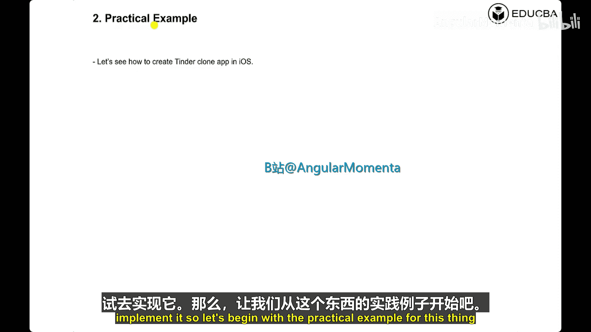
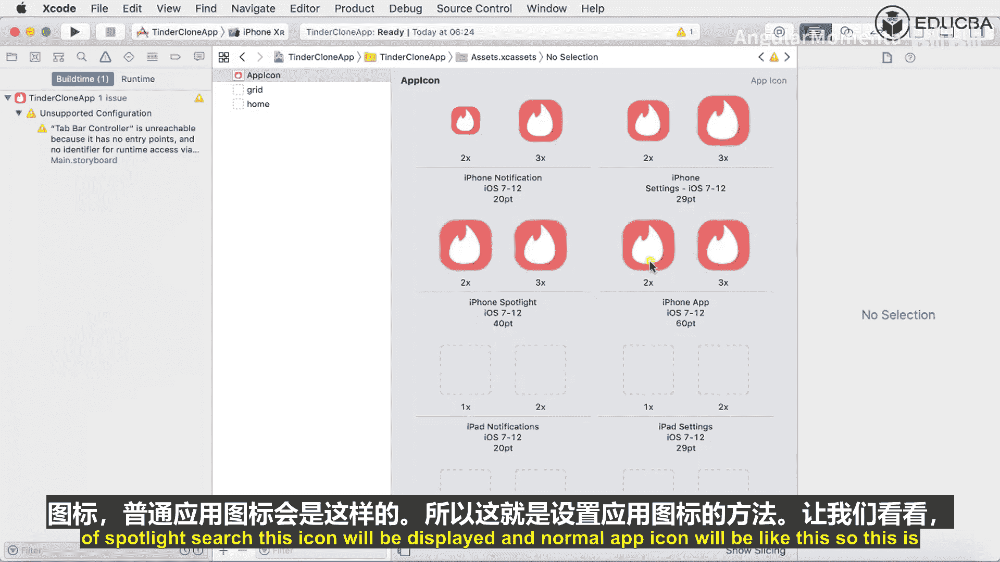
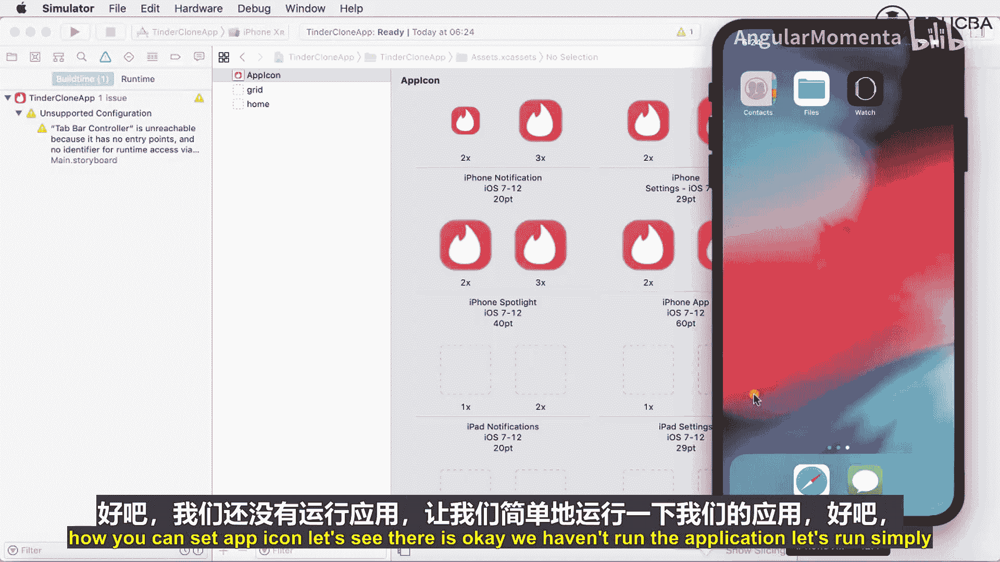
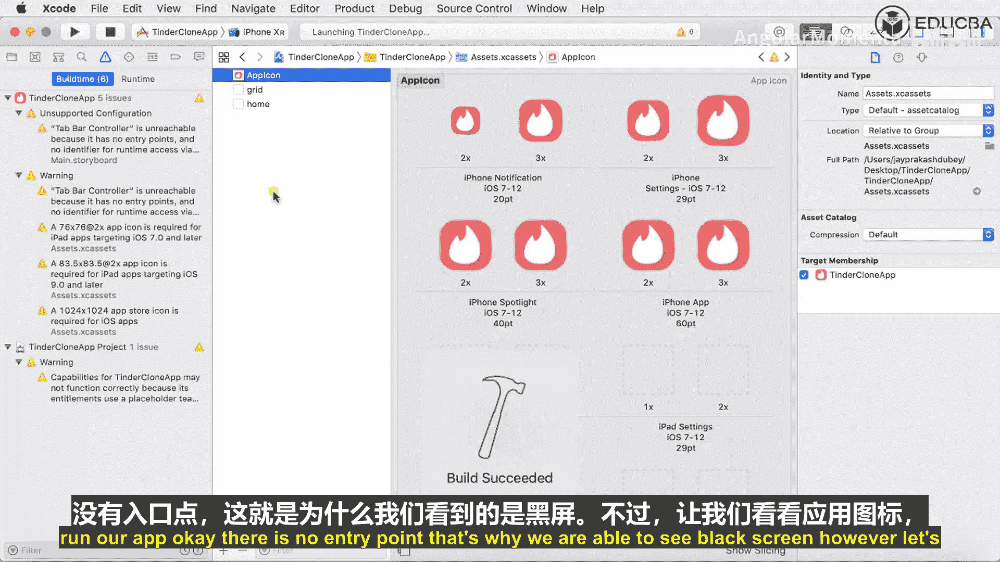
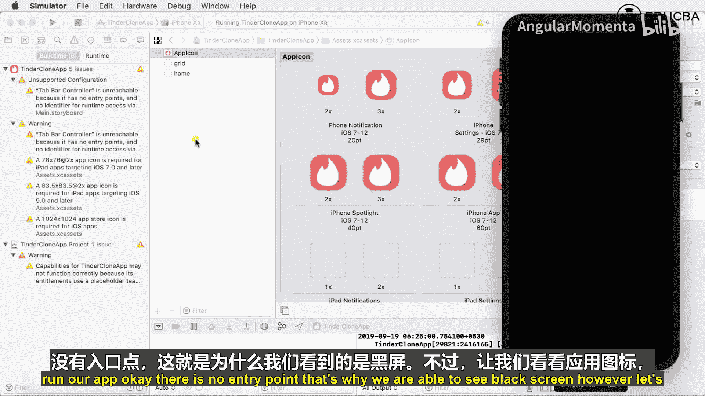
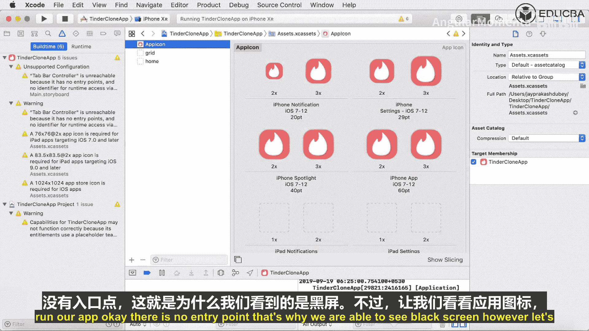
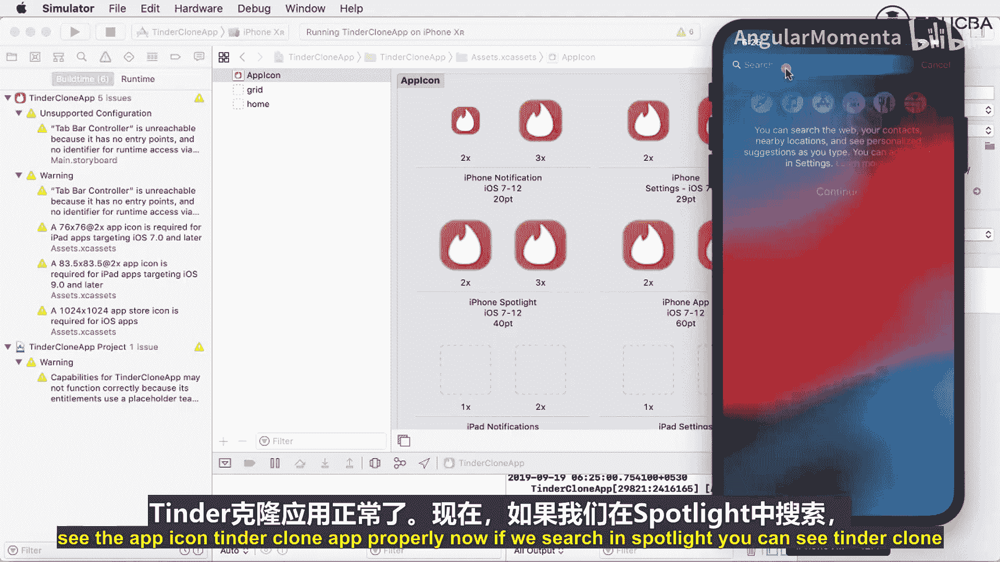
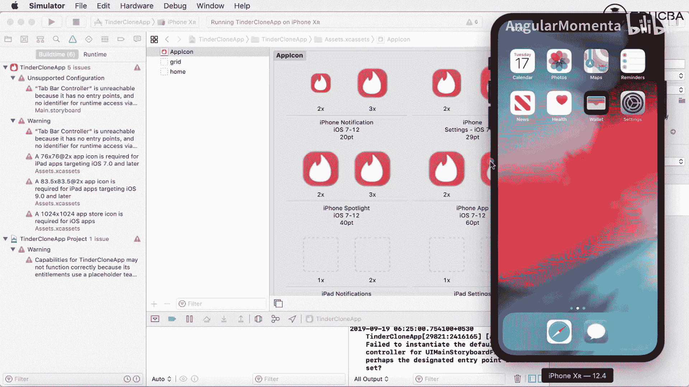
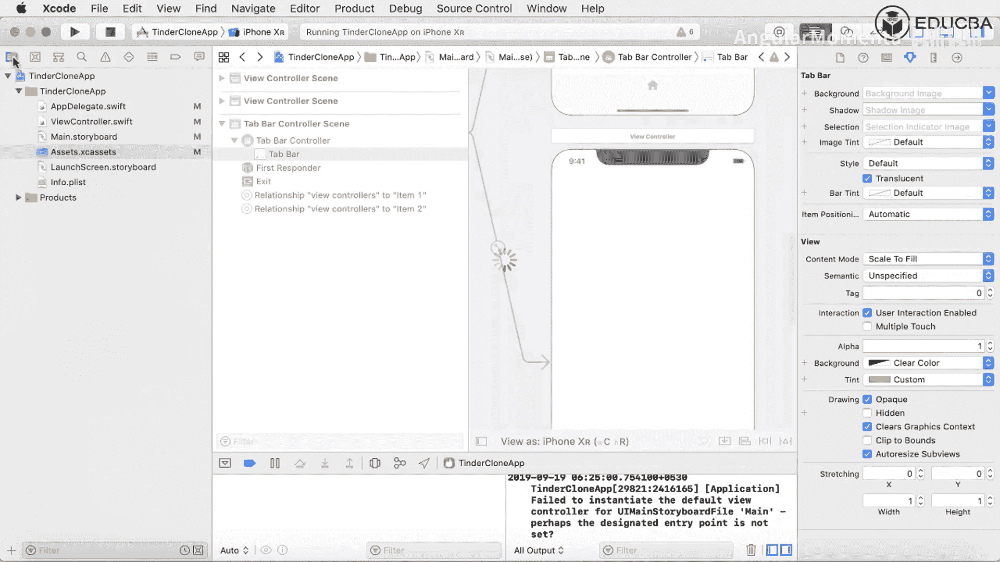

# 001：Tinder克隆应用入门 🚀

在本教程中，我们将学习如何使用Swift为iOS移动应用创建一个Tinder克隆应用。你将学习到视图控制器、委托、约束以及如何添加各种手势（如滑动、点击、平移、捏合）。本教程难度为中级，适合已经熟悉Swift基础概念、并对iOS应用开发感兴趣的学生。

## 概述

Tinder是一款基于地理位置社交搜索的移动应用和移动网页应用，主要用于约会和社交。它允许用户通过滑动操作来表达兴趣：向右滑动表示“喜欢”，向左滑动表示“不喜欢”。如果双方互相“喜欢”，则可以进一步聊天。我们将开发一个类似的应用，使用静态用户数据，实现卡片滑动功能。

## 开始实践

首先，打开Xcode 10.3，创建一个新项目。

以下是创建项目的步骤：
1.  点击“Create a new Xcode project”。
2.  选择“Single View Application”。
3.  点击“Next”。
4.  输入产品名称（例如：TinderCloneApp）和组织名称。
5.  组织标识符将用于生成唯一的Bundle ID，该ID用于在App Store上标识你的应用。
6.  选择语言为Swift。
7.  点击“Next”，选择项目保存位置。
8.  确保勾选“Create Git repository on my Mac”以在本地设置Git仓库。
9.  点击“Create”。

项目创建完成后，我们将开始设计界面。

## 设计故事板

首先，删除默认的视图控制器。我们需要一个标签栏控制器。

以下是设置标签栏控制器的步骤：
1.  从对象库中拖拽一个“Tab Bar Controller”到故事板。
2.  标签栏控制器需要至少关联两个视图控制器。
3.  选择第一个标签栏项目，在属性检查器中设置其标题和图片。
4.  我们需要为标签栏项目添加图片资源。进入Assets.xcassets，创建新的图片集，并添加1x、2x、3x尺寸的图片（例如：home, heart）。
5.  为两个标签栏项目分别设置图片和标题。
6.  可以调整标签栏的色调颜色以匹配Tinder的风格。

## 设置应用图标

应用图标需要多种尺寸以适应不同场景（如主屏幕、通知、设置、搜索）。

以下是添加应用图标的步骤：
1.  在Assets.xcassets中，找到“AppIcon”位置。
2.  根据每个槽位要求的尺寸（例如：40x40, 60x60, 83.5x83.5），拖拽对应尺寸的图片到相应位置。
3.  确保没有出现尺寸警告，这表示图标尺寸正确。
4.  这些图标将分别用于iPhone通知、设置、Spotlight搜索和主屏幕。

设置完成后，运行应用。虽然目前可能只显示黑屏（因为尚未设置入口点），但你可以在设备的Spotlight搜索中看到已设置的应用图标。

## 总结

本节课中，我们一起学习了Tinder克隆应用的入门知识。我们创建了新的Xcode项目，设置了标签栏控制器的基础界面，并配置了应用图标。下一节，我们将开始构建应用的主界面和卡片视图。