# 003：滑动动画

在本节课中，我们将学习如何为滑动卡片实现手势识别和动画效果。我们将编写平移手势和点击手势的处理函数，并集成一个强大的动画库来创建流畅的交互体验。

---

## 平移手势识别器

上一节我们介绍了视图的基本结构，本节中我们来看看如何响应用户的滑动操作。我们将首先编写平移手势识别器的处理函数。

```swift
// MARK: - Pan Gesture Recognizer
private func panGestureRecognizer(_ gestureRecognizer: UIPanGestureRecognizer) {
    let translation = gestureRecognizer.translation(in: self)
    switch gestureRecognizer.state {
        case .began:
            // 手势开始时的处理
        case .changed:
            // 手势变化时的处理
        case .ended:
            // 手势结束时的处理
        default:
            // 其他状态的处理
    }
}
```

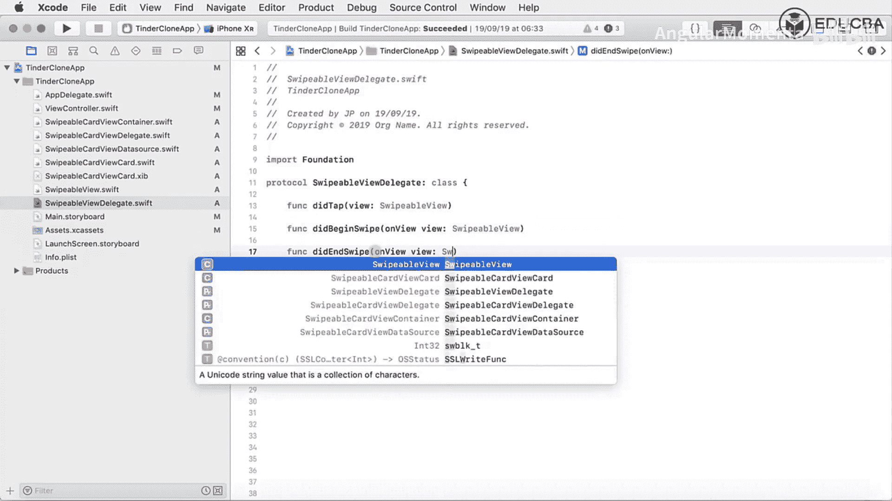

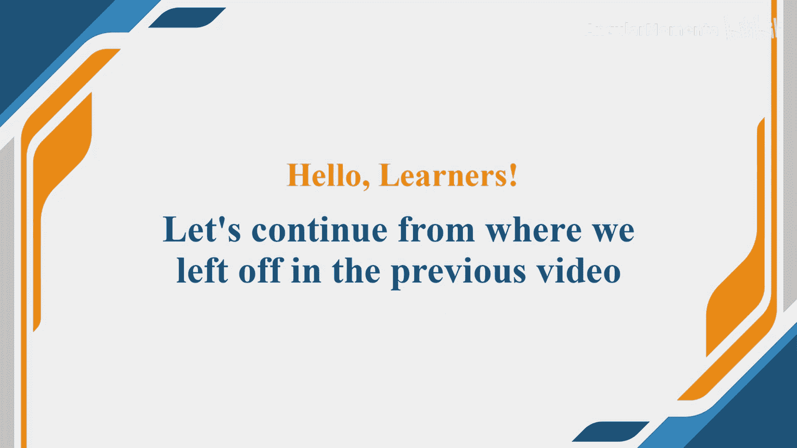

在`.began`状态下，我们需要获取用户触摸的初始点，并计算相关的锚点和位置信息，为后续的动画做准备。

以下是`.began`状态下需要执行的步骤：

*   `initialTouchPoint`：获取手势在视图中的初始位置。
*   `anchorPoint`：计算基于视图边界的归一化锚点。
*   `oldPosition`：计算图层基于旧锚点的位置。
*   `newPosition`：计算图层基于新锚点的位置。
*   将计算出的新锚点和新位置赋值给图层的`anchorPoint`和`position`属性。
*   设置`layer.shouldRasterize = true`以优化动画性能。
*   调用委托方法`didBeginSwipe(on:)`通知手势开始。

在`.changed`状态下，我们需要根据手指移动的距离来计算卡片的旋转和位移。

以下是`.changed`状态下的核心计算：

*   `rotationStrength`：根据横向移动距离与视图宽度的比例计算旋转强度，并限制在最大旋转值内。公式为：`min(translation.x / frame.width, SwipeableView.maxRotation)`
*   `rotationAngle`：根据动画方向和旋转强度计算最终的旋转角度。公式为：`SwipeableView.animationDirection.y * SwipeableView.rotationAngle * rotationStrength`
*   `transform`：创建一个3D变换，先应用旋转，再应用平移。代码为：
    ```swift
    var transform = CATransform3DIdentity
    transform = CATransform3DRotate(transform, rotationAngle, 0, 0, 1)
    transform = CATransform3DTranslate(transform, translation.x, translation.y, 0)
    layer.transform = transform
    ```

在`.ended`和`default`状态下，我们将`layer.shouldRasterize`设置为`false`，并计划实现动画的结束和重置逻辑。

`shouldRasterize`属性用于优化图层渲染。当设置为`true`时，图层会先被渲染成位图再合成，适合复杂动画；设置为`false`时，图层直接合成。

---

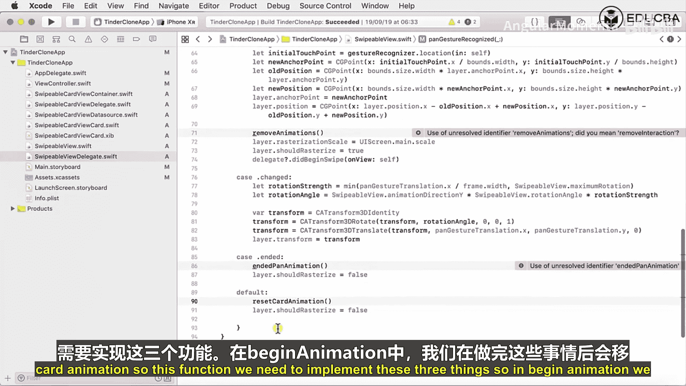

## 集成POP动画库

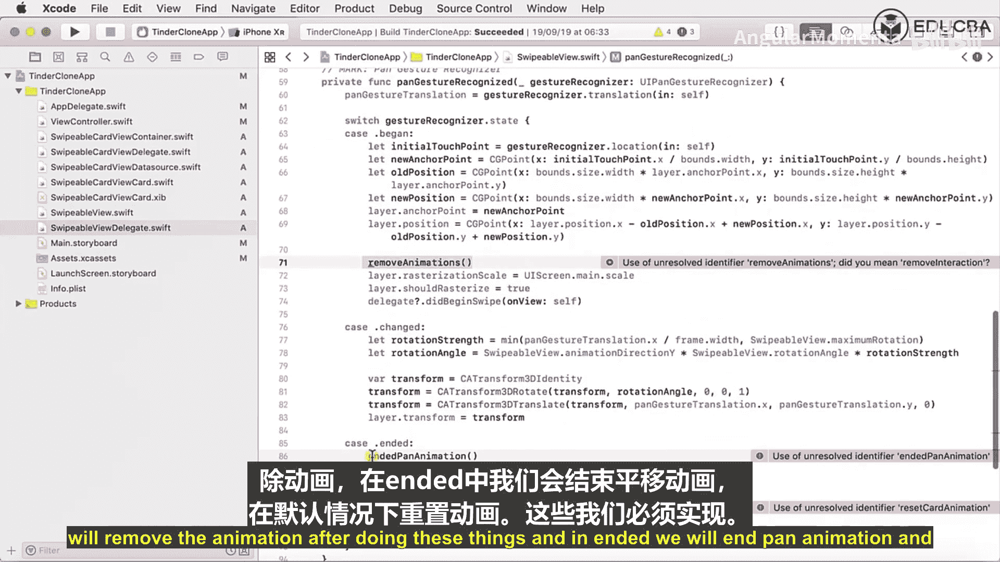

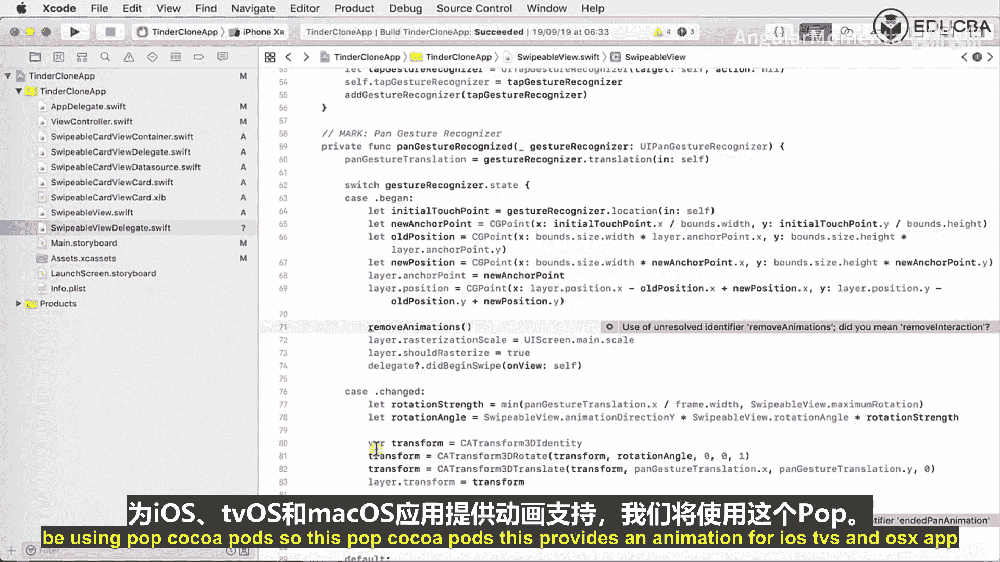

为了实现更自然、有弹性的滑动动画，我们将使用Facebook开源的POP动画库。许多知名应用如Instagram、Messenger都使用了这个库。

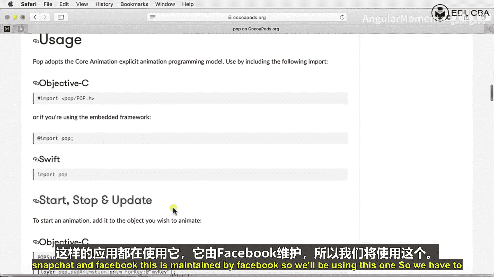

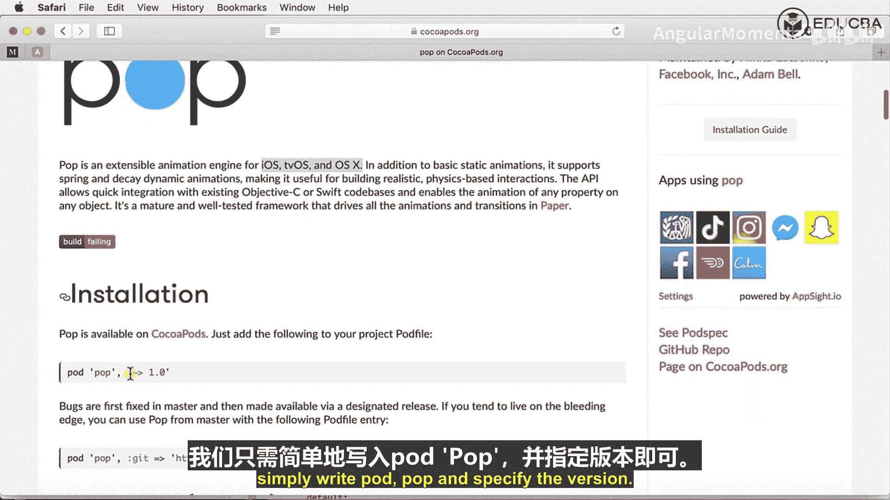

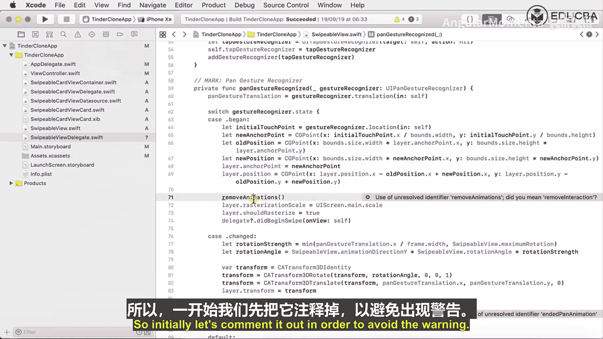

首先，我们需要通过CocoaPods将POP库集成到项目中。

以下是集成POP库的步骤：

1.  在终端中，使用`cd`命令导航到项目根目录。
2.  运行`pod init`命令创建`Podfile`文件。
3.  打开`Podfile`，添加`pod ‘pop’, ‘~> 1.0.1’`。
4.  运行`pod install`命令安装依赖库。
5.  安装完成后，关闭`.xcodeproj`文件，使用新生成的`.xcworkspace`文件打开项目。

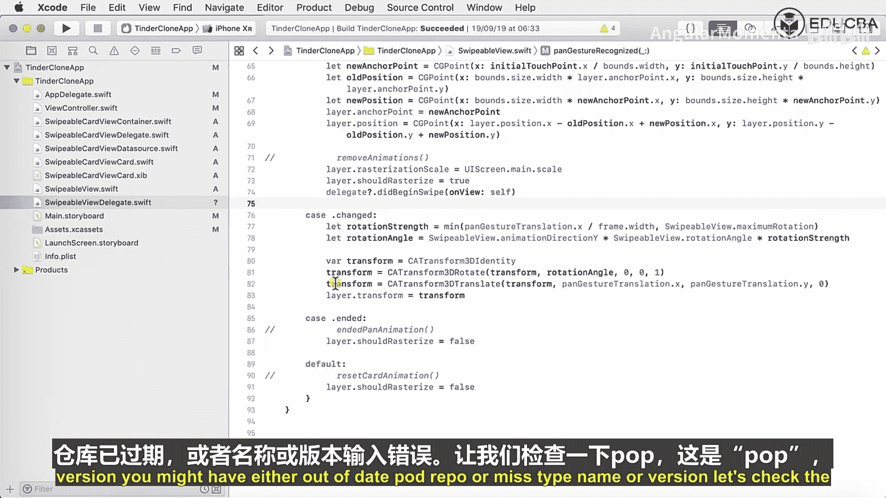

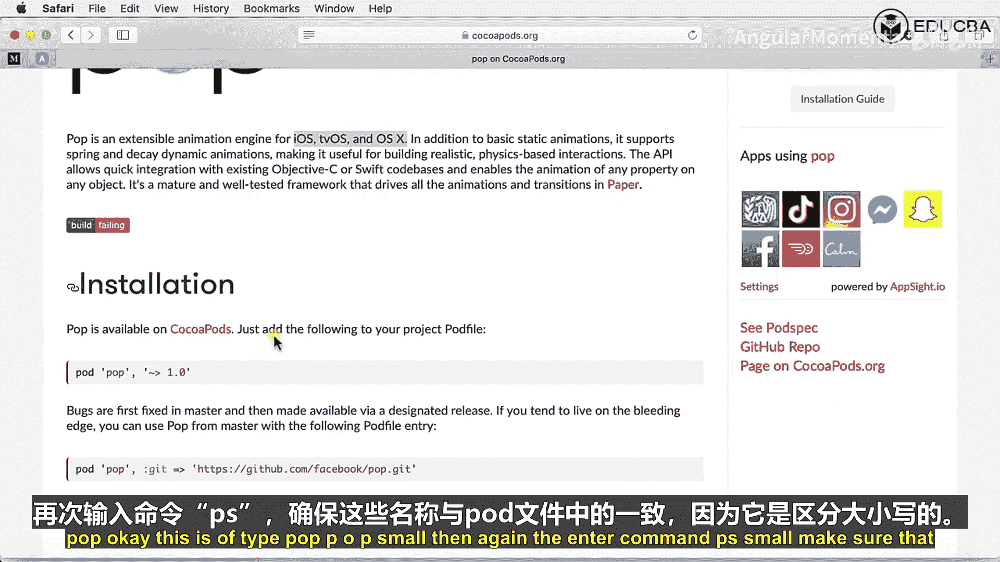

集成成功后，我们可以在代码中导入`POP`模块并使用它。

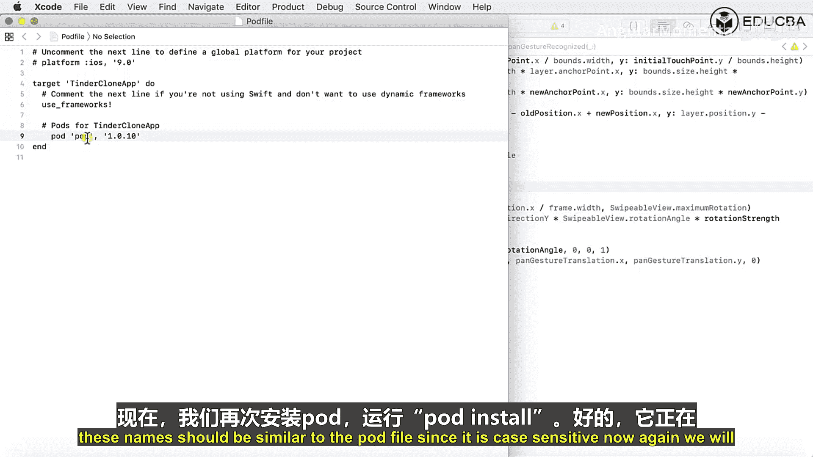

---

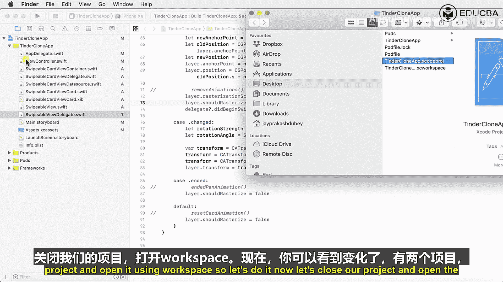

## 实现动画控制函数

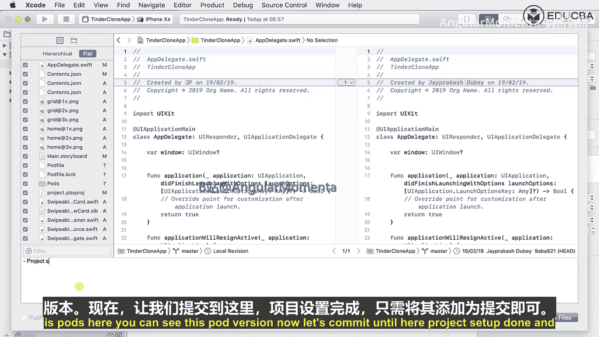

现在，我们来实现之前提到的三个动画控制函数：`beginAnimation`、`endedPanAnimation`和`resetAnimation`。

在`beginAnimation`函数中，我们需要移除图层上所有正在进行的POP动画。

```swift
private func beginAnimation() {
    layer.pop_removeAllAnimations()
}
```

在`endedPanAnimation`函数中，我们需要判断滑动的方向。为此，我们引入了一个`SwipeDirection`枚举文件和`CGPoint`的扩展工具类。

`SwipeDirection`枚举定义了所有可能的滑动方向（如左、右、上、下）。`CGPoint`扩展提供了一些几何计算方法。

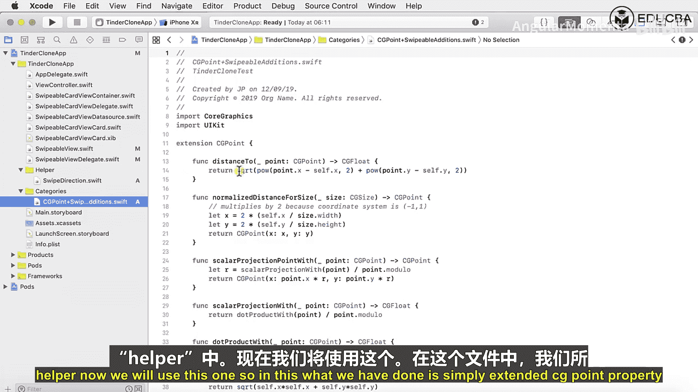

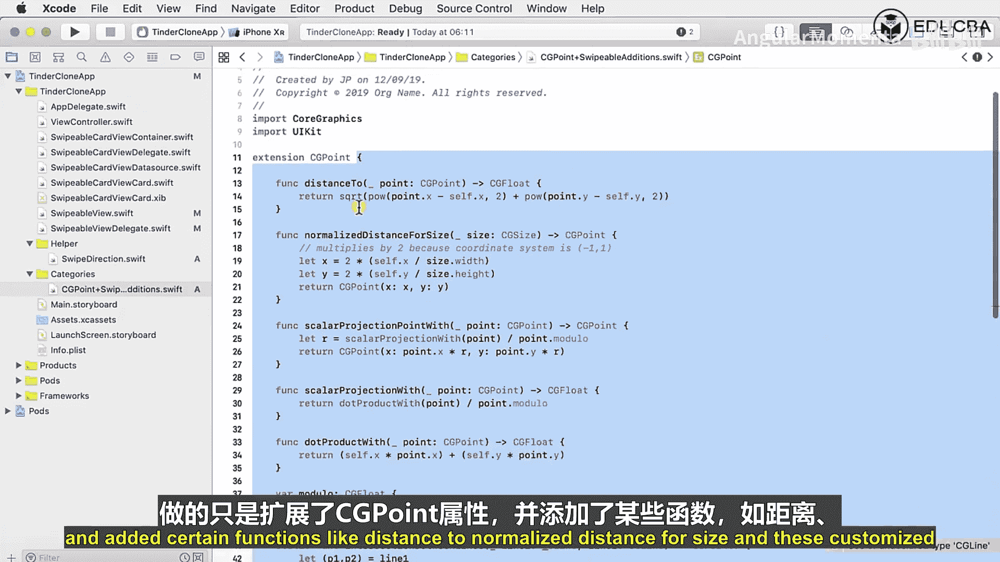

`endedPanAnimation`函数的核心是计算拖动方向。我们通过归一化的拖动距离，在所有可能的方向中找到距离最近的一个。

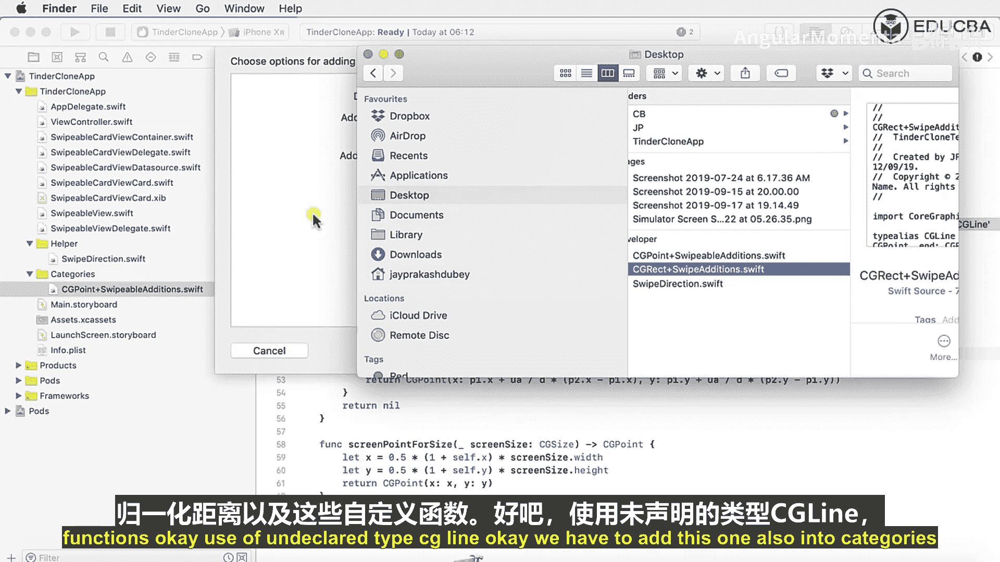

```swift
private func endedPanAnimation() {
    let normalizedDragPoint = panGestureTranslation.normalizedDistance(forSize: bounds.size)
    let dragDirection = SwipeDirection.allDirections.reduce((CGFloat.infinity, nil)) { closest, direction in
        let distance = direction.point.distance(to: normalizedDragPoint)
        return distance < closest.0 ? (distance, direction) : closest
    }.1
    // 后续将根据dragDirection执行相应动画
}
```

`dragPercentage`函数（将在后续实现）用于计算拖动进度百分比，这对于决定卡片是复位还是飞离屏幕至关重要。

---

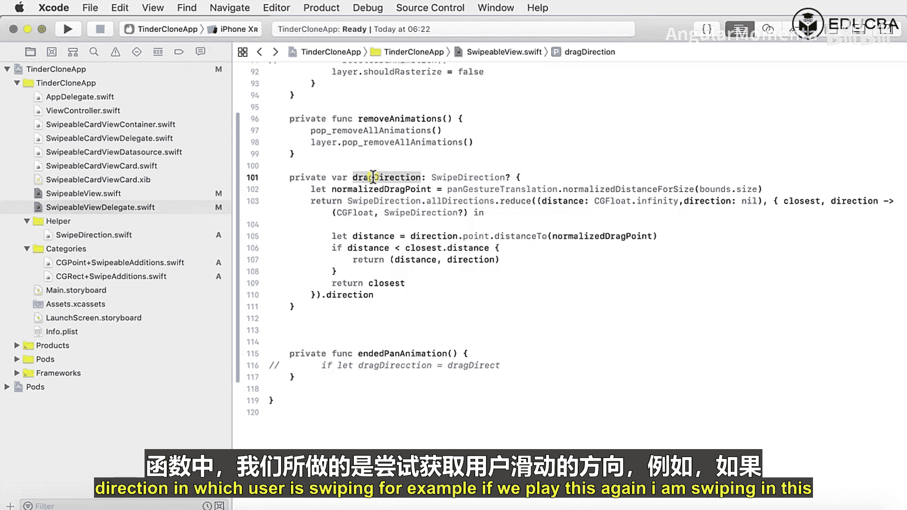

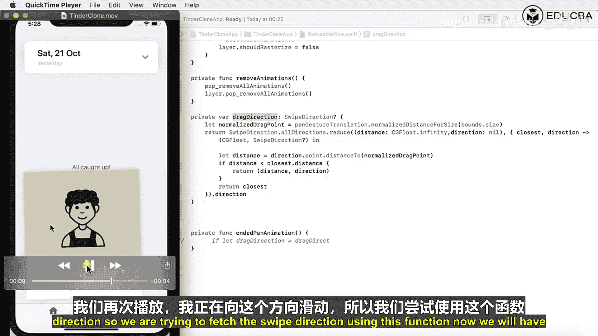

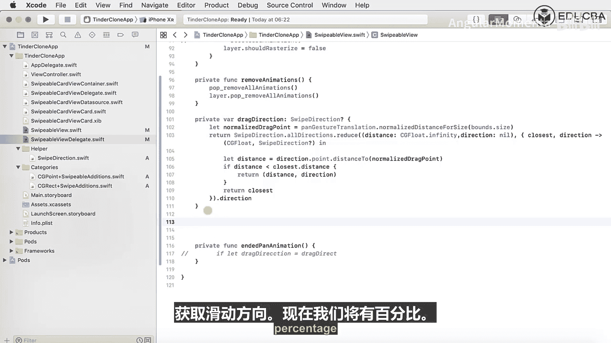

本节课中我们一起学习了滑动动画的核心实现。我们编写了平移手势识别器，在`began`、`changed`、`ended`不同状态下处理触摸事件，计算卡片的旋转和位移变换。我们还集成了POP动画库来增强效果，并实现了动画的开始与结束控制函数，为下一节实现卡片的最终滑动行为打下了基础。