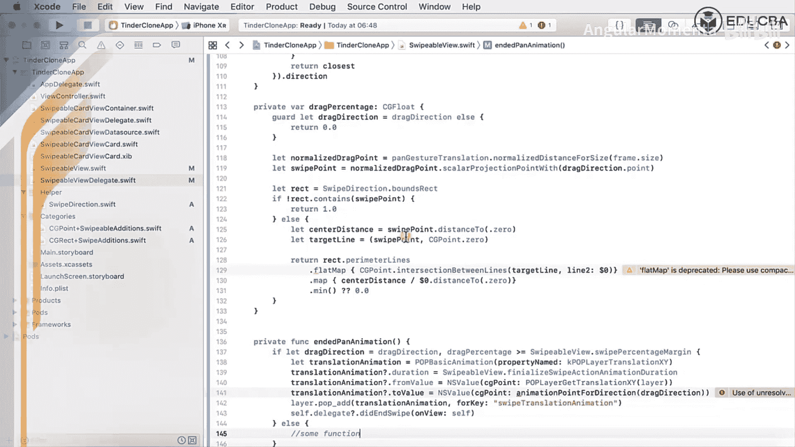
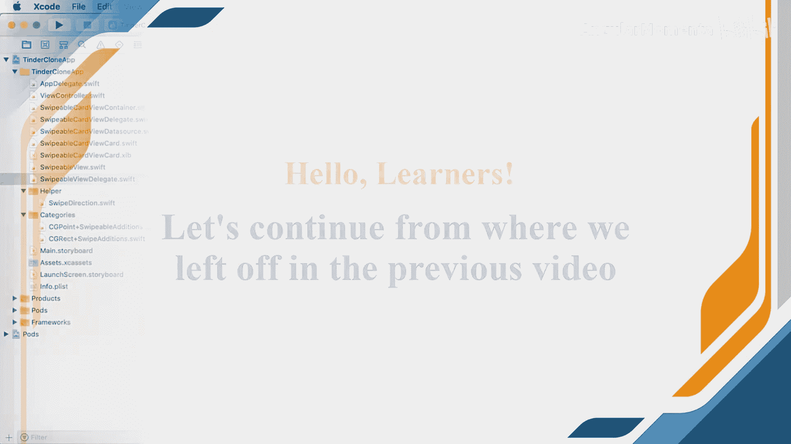
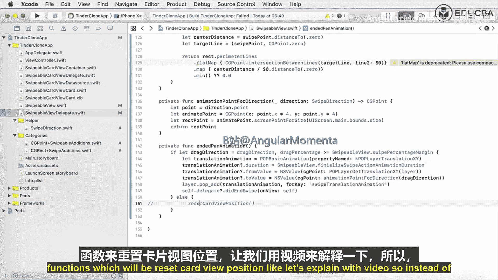
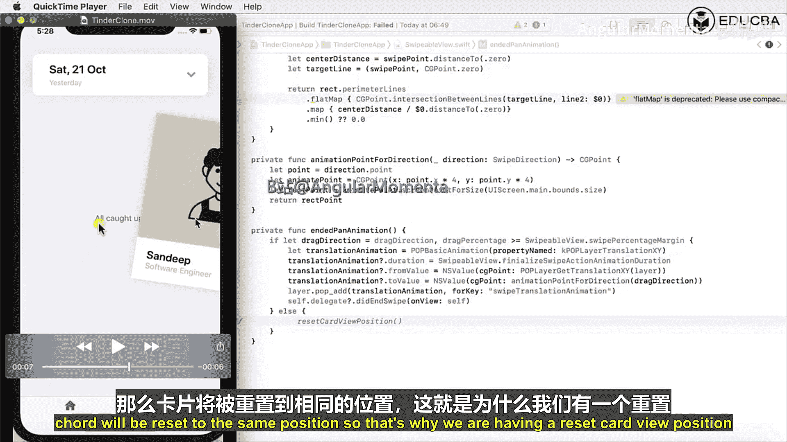
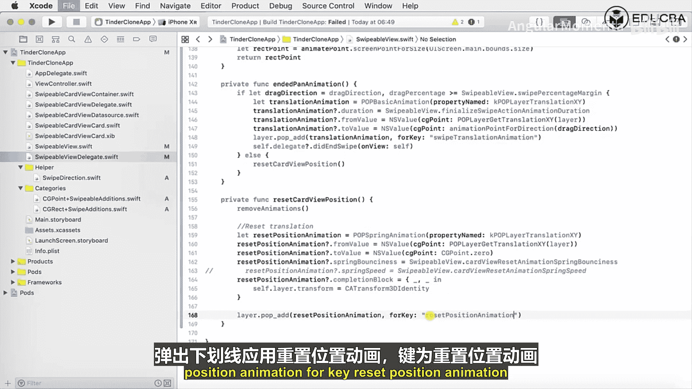
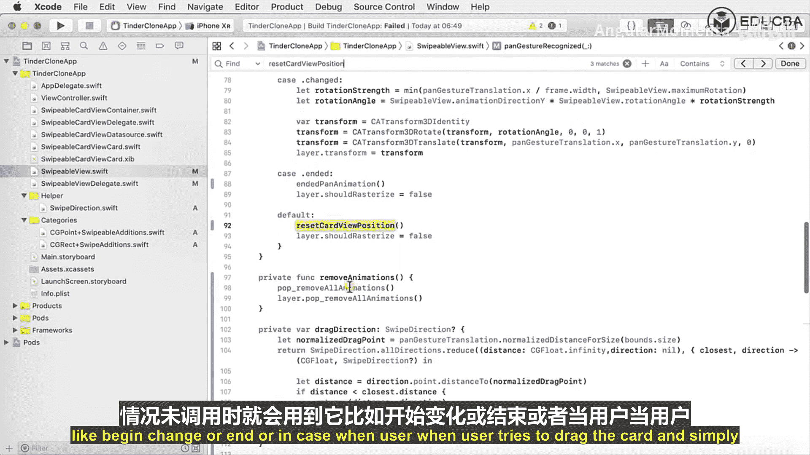

# 004：可滑动卡片模型

在本节课中，我们将学习如何实现一个可滑动卡片的交互模型。我们将重点编写计算拖拽方向、百分比以及处理卡片动画的核心逻辑，包括滑动确认后的动画和滑动中断后的复位动画。

---

## 计算拖拽方向与百分比

上一节我们介绍了手势识别的基础。本节中，我们来看看如何根据用户的手势计算拖拽的方向和距离百分比。

首先，我们定义两个私有计算属性。

```swift
private var dragDirection: SwipeDirection {
    // 此实例来自之前创建的SwipeDirection枚举
    // 如果无法确定方向，则返回0.0
    return .none
}

private var dragPercentage: CGFloat {
    // 初始化返回0.0
    return 0.0
}
```

接下来，我们实现 `dragPercentage` 的具体逻辑。

```swift
private var dragPercentage: CGFloat {
    // 1. 获取归一化的拖拽点
    let normalizedDragPoint = panGesture.translation(in: self).normalizedDistance(for: frame.size)
    // 2. 根据拖拽方向计算预测的滑动点
    let swipePoint = normalizedDragPoint.scalarProjection(with: direction.point)
    // 3. 定义有效区域
    let rect = SwipeDirection.boundsRect

    // 检查点是否在有效区域内
    if !rect.contains(swipePoint) {
        return 1.0
    }

    // 4. 计算中心点距离并求交点
    let centerDistance = swipePoint.distance(to: .zero)
    let targetLine = (swipePoint, CGPoint.zero)
    // 5. 计算与区域边界的交点，并最终得出百分比
    return rect.perimeterLines
        .flatMap { CGPoint.intersectionBetweenLines(targetLine, $0) }
        .map { centerDistance / $0.distance(to: .zero) }
        .min() ?? 0.0
}
```





**代码逻辑说明**：
1.  `normalizedDragPoint`: 获取相对于卡片自身尺寸归一化后的拖拽位移。
2.  `swipePoint`: 将拖拽位移投影到当前滑动方向上，得到一个预测的滑动向量点。
3.  检查这个预测点是否超出了预设的有效滑动区域（`boundsRect`）。如果超出，意味着滑动动作已足够完成，返回 `1.0`（即100%）。
4.  如果点在区域内，则计算该点到原点的距离，并构造一条从该点到原点的线段。
5.  计算这条线段与有效区域边界线的所有交点。百分比的计算公式为：**当前点距原点的距离 / 交点到原点的距离**。取所有计算结果中的最小值，确保百分比不会超过1.0。

这个属性用于精确量化用户拖拽卡片完成滑动的进度。

---

## 处理滑动结束的动画

在用户结束拖拽手势时，我们需要判断是执行完整的滑动动画，还是将卡片复位。

我们在 `handlePanEnded` 函数中调用以下逻辑：



```swift
private func endedPanAnimation() {
    // 获取拖拽方向和百分比
    let direction = dragDirection
    let percentage = dragPercentage

    // 判断是否达到滑动阈值
    if percentage >= SwipeableView.swipePercentMargin && direction != .none {
        // 执行滑动动画
        let translationAnimation = POPBasicAnimation(propertyNamed: kPOPLayerTranslationXY)
        translationAnimation.duration = SwipeableView.finalizeSwipeActionAnimationDuration
        translationAnimation.fromValue = NSValue(cgPoint: popLayer.translationXY)
        translationAnimation.toValue = NSValue(cgPoint: animationPoint(for: direction))
        popLayer.pop_add(translationAnimation, forKey: "swipeTranslationAnimation")

        // 通知代理滑动已完成
        delegate?.didSwipe(on: self, with: direction)
    } else {
        // 未达到阈值，复位卡片
        resetCardViewPosition()
    }
}
```



**核心判断条件**：`percentage >= SwipeableView.swipePercentMargin && direction != .none`
这个条件检查拖拽百分比是否达到预设的阈值（例如30%），并且拖拽方向是否有效。如果两者都满足，则触发滑动动画并通知代理；否则，调用复位函数。

其中，`animationPoint(for:)` 函数用于计算卡片最终应该滑动到的屏幕位置。

```swift
private func animationPoint(for direction: SwipeDirection) -> CGPoint {
    let point = direction.point
    // 将方向向量放大，确保卡片移出屏幕
    let animatePoint = CGPoint(x: point.x * 4, y: point.y * 4)
    // 将点坐标转换为屏幕坐标系下的点
    let screenPoint = animatePoint.screenPoint(for: UIScreen.main.bounds.size)
    return screenPoint
}
```

---

## 实现卡片复位功能



如果用户的拖拽未达到滑动阈值，我们需要让卡片平滑地回到初始位置。


以下是复位卡片位置和旋转状态的函数：

```swift
private func resetCardViewPosition() {
    // 1. 移除所有现有动画
    popLayer.pop_removeAllAnimations()

    // 2. 复位位置（使用弹性动画）
    let resetPositionAnimation = POPSpringAnimation(propertyNamed: kPOPLayerTranslationXY)
    resetPositionAnimation.fromValue = NSValue(cgPoint: popLayer.translationXY)
    resetPositionAnimation.toValue = NSValue(cgPoint: .zero)
    resetPositionAnimation.springBounciness = SwipeableView.cardViewResetSpringBounciness
    resetPositionAnimation.springSpeed = SwipeableView.cardViewResetSpringSpeed
    resetPositionAnimation.completionBlock = { _, _ in
        self.popLayer.transform = CATransform3DIdentity
    }
    popLayer.pop_add(resetPositionAnimation, forKey: "resetPositionAnimation")

    // 3. 复位旋转
    let resetRotationAnimation = POPBasicAnimation(propertyNamed: kPOPLayerRotation)
    resetRotationAnimation.fromValue = popLayer.getRotationZ()
    resetRotationAnimation.toValue = 0.0
    resetRotationAnimation.duration = SwipeableView.animationDuration
    popLayer.pop_add(resetRotationAnimation, forKey: "resetRotationAnimation")
}
```

**复位过程分解**：
1.  **清理动画**：首先移除图层上所有正在进行的POP动画，防止冲突。
2.  **复位平移**：创建一个`POPSpringAnimation`弹性动画，将卡片的平移值从当前位置（`translationXY`）动画变化到原点（`.zero`）。我们通过`springBounciness`和`springSpeed`属性来调整弹性效果。动画完成后，将图层的变换重置为单位矩阵。
3.  **复位旋转**：同时创建一个`POPBasicAnimation`基础动画，将卡片的Z轴旋转值复位到0。这确保了卡片在回到中心的同时也摆正了角度。

这个功能模拟了现实世界中，轻轻拨动卡片后它弹回原处的效果。

---

## 总结

本节课中我们一起学习了可滑动卡片模型的核心实现。

1.  **计算交互状态**：我们实现了 `dragDirection` 和 `dragPercentage` 属性，用于实时计算用户拖拽的方向和进度百分比。
2.  **处理滑动完成**：在 `endedPanAnimation` 方法中，我们根据百分比和方向判断是否触发完整滑动。如果触发，则执行移出屏幕的动画并通知代理。
3.  **处理滑动取消**：如果拖拽未达到阈值，则调用 `resetCardViewPosition` 方法。该方法使用弹性动画和基础动画，将卡片的位置和旋转状态平滑地复位到初始值。



通过这三部分逻辑，我们构建了一个响应灵敏、体验流畅的卡片滑动交互模型。下一节，我们将把这些卡片集成到主视图控制器中。