# 005：卡片堆栈管理 🃏

在本节课中，我们将学习如何为卡片视图添加手势识别器的动作，并创建一个可滑动的示例卡片。我们将从添加手势动作开始，然后详细设计并实现一个包含图片、标签和按钮的卡片视图。

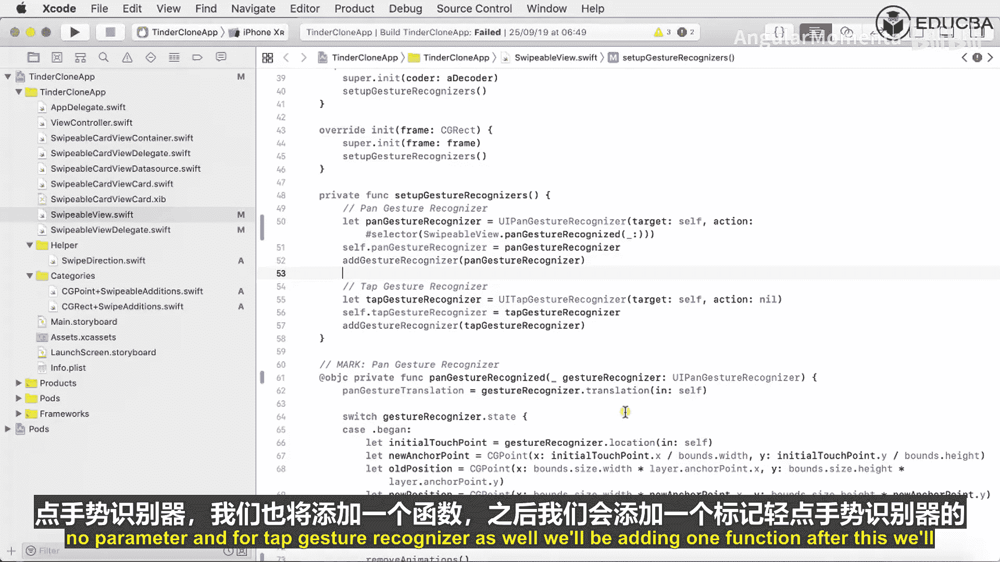

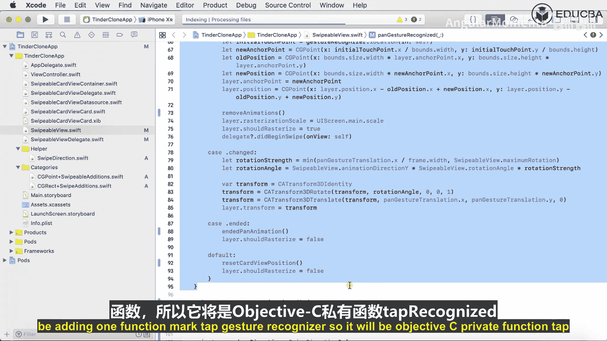

---

## 为手势识别器添加动作

上一节我们介绍了如何添加手势识别器，本节中我们来看看如何为它们关联具体的动作函数。

我们有两个手势识别器需要处理：**UIPanGestureRecognizer**（滑动手势）和**UITapGestureRecognizer**（点击手势）。我们已经添加了滑动手势识别器，现在需要为两者创建对应的动作函数。

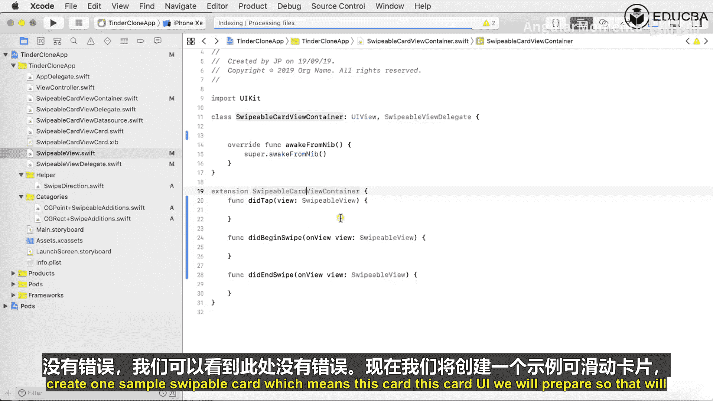

以下是需要添加的动作函数：

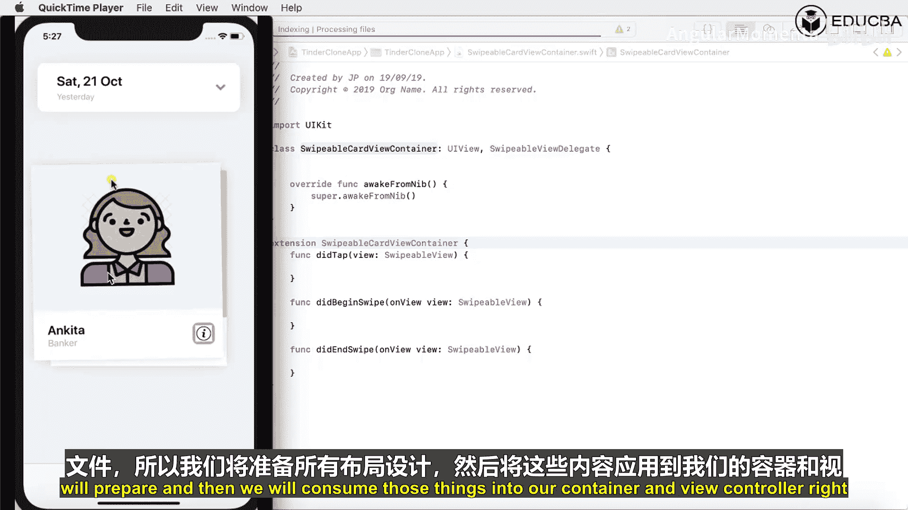

```swift
@objc private func handlePanGesture(_ recognizer: UIPanGestureRecognizer) {
    // 处理滑动手势的逻辑
}

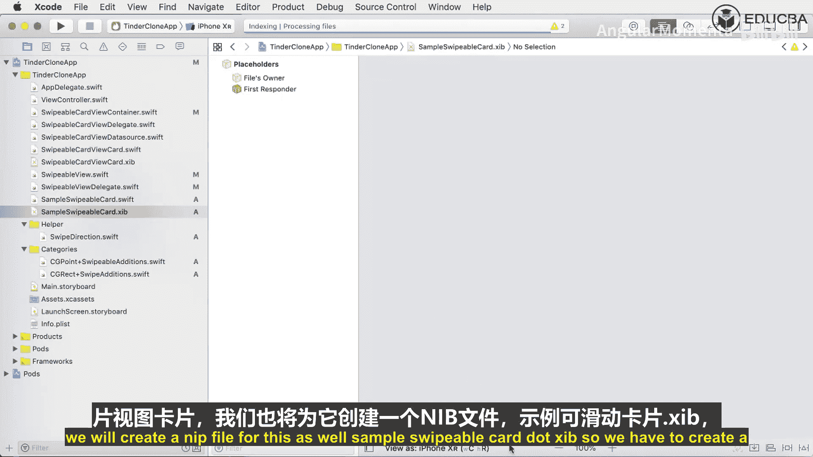

@objc private func handleTapGesture(_ recognizer: UITapGestureRecognizer) {
    // 处理点击手势的逻辑
}
```

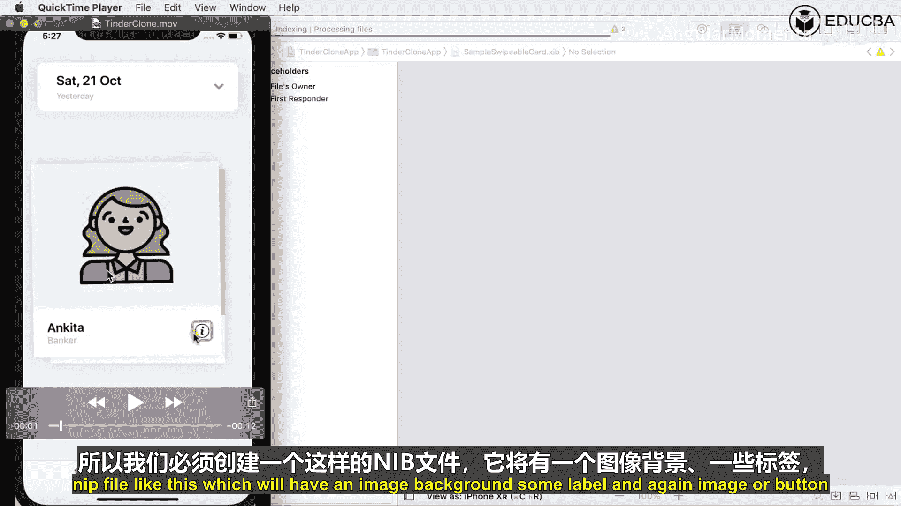

这些函数被标记为 `@objc`，以便它们可以在 Objective-C 的运行时中被识别和调用，这对于手势识别器的 `#selector` 语法是必需的。

我们将滑动手势的动作关联到 `handlePanGesture` 函数，点击手势的动作关联到 `handleTapGesture` 函数。

在关联过程中，如果遇到“未解析的标识符”错误，例如 `animationPointForDirection`，请确保相关函数已正确定义。清理项目并重新构建通常可以解决此类问题。

构建时可能会遇到协议一致性错误，例如“SwipeableContainerView does not conform to SwiperDelegate”。这通常意味着需要调整函数签名以符合协议要求。修正后再次构建，直到没有错误。

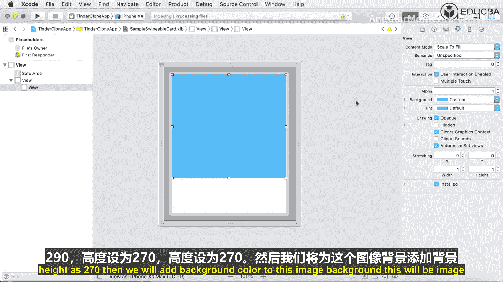

---

## 创建示例卡片视图

手势动作设置完成后，我们现在来创建一个具体的、可滑动的卡片视图。这个卡片将拥有自己的界面布局和对应的代码文件。

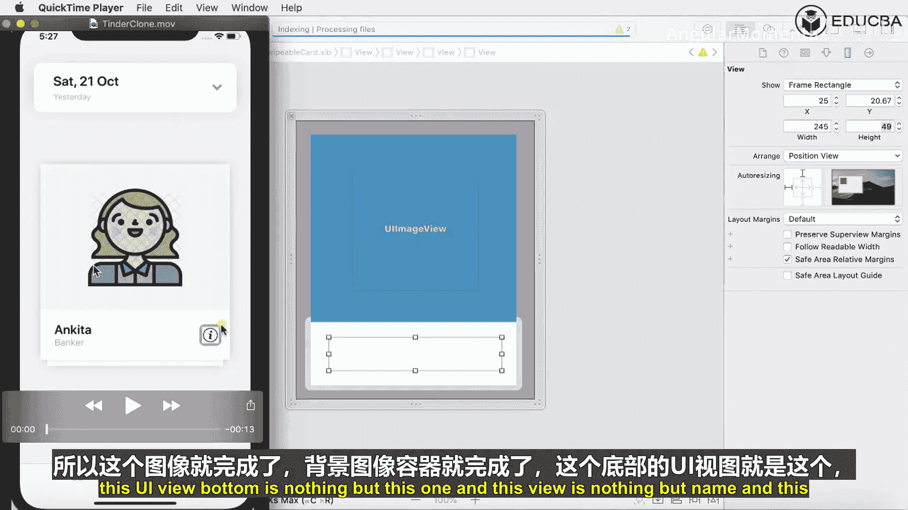

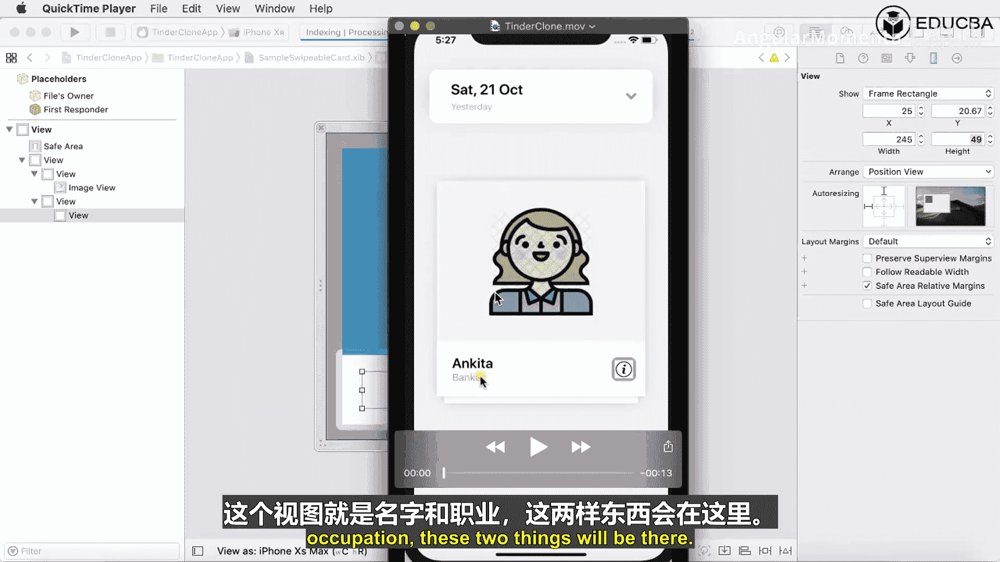

我们将创建一个名为 `SampleSwipeableCard` 的类，它继承自我们基础的可滑动卡片类。同时，我们还会为它创建一个 `.xib` 文件来设计界面。

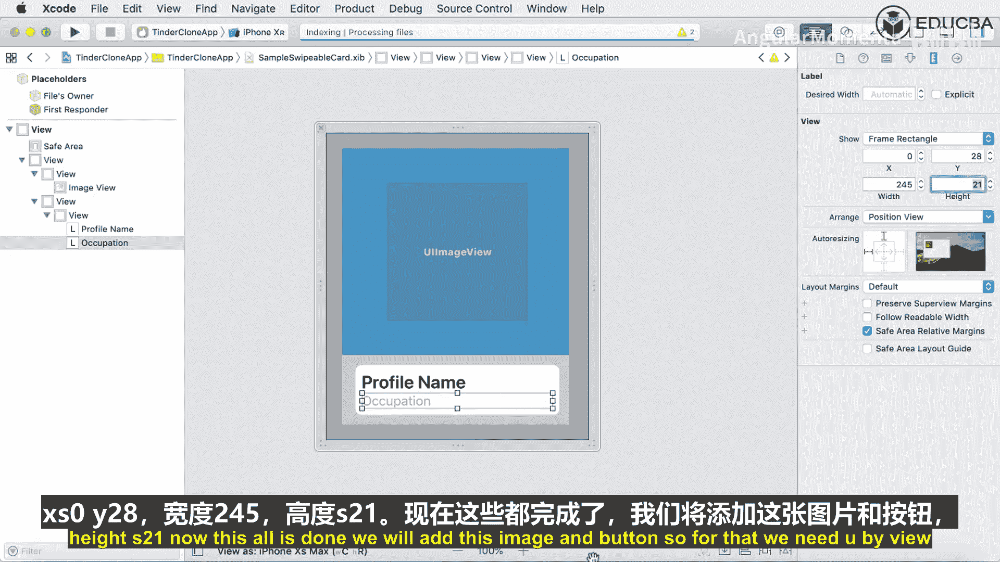

以下是创建步骤：
1.  新建一个 Swift 文件，定义 `SampleSwipeableCard` 类。
2.  新建一个 User Interface 文件，选择“View”模板，将其命名为 `SampleSwipeableCard.xib`。

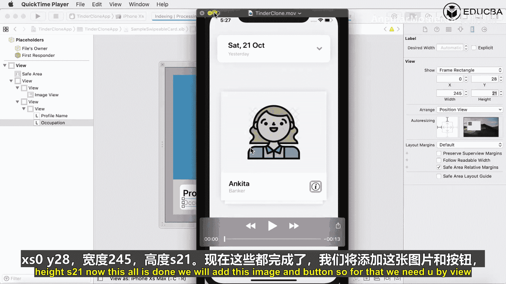

---

## 设计卡片界面

现在，我们在 `.xib` 文件中设计卡片的视觉布局。卡片将包含以下元素：
*   一个作为背景的容器视图。
*   一个用于显示用户照片的图片视图。
*   一个显示姓名和职业信息的区域。
*   一个添加好友的按钮。

具体操作如下：
1.  在 `.xib` 中，拖入一个 **UIView** 作为根视图。
2.  进入“Size Inspector”，将尺寸模拟设置为“Freeform”，并调整宽高为 `335 x 400`。
3.  确保为该视图启用自动布局约束（Auto Layout）。
4.  在根视图中，依次拖入并排列各个子视图（背景容器、图片容器、信息容器、按钮等）。
5.  为所有视图添加恰当的约束，确保它们在不同设备尺寸上都能正确显示。

添加约束时需注意：
*   使用“Add New Constraints”按钮为视图添加边距、宽度或高度约束。
*   使用“Ctrl + 拖拽”的方式快速添加居中对齐等约束。
*   如果出现约束冲突（红色警告），需检查并移除重复或不必要的约束。

---

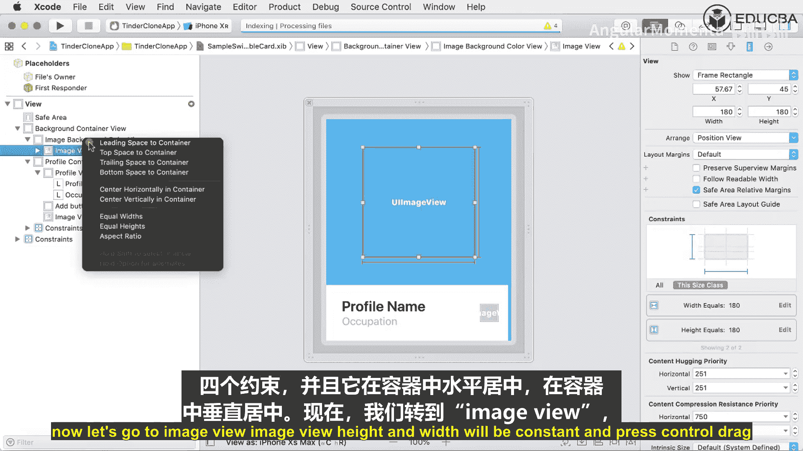

## 连接界面与代码

界面设计好后，需要将 `.xib` 中的界面元素与 `SampleSwipeableCard.swift` 文件中的代码进行关联。

操作步骤如下：
1.  在 Xcode 中同时打开 `.xib` 文件和对应的 `.swift` 文件。
2.  在 `.xib` 文件中，点击“File‘s Owner”，在“Identity Inspector”中将其类设置为 `SampleSwipeableCard`。
3.  使用“Ctrl + 拖拽”的方式，将界面上的元素（如 UILabel、UIButton、UIImageView）拖拽到 `.swift` 文件中，以创建 **@IBOutlet** 连接。

需要创建的 outlet 包括：
*   `titleLabel`：用于显示姓名。
*   `subtitleLabel`：用于显示职业。
*   `addButton`：添加按钮。
*   `imageBackgroundContainerView`：图片背景容器。
*   `imageView`：用户头像图片视图。

确保所有 outlet 都正确连接，没有出现警告图标。

---

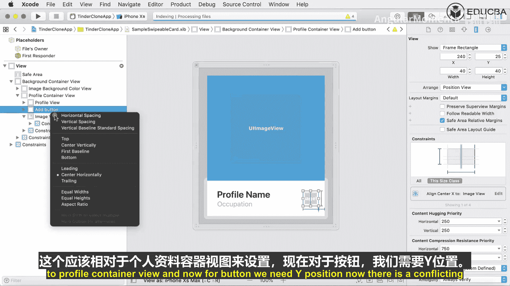

## 准备卡片数据模型

为了动态显示卡片内容，我们需要一个数据模型。这个模型将定义卡片所需的数据结构。

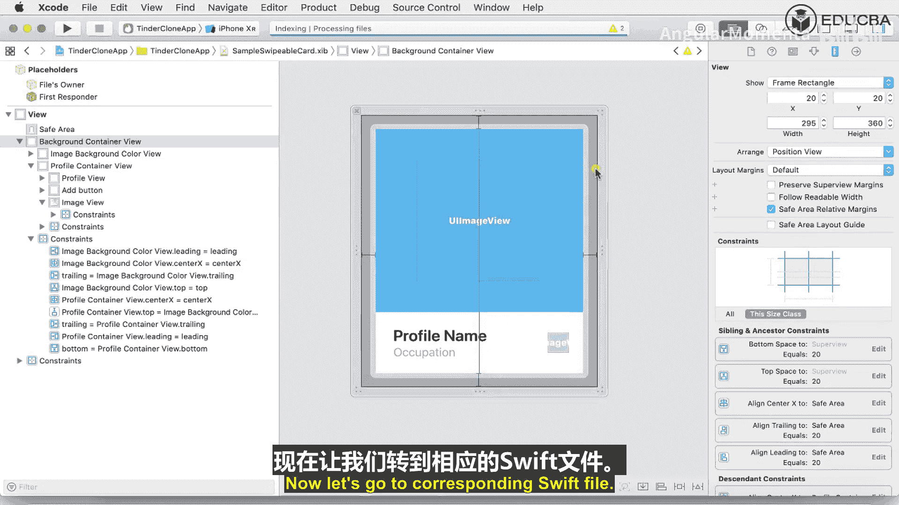

我们创建一个名为 `SampleSwipeableCardViewModel` 的新文件。该模型通常包含以下属性：
*   `title`：姓名（String）。
*   `subtitle`：职业（String）。
*   `color`：背景色（UIColor）。
*   `imageName`：图片名称（String）。

模型的定义类似于：
```swift
struct SampleSwipeableCardViewModel {
    let title: String
    let subtitle: String
    let color: UIColor
    let imageName: String
}
```

之后，我们可以在 `SampleSwipeableCard` 类中添加一个配置方法，用于接收 `ViewModel` 并更新界面：
```swift
func configure(with viewModel: SampleSwipeableCardViewModel) {
    titleLabel.text = viewModel.title
    subtitleLabel.text = viewModel.subtitle
    backgroundContainerView.backgroundColor = viewModel.color
    imageView.image = UIImage(named: viewModel.imageName)
}
```

---

## 集成到容器中

最后，我们需要将这个创建好的 `SampleSwipeableCard` 实例添加到主视图控制器中的卡片堆栈容器里。

在主视图控制器的代码中（例如 `viewDidLoad` 方法中）：
1.  实例化 `SampleSwipeableCard`（通常从 `.xib` 加载）。
2.  创建一个对应的 `SampleSwipeableCardViewModel` 数据对象。
3.  调用卡片的 `configure(with:)` 方法传入数据。
4.  将卡片添加到负责管理堆栈和滑动的容器视图中。

这样，一个完整的、带有数据和交互功能的可滑动卡片就集成到了我们的应用中。

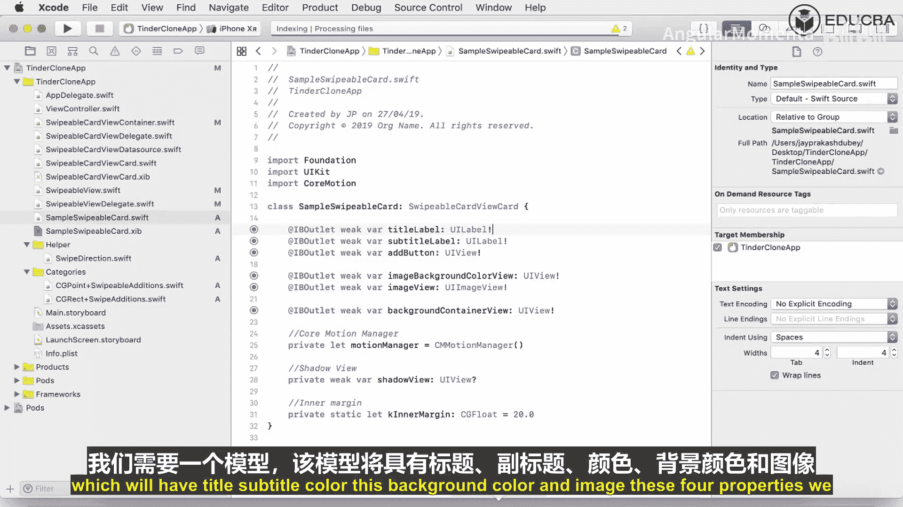

---

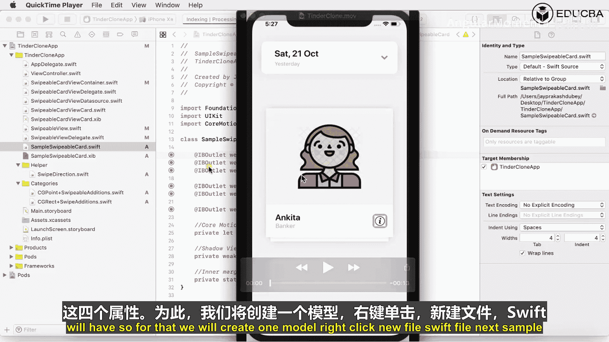

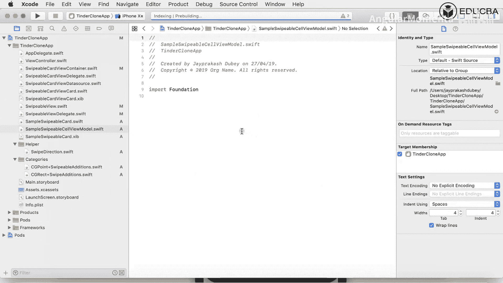

本节课中我们一起学习了如何为手势识别器添加动作、设计并实现一个复杂的卡片视图、连接界面与代码、创建数据模型，以及最终将卡片集成到应用的主流程中。这些步骤是构建滑动匹配应用核心交互界面的基础。