# 006：自定义可滑动单元格结构 🏗️

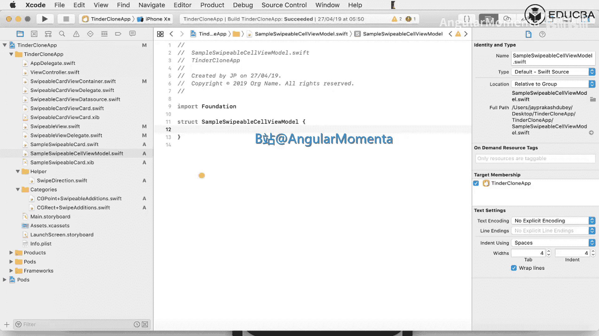

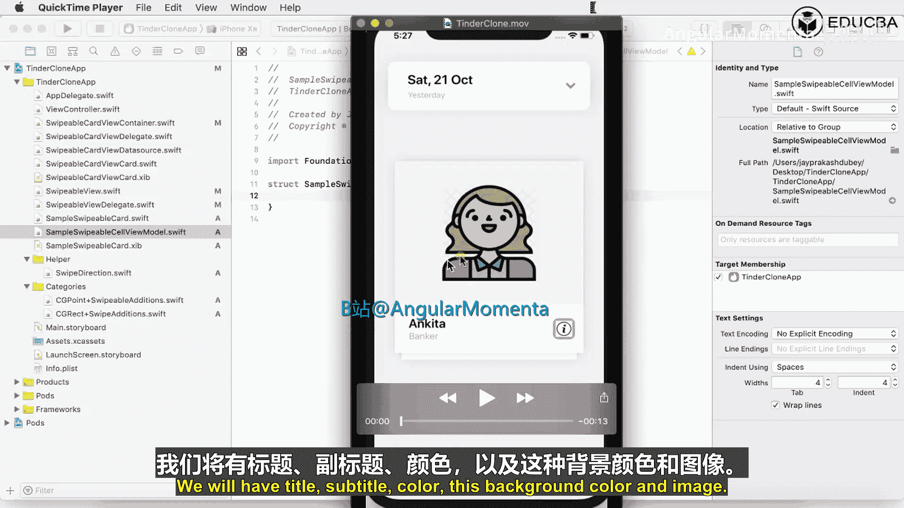

在本节课中，我们将学习如何创建一个自定义的可滑动卡片视图。我们将定义一个数据模型来管理卡片的内容，并配置卡片的视觉样式，包括圆角和阴影效果。

## 概述

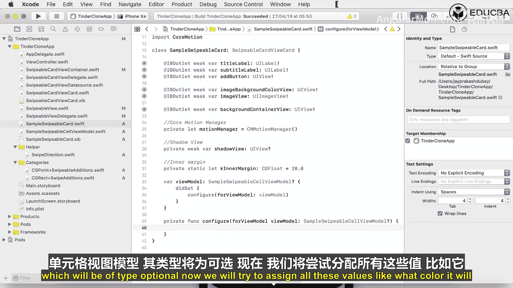

我们将创建一个名为 `SampleSwipeableCellViewModel` 的数据模型，它定义了卡片上显示的内容。然后，我们将在 `SampleSwipeableCard` 视图中使用这个模型，并配置其外观，包括背景色、图片、文本以及添加阴影效果。

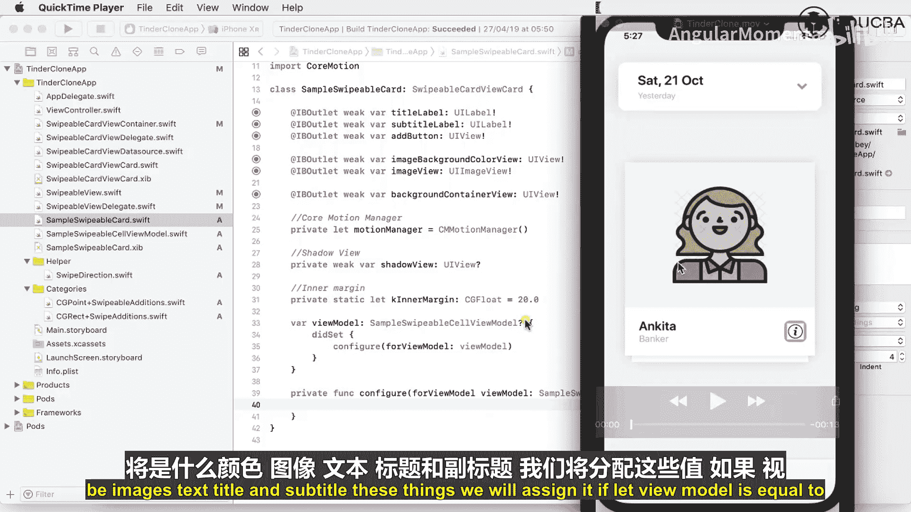

## 创建数据模型

首先，我们需要定义一个结构体来作为卡片视图的数据模型。这个模型将包含标题、副标题、背景颜色和图片。

以下是 `SampleSwipeableCellViewModel` 结构体的定义：

```swift
struct SampleSwipeableCellViewModel {
    let title: String
    let subtitle: String
    let color: UIColor
    let image: UIImage
}
```

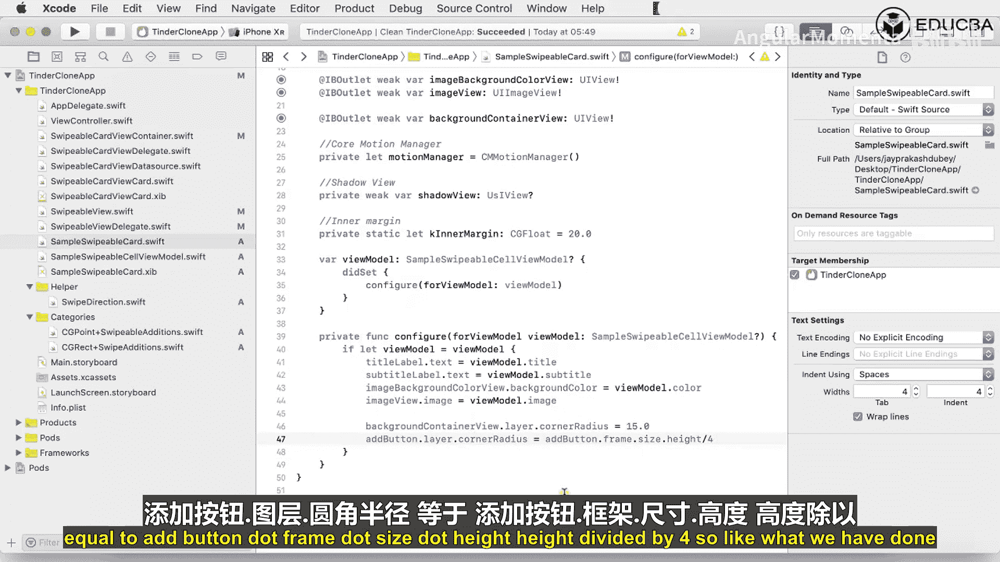

这个模型包含了四个属性：`title`（标题）、`subtitle`（副标题）、`color`（背景颜色）和 `image`（图片）。

## 在卡片视图中配置模型

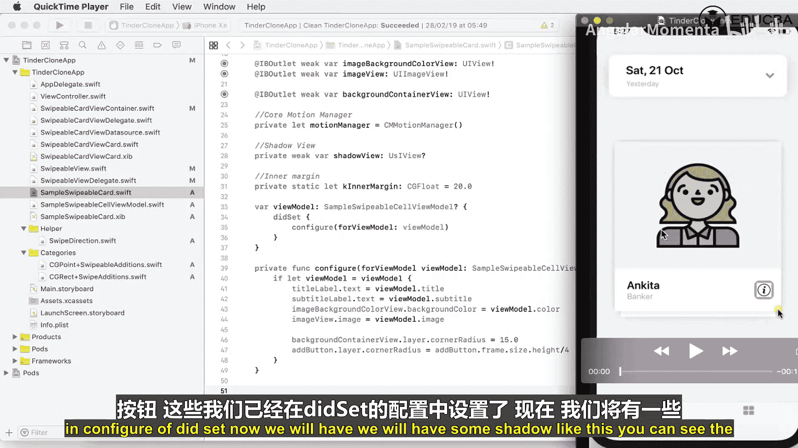

上一节我们创建了数据模型，本节中我们来看看如何在 `SampleSwipeableCard` 视图中使用它。

我们将在卡片视图中添加一个 `viewModel` 属性。当这个属性被设置时，我们会调用一个 `configure` 方法来更新界面。

在 `SampleSwipeableCard` 类中，添加以下代码：

```swift
var viewModel: SampleSwipeableCellViewModel? {
    didSet {
        configure(for: viewModel)
    }
}

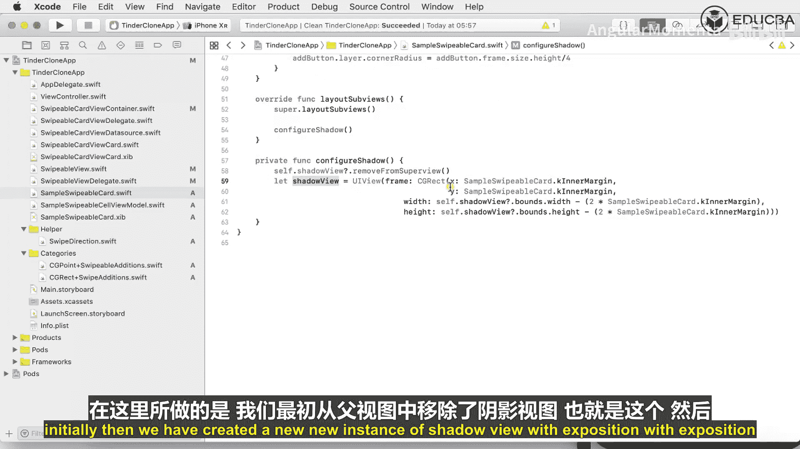

private func configure(for viewModel: SampleSwipeableCellViewModel?) {
    guard let viewModel = viewModel else { return }
    titleLabel.text = viewModel.title
    subtitleLabel.text = viewModel.subtitle
    imageBackgroundColorView.backgroundColor = viewModel.color
    imageView.image = viewModel.image
}
```

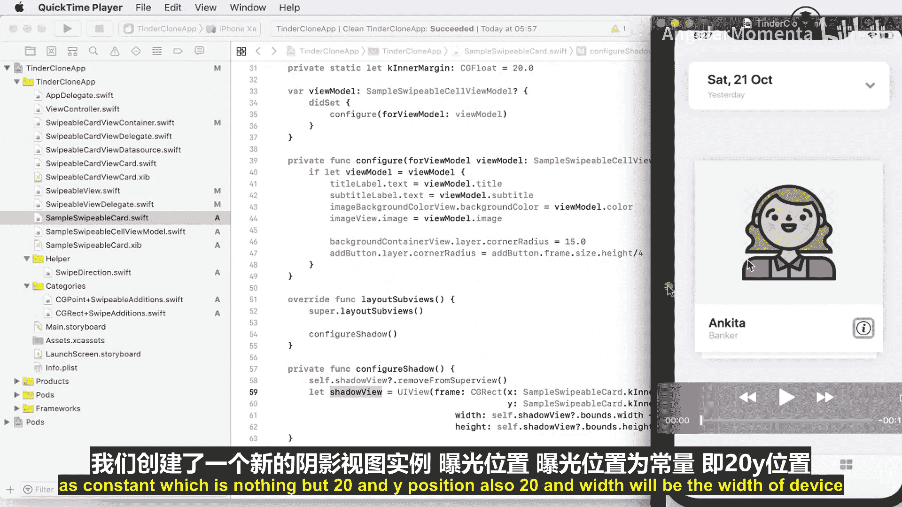

`configure` 方法的作用是将数据模型中的值赋给对应的界面元素。我们使用 `guard let` 语句来安全地解包可选的 `viewModel`。

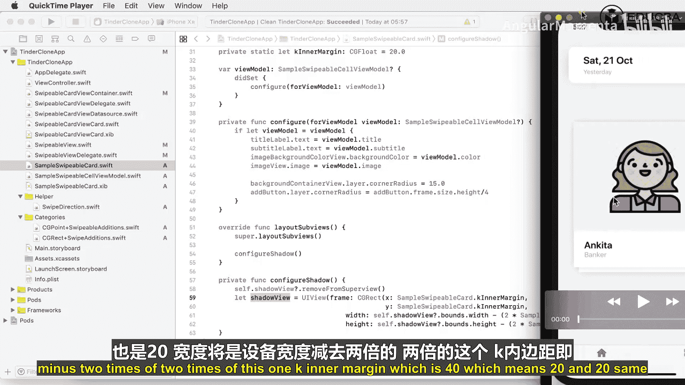

## 设置视图样式

配置好基本内容后，我们需要为卡片设置视觉样式，使其看起来更美观。

以下是设置圆角的方法：

```swift
private func setupViewStyle() {
    // 设置卡片本身的圆角
    layer.cornerRadius = 15.0
    // 设置按钮的圆角，使其高度的一半
    addButton.layer.cornerRadius = addButton.frame.size.height / 4
}
```

我们在视图初始化或布局更新时调用此方法，以确保圆角效果正确应用。

## 添加阴影效果

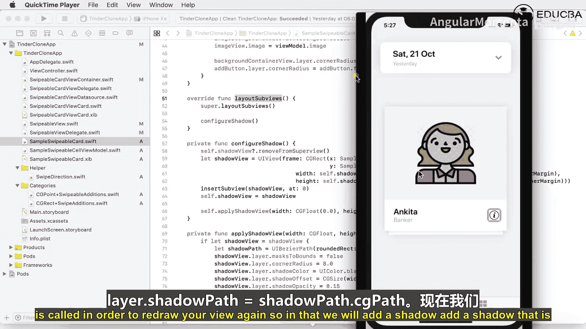

为了让卡片有立体感，我们接下来为其添加阴影效果。这将在 `layoutSubviews` 方法中完成。

以下是配置阴影的步骤：

1.  移除可能已存在的旧阴影视图。
2.  创建一个新的视图作为阴影层。
3.  设置阴影层的位置和大小，使其略大于卡片主体，以产生偏移效果。
4.  将阴影层插入为卡片的最底层子视图。
5.  应用阴影属性，如颜色、透明度、偏移量和路径。

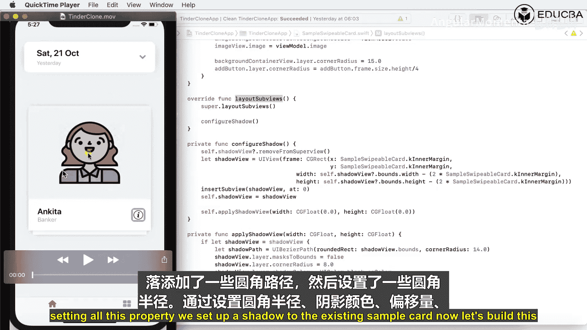

```swift
override func layoutSubviews() {
    super.layoutSubviews()
    configureShadow()
}

private func configureShadow() {
    // 1. 移除旧的阴影视图
    shadowView?.removeFromSuperview()

    // 2. 创建新的阴影视图
    let shadowView = UIView(frame: CGRect(x: 20, y: 20, width: bounds.width - 40, height: bounds.height - 40))
    shadowView.backgroundColor = .clear

    // 3. & 4. 插入阴影视图
    insertSubview(shadowView, at: 0)
    self.shadowView = shadowView

    // 5. 应用阴影属性
    applyShadow(to: shadowView)
}

private func applyShadow(to view: UIView) {
    view.layer.masksToBounds = false
    view.layer.cornerRadius = 8.0
    view.layer.shadowColor = UIColor.black.cgColor
    view.layer.shadowOffset = CGSize(width: 0, height: 0)
    view.layer.shadowOpacity = 0.15
    let shadowPath = UIBezierPath(roundedRect: view.bounds, cornerRadius: 14.0)
    view.layer.shadowPath = shadowPath.cgPath
}
```

## 源代码控制

在开发过程中，及时提交代码是一个好习惯。我们可以使用Xcode内置的源代码控制功能。

以下是提交更改的步骤：

1.  在项目导航器中，选择已修改的文件。
2.  在源代码控制菜单中选择“Commit...”。
3.  在提交窗口中，勾选要提交的文件，并输入有意义的提交信息，例如“步骤2：准备样本卡片并添加阴影和模型”。
4.  点击“Commit”按钮提交更改。

提交后，你可以在“Source Control Navigator”中查看提交历史，了解项目的演变过程。

## 总结

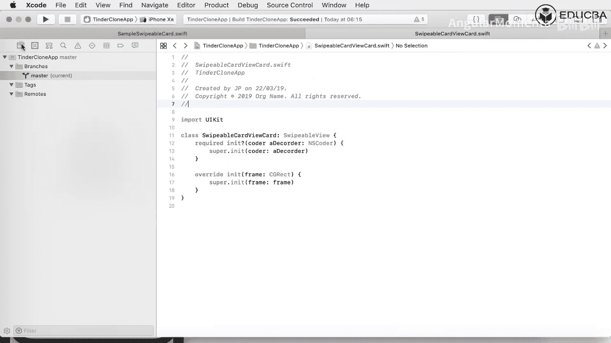

本节课中我们一起学习了如何构建滑动匹配应用的自定义卡片组件。我们首先定义了一个数据模型 `SampleSwipeableCellViewModel` 来封装卡片内容。然后，我们在 `SampleSwipeableCard` 视图中集成该模型，并通过 `configure` 方法动态更新UI。接着，我们美化了卡片视图，为其添加了圆角和复杂的阴影效果，以提升视觉层次感。最后，我们简要介绍了如何使用Xcode的源代码控制功能来管理代码版本。通过这些步骤，我们完成了一个具有良好数据结构和视觉表现的可滑动卡片单元。