# 007：匹配屏幕用户界面

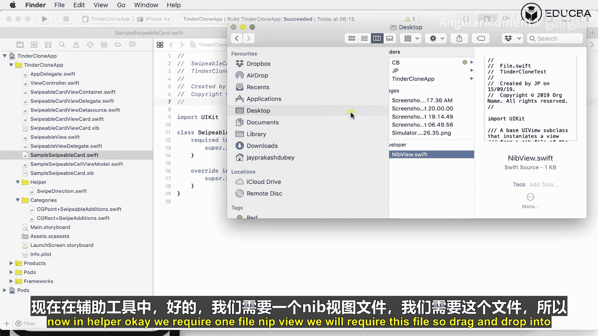

在本节课中，我们将学习如何为匹配屏幕构建一个带有阴影效果的静态头部视图。我们将创建一个自定义的UIView子类，并通过XIB文件来设计其布局，最后通过代码为其添加圆角和阴影效果。

## 概述

上一节我们完成了卡片视图的基础搭建。本节中，我们将创建一个位于屏幕顶部的静态头部视图。这个视图将包含背景容器、文本标签和一个指示图标，并会为其添加美观的圆角和阴影效果。

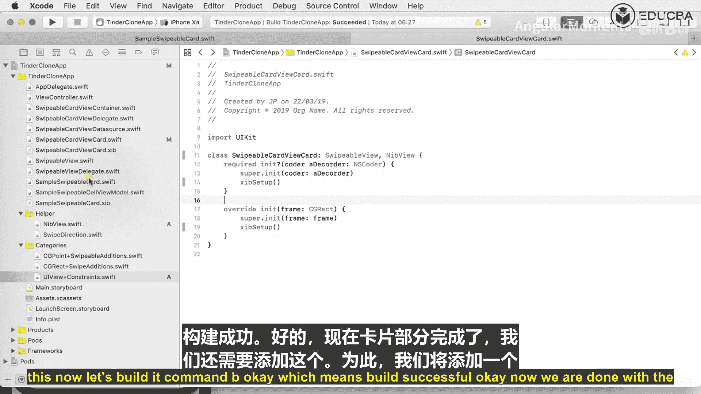

## 添加辅助文件

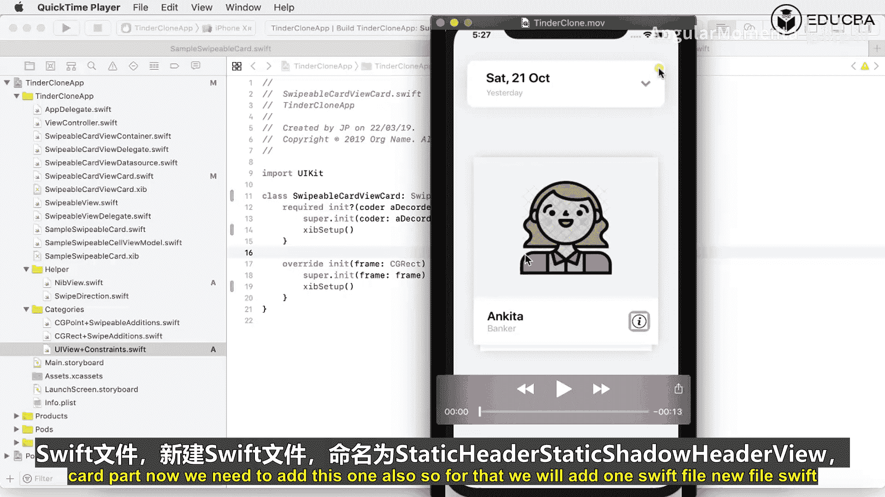

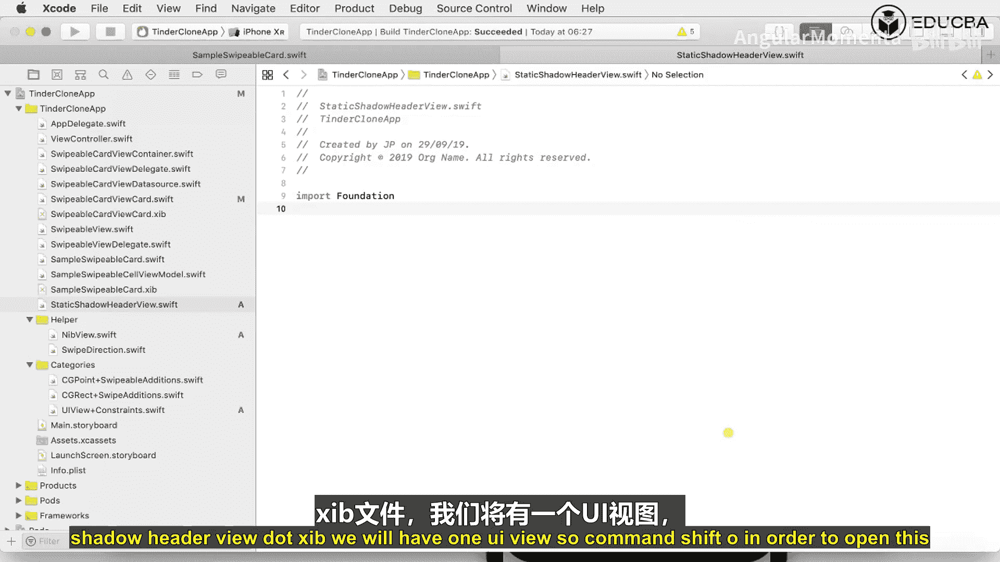

首先，我们需要一个辅助文件来帮助我们从XIB文件加载视图。这个文件是一个UIView的扩展，它封装了从XIB初始化视图并设置约束的通用逻辑。

以下是该扩展的核心代码：

```swift
extension UIView {
    func xibSetup() {
        backgroundColor = .clear
        let view = loadViewFromNib()
        addEdgeConstraints(view: view)
    }
    
    private func loadViewFromNib() -> UIView {
        let bundle = Bundle(for: type(of: self))
        let nib = UINib(nibName: String(describing: type(of: self)), bundle: bundle)
        let view = nib.instantiate(withOwner: self, options: nil).first as! UIView
        return view
    }
    
    private func addEdgeConstraints(view: UIView) {
        view.translatesAutoresizingMaskIntoConstraints = false
        NSLayoutConstraint.activate([
            view.topAnchor.constraint(equalTo: topAnchor),
            view.bottomAnchor.constraint(equalTo: bottomAnchor),
            view.leadingAnchor.constraint(equalTo: leadingAnchor),
            view.trailingAnchor.constraint(equalTo: trailingAnchor)
        ])
    }
}
```

在自定义视图的初始化方法中调用 `xibSetup()` 即可完成视图的加载和约束配置。

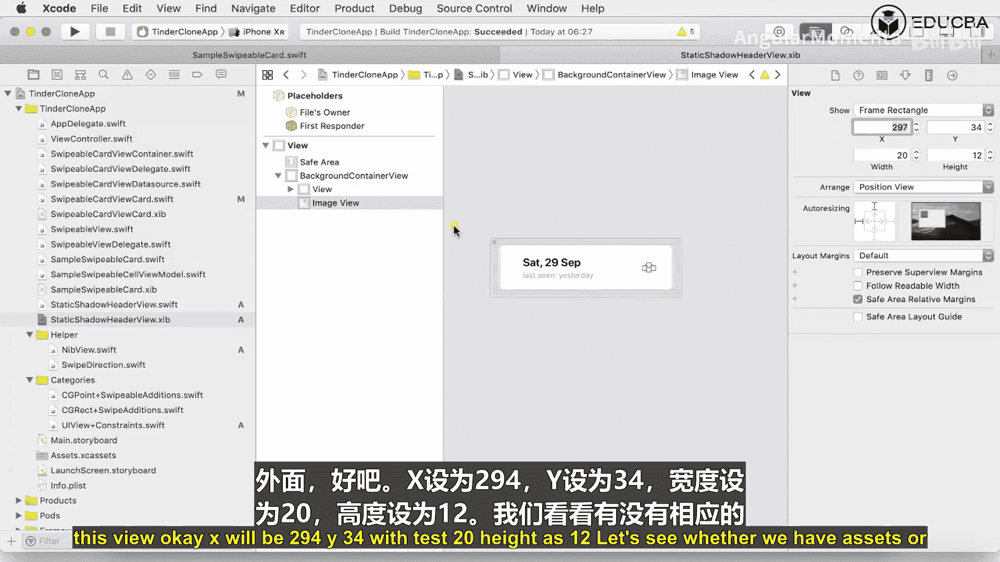

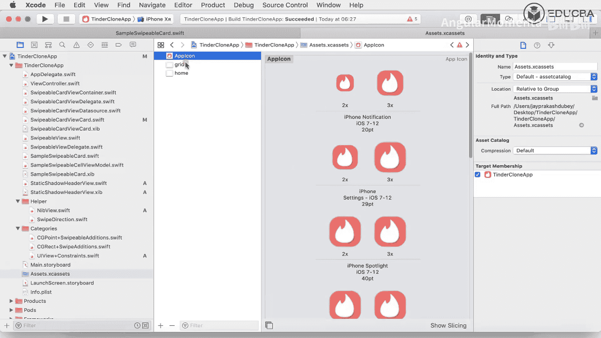

## 创建静态头部视图

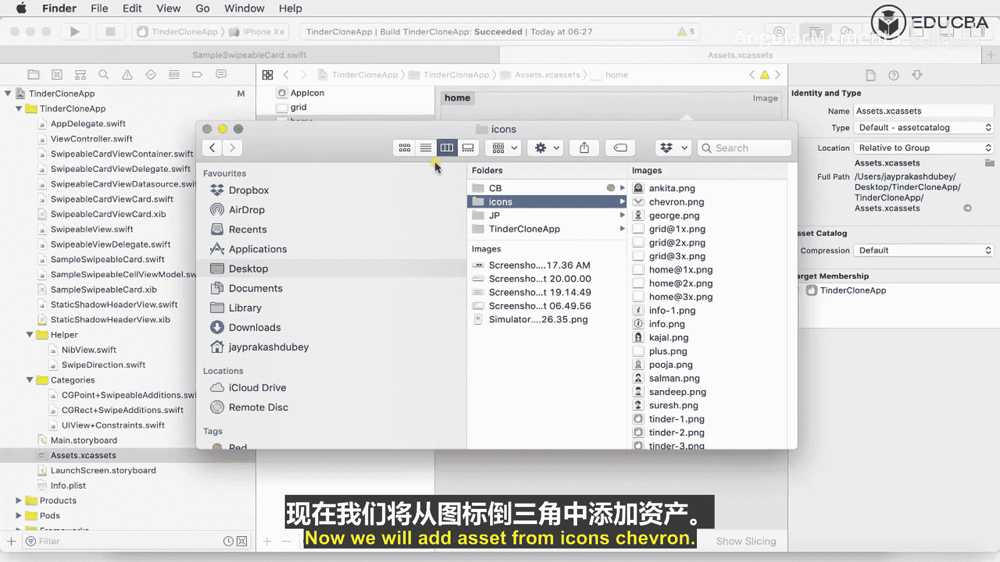

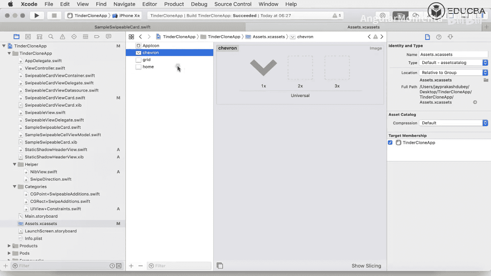

接下来，我们创建头部视图本身。这需要创建一个Swift类文件和一个对应的XIB界面文件。

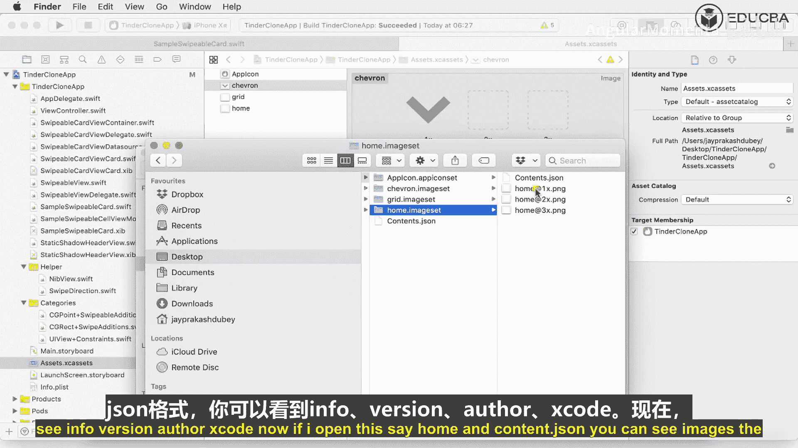

1.  新建一个Swift文件，命名为 `StaticShadowHeaderView`。
2.  新建一个User Interface文件，选择View模板，同样命名为 `StaticShadowHeaderView.xib`。

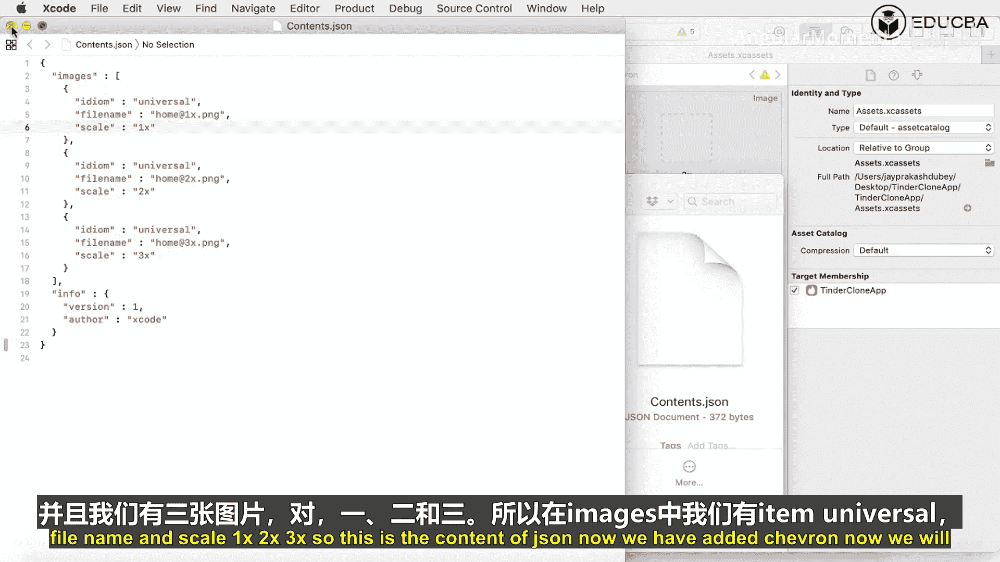

## 设计XIB界面

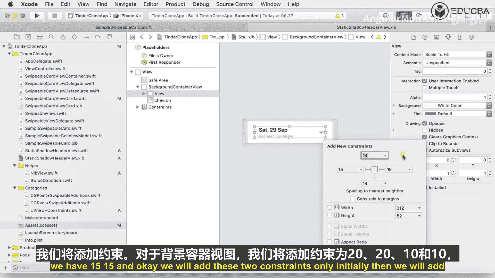

打开 `StaticShadowHeaderView.xib` 文件，开始设计界面布局。

以下是需要添加到视图中的组件及其配置步骤：

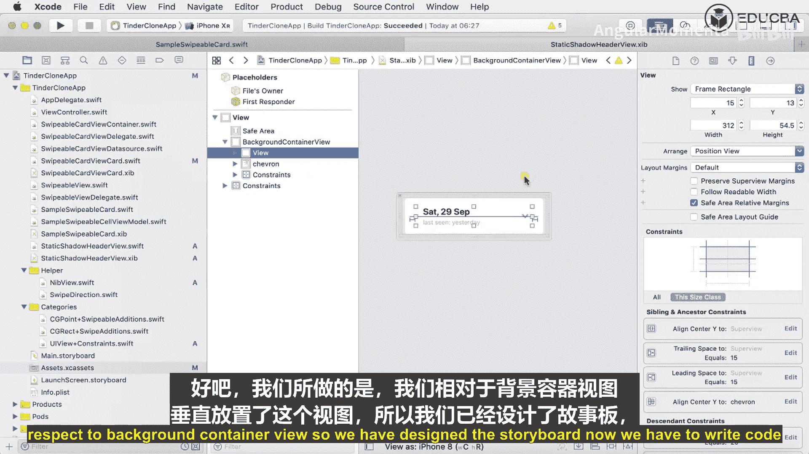

1.  **主背景容器**：添加一个UIView，将其尺寸设置为自由格式，宽度382，高度80。将其重命名为 `backgroundContainerView` 以避免混淆。为其设置圆角半径为14，并选择一个默认背景色。
2.  **内部容器**：在背景容器内添加另一个UIView，设置其约束为：上、下、左、右各距离背景容器15点。这个视图将作为内容区域。
3.  **标题标签**：在内部容器中添加一个UILabel。设置其字体为24pt的粗体，例如“Saturday 29 September”。为其添加约束：距离内部容器左、右各20点，顶部0点，底部5点。
4.  **副标题标签**：添加第二个UILabel，用于显示“Last seen yesterday”之类的文本。设置其字体颜色为浅灰色。约束设置与标题标签类似。
5.  **指示图标**：添加一个UIImageView来显示一个箭头（Chevron）图标。首先需要将图标资源（Chevron图片）拖入项目的Assets.xcassets资源目录中。然后在XIB中设置该UIImageView的图片为该资源，并添加约束：宽度20，高度20，距离父视图右边缘25点，并在垂直方向上居中对齐。

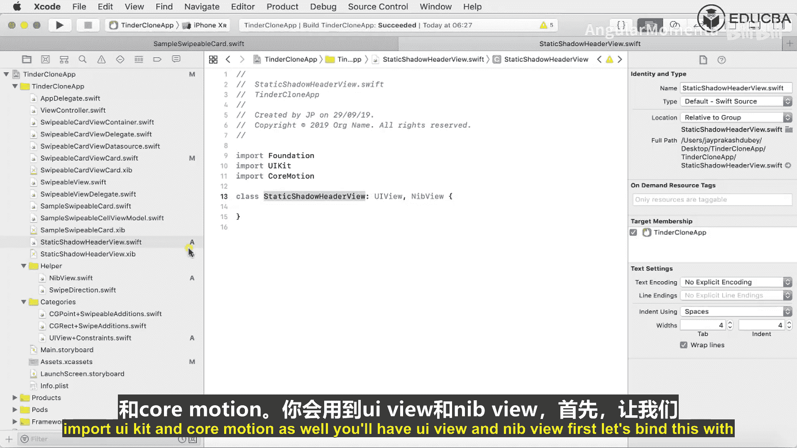

完成后的界面应包含上述所有元素，并且约束设置完整，没有缺失或冲突的警告。

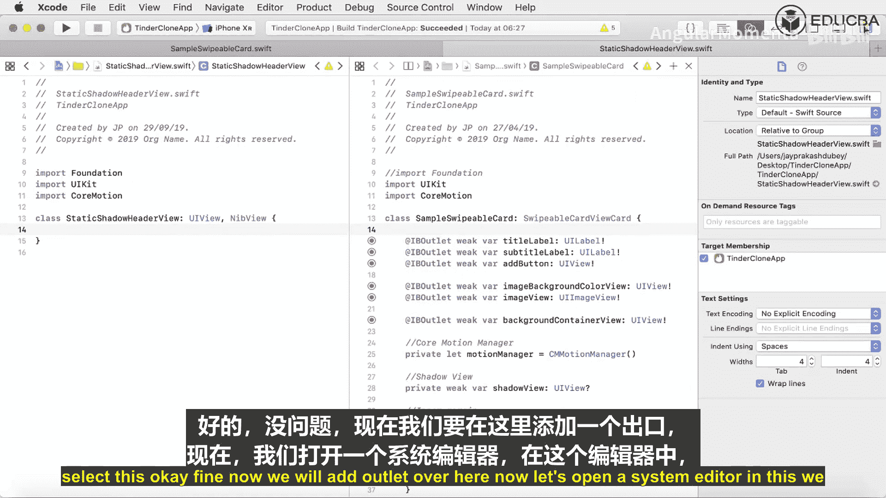

## 编写视图代码

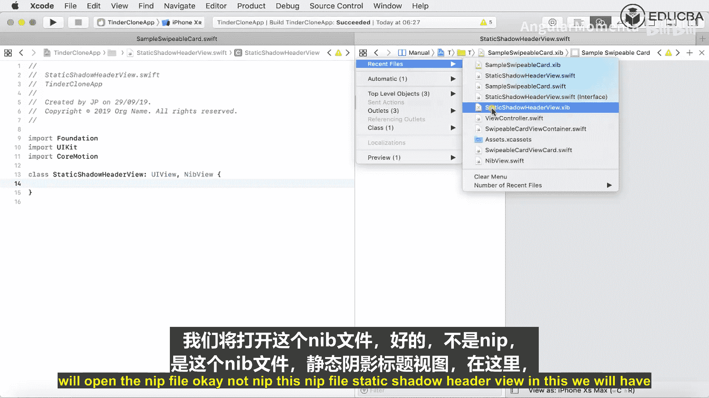

现在，将XIB文件的File‘s Owner类设置为 `StaticShadowHeaderView`，并开始编写对应的Swift类代码。

首先，建立IBOutlet连接，将 `backgroundContainerView` 连接到代码中。

```swift
class StaticShadowHeaderView: UIView {
    @IBOutlet weak var backgroundContainerView: UIView!
}
```

然后，在类中实现必要的属性和方法：

1.  **初始化方法**：在 `init?(coder:)` 和 `init(frame:)` 方法中调用 `xibSetup()` 来加载XIB布局。
2.  **设置圆角**：在初始化后，设置 `backgroundContainerView.layer.cornerRadius = 14`。
3.  **配置阴影**：我们不在背景容器上直接加阴影，而是创建一个专门的 `shadowView` 来模拟阴影效果，这样可以获得更好的性能和控制。在 `layoutSubviews()` 方法中调用一个私有方法来配置这个阴影视图。
4.  **阴影方法**：创建一个 `configureShadow()` 方法。该方法会：
    *   移除已存在的旧阴影视图。
    *   创建一个新的UIView作为 `shadowView`，其尺寸略大于背景容器。
    *   将其插入到视图层的最底部（index 0）。
    *   设置该视图的 `shadowPath`、`shadowRadius`、`shadowColor`、`shadowOffset` 和 `shadowOpacity` 来生成阴影效果。

核心的阴影配置代码如下：

```swift
private func configureShadow() {
    shadowView?.removeFromSuperview()
    
    let shadowView = UIView(frame: CGRect(x: innerMargin, y: innerMargin, width: bounds.width - 2*innerMargin, height: bounds.height - 2*innerMargin))
    insertSubview(shadowView, at: 0)
    self.shadowView = shadowView
    
    shadowView.layer.shadowPath = UIBezierPath(roundedRect: shadowView.bounds, cornerRadius: 14).cgPath
    shadowView.layer.masksToBounds = false
    shadowView.layer.shadowRadius = 14
    shadowView.layer.shadowColor = UIColor.black.cgColor
    shadowView.layer.shadowOffset = CGSize(width: 0, height: 0)
    shadowView.layer.shadowOpacity = 0.15
}
```

通过以上步骤，我们就创建了一个具有自定义圆角和柔和阴影的精致头部视图组件。

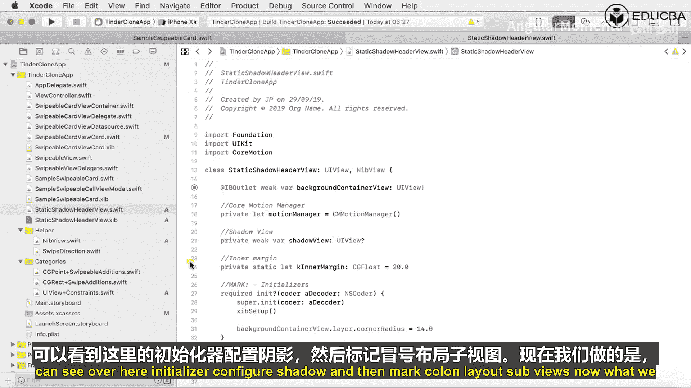

## 总结

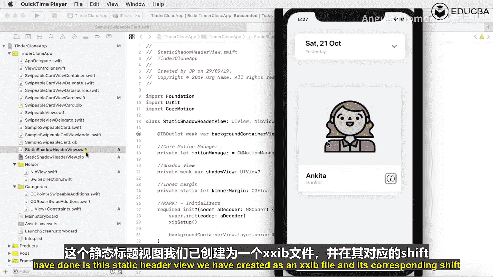

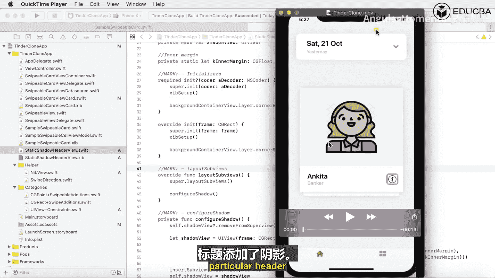

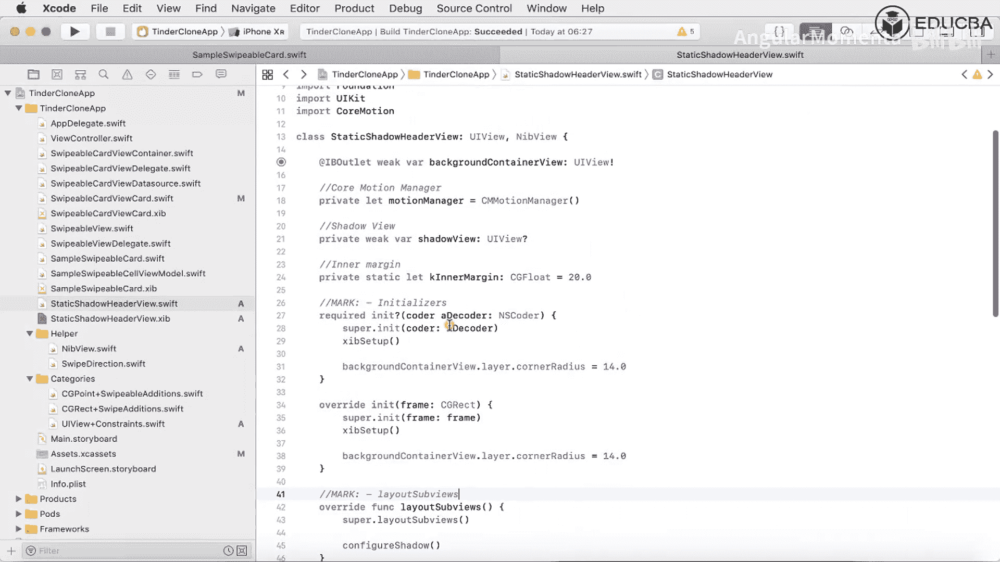

本节课中我们一起学习了如何构建匹配屏幕的静态头部用户界面。我们首先利用一个辅助扩展从XIB文件加载视图，然后详细设计了包含背景、文字和图标布局的XIB文件，最后通过编写Swift代码，为视图添加了圆角并实现了一个高性能的阴影效果，使UI看起来更加立体和美观。这个可复用的组件为应用顶部区域提供了标准的视觉样式。