# 008：导航转换 🧭

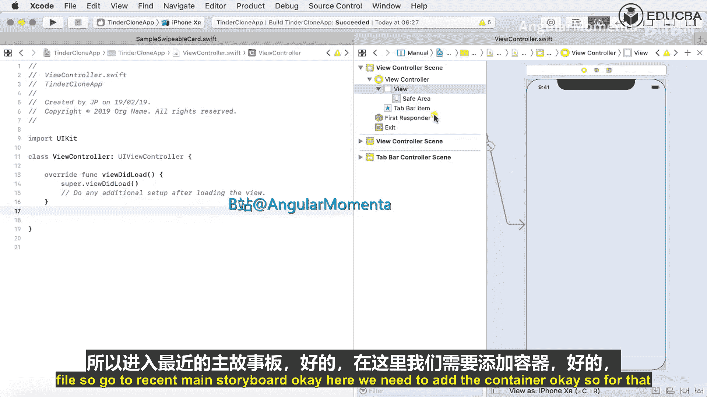

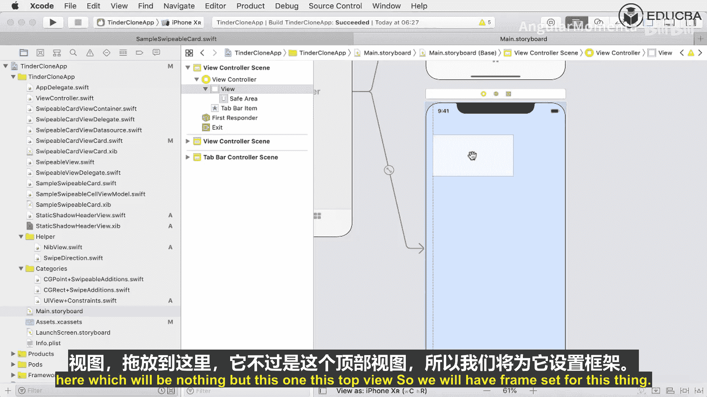

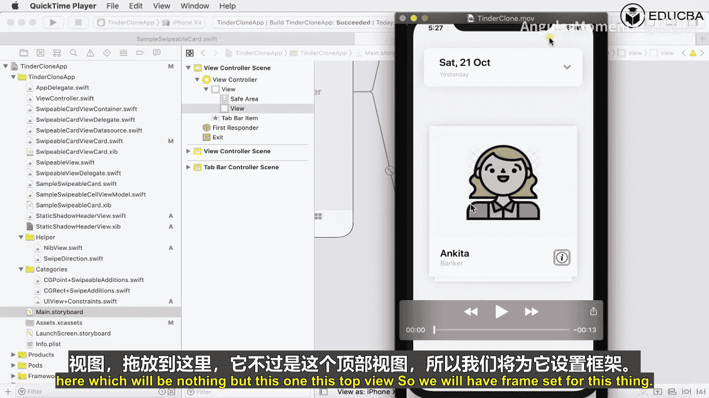

在本节课中，我们将学习如何将之前创建的各个组件文件整合到主视图控制器中，并设置卡片容器的数据源和委托，以实现完整的滑动匹配功能。

## 概述

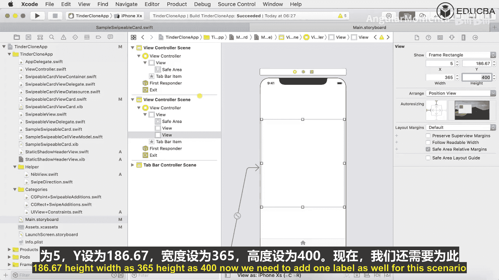

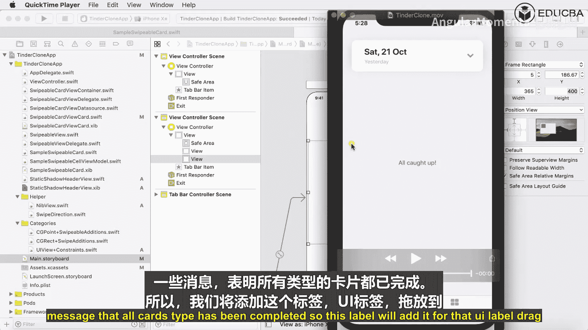

上一节我们创建了可滑动的卡片视图。本节中，我们将在主故事板中搭建界面，将 `SwipeableCardViewContainer` 容器与 `ViewController` 连接起来，并实现必要的数据源协议，让卡片能够显示和交互。

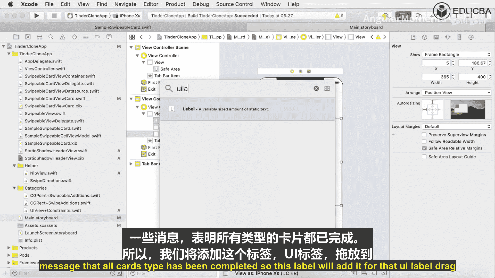

## 在故事板中搭建界面

首先，我们需要打开主故事板文件，并在初始视图控制器（即应用启动时显示的屏幕）上添加界面元素。

以下是需要添加的组件步骤：

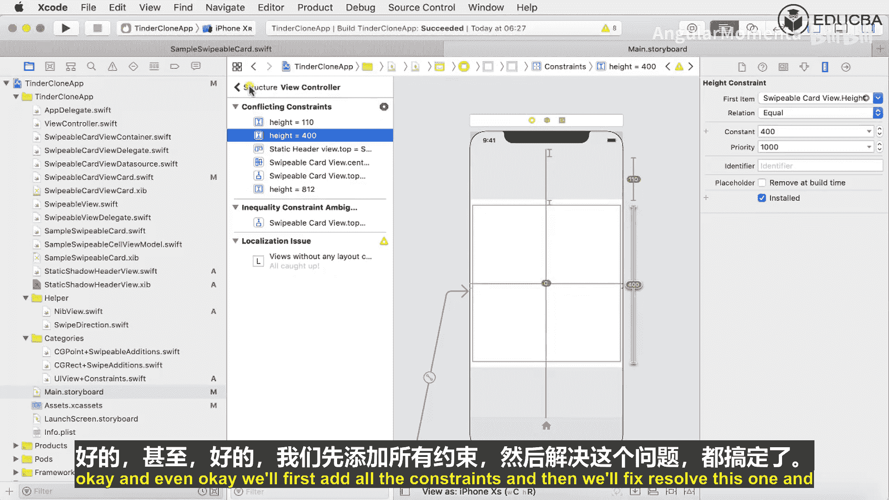

1.  **添加顶部静态视图**：这是一个作为背景或标题区域的视图。
    *   将其 `Frame` 设置为：`x: 5, y: 64, width: 365, height: 110`。
    *   确保它被添加到代表首页的 `View Controller` 中，而非其他标签页。

2.  **添加可滑动卡片容器视图**：这是用于承载多层卡片的主要视图。
    *   将其 `Frame` 设置为：`x: 5, y: 186, width: 365, height: 400`。

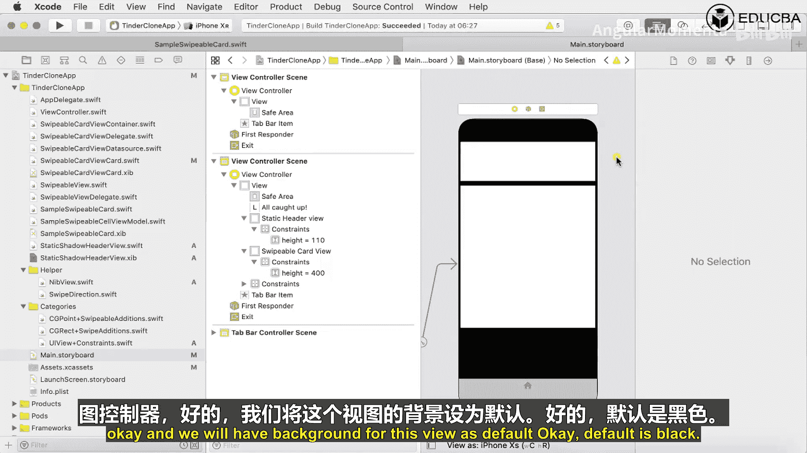

3.  **添加提示标签**：当所有卡片都被滑动完毕后，需要显示提示信息。
    *   添加一个 `UILabel`，将其 `Frame` 设置为：`x: 135, y: 376, width: 106, height: 21`。
    *   设置文本为 `All caught up`（意为“已无更多卡片”），颜色设为浅灰色。
    *   注意视图的层级关系：后添加的视图会覆盖在先添加的视图之上。因此，卡片容器视图会覆盖这个标签，在初始状态下标签不可见是正常的。

## 设置自动布局约束

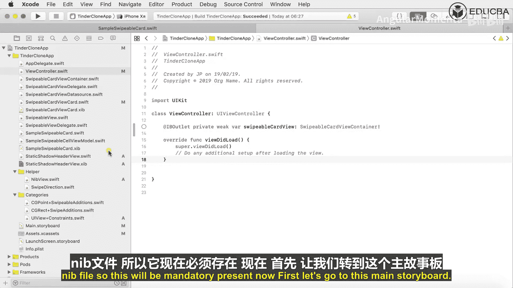

为了确保界面在不同尺寸的设备上都能正确显示，我们需要为各个视图添加约束。

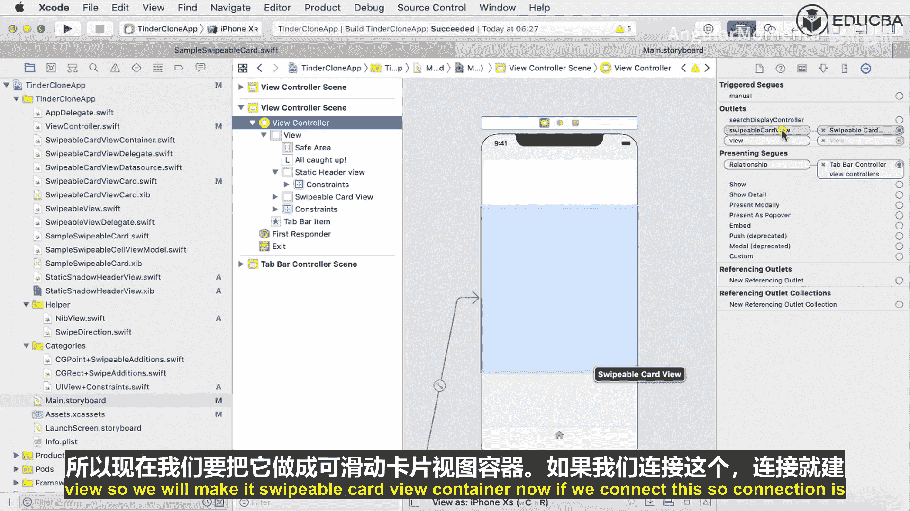

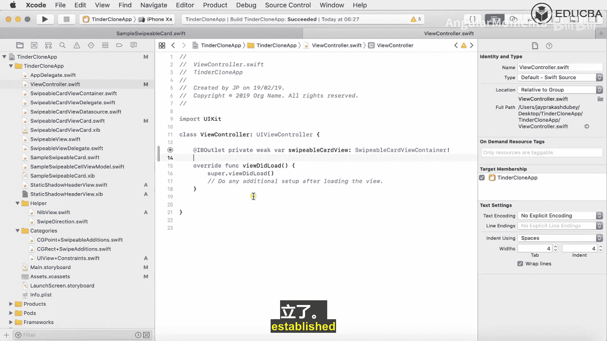

以下是约束设置步骤：

1.  **为顶部静态视图（重命名为 `StaticHeaderView`）添加约束**：
    *   左、右、上边距均为 `5` 点，下边距为 `20` 点。
    *   固定高度为 `110` 点。

2.  **为可滑动卡片视图（重命名为 `SwipeableCardViewContainer`）添加约束**：
    *   左、右边距均为 `5` 点。
    *   高度固定为 `400` 点。
    *   在安全区域内 **水平居中** 和 **垂直居中**。
    *   其顶部与 `StaticHeaderView` 底部的空间约束设置为“大于等于”某个值。

3.  **为“All caught up”标签添加约束**：
    *   在安全区域内 **水平居中** 和 **垂直居中**。

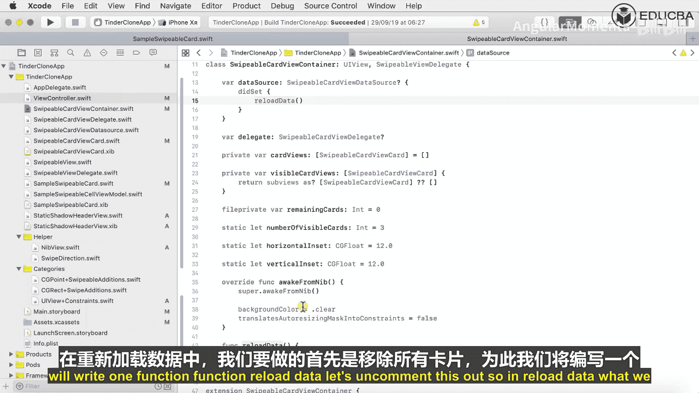

添加约束后，如果出现黄色警告线（表示帧位置与约束不符），可以选中视图，点击“Update Frames”来根据约束重新定位。如果存在红色冲突线，需要检查并调整约束，例如将某个固定边距改为灵活范围。

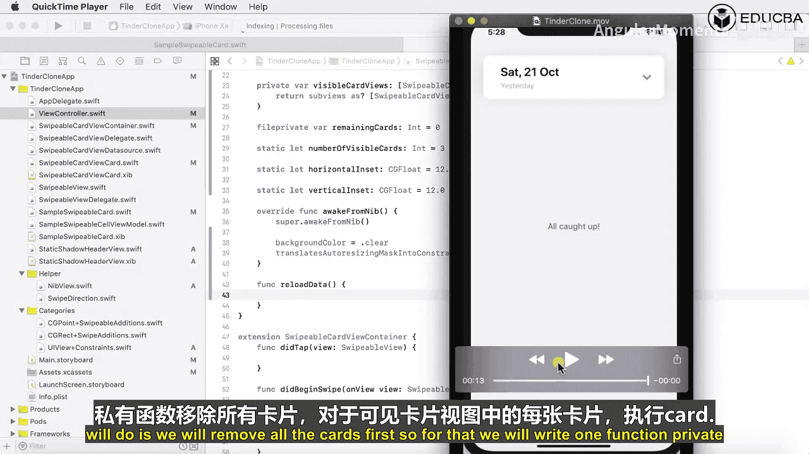

## 连接出口与属性

现在，我们需要在代码中建立与故事板中视图的连接。

1.  **设置视图控制器背景色**：在故事板中，选择 `View Controller` 的主视图，将其背景色从默认的黑色改为更合适的颜色，例如“Group Table View Background Color”。

2.  **创建出口连接**：
    *   打开 `ViewController.swift` 文件。
    *   为 `SwipeableCardViewContainer` 创建一个出口属性：
        ```swift
        @IBOutlet private weak var swipeableCardViewContainer: SwipeableCardViewContainer!
        ```
    *   由于我们确定该视图一定存在，可以使用隐式解包可选类型 `SwipeableCardViewContainer!`。
    *   回到故事板，选中 `SwipeableCardViewContainer` 视图，在“Identity Inspector”中将其类由 `UIView` 改为 `SwipeableCardViewContainer`。
    *   最后，按住 `Ctrl` 键从该视图拖拽到 `ViewController` 代码中的 `@IBOutlet` 行，完成连接。

## 实现卡片容器数据源

`SwipeableCardViewContainer` 需要一个数据源来提供卡片内容和数量。我们需要在 `SwipeableCardViewContainer.swift` 文件中实现其核心逻辑。

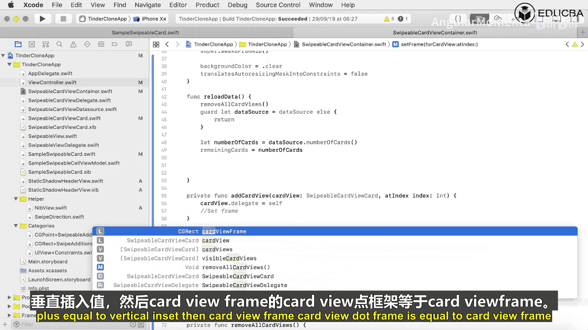

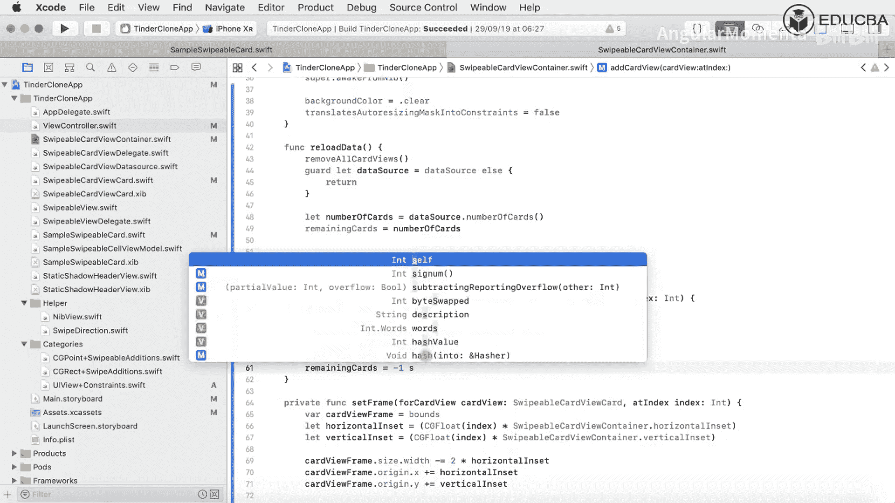

以下是 `SwipeableCardViewContainer` 的核心实现步骤：

1.  **定义协议与属性**：
    *   定义 `SwipeableCardViewDataSource` 和 `SwipeableCardViewDelegate` 协议（后者可先注释以避免编译错误）。
    *   声明 `dataSource` 和 `delegate` 属性。
    *   声明存储卡片的数组 `cardViews`。
    *   定义属性 `remainingCards` 来跟踪剩余未显示卡片数。
    *   定义常量 `numberOfVisibleCards`（例如 `3`）来设置同时可见的最大卡片数。
    *   定义常量 `horizontalInset` 和 `verticalInset`（例如 `12.0`）来设置卡片间的重叠偏移量。

2.  **初始化设置**：在 `awakeFromNib()` 方法中：
    *   将容器背景色设为 `.clear`。
    *   设置 `translatesAutoresizingMaskIntoConstraints = false`，因为我们使用自动布局约束。

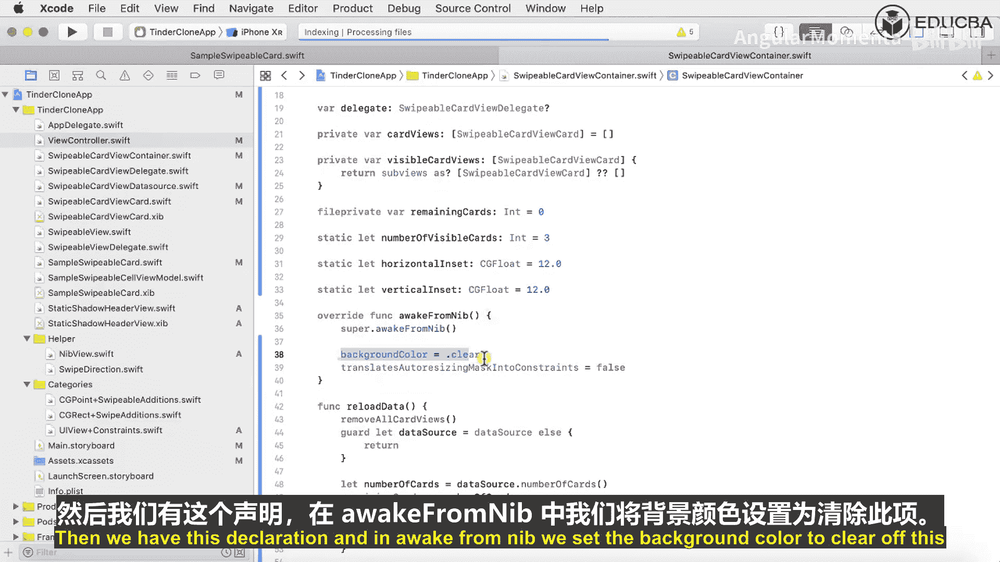

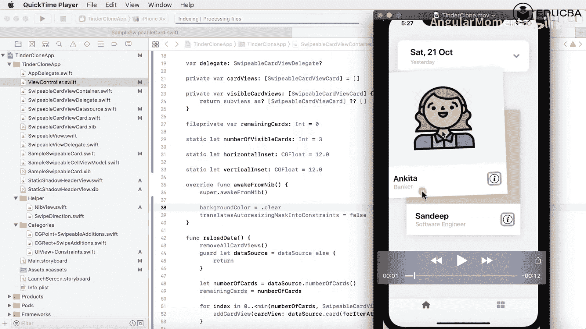

3.  **重载数据方法 `reloadData()`**：
    *   首先，移除所有现有的卡片视图。
    *   从 `dataSource` 获取总卡片数，并赋值给 `remainingCards`。
    *   循环创建卡片（循环次数取 `总卡片数` 和 `numberOfVisibleCards` 中的较小值）。
    *   在每次循环中，调用 `addCardView(_:at:)` 方法添加新卡片。

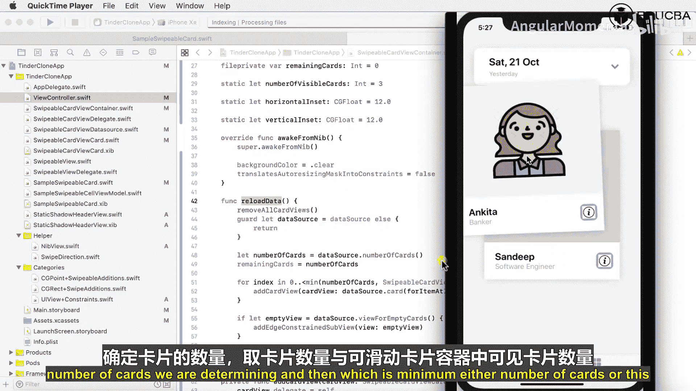

4.  **添加卡片方法 `addCardView(_:at:)`**：
    *   设置卡片的 `delegate` 为 `self`（即容器自身）。
    *   调用 `setFrame(for:at:)` 方法根据索引设置卡片的位置和大小，实现层叠效果。
    *   将卡片视图添加到 `cardViews` 数组并插入到容器视图的底层。

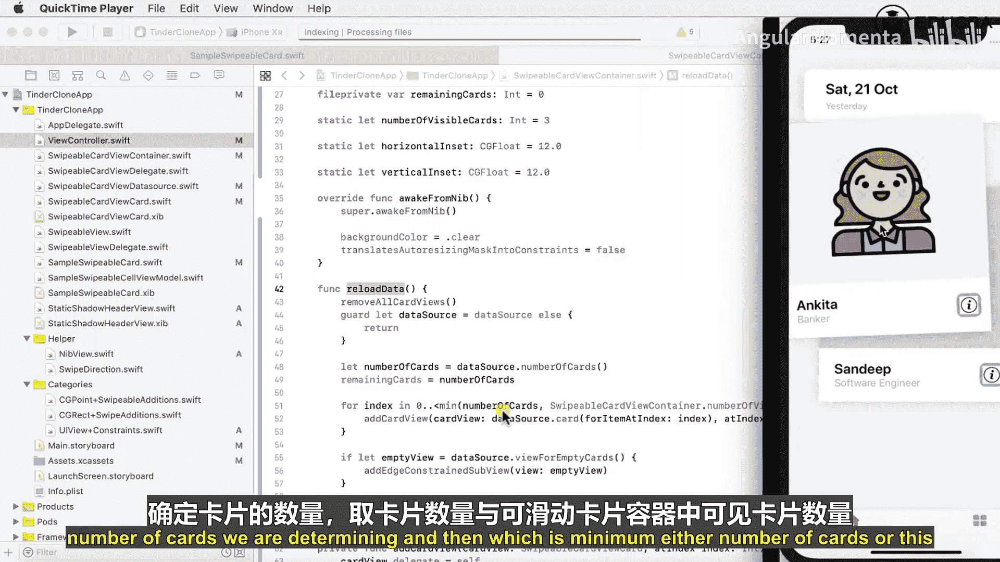

5.  **设置卡片帧方法 `setFrame(for:at:)`**：
    *   计算卡片的 `frame`。其宽度和高度根据容器 `bounds` 和 `inset` 值计算。
    *   卡片的 `origin.x` 和 `origin.y` 会根据其索引乘以 `inset` 值进行偏移，从而实现层叠视觉效果。
        ```swift
        cardViewFrame.origin.x += CGFloat(index) * horizontalInset
        cardViewFrame.origin.y += CGFloat(index) * verticalInset
        cardViewFrame.size.width -= 2 * CGFloat(index) * horizontalInset
        ```

6.  **实现滑动手势委托**：
    *   在 `didSelectCard(at:)` 中通知代理某张卡片被点击。
    *   在 `didEndSwipingCard(at:)` 中处理滑动结束的逻辑：
        *   从视图层级和 `cardViews` 数组中移除被滑走的卡片。
        *   如果还有剩余卡片（`remainingCards > 0`），则通过数据源获取下一张新卡片并添加。
        *   为所有当前可见的剩余卡片触发一个动画，重新计算并设置它们的新位置（索引减一），模拟卡片向上推进的效果。

## 在视图控制器中集成

最后，我们需要在 `ViewController` 中设置数据源并触发数据加载。

1.  **设置数据源**：在 `ViewController` 的 `viewDidLoad` 方法或适当的位置，将卡片容器的数据源设为 `self`：
    ```swift
    swipeableCardViewContainer.dataSource = self
    ```
2.  **实现数据源协议**：让 `ViewController` 遵循 `SwipeableCardViewDataSource` 协议，并实现其必需的方法，例如 `numberOfCards()` 和 `card(forItemAt:)`，以提供实际的数据模型给卡片容器。

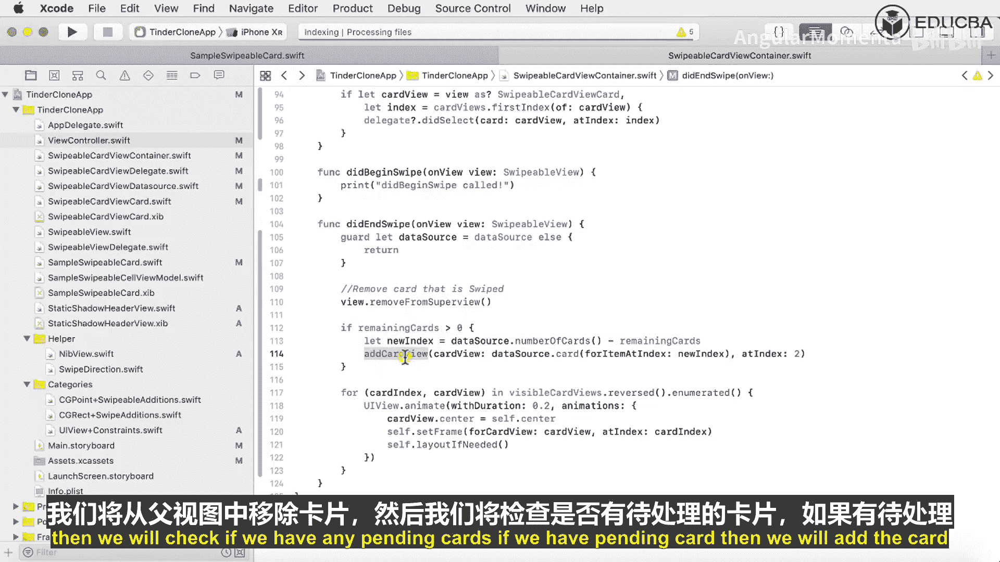

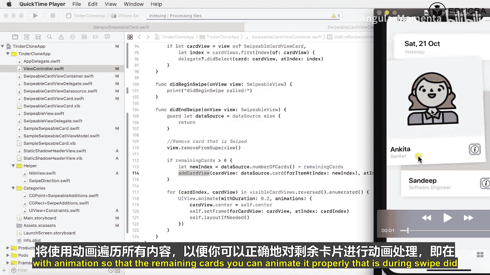

## 总结

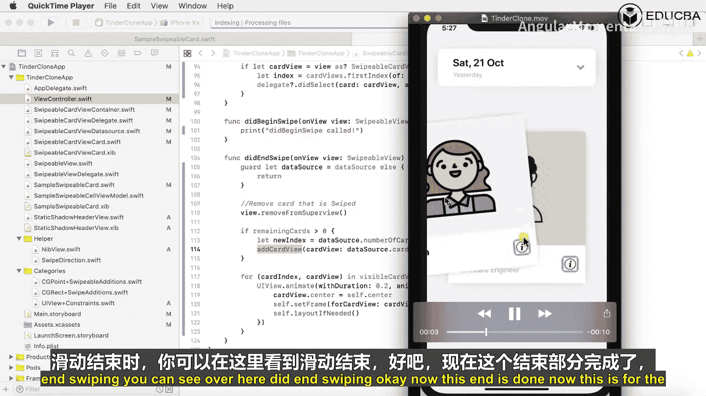

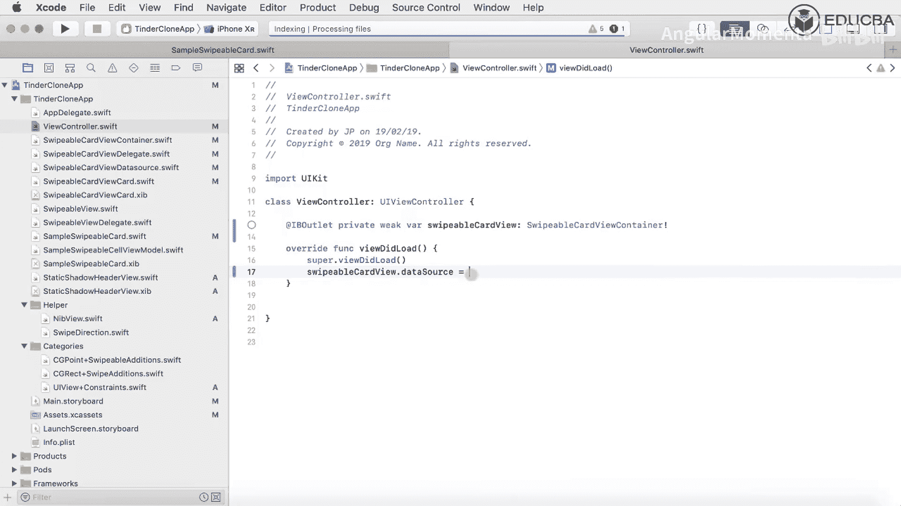

本节课中我们一起学习了导航与界面集成的关键步骤。我们首先在主故事板中搭建了应用的静态界面，并设置了完整的自动布局约束。然后，我们将自定义的 `SwipeableCardViewContainer` 与视图控制器连接，并深入实现了其内部的数据管理、卡片布局和滑动交互逻辑。通过实现数据源协议，我们为卡片容器注入了动态数据的能力。至此，一个具有可视化层叠卡片和流畅滑动交互功能的核心界面已经构建完成。