# 009：最终用户界面润色 🎨

在本节课中，我们将对滑动匹配应用的用户界面进行最后的润色和调试。我们将解决之前遇到的错误，配置数据源，并确保卡片视图能够正确显示和交互。

---

## 解决错误并配置数据源

上一节我们完成了卡片视图的布局，但在运行时遇到了错误。本节中，我们来看看如何解决这个问题并配置数据源。

首先，我们需要在视图控制器的扩展中添加数据源方法。以下是需要实现的方法：

*   **`numberOfCards`**: 返回卡片的总数。
*   **`card(forItemAt:)`**: 根据索引返回对应的卡片视图。
*   **`emptyView()`**: 当没有更多卡片时返回一个空视图。

在实现数据源之前，我们需要创建一些静态的用户数据模型。

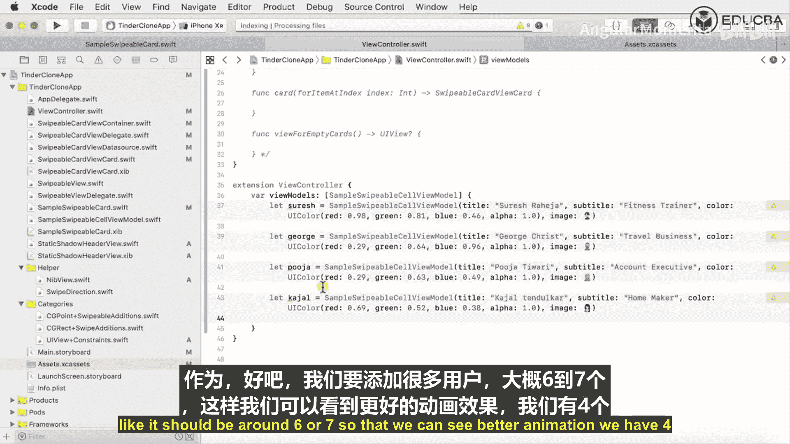

---


## 创建静态用户数据模型

为了测试应用，我们将创建一组模拟用户数据。以下是创建这些模型的步骤：

1.  在视图控制器的扩展中，定义一个包含多个 `SampleSwipeableCardViewModel` 实例的数组。
2.  每个模型实例代表一个用户，包含姓名、职业、背景色和头像图片名称。

以下是创建用户模型的代码示例：

```swift
let sarish = SampleSwipeableCardViewModel(title: "Sarish Raheja",
                                          subtitle: "Fitness Trainer",
                                          color: UIColor(red: 0.98, green: 0.81, blue: 0.46, alpha: 1.0),
                                          imageName: "sarish_image")
let george = SampleSwipeableCardViewModel(title: "George Christ",
                                          subtitle: "Travel Business",
                                          color: UIColor(red: 0.29, green: 0.64, blue: 0.96, alpha: 1.0),
                                          imageName: "george_image")
// ... 以此类推创建更多用户
let viewModels = [sarish, george, priya, kagel, guitar, sundip]
```

在创建模型之前，请确保已将所需的图片资源（如 `sarish_image`, `george_image` 等）添加到项目的 `Assets.xcassets` 目录中。

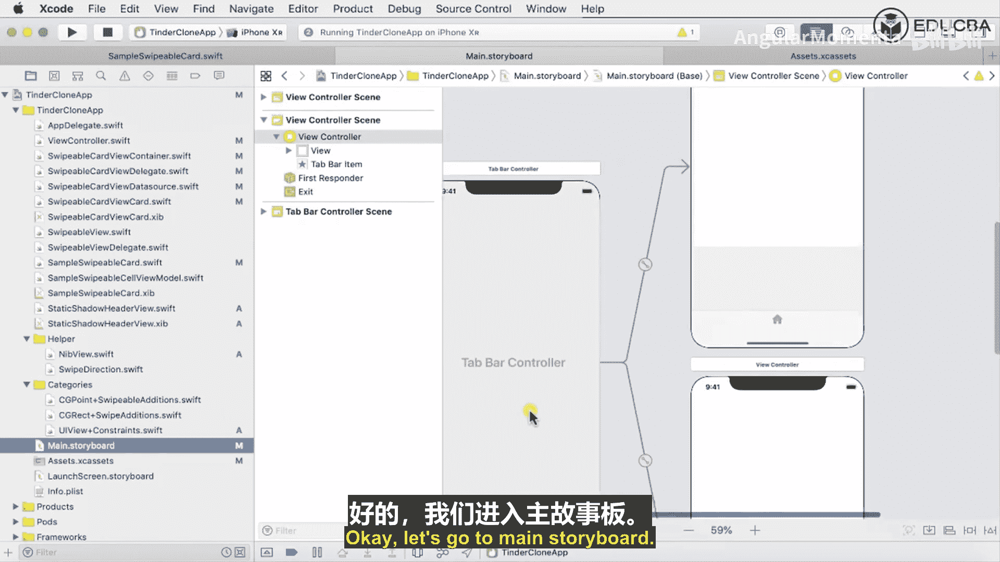

---

## 实现数据源方法

现在，我们可以使用上面创建的 `viewModels` 数组来实现数据源方法。

*   在 `numberOfCards` 方法中，返回 `viewModels.count`。
*   在 `card(forItemAt index:)` 方法中，根据索引获取对应的视图模型，并将其赋值给一个新的 `SampleSwipeableCard` 实例，然后返回该卡片视图。
*   在 `emptyView()` 方法中，目前可以暂时返回 `nil`。

核心实现代码如下：

```swift
func numberOfCards() -> Int {
    return viewModels.count
}

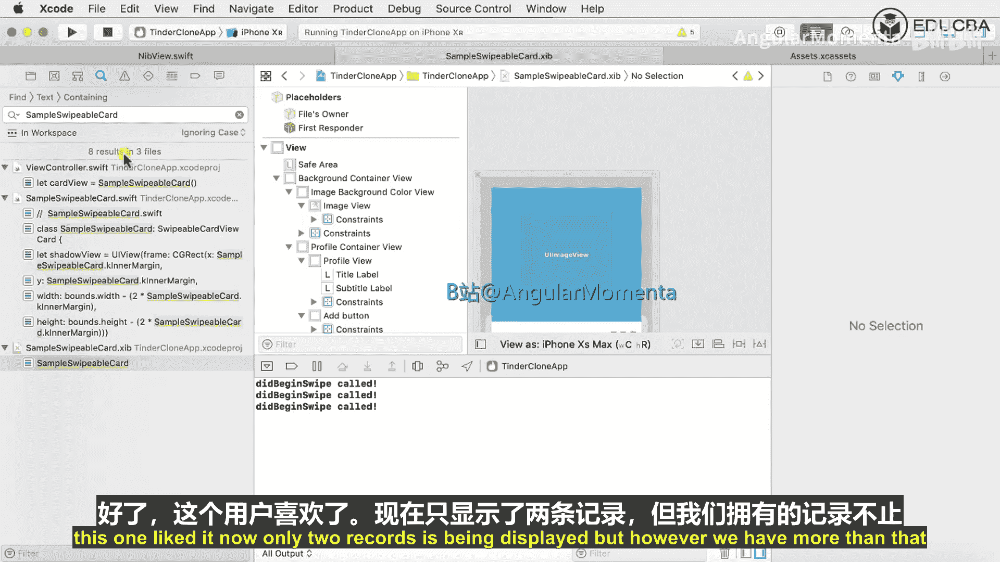

func card(forItemAt index: Int) -> SwipeableCardView {
    let viewModel = viewModels[index]
    let cardView = SampleSwipeableCard()
    cardView.viewModel = viewModel
    return cardView
}

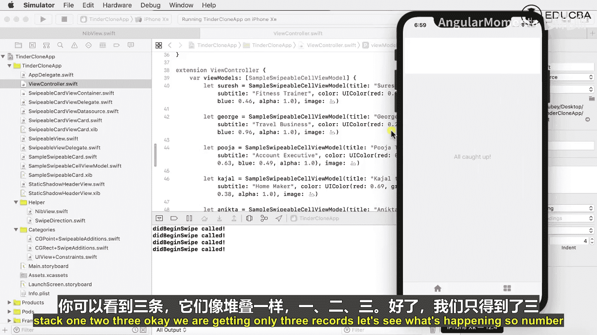

func emptyView() -> UIView? {
    return nil
}
```

---

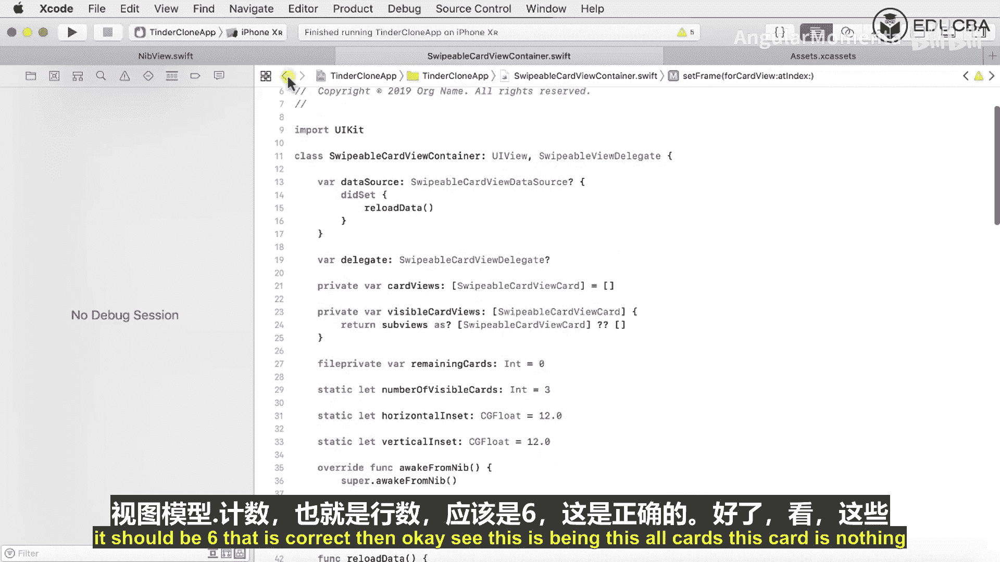

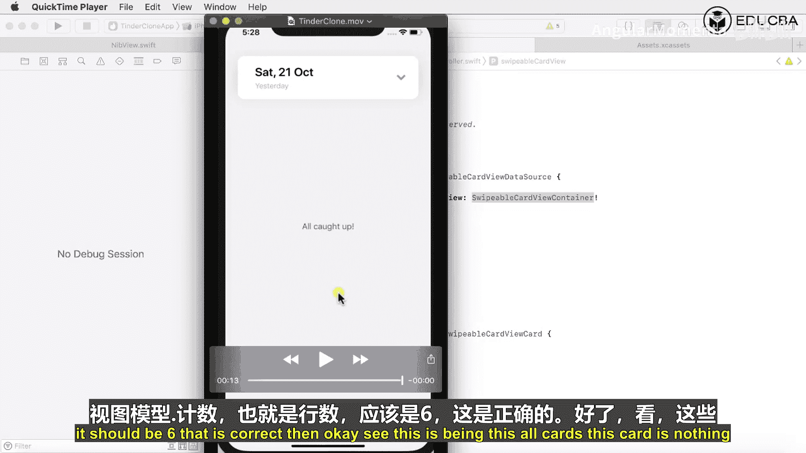

## 检查界面连接与调试

实现数据源后，运行应用可能仍然无法正常显示。以下是常见的检查与调试步骤：

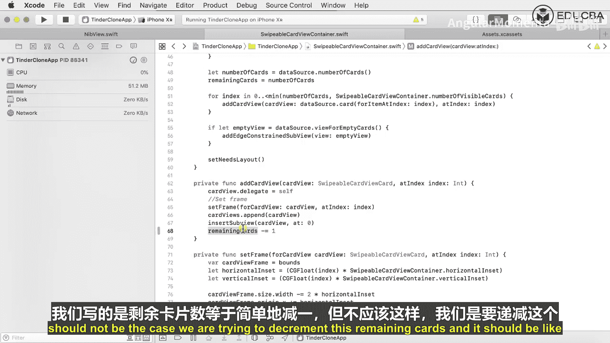

1.  **检查Storyboard连接**：确保 `SampleSwipeableCard` 在Storyboard中的自定义类已正确设置，并且所有 `@IBOutlet`（如背景容器、图片视图、标题标签等）都已正确连接到文件所有者。
2.  **修复循环引用导致的崩溃**：如果应用崩溃并提示内存问题，可能是由于在 `reloadData` 方法中出现了无限循环。检查更新剩余卡片数量的逻辑，确保使用了正确的递减运算符 `-=`。
    错误示例：`remainingCards = -1`
    正确示例：`remainingCards -= 1`
3.  **检查静态头部视图**：确保应用顶部的静态信息栏（如显示“Tinder”Logo和图标的部分）对应的视图类已正确设置，并且其内部的子视图连接无误。

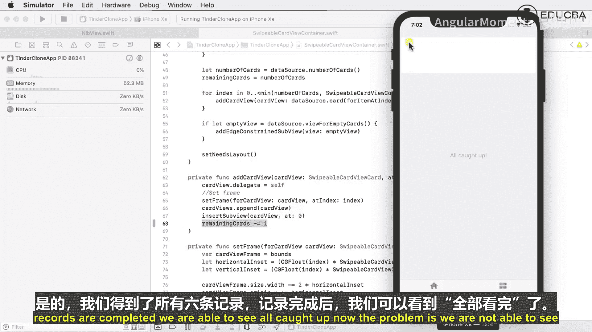

完成这些检查和修复后，再次运行应用。此时应该能够看到所有用户卡片以堆叠形式显示，并且可以通过左右滑动来表示“喜欢”或“不喜欢”。

---

## 功能回顾与扩展

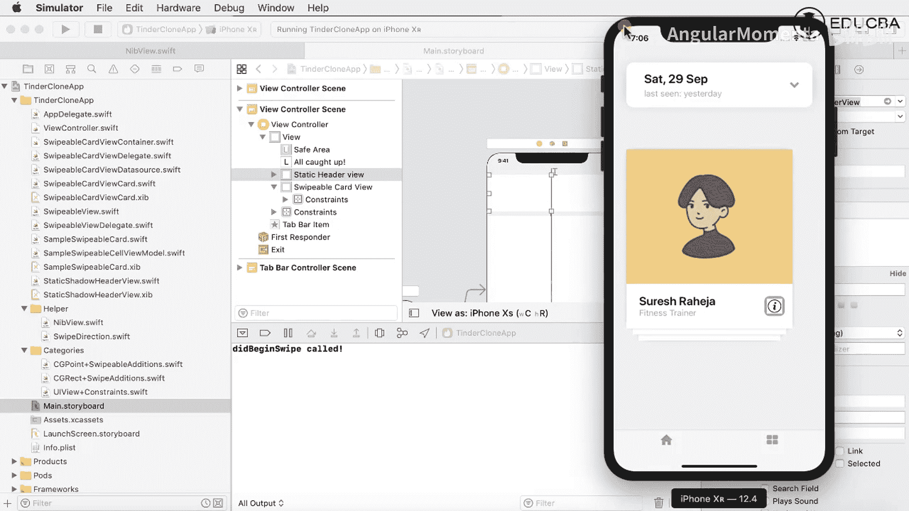

本节课中我们一起学习了如何为滑动匹配应用注入数据并完善界面。

我们已经成功实现了Tinder应用的核心交互逻辑：**通过左右滑动手势来评价卡片**。目前应用使用的是本地静态数据，在实际开发中，这些用户数据通常会从服务器接口获取。

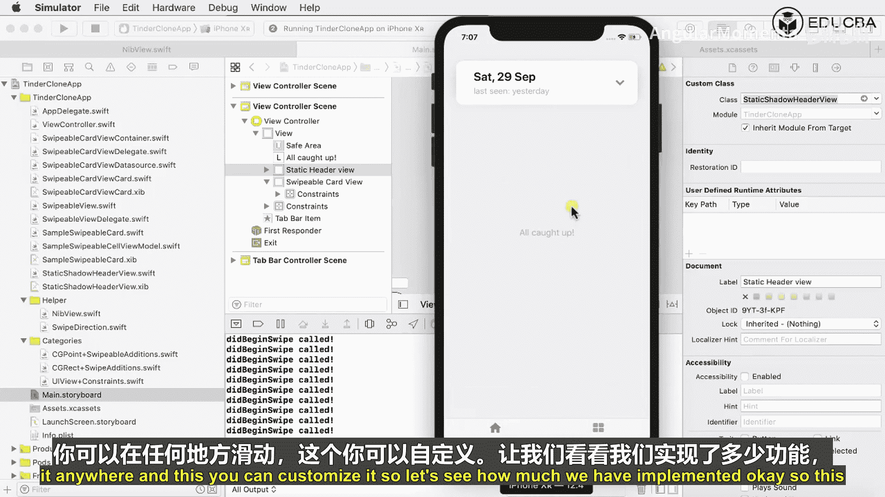

你可以在此基础上进一步扩展应用功能，例如：
*   在滑动后添加“已添加至收藏”或“已跳过”等提示信息。
*   实现“刷新”或“撤销”按钮来重新加载或回退操作。
*   集成即时聊天、个人资料详情页等更多功能模块。


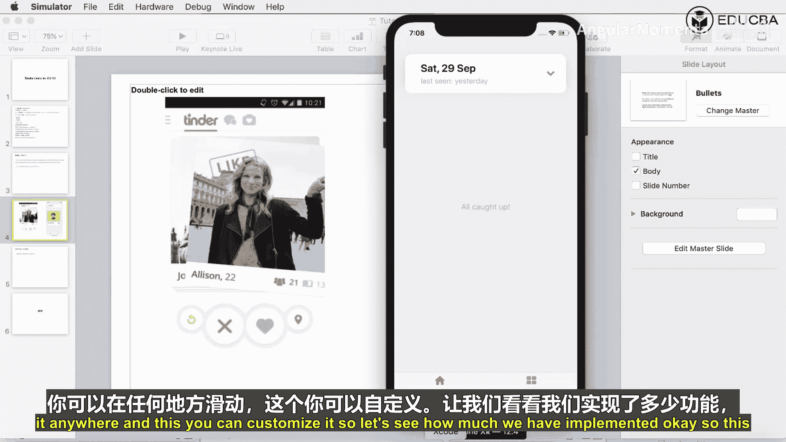

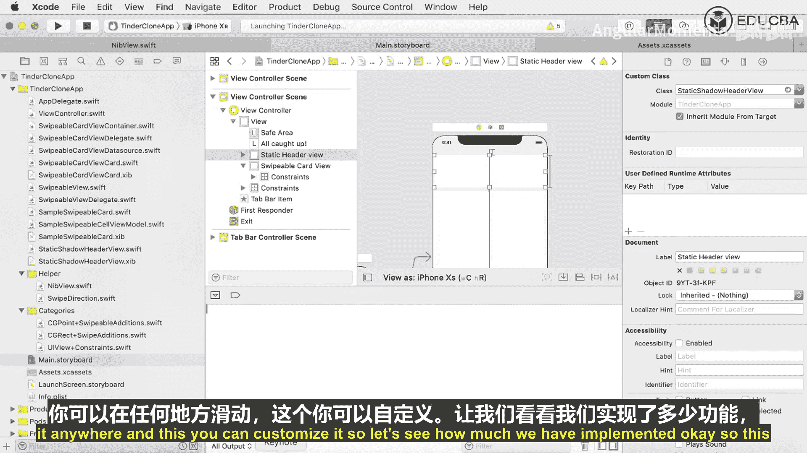

通过本课程，你已经掌握了使用Swift创建滑动匹配式应用界面的基本方法，可以在此基础上构建功能更丰富的社交应用。

---

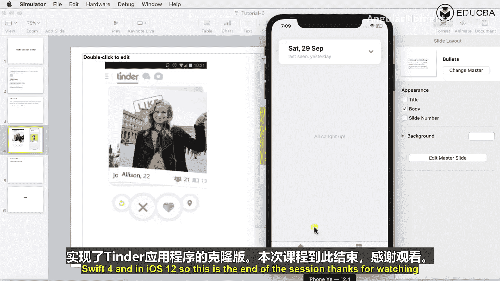

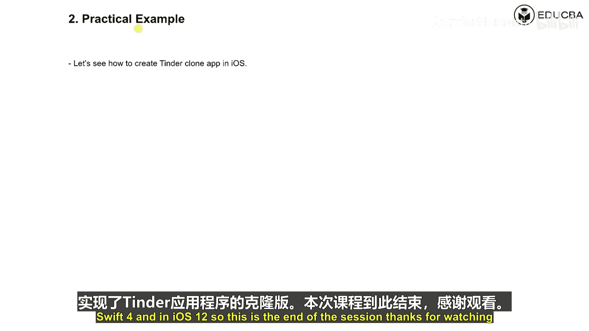

**本节总结**：本节课程完成了应用界面的最后润色。我们解决了数据源错误，配置了模拟用户数据，修复了界面连接问题，并确保了核心的滑动匹配功能正常运行。现在，一个基础版本的滑动匹配应用已经可以工作了。