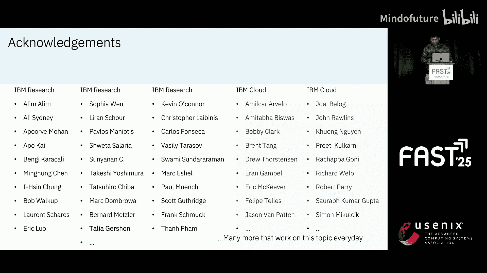
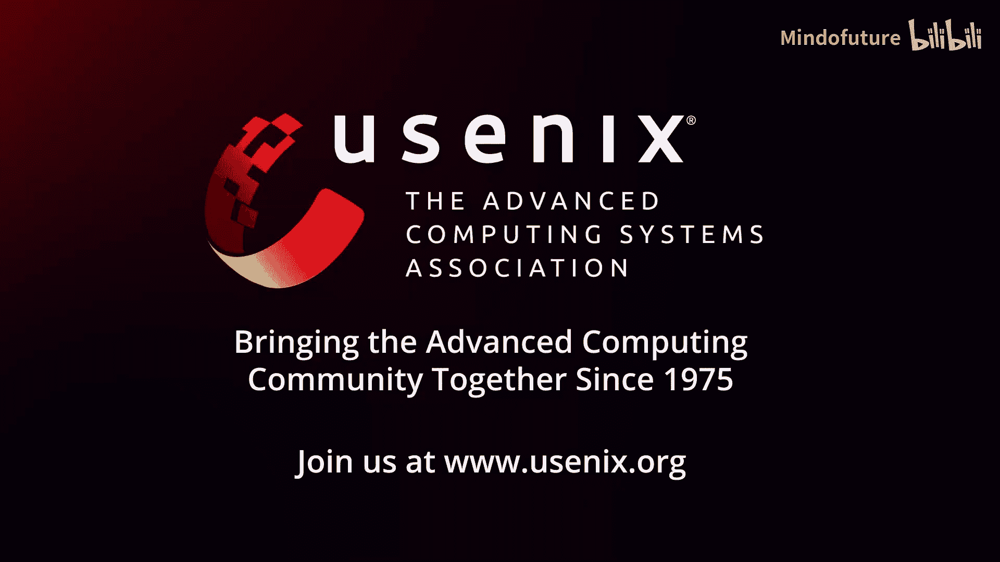

# 001：主题演讲——从交付两代AI超级计算机中获得的洞见

在本节课中，我们将学习一位资深工程师分享的个人职业旅程，以及构建和优化用于人工智能（AI）工作负载的云原生超级计算机系统的技术洞见。我们将涵盖AI工作流的全貌、系统设计原则、性能优化策略以及存储架构面临的挑战。

---

## 个人旅程与建议

上一节我们介绍了课程概述，本节中我们来看看演讲者分享的个人职业发展故事和建议。

我的职业生涯始于IBM研究院，当时我正在攻读研究生。我加入了IBM的高性能计算（HPC）小组，参与了包括Blue Gene系列在内的超级计算机的构建工作，专注于文件系统和性能工具。

在职业生涯的前5到10年，是进行深度技术工作的最佳时期。这个阶段通常管理负担较轻，可以专注于技术成长和建立广泛的专业社区网络。积极参与行业会议，与同行交流，建立一个强大的导师和同行社区至关重要，这对个人和职业发展都有长远益处。

随后，我转向了云计算领域。从一切追求性能的HPC，转向注重可用性、易用性和弹性的云平台，这是一个巨大的思维转变。这段经历表明，拥抱变化、学习新领域是持续成长的关键。

近年来，我的工作重心转向了构建AI系统。结合HPC的性能专长和云计算的灵活性，我们致力于设计能够支持完整AI工作负载生命周期的云原生AI超级计算机。

我强烈鼓励大家参与指导他人和教学活动。无论是指导同事、教授学生，还是帮助社区中的年轻人，这不仅能带来成就感，也是从日常工作中获得平衡的有效方式。

---

## AI工作流全景

上一节我们了解了演讲者的背景，本节中我们来看看现代AI，特别是基础模型，所涉及的完整工作流程。

AI模型开发远不止最终的训练阶段。一个完整的流程包括多个计算和存储密集型阶段：

以下是AI工作流的主要阶段：

1.  **数据准备**
    *   这是起点，如同“沙里淘金”。我们从数十PB的原始数据开始，通过过滤、清理和标注，最终得到可能包含数万亿令牌（tokens）的高质量数据集。
    *   此过程需要大量数据工程人力，计算任务可能持续数小时到数天，涉及数百甚至数千个CPU核心，虽然GPU使用相对较少，但步骤极其繁多且需要反复迭代。

2.  **分布式训练**
    *   在准备好数据并确定模型架构和超参数后，启动大规模的分布式训练。这类似于为马拉松进行长期训练。
    *   实际训练前的准备工作（如小规模试验）所消耗的基础设施资源可能与正式训练相当甚至更多。训练本身可能持续数周甚至数月，需要动用成千上万个GPU。

3.  **模型微调**
    *   训练得到的基础模型不能直接使用，需要针对特定用例进行微调。这就像完成基础教育后进入专业领域。
    *   微调可能涉及数百个任务，使用较少的GPU资源，并行尝试多种路径，然后评估选择最佳结果。

4.  **推理部署**
    *   这是模型产生实际价值的阶段。模型被部署以服务终端用户请求。
    *   推理是高度交互式、计算和内存密集型的任务。其性能通常受GPU内存带宽限制。关键指标是**每百万令牌的成本（美元）**，优化成本对于AI服务的长期成功至关重要。

---

## AI系统的计算需求

上一节我们梳理了AI工作流，本节中我们来量化训练这些模型所需的计算资源。

驱动AI模型训练规模的两个核心因素是：**数据量（D）** 和 **模型参数量（N）**。自2020年以来，这两个维度都在急剧增长。数据集从千亿令牌级别跃升至十万亿令牌级别，模型参数从十亿级别增长到万亿级别。

所需计算量的估算公式非常简单，一个六年级学生也能记住：

*   **预训练计算量 ≈ 6 × N × D**
    *   其中，`N`是模型参数量，`D`是训练数据令牌量。公式中的系数`6`是一个经验值，考虑了前向传播、反向传播等操作。
*   **推理计算量 ≈ 2 × N × D**
    *   推理主要涉及前向传播，计算量约为预训练的三分之一。
*   **微调计算量**
    *   微调使用的数据量`D`较小，但模型参数量`N`保持不变，因此计算量介于预训练和推理之间。

这些公式表明，AI对计算资源的需求呈组合式爆炸增长。

---

## 云原生AI超级计算机设计

上一节我们了解了AI的巨大算力需求，本节中我们来看看如何设计系统来满足这些需求。

我们的设计目标是构建一个云原生AI超级计算机（代号Vela），它需要兼顾高性能和云的灵活性。

以下是核心设计原则：

1.  **在以太网上实现高性能**：尽管云环境主要基于以太网，而非InfiniBand，但我们仍需通过优化实现接近裸金属的性能。
2.  **支持全工作负载生命周期**：系统必须同时支持训练、微调和推理，而不仅仅是训练。
3.  **具备云的操作灵活性与弹性**：能够快速部署、扩展，并适应全球不同规模和形态的数据中心。
4.  **优化功耗、空间和冷却效率**：AI硬件功耗巨大，必须创新设计以提高数据中心机架密度和能效。

系统采用标准的云数据中心脊柱-叶子（Spine-Leaf）网络架构，通过虚拟化提供计算资源，但关键是通过技术优化（如GPU Direct RDMA）使虚拟机能获得接近裸机的性能。

我们通过启用**GPU Direct RDMA over Ethernet**技术，让GPU能够直接跨节点通信，避免了数据经CPU拷贝的开销。这使得网络吞吐量提升了2-4倍，网络延迟降低了约10倍，从而能将20B参数模型的训练时间缩短至合理范围。

面对高功耗挑战，我们重新设计了电源方案。传统云机柜为冗余保留一半电源容量。我们改为让GPU节点在检测到电源故障时自动降频（功耗在1.5秒内从700W降至150W），而非直接崩溃，从而实现了机柜计算密度的翻倍，提高了资源利用率。

---

## 存储架构与挑战

上一节我们探讨了计算和网络优化，本节中我们聚焦于AI工作负载中的存储数据架构。

AI系统中的数据流主要涉及三层存储：

以下是AI存储架构的三层：

1.  **对象存储**
    *   这是数据的源头和归宿。容纳PB级别的原始数据集、处理后的数据以及最终模型。提供极佳的成本效益和规模，但性能通常不足以支撑高强度训练。

2.  **分布式文件系统**
    *   这是高性能计算的“热点数据缓存层”。训练和微调作业从此处读取输入数据，并写入检查点（checkpoint）和中间结果。它需要提供高带宽和低延迟，以避免GPU空闲。
    *   **关键需求**：与对象存储的同步必须是自动化和无缝的，而非手动拷贝。

3.  **本地存储**
    *   位于GPU节点内部，速度最快。常用于缓存频繁访问的数据，如微调数据集或推理时的KV缓存。
    *   **挑战**：容量有限，若被长期独占会导致整体基础设施利用率低下。

当前的主要挑战在于**数据在存储层间的透明迁移**。用户仍需手动管理数据在不同层级间的移动。未来的研究方向包括：使数据迁移对用户不可见；让分布式文件系统缓存层能根据需求弹性伸缩；以及开发用于存储系统的自动化运维工具（“自动驾驶仪”）。

在我们的实践中，使用IBM Spectrum Scale（GPFS）作为高性能缓存层，显著改善了数据加载时间和作业执行的稳定性。

---

## 经验总结与未来展望

在本节课中，我们一起学习了从构建两代AI超级计算机中获得的核心洞见。

首先，**AI工作负载变化迅猛**。与其完全相信研究人员对未来的预测，不如假设AI将取得巨大成功，并以此为前提进行系统设计，前瞻性地思考百倍规模下可能出现的问题。

其次，**在实践中学习和迭代优于追求完美**。尽早将系统交予用户使用，收集反馈并持续改进，这比闭门造车能学到更多。当然，初版系统需具备基本可用性。

再者，**自动化运维至关重要**。我们需要更智能的工具（如“自动驾驶仪”）来自动诊断硬件故障、性能降级等问题，否则工程师将陷入无尽的调试工作，无法推进根本性创新。

最后，**AI革命才刚刚开始**。其中蕴含着巨大的机遇。构建这些系统是数百人团队协作的成果。我鼓励大家积极参与到这个旅程中，与社区交流，共同应对挑战。

本节课总结了个人在HPC、云计算和AI领域的交叉经验，深入探讨了支持现代基础模型全生命周期的云原生AI超级计算机的设计、优化和存储考量。核心在于平衡高性能与云的弹性，并通过自动化应对运维复杂度，以支撑AI的持续演进。