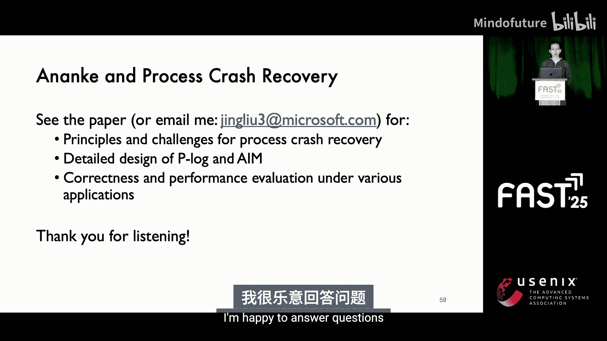

# 002：Ananke - 快速透明的文件系统微内核恢复


在本节课中，我们将学习一项名为“Ananke”的研究工作，它旨在为文件系统微内核提供快速、透明的进程崩溃恢复。我们将探讨其核心挑战、设计原理以及如何实现高效恢复。

---

## 概述

文件系统微内核将文件系统服务构建为用户空间进程，无需操作系统内核参与。这种架构因其性能优势、易于开发和升级以及更好的故障隔离而受到关注。然而，当文件系统进程崩溃时，会面临与传统内核文件系统崩溃（等同于断电）不同的恢复挑战。Ananke 通过引入名为 **Plog** 的内存日志和 **M 算法**，旨在正确、高效地恢复内存与磁盘之间的“状态间隙”，实现快速透明的恢复。

---

## 文件系统微内核与恢复挑战

上一节我们介绍了文件系统微内核的基本概念。本节中我们来看看其独特的崩溃恢复模型所面临的挑战。

当内核文件系统崩溃时，会导致整个操作系统崩溃，所有应用程序都会失去进度，因此其恢复方式与断电恢复类似，仅使用磁盘状态。然而，当作为进程的文件系统微内核崩溃时，只会导致该进程崩溃，操作系统和其他应用程序可以继续运行。

这带来了新的机遇，但也带来了核心挑战：**恢复状态间隙**。文件系统的更新首先发生在内存中，因此在磁盘状态和应用程序视图之间存在一个“状态间隙”。此外，后续操作或后台行为（尤其是非顺序操作）可能会任意改变这个状态间隙。

---

## Ananke 的核心设计

为了解决上述挑战，Ananke 设计了核心机制。接下来，我们将深入探讨其核心数据结构 **Plog** 和恢复算法 **M**。

### Plog：为进程崩溃恢复设计的内存日志

Plog 是嵌入在文件系统进程中的内存日志，用于记录操作和其他信息。当文件系统崩溃时，操作系统协调控制权转移，通知一个新的文件系统进程，然后使用 Plog 来恢复状态间隙。

Plog 的条目设计用于高效追踪操作如何影响状态间隙。每个条目包含：
*   **一个数组**：记录操作可能影响的目标（例如文件描述符、inode号）。
*   **一个位图**：追踪该操作对这些目标的更新是否仍然对状态间隙有贡献。

以下是 Plog 条目结构的简化表示：
```c
struct plog_entry {
    int targets[MAX_TARGETS]; // 可能影响的目标标识符数组
    bitmap_t contribution_bits; // 贡献位图，每位对应一个目标
    // ... 其他元数据（如操作类型、参数）
};
```

通过检查位图，可以快速判断一个已记录的操作是否仍需在恢复时被考虑，这有助于降低正常路径的开销。

### M 算法：决定恢复时的操作

Plog 记录了“发生了什么”，而 **M 算法**（代表 **Act**、**Ignore** 或 **Modify**）则决定在恢复时“该怎么做”。它负责将 Plog 中的记录转换为可由原始文件系统实现执行的动作。

M 算法对每个已记录的操作做出三个决策之一：
1.  **忽略**：如果该操作对当前状态间隙已无贡献，则忽略它。
2.  **执行**：直接重放该操作，使用原参数。
3.  **修改执行**：需要采取行动，但必须以修改的形式（例如，不同的操作类型或参数）。

这个决策基于 Plog 条目中的贡献位图以及恢复期间维护的路径名到 inode 的映射视图。

---

## 状态间隙的复杂性及解决方案

上一节我们介绍了 Ananke 的核心组件。本节中我们来看看状态间隙为何复杂，以及 Plog 和 M 算法如何协同解决。

状态间隙复杂的原因主要有两点：
1.  **后续操作移除更新**：例如，`close` 操作会移除文件描述符，`fsync` 操作会使某些更新持久化到磁盘，从而将它们从状态间隙中移除。
2.  **后续操作改变前置条件**：例如，一个文件被打开、写入，然后重命名。崩溃后，需要重放写入操作，但无法使用原始路径名重放打开操作，因为路径映射已改变。

Plog 和 M 算法共同应对这些挑战：
*   Plog 通过位图动态追踪每个操作的更新是否仍“有效”（即仍属于状态间隙）。
*   M 算法在恢复时扫描日志，识别像 `fsync` 和 `rename` 这样的操作，回溯并更新那些依赖于已改变路径映射的先前操作的参数（例如，将打开操作的路径名从旧名改为新名），从而实现正确的修改执行。

---

## 评估与总结

我们已了解了 Ananke 的设计原理。最后，我们来看看它的实际效果如何。

对 Ananke 的全面评估表明：
*   **正确性**：在超过 3 万次故障注入实验中，Ananke 均提供了故障透明性（即应用程序无感知）。
*   **低开销**：在大多数情况下，正常路径的性能开销低于 **2%**。
*   **恢复速度快**：恢复时间极短，即使对于具有挑战性的工作负载，对应用程序而言也仅表现为瞬间的性能下降。

### 总结

本节课中我们一起学习了 Ananke，一个为文件系统微内核提供快速透明进程崩溃恢复的系统。其核心创新在于 **Plog** 内存日志和 **M 算法**，它们能够高效、正确地恢复崩溃进程留下的状态间隙，而无需在正常路径引入额外的刷盘操作，从而兼顾了低开销和快速恢复。

更广泛地说，将进程崩溃恢复与全系统崩溃恢复分离是一个重要范式转变。进程崩溃不同于断电，它为实现不丢失状态间隙的透明恢复提供了巨大机遇。我们期望进程崩溃恢复能够提升当今大规模系统中本地文件系统服务的可靠性，减轻全局恢复的负担。




---