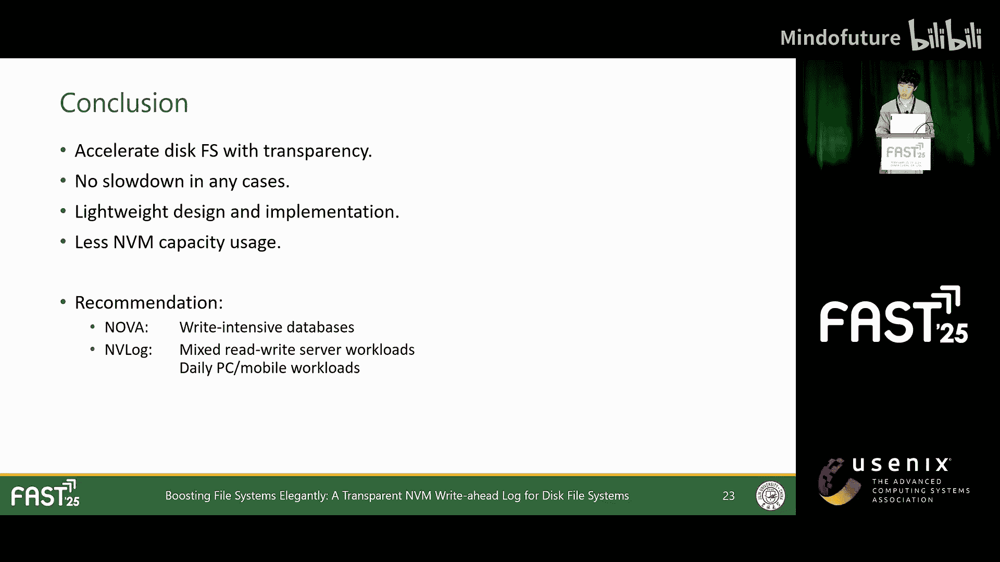
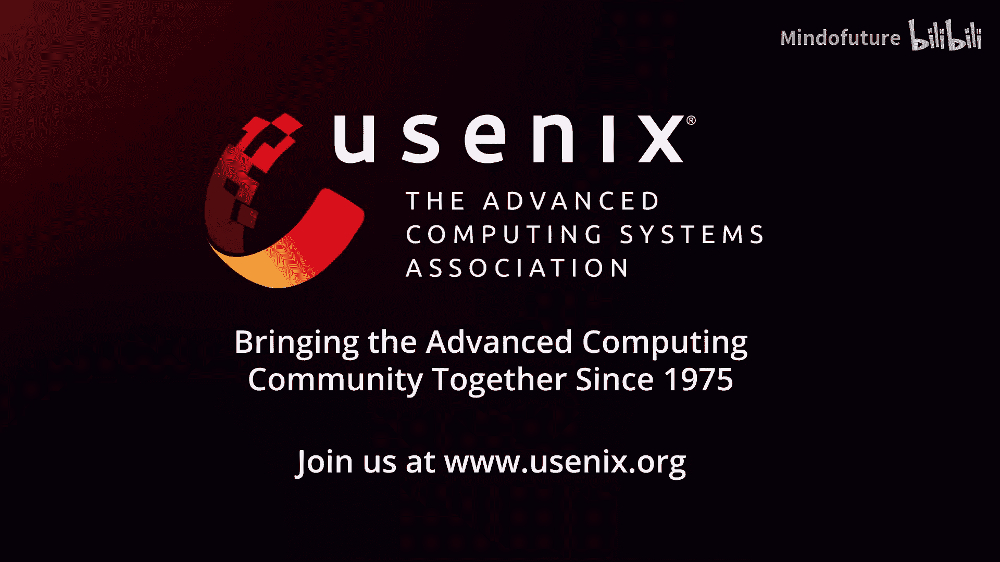

# 003：优雅提升文件系统性能——面向磁盘文件系统的透明NVM预写日志

在本节课中，我们将学习如何利用非易失性内存（NVM）来优雅地加速传统磁盘文件系统。我们将介绍一种名为 `enlog` 的透明预写日志方案，它能够在不修改应用程序和文件系统的情况下，显著提升同步写入操作的性能，同时保留磁盘缓存（D-cache）在处理其他操作时的高效率。

## 概述：为何需要NVM加速磁盘文件系统？

在过去的十年中，非易失性内存（NVM）技术兴起。与传统磁盘相比，NVM具有更高的持久化性能和更细粒度的写入支持。然而，专为NVM设计的文件系统并非完美解决方案。

NVM文件系统面临一些挑战：NVM容量通常小于磁盘；将数据从旧磁盘文件系统迁移到新NVM文件系统给用户带来不便；NVM文件系统的一致性语义可能与磁盘文件系统不同；新编写的NVM文件系统代码可能不如久经考验的磁盘文件系统稳定。

从性能角度看，虽然NVM本身比磁盘快，但NVM文件系统并不总是优于磁盘文件系统。这是因为磁盘文件系统通常由D-cache加速，而大多数NVM文件系统会绕过D-cache。

以Nova和EXT4为例：对于读操作，当缓存热时，磁盘文件系统性能优于NVM文件系统；当缓存冷时，NVM文件系统性能更优。对于写操作，带有D-cache的磁盘文件系统在异步写入时性能优于NVM文件系统，而NVM文件系统在处理同步写入时性能更优。

综上所述，NVM文件系统的优势主要体现在两个方面：缓存冷时的读操作，以及同步写操作。对于其他可以被D-cache加速的操作，磁盘文件系统性能更好。

因此，我们面临一个问题：能否结合磁盘文件系统和NVM文件系统两者的优势？答案是肯定的。我们可以在NVM上加速同步写入，同时保留D-cache处理快速操作的能力。

## 现有方案的局限性

当前已有一些利用NVM加速磁盘文件系统的方案，但它们未能达到最佳实践。

*   **SPFS**：通过预测同步事件将部分数据接管到NVM来加速磁盘文件系统。但在同步操作不规则或不频繁的场景下，它无法提供有效加速。接管数据后，还可能拖慢后续的读写操作。
*   **Pettoc**：允许从D-cache快速读取，但代价是写入性能。它将所有数据（无论同步还是异步）都写入NVM，这显然会导致异步写入工作负载的性能下降。

这些加速器模糊地接管了大量数据，而不是精确地只加速缓慢的同步操作。此外，由于需要频繁访问NVM数据，它们必须在运行时为NVM建立索引，这引入了复杂性和性能开销。同时，它们还需要持续占用大量NVM空间。

我们发现，先前的工作忽略了两点关键因素：
1.  D-cache已经提供了高效的索引和数据检索机制。因此，NVM应只专注于持久化同步数据，应避免为NVM建立索引和从NVM检索数据的需求。
2.  NVM写入和磁盘写入可能以随机顺序交错。先前的工作为了避免这种交错导致的数据版本不一致，接管了所有操作和大量数据。我们发现，理清跨不同设备的写入时序关系，有助于减少不必要的数据和操作被接管，从而充分利用RAM的高性能。

## `enlog`的设计目标

我们希望将NVM高效地集成到现有系统中，它应具备以下属性：
1.  **透明性**：对上层应用程序和底层磁盘文件系统都透明。这样可以避免要求修改用户程序，同时仍能重用成熟的磁盘文件系统，并避免数据迁移的开销。
2.  **一致性保证**：不损害磁盘文件系统中同步操作的一致性保证。同时，无需在非同步场景引入强一致性，因为这只会降低性能。
3.  **无性能降级**：确保在任何场景下（无论是读或写，同步或异步）都不会对现有磁盘文件系统造成性能降级。
4.  **轻量高效**：设计并实现一个轻量级、高效的解决方案，占用尽可能少的NVM空间。

## `enlog`的核心设计

我们设计了 `enlog`。与先前工作不同，`enlog` 不是一个文件系统，而是一个专门为磁盘文件系统设计的预写日志。

类似于数据库中的重做日志，`enlog` 专注于记录写入事件，以便在崩溃后可以重放尚未提交到磁盘的数据。它拥有预写日志的所有优点。

但与数据库重做日志不同，`enlog` 不要求将所有数据都写入磁盘，因为那样会降低性能。相反，`enlog` 只记录受同步操作影响的数据，以绕过缓慢的磁盘I/O。

我们在VFS层通过 `vfs_fsync_range` 拦截同步写入，将所有其他操作留给更快的D-cache处理。同时，我们提供细粒度的数据持久化，并解决NVM和磁盘写入交错引起的一致性问题。

## `enlog`的数据结构

在介绍同步写入步骤前，首先介绍 `enlog` 用于在NVM上存储数据的数据结构。

`enlog` 采用日志型结构。首先，`inode log` 用于持久化单个文件的同步数据。对于每次写入，数据按页边界划分，每个部分由一个 `inode log entry` 保存，如上图中的绿色块所示。

其次，对于每个 `inode log`，其头部和尾部信息存储在一个特殊的 `super log entry` 中，即图中的小蓝色块。所有的 `super log entry` 共同构成了整个 `super log`。为了方便恢复，这个 `super log` 的起始位置被放置在NVM的零地址。

需要注意的是，当数据按页划分时，其头部和尾部可能不对齐页边界，这可能导致数据块小于一页。中间部分可能包含页对齐的、包含完整页数据的块。对于未对齐的小数据块，我们使用 `in-place log entry` 将数据按字节写入日志条目本身，如图中的条目0和条目3。对于完整的页数据块，我们将数据写入单独的NVM页，并使用 `out-of-place entry` 链接它们，如图中的条目1和条目2，以便于后续的垃圾回收。

## 同步写入流程

以下是传统磁盘文件系统的同步写入步骤。可以看到，一旦同步发生，就需要等待缓慢的磁盘I/O。由于磁盘的最小写入粒度是块，此操作无法实现细粒度持久化。

在 `enlog` 中，我们不等待缓慢的磁盘I/O，而是将同步数据写入NVM中的 `enlog` 并立即返回。这些页将在后台异步写回磁盘。

对于 `O_SYNC` 写入，我们知道正在写入数据的偏移量和长度。由于NVM支持字节粒度写入，我们可以为小的 `O_SYNC` 写入实现细粒度持久化。

我们进一步说明同步进程与日志条目的对应关系。对于 `O_SYNC` 写入，写入的未对齐部分使用 `in-place entry` 处理以实现细粒度写入，如图中黄色部分。对齐的完整页数据则使用 `out-of-place entry` 写入，如图中红色部分。

对于独立的同步调用，如 `fsync` 和 `fdatasync`，由于我们只知道调用时哪些页是脏的，但不知道具体哪些字节是脏的，我们只能在页粒度上吸收同步写入。如图所示，现在我们知道，在 `fsync` 调用中，少量粉色的用户写入可能导致一大块红色数据被写入存储介质。

但由于NVM支持字节粒度写入，我们能否使同步操作也实现细粒度？当然，跟踪每个字节的脏状态是不切实际的。然而，我们也知道在 `O_SYNC` 写入中，`enlog` 可以以字节粒度吸收数据。基于此观察，我们的想法是预测文件的同步模式，并主动为每个文件标记或清除 `O_SYNC` 标志。通过这种主动同步机制，当文件上发生连续、分散的小同步写入时，`enlog` 可以用更细的粒度吸收它们中的大部分。

## 处理写入交错与一致性

由于存在两种不同的写入路径：一种从D-cache到NVM，另一种从D-cache到磁盘，它们之间的任何交错都可能导致一致性问题。换句话说，如果顺序未知，在崩溃恢复期间，一些过时的NVM数据可能会覆盖磁盘上已更新的数据。

我们的解决方案是在NVM上记录必要的磁盘写回事件，如图中紫色气泡所示，以建立一个全局时钟。更多细节可以在我们的论文中找到。

## 垃圾回收

为了理解垃圾回收过程，我们需要知道哪些NVM记录（即条目）不再需要。由于我们在写入时沿页边界分割数据，我们可以看到每个条目对应一个单独的页。

如果整个页被覆写，即存在一个 `out-of-place entry`，那么与该页相关的所有先前条目都可以被丢弃。或者，如果一个页已被写回磁盘，这意味着该页之前的所有写入都已保存，因此在该写回事件之前该页的条目也可以被丢弃。

之后，我们只需要调度一个后台线程来回收这些未使用的条目和关联的数据。以下是一些例子：这些 `out-of-place entries` 和 `rep entries` 将使该页的先前条目过期。

## 崩溃恢复

对于崩溃恢复，我们首先需要识别每个页的所有相关条目。我们对整个 `enlog` 进行全扫描，将与同一页相关的所有元素链接成一个链表。然后，我们顺序访问每个页，并将未过期的条目重放到磁盘上。

## 实验评估

以下是我们的实验设置。由于时间限制，此处不详细展开，但请注意我们所有的评估都是在缓存热的情况下进行的。一方面，缓存命中是大多数工作负载的常态；另一方面，我们只加速同步写入，因此需要避免缓存未命中造成的性能干扰。

首先，我们测试了多种文件系统和加速器在不同读写和同步比例下的性能。我们的 `enlog` 在完全没有同步操作时保持了D-cache的高性能，在这种情况下我们可以超越NVM文件系统及其全同步写入。它可以匹配NVM文件系统的性能，并且在处理混合读写和异步请求时，在所有系统中实现了最佳的整体性能。这种高性能的关键原因是 `enlog` 精确地加速了同步操作，同时允许D-cache更快地处理所有其他请求。

接下来，我们进行了纯同步写入性能测试。我们可以为磁盘文件系统提供高达15倍的加速，对于小的同步写入，其性能甚至可以通过Nova四倍，因为 `enlog` 支持细粒度写入。

需要注意的是，在16kB大块同步写入的情况下，`enlog` 的性能比Nova差，因为Nova只需要写入NVM一次，而 `enlog` 需要同时写入NVM和D-cache。然而，我们认为需要纯大块同步写入的应用程序相对较少，因此，在更广泛的使用场景中，牺牲一点同步写入性能以获得更好的异步写入和读取性能是值得的。

接下来，我们测试了垃圾回收性能。可以看到，在GC的帮助下，`enlog` 只临时占用少量的NVM空间。

我们还使用真实世界的工作负载测试了 `enlog`。结果表明，在各种任务下，`enlog` 至少可以匹配磁盘文件系统和NVM文件系统中最佳者的性能，证明了其广泛的适用性。

## 总结

本节课中，我们一起学习了一种利用NVM透明加速磁盘文件系统的新方法。通过将NVM作为预写日志集成到系统中，我们可以精确地吸收那些缓慢的同步写入到NVM，同时将其他操作留给D-cache。这种设计确保了 `enlog` 在任何情况下都不会导致磁盘文件系统的性能降级。

此外，我们采用了轻量级的设计和实现，仅使用少量的NVM空间。我们相信，这种对NVM的无痛使用更有可能被传统存储系统的用户广泛接受。

我们建议需要大量细粒度同步写入的写密集型数据库或类似应用程序选择Nova。除此之外，对于具有混合读写工作负载的服务器、PC和移动设备，我们相信 `enlog` 具有更大的潜力。

最后，该原型已在Github上开源。这就是我今天要分享的内容。谢谢。

