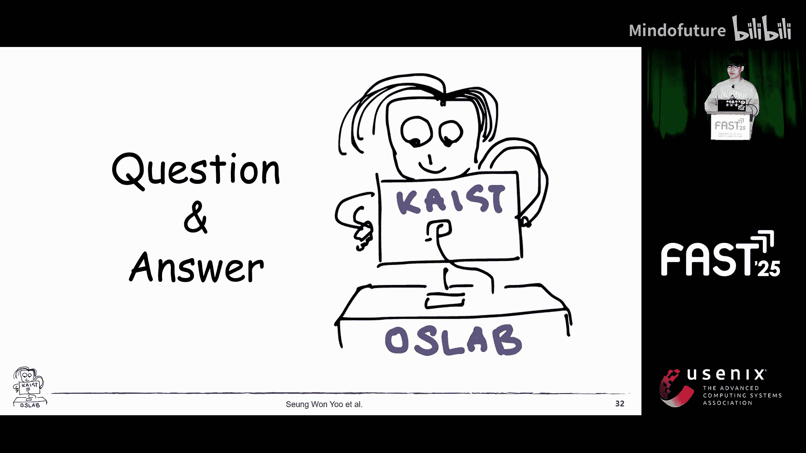

# 004：面向CMM-H SSD的目录粒度文件系统日志技术

## 概述

在本节课中，我们将学习一种名为DJFS（Directory-Granularity Filesystem Journaling）的新型文件系统日志技术。该技术旨在解决传统日志机制在现代高性能存储设备（如CMM-H SSD）上导致的性能瓶颈问题。我们将从硬件演进背景出发，分析传统日志的问题，然后深入探讨DJFS的设计目标、核心原理、关键技术挑战及其性能评估。

## 硬件快速演进

我们首先回顾CPU和存储设备从1990年至今的发展历程。

在过去30年里，CPU核心数量增加了128倍。对于存储设备，其I/O延迟在20年内降低了约10,000倍。

## 传统日志机制的性能瓶颈

为了提供文件目录抽象层的崩溃一致性，日志或写时复制技术被广泛使用。

然而，日志机制会导致严重的性能下降。

幻灯片中的图表展示了文件创建基准测试（MDtest）的结果，对比了JBD2和F2FS的`fsync`提交。结果显示，使用日志机制会导致约70%的性能下降。

任何使用文件目录抽象层的应用程序都可能因日志机制而遭受性能下降。

诸如AIM、RocksDB、MySQL、Git和虚拟机等应用程序都依赖于文件目录抽象。文件系统更新通过日志机制反映到存储设备，因此应用程序无法充分利用像CMM-H这样的现代高性能存储设备的性能。

日志机制的瓶颈可归纳为以下四个方面：

以下是四个主要瓶颈：

1.  **事务锁争用**：在许多日志技术中，多个操作将元数据更新插入到单个事务中。为了防止线程间的竞态条件，必须获取事务锁。
2.  **事务冲突**：当要插入到事务中的对象已经属于另一个事务时，就会发生事务冲突。当冲突发生时，新事务必须等待前一个事务提交。
3.  **串行提交**：许多通用文件系统在日志区域内串行化事务提交。即使发出了提交请求，在大多数情况下也必须等待前一个事务首先提交。
4.  **事务锁延迟**：在组提交期间，没有事务的文件操作必须在事务提交开始前完成。为了防止组提交延迟，在此期间不能将新的文件操作插入到事务中，发起新文件操作的线程必须等待。

## 现有解决方案及其局限性

许多研究被提出来解决日志的可扩展性问题。

*   **2014/2015年**：ISF2和SPAP引入了按分区的事务分配。
*   **2017年**：I-Journaling提出了按inode的事务分配。
*   **2021年**：Z-Journaling引入了按路径组件（Popcorn）的事务分配。这种分配在事务冲突很少发生的情况下表现良好。
*   **2023年**：CJ-Journaling提出了专为并发提交设计的技术。这在事务冲突频繁的Workload中显示出令人印象深刻的性能。
*   **2024年**：F-Journaling结合了逻辑日志和物理日志。这最小化了频繁文件操作的日志大小，从而减少了写放大。

然而，每种日志技术都有其局限性。

*   按分区的事务分配需要修改磁盘布局。
*   按inode的事务分配难以从组提交效果中受益。
*   按路径组件的事务分配经常遇到事务冲突，需要链接多个影子页来解决，这增加了写放大。
*   并发提交是基于原子持久性I/O设计的，使其只能在特定设备上使用。
*   混合日志在事务日志提交期间缺乏细粒度的事务锁，显著增加了锁持有时间。

## CMM-H SSD与设计目标

现在，这张幻灯片介绍了CMM-H，这是一种支持基于CXL域协议进行I/O操作的SSD。CMM-H支持两种I/O模式：通过CXL.io的块I/O和通过CXL.mem的缓存行I/O。

这两种I/O模式的区别可以类比为卡车和特斯拉汽车。块I/O具有高带宽但高延迟，而缓存行I/O具有低带宽但低延迟。

通过分析先前的研究，我们为日志可扩展性确立了三个目标：

以下是我们的三个设计目标：

1.  **最小化开销**：减少事务锁持有期间被阻塞的文件操作数量。
2.  **最小化冲突**：防止由事务冲突引起的不必要的事务串行化。
3.  **最大化事务合并度**：减少每次事务提交的缓存刷新开销。

## 应用行为分析与目录粒度事务

为了探索满足这三个目标的事务分配方法，我们分析了八个应用程序的文件操作模式。这些应用包括AIM、Lustre、MySQL、Git、Mercurial、Btrfs和HDFS。

我们发现了三个关键属性：

以下是分析得出的三个关键属性：

1.  **专用目录（属性D）**：应用程序在其自己的目录内工作。例如，AIM在`school`和`mail`目录中执行文件操作，RocksDB在系统管理员指定的目录内操作，MySQL也在指定的目录中执行文件操作。
2.  **目录更新（属性U）**：更新文件内容涉及创建和删除文件。一个众所周知的例子是原子重命名。此外，随着日志结构写入的日益普及，这种趋势变得更加明显。例如，RocksDB不操作现有的SST文件，而是创建一个新的SST文件并向其中写入数据。
3.  **共享目录（属性S）**：应用程序更新属于同一目录的多个文件。例如，在AIM中，每封邮件的邮件数据和邮件头都在同一个`school`目录中创建。

基于专用目录属性，每个应用程序在其目录上工作，与其他应用程序隔离。因此，如果我们按目录分配事务，一个应用程序在恢复期间的事务不会影响其他应用程序的事务。

其次，使用按目录的事务，我们可以通过属性U和S携带多个相互关联的文件操作。

由于按目录事务的上述好处，我们决定将目录设置为日志事务的单位。

## DJFS核心设计

在DJFS中，更新的元数据被插入到路径字符串最深层组件的父目录的运行事务中。

这是一个时间序列示例。当调用`create(“/D”)`时，以下对象被插入到D的运行事务中：`D inode`、`D directory entry`和`A inode`。然后当调用`open(“/D/F1”)`时，以下对象被插入到D1的事务中：`F1 inode`和`F1 directory entry`。当调用`link`时，以下对象被插入到D2的事务中：`F2 inode`、`D2 directory entry`和`F2 inode`。

这张幻灯片从三个轴（锁开销、冲突和合并度）分析了先前的工作。与其他日志技术不同，我们实现了所有三个目标。

在DJFS中，每个目录最多可以有一个运行事务和一个提交事务。

当文件操作被调用时，它识别目录并将日志记录插入到该目录的运行事务中。运行事务可以定期提交，也可以通过`fsync`提交。

在DJFS中，多个事务可以同时提交，如果在短时间内调用了几个`fsync`。

我们的DJFS仅记录文件元数据，例如inode、文件映射和目录项。文件系统元数据在崩溃恢复期间重建，就像在I-Journaling或Concurrent Commit中一样。这是为了减少事务冲突的频率。

对于inode，DJFS使用256字节的物理日志。对于索引和目录块，它使用基于Bmap的缓存行粒度差异日志。DJFS采用细粒度日志的原因是为了确保日志能够放入CMM-H缓存中。

该图说明了相同X动态映射的随机输出，作为数据集大小的函数。随着数据集大小的增加，吞吐量下降。

## 关键技术挑战与解决方案

为了实现按目录事务，存在三个挑战。

以下是三个主要挑战及其解决方案：

1.  **事务选择**：一个inode可以被多个目录项引用。那么同一个inode可能存在多个运行事务。日志模块需要选择事务。
2.  **多事务原子性**：单个文件操作可以更新多个目录。我们需要一种机制以原子方式处理多个目录更新。
3.  **解决目录事务冲突**：冲突下的事务需要正确同步。

**解决方案1：基于路径的事务选择**
一个文件可以有多个链接，因此可以有多个父目录。在这种情况下，我们使用一种称为基于路径的事务选择的技术。如果文件操作需要路径，则文件操作基于路径选择运行事务。当文件操作接收到文件描述符时，它通过从关联的文件结构跟踪目录项来跟踪路径。

**解决方案2：事务队列**
单个文件操作可能更新多个目录。在这种情况下，文件操作的原子性可能会受到损害。为了解决这个问题，我们开发了事务队列技术。事务队列将两个事务合并为一个。在此示例中，D1事务和D2事务被排队。

**解决方案3：运行-运行冲突处理**
当一个事务尝试更新属于另一个运行事务的元数据对象时，会发生运行-运行冲突。如果文件系统检测到运行-运行冲突，文件系统将两个事务排队，并为冲突操作更新现有的日志记录。

**解决方案4：运行-提交冲突处理**
当文件操作更新属于提交事务的元数据对象时，会发生运行-提交冲突。如果文件系统检测到运行-提交冲突，文件系统会延迟提交运行事务，直到冲突下的提交事务在存储中持久化。

## 性能评估

这是评估设置。我们使用了双路Intel SPR机器和CMM-H原型。我们使用Ubuntu 22.02和Linux内核5.18。我们使用了六种日志模块：JBD2、F2FS commit、CJ-Journaling、Z-Journaling、I-Journaling和DJFS。

其中，JBD2、F2FS commit、I-Journaling、DJFS使用CXL.mem接口来持久化事务。此外，我们将DJFS的细粒度日志应用于JBD2和I-Journaling。

我们使用了四个宏基准测试：Postmark、MDtest、AIM和RocksDB fill-sync。

我们展示了MDtest和RocksDB fill-sync的吞吐量。MDtest是一个元数据密集型基准测试，DJFS显示出比F2FS commit高2.4倍的吞吐量。在RocksDB fill-sync中，它显示出与F2FS commit几乎相似的吞吐量。

然后，我们测量了所有四个基准测试中每个工作负载的事务锁持有间隔长度。由于细粒度的事务粒度，DJFS显示出事务锁持有时间的显著减少。

接下来，我们计算了由于事务冲突而导致事务被阻塞的次数，我们称之为冲突计数。按目录和按路径组件的事务分配几乎消除了事务冲突，因为它们是面向每个文件系统数据结构的事务分配。

然后，我们计算了每个事务的文件操作数量。按目录的事务成功地比按路径组件的事务携带了更多的文件操作。

## 总结

本节课中，我们一起学习了DJFS的设计与实现。

我们分析了应用程序的文件数据行为，并得出结论：它围绕专用目录展开。

我们提出了一种新的文件系统日志单位：目录。

对于CMM-H，我们需要一种能够利用CMM-H访问局部性的新日志文件系统。

因此，我们提出了DJFS，即目录粒度日志文件系统。

