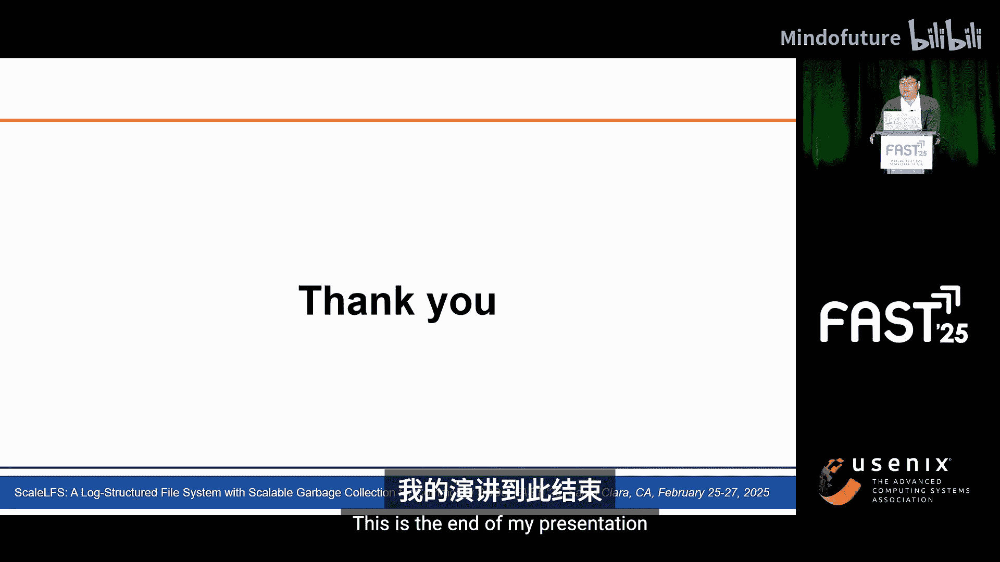
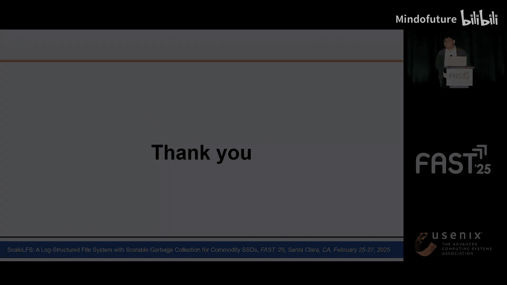
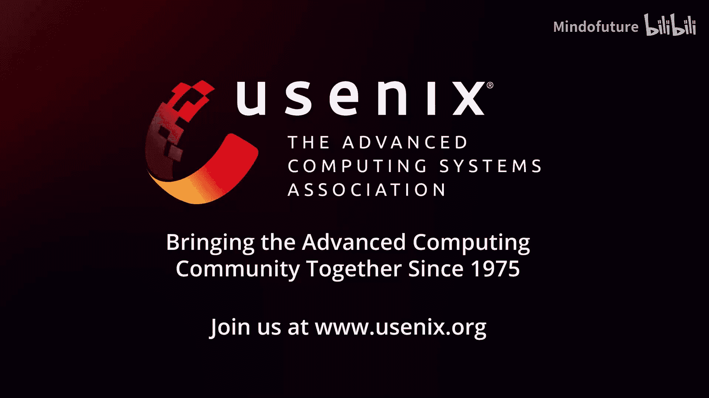

# 005：ScaleLFS - 为商用SSD设计的具有可扩展垃圾回收功能的日志结构文件系统 🗂️

## 概述
在本节课中，我们将学习一种名为ScaleLFS的新型日志结构文件系统。该系统通过并行化垃圾回收过程，显著提升了文件系统的持续性能。我们将深入探讨其设计原理、核心组件以及性能表现。

---

## 日志结构文件系统与垃圾回收瓶颈

上一节我们概述了ScaleLFS的目标。本节中，我们来看看其要解决的核心问题：传统日志结构文件系统中的垃圾回收瓶颈。

日志结构文件系统（LFS）通过仅追加的方式写入数据来优化写操作。在LFS中，新数据被写入连续的LBA，以利用顺序写入的高性能。当数据被覆写时，之前的页面变为陈旧并被标记为无效。如果无效页面积累导致空闲空间不足，LFS会通过垃圾回收来回收空间。在GC过程中，LFS选择一个连续的LBA范围作为受害者段，并将有效页面从受害者段迁移到空闲空间。

然而，频繁的GC会显著降低LFS的持续性能。因为GC在单线程中运行，它会形成一个瓶颈。如图所示，GC触发后，应用带宽最多下降了68倍。

一个直观的改进方法是引入GC多线程。然而，如下图所示，增加GC线程数并未提升性能。这个结果是由于当前GC过程中锁争用的增加导致的。因此，需要并发且可扩展的GC技术。

---

## 传统LFS中的可扩展性瓶颈

上一节我们看到了GC的瓶颈。本节中，我们基于广泛使用的FFS文件系统，分析阻碍GC可扩展性的四个关键瓶颈。

以下是四个主要瓶颈：
1.  **共享资源**：GC的目标段和页缓存被多个线程共享，导致同步开销。解决方案是为每个GC线程分配专用资源。
2.  **受害者选择的过度争用**：受害者选择操作被互斥锁独占保护，形成了可扩展性瓶颈。解决方案是允许并发受害者选择。
3.  **过度的元数据同步**：段元数据被单个互斥锁保护，迫使所有线程等待。解决方案是启用并发段元数据更新。
4.  **粗粒度的数据保护**：GC线程和I/O线程在文件级别竞争访问，造成争用。解决方案是切换到页面级别以减少争用。

---

## ScaleLFS的核心组件

上一节我们分析了问题所在。本节中，我们来看看ScaleLFS提出的三个核心解决方案组件。

ScaleLFS建立在三个关键组件之上：专用垃圾收集器、可扩展受害者管理器和可扩展受害者保护器。

1.  **专用垃圾收集器**
    DGC是一个拥有自己专用页缓冲区和目标段的GC线程，这减少了资源共享开销。
2.  **可扩展受害者管理器**
    SVM允许多个DGC使用原子位图并发选择受害者。它还允许宽松的同步更新，因此多个线程可以同时更新段元数据。
3.  **可扩展受害者保护器**
    SVP通过使用每文件并发哈希表来启用页面级别的垃圾回收，以减少争用。

---

## 组件一：专用垃圾收集器详解

上一节我们介绍了三个组件。本节中，我们首先深入探讨专用垃圾收集器的细节。

DGC包含一个每GC线程数据缓冲区和写入流。专用数据缓冲区有助于避免昂贵的页缓存开销。如图所示，当GC启动时，DGC从SVM选择一个受害者段。它不使用全局共享的页缓存，而是直接将有效页面加载到其专用页缓冲区中。然后，DGC将缓冲区数据写入其专用写入流。此时，专用写入流支持以顺序方式进行无锁LBA管理。

---

## 组件二：可扩展受害者管理器详解

上一节我们了解了DGC。本节中，我们来看看可扩展受害者管理器如何工作。

SVM引入了并发受害者选择，利用两个原子位图：一个用于脏段，另一个用于受害者段。每个DGC选择有效页面最少的段作为其受害者。在受害者选择期间，脏段位图用于并发识别候选受害者，而受害者段位图则解决并发受害者选择中的冲突。多个DGC选择同一段作为受害者的数据竞争通过原子测试并置位操作解决。成功设置受害者段位的DGC获胜。通过采用CVS，DGC可以并发选择受害者而不会遇到锁争用。

SVM的另一个关键特性是宽松同步更新。它允许SVM并发更新有效页面位图（指示需要GC迁移的页面）和有效页面计数（被视为GC成本）。我们为VPB使用原子位图，为VPC使用原子整数。然而，LSU引入了两个副作用：次优受害者选择（增加GC成本）和误判GC读取（导致不必要的读I/O）。

次优受害者选择的例子在图的左侧描述。DGC0最初由于最低的VPC而选择段1作为受害者。同时，其他线程更新了VPC，使得段0成为最优受害者。不幸的是，由于对VPC的更新不是紧密同步的，这对DGC0可能是不可见的。这导致了GC写放大，但在我们的评估中，由LSU引起的写放大可以忽略不计。

第二个副作用，误判GC读取，在图的右侧描述。当DGC1发现其受害者段的VPB中第一个位为1时，它开始对该受害者的第一页进行GC读取。然而，与此同时，另一个线程清除了第一个位，表明第一页已变为陈旧。由于LSU，DGC1无法识别此更新。这种误判GC读取可能导致数据一致性问题。我们第一次误判GC读取的数据是陈旧的，因此，这些陈旧数据不应提供给用户以确保数据一致性。

为了实现数据一致性，我们通过利用节点数据（如索引节点或直接节点）来过滤掉陈旧页面。如果节点内的LBA与GC读取的LBA不同，ScaleLFS将相应的寻址页面确定为陈旧并跳过其GC写入。此过程受节点级日志保护，该日志已在FFS中用于保护节点数据免受并发更新。因此，它不会造成额外的日志开销。

---

## 组件三：可扩展受害者保护器详解

上一节我们解决了SVM的副作用。本节中，我们来看最后一个组件：可扩展受害者保护器。

SVP通过利用带有比较并交换操作的每文件并发哈希表来启用页面级别GC。它在访问页面之前插入该页面的文件偏移量。当访问完成时，插入的条目被移除以防止读取已释放的内存空间。采用逻辑删除。逻辑删除的条目由首先发现它的其他线程实际移除。如果一个线程发现相同的文件偏移量已经插入到SVP中，该线程会等待其被移除。为了减少争用，SVP根据文件偏移量将请求分发到多个桶中。通过SVP，DGC在页面级别执行GC，从而降低了争用。

---

## 性能评估：微基准测试

上一节我们详细了解了所有组件。本节中，我们通过评估来看看ScaleLFS的实际表现。

我们在配备英特尔CPU、160GB DRAM和三星983 SSD的机器上评估ScaleLFS。我们使用4KB随机写入进行微基准测试。此外，我们采用文件服务器、邮件服务器和OLTP工作负载进行宏基准测试。作为真实世界应用，我们使用YCSB工作负载评估MySQL。

为了比较，我们使用了Linux内核中的FFS和运行在纯LFS模式下的FFS-L。此外，我们还评估了作为最先进可扩展LFS的MapFS和作为并行GC方案的PGC。ScaleLFS是在LFS模式下的FFS上构建的原型。

在微基准测试中，我们使用两种容量配置评估我们的想法：30GB的小分区和完整的SSD容量。小分区的评估通过最小化SSD内部GC的影响来隔离文件系统性能。在此配置中，我们提交了120GB的随机写入。如左图所示，ScaleLFS在执行时间上比其他LFS快达7倍。当其他LFS经历显著的带宽下降时，ScaleLFS保持了相对较高的带宽。这些结果表明，ScaleLFS在高I/O密集型工作负载下有效地扩展了LGC，从而保持了持续的吞吐量。

此外，为了评估ScaleLFS如何有效地利用SSD，我们测量了提交给SSD的写入带宽。如右图所示，与其他LFS相比，ScaleLFS实现了高达19.6倍的带宽。这一结果表明，即使频繁进行GC，ScaleLFS也能高效利用SSD。

为了在更实际的存储配置上进行评估，我们也使用了完整的SSD容量。在此评估中，我们提交了10.3TB的随机写入。如图所示，与FFS相比，ScaleLFS减少了37分钟的执行时间。运行在纯LFS模式下的系统（如FFS-L和PGC）在LFS和SSD GC都启动后，显示出11MB/s的持续写入带宽。相比之下，ScaleLFS实现了最高的性能，没有明显的性能下降。这一结果意味着即使与SSD GC并行，ScaleLFS也是高效的。

---

## 性能评估：宏基准测试与真实应用

上一节我们看到了微基准测试的优异结果。本节中，我们看看它在更复杂工作负载和真实应用中的表现。

对于宏基准测试，我们使用Filebench中的三个写入密集型合成工作负载。在此评估中，与其他LFS相比，ScaleLFS将吞吐量提高了高达83.1%。由于大量文件删除或应用线程间的争用导致的GC频率较低，性能改进低于微基准测试的结果。

为了展示在真实应用中的性能，我们在YCSB工作负载下使用MySQL数据库。最初，插入650万条记录以达到总分区容量的70%。在工作负载A（更新密集型）中，执行时间减少了高达70.4%。在工作负载B（读取密集型）中，执行时间减少了27.3%。尽管读取密集型工作负载为ScaleLFS带来了更具挑战性的条件，但结果表明它仍然带来了性能改进。

---

## 总结

在本节课中，我们一起学习了ScaleLFS，一个旨在通过多线程友好优化来加速垃圾回收的日志结构文件系统。ScaleLFS利用具有专用策略的多个GC线程，并通过并发数据结构和宽松的受害者管理来增强GC并发性。此外，它引入了页面级别保护机制以减少线程间的冲突。评估结果表明，与现有的LFS相比，ScaleLFS将性能提升了高达7倍。