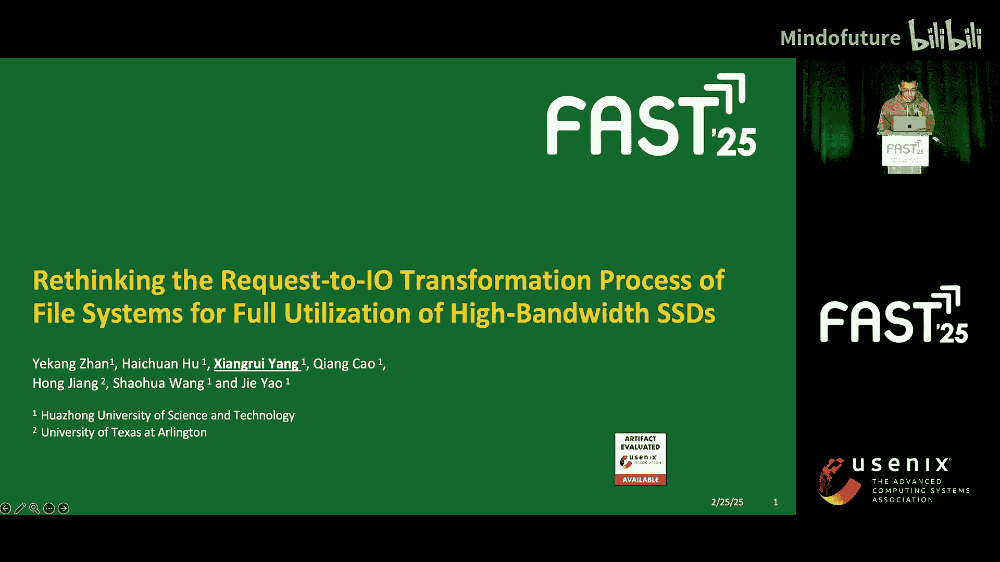
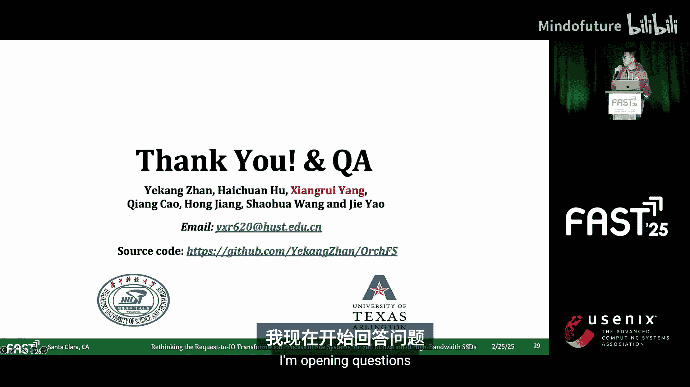

# 006：重新思考文件系统的请求到I/O转换过程以实现高速SSD的充分利用 🚀

在本教程中，我们将学习一篇来自FAST‘25存储大会的研究。该研究探讨了现代文件系统在利用高速NVMe SSD时遇到的性能瓶颈，并提出了一种名为OrFS的新型异构文件系统架构来解决这些问题。我们将逐步解析问题的根源、解决方案的设计思路以及其带来的性能提升。

---

## 概述：高速SSD时代的性能瓶颈

过去几年，固态硬盘（SSD）的性能经历了爆炸式增长，带宽从不到1 GB/s提升到了超过10 GB/s。然而，尽管底层硬件性能大幅提升，许多数据密集型应用（如图处理、科学计算）的实际性能却未能同步增长。本研究发现，传统的文件系统I/O栈在处理用户请求时存在显著的“写入低效”问题，导致无法充分利用高速SSD的带宽潜力。

## 问题诊断：为何文件系统成为瓶颈？

上一节我们概述了性能不匹配的现象，本节中我们来看看具体是哪些因素导致了“写入低效”。研究通过一系列测试和分析，定位了三个核心问题。

首先，研究者运行了单线程随机写入测试，发现文件系统的吞吐量仅能达到底层SSD带宽的三分之一或四分之一。即使将测试聚焦在接近1MB的大尺寸写入上，性能提升依然有限。

以下是导致性能瓶颈的关键因素分析：

1.  **I/O对齐开销**：文件系统使用页缓存（Page Cache）将用户请求转换为内存页对齐的I/O。对于非页对齐的写入，需要进行耗时的“读-修改-写”操作。这涉及从SSD读取数据、在内存页中修改、再写回SSD。由于SSD访问延迟较长，这些小规模操作变得极其缓慢。
    *公式表示：非对齐写入耗时 = SSD读取延迟 + 内存修改时间 + SSD写入延迟*

2.  **页缓存管理开销**：随着写入尺寸增大，页缓存本身的管理开销（如查找脏页、组装BIO）变得显著。对于1MB的写入，页缓存管理开销可占总写入时间的40%以上。

3.  **I/O并发度不足**：大多数存储系统被动依赖SSD的内部并行性。但由于I/O调度的复杂性，单一线程很难最大化SSD性能。测试表明，使用多线程处理较小的I/O请求能更好地利用SSD带宽。

## 解决方案：OrFS异构文件系统设计

在明确了问题根源后，研究者提出了名为OrFS的解决方案。其核心思想是引入非易失性内存（NVM）作为辅助存储，协同高速SSD工作，而非简单地在内存中合并请求或强制使用对齐要求苛刻的直接I/O。

### 异构数据布局

OrFS将文件数据分布在两种存储介质上：
*   **元数据**：全部存放在NVM上。
*   **文件数据**：根据策略分布在NVM和SSD上。

系统定义了三种存储单元类型：
*   `SD Blocks`: 用于存放32KB对齐的数据段。
*   `NVM Pages`: 用于存放4KB对齐的数据段。
*   `NVM-U Pages`: 用于存放剩余的未对齐数据片段。

### 写入请求分割策略

当写入请求到达时，OrFS会将其智能地分割为三部分：
1.  块对齐的SSD I/O
2.  页对齐的NVM I/O
3.  未对齐的NVM-U I/O

分割过程遵循两项策略：
*   **对齐优先策略**：按块对齐 > 页对齐 > 未对齐的优先级顺序分割请求。
*   **碎片最小化策略**：尽可能将文件数据放置在更少的存储单元中，以减少碎片。

### 统一文件映射结构：HR-Tree

为了高效管理分布在三种存储单元上的数据，OrFS设计了异构Radix树（HR-Tree）。它由传统的Radix树和一个底部的异构层组成。
*   Radix树部分将文件逻辑偏移映射到逻辑块。
*   异构层记录每个逻辑块内部的数据构成（即哪些部分在SSD块，哪些在NVM页）。

通过HR-Tree，OrFS只需一次树遍历就能定位一个文件请求关联的所有存储单元。

### 并行I/O引擎

为了高效、透明地处理分割后的异构I/O并保证数据一致性，OrFS实现了并行I/O引擎。
*   **并行处理**：SSD I/O和NVM I/O被并行处理。
*   **多线程I/O**：主动使用多线程来处理SSD I/O，以充分挖掘其并发性能。
*   **数据一致性**：每个I/O线程在其独占的数据范围内执行操作，避免冲突。
*   **I/O路径优化**：
    *   SSD写入：使用直接I/O模式，绕过页缓存。
    *   SSD读取：使用缓冲I/O模式，受益于预对齐写入带来的高效页缓存命中。
    *   NVM访问：使用高效的内存映射路径。

## 性能评估：OrFS的表现如何？

研究者将OrFS与多类文件系统进行了对比测试，包括传统SSD文件系统（EXT4， F2FS）、NVM文件系统（NOVA， AFS）和混合文件系统（Strata， SPFS， 以及基于OrFS思想实现的PHFS）。

以下是核心测试结果：

1.  **单线程随机写入性能**：OrFS在各种写入大小下都表现出显著更低的平均写入延迟。
2.  **数据分布分析**：在大写入（如1MB）场景下，OrFS有超过90%的数据被直接写入SSD，性能主要来源于高速SSD。而像Strata这样的系统，其性能主要来源于昂贵的NVM。
3.  **读取性能**：由于写入时数据在SSD侧总是32KB对齐的，这使得后续的读取操作能更高效地利用页缓存，因此OrFS的读取吞吐量也显著高于基线系统。
4.  **多线程性能**：OrFS仅需少量用户线程即可最大化SSD的写入性能，证明了其主动提升I/O并发度的有效性。
5.  **实际应用**：
    *   在充满小请求的LevelDB工作负载中，OrFS使用NVM处理多数请求，而让SSD快速处理大的压缩写入，表现优异。
    *   在混合大小请求的图处理工作负载中，OrFS将处理时间减少了近70%。

## 总结与资源

本节课中我们一起学习了现代文件系统在高速SSD上面临的“写入低效”挑战。我们深入分析了其三大根源：I/O对齐开销、页缓存管理开销和I/O并发度不足。接着，我们详细介绍了OrFS异构文件系统的设计方案，它通过引入NVM作为辅助存储、智能分割写入请求、使用HR-Tree统一映射以及并行I/O引擎，有效地克服了这些瓶颈，在读写性能上都实现了显著提升。

这项研究已开源，您可以通过提供的链接查看其详细实现。

---
**总结要点**：
*   **问题**：传统文件系统I/O栈导致高速SSD带宽无法被充分利用（写入低效）。
*   **根源**：非对齐I/O操作、页缓存管理开销、单线程I/O并发不足。
*   **解决方案**：OrFS文件系统，采用NVM+SSD异构存储、请求分割、HR-Tree和并行I/O引擎。
*   **结果**：大幅提升了随机写入、读取以及实际应用（如LevelDB、图处理）的性能。