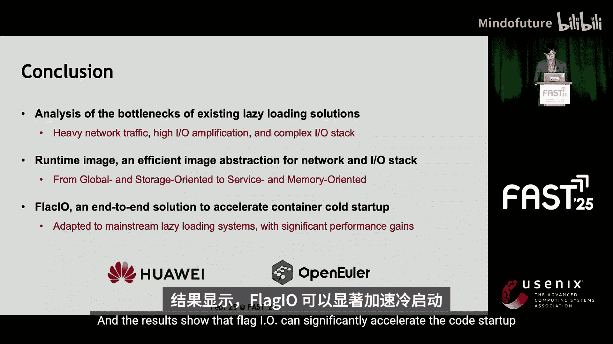
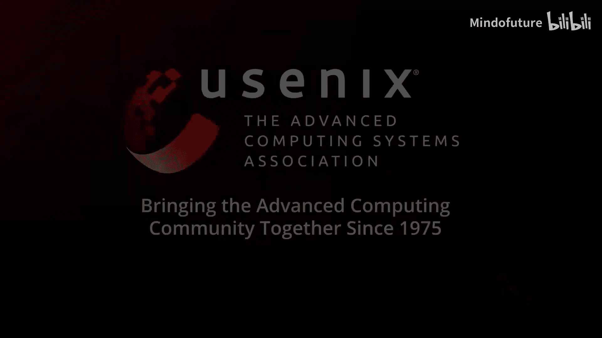

# 007：FlacIO - 面向容器镜像服务的扁平化与聚合I/O方案

## 概述

在本节课中，我们将学习一篇来自FAST25存储大会的技术分享，主题是“FlacIO：面向容器镜像服务的扁平化与聚合I/O方案”。我们将深入探讨传统容器启动的瓶颈、FlacIO的核心设计思想、其关键组件以及它如何显著提升容器冷启动性能。内容将力求简单直白，适合初学者理解。

---

## 传统容器存储栈与启动瓶颈 🐢

首先，我们来了解传统的容器存储栈。容器通常在Overlay文件系统上构建其文件系统，用于合并镜像的多个层，并为容器提供一个统一的视图。

启动容器的传统方式是**将整个镜像加载到节点**。然而，这种方式效率低下，因为它会引发大量的I/O放大，并导致启动延迟。

为了加速启动，**延迟加载**成为了主流解决方案。它只将镜像的元数据拉取到节点，让容器快速启动，而实际的数据I/O则在容器运行过程中按需进行。

另一种优化是**减轻冷启动开销**，例如使用主机端缓存共享或P2P加载。但这些方案需要消耗主机资源，而主机资源是有限的，因此无法完全解决冷启动问题。本工作将重点聚焦于冷启动加速。

---

## 延迟加载的典型过程与I/O分析 🔍

上一节我们介绍了冷启动的瓶颈，本节中我们来看看延迟加载的典型过程。

延迟加载过程主要分为三个阶段：
1.  **获取元数据**：获取构建容器运行时所需的元数据。
2.  **创建运行时**：在主机上创建运行时环境，例如创建Cgroup、创建文件系统。
3.  **启动服务**：启动服务并执行容器内的入口点。

在这个过程中，数据会先被拉取到延迟加载模块的预取缓存中，然后加载到本地文件系统。这个阶段会触发大量的I/O操作。

现在，让我们分析现有解决方案中冷启动开销的构成。在我们的实验中，CFS和Lindle是文件级加载系统，而DADI是块级加载系统。

从结果可以看出，延迟加载方案确实能加速部署阶段，但它们在就绪阶段会遭受非常长的延迟。

当我们深入分析现有系统的I/O行为时，发现它们在就绪阶段存在严重的I/O放大和低效的网络访问问题。

---

## 问题的根源：传统镜像组织方式 🧩

上一节我们分析了延迟加载的I/O问题，本节我们来探讨其根本原因。

问题的关键在于**传统的镜像组织方式**。传统镜像是**全局导向**的，意味着一个镜像被多个服务使用；同时它也是**存储导向**的，主要反映磁盘状态。

这种组织方式的缺点如下：
*   由于镜像上的随机访问，使得延迟加载系统难以聚合I/O。
*   延迟加载单元与容器访问模式不匹配，导致高I/O放大。
*   由于不同容器间的I/O行为不同，I/O局部性难以优化。
*   需要一个复杂的I/O路径来将磁盘状态转换为内存状态。

---

## 解决方案：运行时镜像组织方式 🚀

基于对传统方式缺点的分析，我们提出了**运行时镜像组织方式**。

其核心思想是：**为每个服务预计算其内存状态**。因此，它是**服务导向**的（一个镜像对应一个服务），并且是**内存导向**的（只反映内存状态，而非磁盘状态）。

这种组织方式的好处是：
*   **网络友好**：可以通过一次网络I/O精确拉取冷启动所需的数据。
*   **支持快速loop文件系统构建**：因为运行时镜像已经包含了内存数据的索引和数据本身，这使得loop文件系统可以直接挂载在给定的运行时镜像上。

---

## FlacIO的设计挑战与概述 ⚙️

然而，基于运行时镜像设计FlacIO并非易事。我们面临两大挑战：

1.  **如何高效地组织运行时镜像**：我们需要考虑容器启动时准确的I/O追踪，同时要兼顾镜像大小并与现有生态系统兼容。
2.  **如何在主机上实现轻量级的I/O栈**：当前内核不支持从给定的内存状态挂载文件系统，我们需要新的操作原语。同时，FlacIO运行在延迟加载系统之上，因此需要与传统的I/O栈兼容。

现在，让我介绍FlacIO的总体架构。它包含四个关键组件：
*   **FlacIO驱动**：作为控制平面，连接系统中的其他组件。
*   **I/O追踪器**：用于在容器首次启动时记录I/O。
*   **运行时页缓存**：内核中的一个特殊文件系统页缓存，允许将运行时镜像注入内核并挂载到文件系统。
*   **运行时镜像服务**：位于注册节点，用于管理和生成运行时镜像。

以下是工作流程：
当用户调用运行时镜像创建API时，系统会启动容器，收集I/O，并将I/O记录发送到注册表进行离线生成。
在容器冷启动期间，FlacIO驱动会先获取运行时镜像元数据，然后通过一次大粒度的I/O拉取镜像数据，并将其注入RPC。
在容器运行期间，RPC处理对位于运行时镜像中的页的读写和缺页错误。对于那些在运行时镜像中缺失的I/O，则会被重定向到传统流程处理。

---

## 准确的I/O追踪机制 🎯

上一节概述了FlacIO的架构，本节我们深入了解其基石——准确的I/O追踪。

运行时镜像的生成依赖于容器启动时准确的I/O追踪。I/O追踪并非新概念，例如DADI就使用了块级追踪机制进行I/O预取。

我们采用了**基于感知点（PoP）的文件级I/O追踪机制**。最终用户可以使用 `RT_CREATE` API 来生成运行时镜像，该API包含三个参数：`镜像名`、`入口点`（用于计算唯一服务ID）和 `PoP`（用于告知I/O追踪器何时停止追踪）。

PoP有两种类型：
*   **外部PoP**：在容器外部运行的程序，例如HTTP探测。这对于像Redis、MySQL这样的网络服务容器非常有用。
*   **内部PoP**：在容器内部运行，例如容器的入口点。我们可以使用导入核心库作为PoP，这对于像TensorFlow这样的框架容器非常高效。

当 `RT_CREATE` 被调用时，系统会启动一个容器进行追踪。我们使用eBPF在容器命名空间下记录读写和缺页I/O。最后，I/O追踪记录被发送到注册表进行离线生成。

这种设计的优势在于：
*   比之前的方案更准确，因为我们可以在PoP捕获到相应事件时停止追踪。
*   适用于任何延迟加载系统，因为它在VFS层实现。

---

## 运行时镜像的组织与生成 🗂️

由于运行时镜像是按服务生成的，如果我们不考虑不同运行时镜像间的数据重复，可能会急剧增加主机的内存使用量。

根据我们的分析，**使用相同基础镜像的服务间，数据重复率非常高**；而使用不同基础镜像的服务间，数据重复率则很低。

因此，我们提出了**分组结构**。它将属于同一个基础镜像的服务归为一组。组内的数据会被去重，并存储在**组数据区**中。

每个运行时镜像的服务元数据是私有的，它记录了文件索引以及其在组数据区中的页映射。它使用一个位图来记录其数据在组数据区中的分布情况。

运行时镜像的生成在离线阶段进行。当接收到I/O追踪记录时，它会初始化相关的元数据和组元数据，然后从基础镜像中取出记录中的页，计算页的指纹并检查它是否已存在于数据区中。如果是一个新页，则更新重复数据删除指纹并将其添加到数据区。最后，更新元数据中的页表。

---

## 冷启动流程与文件系统操作 🖥️

在冷启动期间，驱动首先从注册表获取服务元数据，并调用一个新的OS原语 `prefetch` 来获取缺失页的预测。

如下图所示，每个组对应一个位图，每个RPC维护一个位图来记录哪些页已被加载。`prefetch` 通过比较服务元数据中的组位图和主机中的位图，返回一个需要预取的位图。

通过将位图发送到注册表，所需的页将被拉取到主机并注入内核。接着，我们使用 `inject` 系统调用来将服务元数据和页加载到内核。最后，容器平台使用一个特殊的挂载方式，基于运行时镜像构建文件系统。它搜索运行时镜像，然后将文件系统超级块指向它。

RPC中的文件系统操作很简单，因为它只负责缓存。我们只需要处理位于镜像中的页的读写和缺页。
*   在**文件打开**时，它在服务元数据中搜索文件索引，并将文件节点指向相应的页表。
*   在**文件读取和缺页**时，它搜索页表并返回结果。如果页不存在，则回退到传统的VFS流程处理。

---

## 实现、对比与优势 ⚔️

现在，让我们把一切整合起来。FlacIO在OpenEuler中实现，并适配到两个主流加载系统CFS和Lindle。我们为每个系统定制了容器引擎中的parking snap结构。

图中的流程展示了工作流。FlacIO可以在镜像清单加载后，才开始加载元数据、执行数据拉取和注入。因此，许多FlacIO流程可以与容器平台流程重叠执行。

以下是FlacIO与现有优化方案的对比：
*   **对比预取优化**：现有方案只是简单地扩大加载单元，依赖于容器I/O行为具有强局部性。
*   **对比优先级文件预取**：它严重依赖用户经验，并且加载单元很大。
*   **对比追踪回放**：它未能很好地解决准确追踪和高效聚合的问题。

相比之下，FlacIO在I/O追踪上更准确，在I/O聚合上更高效，并且整体设计更轻量级。

---

## 性能评估 📊

我们在一个24核的服务器上运行测试，通过25G网络连接到注册表。对于TensorFlow，我们使用内部PoP（将加载其核心框架库作为PoP）。对于其他容器，我们使用HTTP探测作为外部PoP。

结果显示，**FlacIO在冷启动上可比次优系统提升高达2.7倍的性能**。此外，在热启动对比中，使用FlacIO的系统几乎没有引入额外开销。

从tcpdump的结果来看，FlacIO将网络数据量和数据包数量减少了超过1.6倍。在不同内存占用场景下，FlacIO也更友好，相比其他系统可节省超过70%的内存占用。原因在于FlacIO具有更低的I/O放大和更短的缓存层次。

---

## 权衡与真实场景应用 ⚖️

FlacIO的主要权衡点是**后端存储开销**。我们为9个主流容器生成了运行时镜像并计算了开销。

结果显示，运行时镜像的大小分别占TensorFlow和Nginx总镜像大小的9%和4.7%。这意味着FlacIO可以用大约5%的存储开销，换取高达2.4倍的启动速度提升。同时，存储开销还可以通过压缩进一步降低。

最后，我们在一些真实应用中进行了评估：
*   **对象存储场景**：启动MinIO对象存储，结果显示FlacIO能使其启动更快。
*   **机器学习训练场景**：启动一个TensorFlow容器进行MNIST数据训练，FlacIO消除了训练过程中的按需加载开销，从而减少了总训练时间。
*   **自动扩缩容场景**：在集群中启动64个容器，结果显示FlacIO将动态扩展的尾部延迟降低了超过22%。

---

## 总结 🎉

在本节课中，我们一起学习了FlacIO方案。我们首先分析了现有容器镜像加载方案的瓶颈，然后提出了创新的“运行时镜像”组织方式。基于此，我们设计了FlacIO系统，它通过准确的PoP追踪、高效的分组去重镜像组织以及轻量级的RPC文件系统，实现了扁平化和聚合I/O。该方案已适配到两个主流加载系统，评估结果表明，FlacIO能显著提升容器冷启动性能，同时保持较低的网络、内存和存储开销。