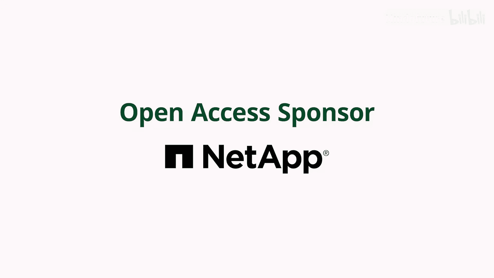
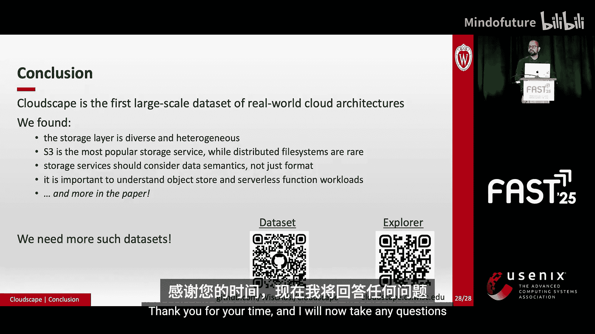

# 008：现代云架构中的存储服务研究

在本教程中，我们将学习如何构建并分析一个名为“Cloudscape”的数据集，该数据集旨在揭示现代云架构中存储服务的真实使用情况。我们将从数据集的构建方法开始，逐步深入到对云存储层多样性、流行服务、存储数据特性以及服务交互模式的具体分析。

## 概述

云平台已成为主流的软件部署环境，构成了一个价值数千亿美元的产业。然而，尽管云服务被广泛使用，但描述真实世界云架构如何构建的数据集却非常稀缺。现有的研究往往缺乏对哪些云服务真正流行的洞察。本工作通过分析一系列由AWS维护的“This is my architecture”视频，构建了第一个大规模、结构化的真实云架构数据集——Cloudscape。该数据集涵盖了近400家不同公司的架构，时间跨度近五年，为我们理解云存储服务的实际应用提供了宝贵资源。

## 数据集构建方法论

上一节我们概述了Cloudscape项目的背景和目标。本节中，我们将详细介绍从非结构化视频数据构建结构化数据集的具体方法。

我们的数据源是YouTube上的技术分享视频。这些视频平均时长6分钟，包含密集的技术信息，并通过音频和视觉渠道（如口头描述或图表连线）传递。视频内容主题广泛，我们的目标是从所有视频中可靠地提取可用数据。

为了将视频转化为结构化数据集，我们采用了“迭代编码”的实践方法。这里的“编码”并非指编程，而是指系统化的分类标记过程。我们的方法源于经过充分研究的协作式定性编码实践。

以下是构建过程的核心步骤：

1.  **独立编码与初步共识**：三名团队成员独立观看相同的五个视频，尝试提取可可靠获取的数据，并各自制定初步的编码指南。随后，团队讨论各自的方法，就一套初步的编码指南达成共识。例如，我们决定将架构格式化为图结构，节点代表服务。

2.  **迭代与精炼**：以上述初步指南为起点，将其应用于更大的视频子集。这个过程会进一步精炼指南，一些规则被舍弃，新的规则被添加。我们多次重复此过程，不断优化编码指南，直到指南不再有更新为止。

3.  **扩展与验证**：由于数据集规模较大，我们引入了另外三名编码员。我们对他们进行培训，使其掌握最终的编码指南。他们对数据集的补充标注都经过了验证。

## 数据结构示例：以Snapchat为例

了解了构建过程后，我们来看看数据在Cloudscape中是如何呈现的。本节将以Snapchat的架构为例进行说明。

在Cloudscape中，架构被编码为图。图的节点是所使用的AWS服务以及系统中的其他实体（如用户手机）。服务之间的交互被捕获为边。我们区分携带数据的交互和仅作为请求触发器或确认响应的交互。

此外，我们还捕获了“工作流”，即完成一个工作单元所需的一系列交互集合。每个架构的工作流概念是独特的。以Snapchat为例，它是一个消息服务。当发送者想要发送照片时，它遵循红色工作流来存储图像，然后采取蓝色路径在接收端触发通知。

最后，我们为边赋予了序列号，这提供了这些交互之间的顺序信息。

## 研究发现：存储层的多样性与异构性

我们已经介绍了数据集的构建方法并浏览了一个示例。现在，我们转向通过研究这400个不同架构所学到的关于存储层的知识。我们首先提出的问题是：如何描述现代云应用的存储层？它由什么组成？

研究发现，存储层具有惊人的多样性。Cloudscape中的架构使用了多达14种不同的存储服务。

接下来，我们考虑每个架构使用了多少种不同的存储服务。数据显示，10%的架构没有使用任何特定的云存储服务，这意味着90%的架构确实使用了专门的云存储服务。超过三分之一的架构使用一种存储服务来满足需求。数据还揭示，存储层是异构的，超过一半的架构依赖于两种或更多不同的存储服务。

因此，我们发现现代云架构确实已经接受了这些专门的云存储服务，并将存储需求卸载给它们。任何关于构建云原生和多租户存储服务的持续工作都可能产生相当大的影响，并有望看到实际部署。

## 研究发现：最流行的存储服务

在了解了存储层的整体构成后，我们接下来探讨：在所有这些不同的存储服务中，哪一种最受欢迎？为了便于分析，我们将提供相同数据模式的服务进行了归类。

总体而言，我们发现对象存储是最受欢迎的，其次是NoSQL存储，然后是SQL存储。具体到服务，最流行的三个服务是S3、DynamoDB和RDS。事实上，S3的使用率是第二名服务的两倍。

最后，尽管有大量关于分布式文件系统的研究，但遗憾的是，它们在此类应用场景中似乎并不那么重要。

S3的高使用率引人深思，我们利用Cloudscape对其进行了更深入的研究。左图显示了我们已知的信息：S3在整个数据集中68%的架构中被使用。Cloudscape的一个功能是根据架构的关键目标对其进行分类。考虑第二个图的X轴，我们将架构大致分为数据摄取密集型、延迟敏感型或计算密集型。我们发现S3在所有类型的架构目标中都被广泛采用。此外，令人惊讶的是，在所有类别中，许多架构除了S3之外没有使用任何其他服务。尽管如此，仍有很大一部分架构将S3与其他存储服务配对使用。

因此，我们发现对象存储已被广泛采用，而分布式文件系统在此背景下则较为罕见。任何关于对象存储的持续研究都将继续产生巨大影响。这也凸显了捕获云上对象存储所承受的真实工作负载的必要性。

## 研究发现：存储数据的语义理解

上一节我们分析了服务的流行度，本节我们将更深入地探讨存储在这些服务中的数据本身，能否从语义上更好地理解它？为此，我们考察了两个最流行的服务：S3和DynamoDB。

不出所料，我们发现S3存储了丰富多样的数据，包括媒体、日志、配置文件、CSV/Parquet格式的分析文件等等。然而，我们也能够理解这些数据是如何被使用的上下文。我们观察到，看似相同的数据可能具有不同的重要性或不同的可用性要求。

以日志和配置文件为例。两者在对象存储看来都是文本。然而，日志通常用于分析，下游分析引擎或许可以容忍数据延迟可用，并且可以在数据可用前推迟工作，而不会牺牲吞吐量。另一方面，配置文件可能用于启动集群。如果它不可用，可能会使整个设置停滞。因此，我们发现S3为所有数据片追求高可用性，它平等地对待它们。因此，让服务了解下游服务的这些可用性要求，从而可能构建更便宜的系统，或许是富有成效的。

我们还考察了存储在DynamoDB中的数据。正如预期，DynamoDB最常用于存储业务特定数据。然而，我们发现了两个有趣的用例。首先，一些架构运行着跨服务的长时间作业，而作业状态本身被维护在DynamoDB中。其次，我们发现有些情况下，DynamoDB存储的是某些原始数据的精简版本。例如，它存储了S3中对象的元数据，并指向S3中的该对象。这揭示了存储层中发生的紧密耦合。

我们认为，现在是时候制定一些原则性框架和指南，用于引用这些跨服务分布的数据，同时仍能保持数据的有效性和一致性。

## 研究发现：与存储交互的服务

最后，我们考察哪些服务最频繁地从存储读取和写入存储。该图显示了与存储交互的前10名服务。计算服务用橙色标出。因此，毫不奇怪，我们发现计算服务是与存储交互的主要接口。

然而，有趣的是Lambda的流行度。我们认为这凸显了理解无状态函数如何处理状态的重要性。Lambda的高使用率很有趣。作为系统研究人员，我们很好奇这种采用背后的原因。与S3类似，我们发现Lambda在65%的架构中被使用，同样覆盖所有目标类别。此外，在我们观察的所有架构中，大约有20%的架构仅使用Lambda就足以作为唯一的计算服务。

因此，我们发现计算服务，特别是Lambda，对云的存储层构成了压力。这凸显了开始捕获真实的无服务器存储工作负载的必要性。

## 总结

在本教程中，我们一起学习了Cloudscape数据集的构建与分析。Cloudscape是数月人工工作的成果，形成了一个捕捉云架构如何构建的数据集。我们将这个数据集公开，研究人员可以运行查询来激发和夯实他们未来的研究问题。我们还提供了一个基于Web的交互式探索器，以便快速理解数据。

我们希望我们的工作是第一步。我们认为我们的社区需要更多这样的数据集，以更好地理解这些服务如何被组合在一起的现实。我们愿意与其他云提供商合作，重复这项研究并将其扩展到更多维度。更广泛地说，我们欢迎关于如何系统化解决这个问题的讨论。

