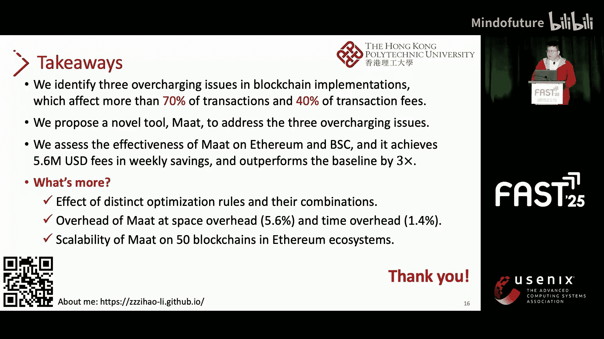

区块链存储优化：P09：Maat - 区块链存储超额收费分析与优化

在本教程中，我们将学习区块链存储中的“超额收费”问题。我们将首先了解区块链的基本概念和状态数据，然后深入分析三种具体的超额收费问题及其财务影响。最后，我们将介绍一个名为 **Maat** 的优化工具，它如何通过调整收费规则来解决这些问题，并评估其性能表现。

## 区块链基础与状态数据

首先，我们来介绍一些关于区块链及其状态数据的基本概念。

众所周知，区块链是一种分布式账本，由一系列区块组成。每个区块包含与区块链数据进行交互的交易。区块链状态数据包含了所有账户和合约的信息，并以 **Merkle Patricia Trie (MPT)** 结构组织，其中 MPT 节点存储在硬盘上。

为了提高效率，区块链会维护一个状态数据的缓存，该缓存驻留在内存中，并由相邻的几个区块共享。

对于状态数据的读取操作，交易在执行时首先会从内存缓存中获取数据。如果缓存未命中，交易才会去访问硬盘上存储的相应 MPT 节点。

对于状态数据的写入操作，交易会先将更新后的数据写入内存缓存。当一个区块内的所有交易执行完毕后，更新后的数据才会被写入硬盘。

## 交易费用机制与问题

接下来，我们将介绍交易费用机制以及由此产生的问题。

为了防止对状态数据的无限访问和修改，区块链引入了交易费用机制，根据用户对矿工资源（如磁盘 I/O）的使用情况向用户收取交易费，这通过 **Gas** 来衡量。每笔交易和合约操作都会消耗 Gas。

Gas 成本的设计初衷是反映实际的资源消耗。例如：
*   从内存缓存中读取账户数据大约消耗 **100 gas**。
*   从硬盘中读取账户数据大约消耗 **2100 gas**。

在我们的工作中，我们重点关注存储相关的 Gas 成本，原因有二：
1.  像以太坊这样的区块链一直饱受高交易费之苦，这是一个公认的巨大问题。例如，数据显示，用户在 2023 年支付了约 **24 亿美元** 的交易费。
2.  存储相关的 Gas 成本占这些交易费的 **70%** 以上。

## 超额收费问题分析

我们工作的第一部分是分析超额收费问题。我们通过研究区块链规范和实施，首先识别出三种超额收费问题。

在我们的语境中，超额收费问题指的是账户和合约操作的 Gas 成本高于实际资源消耗的情况。例如，当区块链将一次内存加载操作按磁盘加载操作收费时，我们就认为这种情况属于超额收费。

以下是识别出的三种超额收费问题：

**第一种问题** 发生在同一个区块内，两笔交易连续读写同一个数据对象时。在这种情况下，区块链会错误地将针对**区块内内存缓存**的读写操作，按磁盘读写操作的 Gas 成本收费。

请看右侧示例图，一个区块内有两笔交易：Alice 分别向 Bob 和 Cat 转账。在第一笔交易中，Alice 的余额从硬盘加载并写入区块内内存缓存。在第二笔交易中，Alice 的余额从区块内内存缓存加载，但区块链错误地认为是从硬盘加载，从而收取了磁盘读取费。

**第二种问题** 发生在 128 个区块内，两笔交易连续读取同一个数据对象时。在这种情况下，区块链会错误地将针对**跨区块内存缓存**的读取操作，按磁盘读取操作的 Gas 成本收费。

右侧同样有一个示例图，Alice 分别向 Bob 和 Cat 转账。在第一笔交易中，Alice 的余额从硬盘加载并写入跨区块内存缓存。在第二笔交易中，余额从跨区块内存缓存加载，但区块链再次错误地收取了磁盘读取费。

**第三种问题** 发生在两笔交易部署包含重复字节码的合约时。在这种情况下，区块链会为在硬盘上存储重复的字节码收取不必要的磁盘写入费。

右侧示例图中，有两笔交易部署了具有相同字节码的合约。在第一笔交易中，字节码（最高价值的字节码）将被存储到硬盘上的键值存储中。在第二笔交易中，第二个合约的字节码已经存在于键值存储中，但区块链仍会为写入该字节码收取费用，尽管实际上没有发生状态变更。

我们进一步探讨了这三种超额收费问题的财务影响。我们测量了它们在以太坊和 BSC 区块链上的影响。对于 BSC 区块链，由于其复用了以太坊的代码，同样会遭受这三种问题。我们的数据集包含约 100 万个区块。

结果显示：
*   在以太坊上，超过 **70%** 的交易和 **40%** 的交易费受到影响。
*   在 BSC 上，超过 **90%** 的交易和 **40%** 的交易费受到影响。

## Maat 优化方案

我们工作的下一部分是优化区块链中识别出的超额收费问题，并提出了名为 **Maat** 的解决方案。

Maat 的核心方法是根据存储操作的实际负载来调整其相应的 Gas 费用。Maat 包含两个主要组件：
1.  第一个组件从区块和交易的执行过程中，收集存储操作及其当前的 Gas 费用。
2.  第二个组件应用我们提出的优化规则，针对第一个组件收集到的实际超额收费案例，优化其 Gas 费用。

接下来，我将详细介绍四条优化规则。

前两条规则针对**第一种问题**，即重复的内存读写操作在区块内缓存中被错误地按磁盘读写操作收费。我们的解决方案是，将这些错误的磁盘读写操作收费，替换为内存读写操作的费用。

第三条规则旨在解决**第二种问题**，即重复的内存读取操作在跨区块缓存中被错误地按磁盘操作收费。我们的解决方案是，将这些错误的磁盘操作收费，替换为内存操作的费用。

最后一条规则旨在缓解**第三种问题**，即部署包含重复字节码的合约会产生冗余的磁盘写入费。我们的解决方案是，消除部署包含重复字节码的合约所产生的费用。

## Maat 的设计考量

我将通过回答两个问题来强调 Maat 的设计考量。

**第一个问题：如何确保优化后的 Gas 费用在所有区块链节点间保持一致？**
我们通过使用区块链固有的数据结构来形式化四条优化规则的条件，从而确保一致性。这些固有数据结构包括区块、交易、账户、合约和合约字节码。所有区块链节点对这些数据结构的执行都是确定性的，这由区块链共识机制保证。

**第二个问题：不同节点的缓存配置和大小可能不同，如何确保存储操作的一致性？**
前三条规则依赖于区块内和跨区块缓存来进行优化。然而，不同的配置和大小可能会改变缓存的内容。我们通过使用一种资源定位技术来确保存储操作在所有节点间保持一致。该技术可以预先定位前 128 个区块中访问过的数据，从而在所有节点间提前分配缓存内容。在我们的估算中，这种情况下最大内存消耗约为 200 MB，因此 Maat 的部署不会引入显著的内存开销。

## 性能评估

在评估中，我们选择 **EIP-2929** 作为基线，该提案旨在解决重复内存读取操作在区块内缓存中被错误收费的问题，这与我们的第一个问题部分重叠。

我们同样使用 100 万个区块来评估 Maat 的性能。结果显示，Maat 实现了显著的优化：
*   在以太坊上节省了超过 **1100 万美元** 的交易费。
*   性能表现约为基线（EIP-2929）的 **3 倍**，节省了约 **570 万美元**。

## 总结与扩展

最后，我们总结一下。我们识别了区块链中的三种超额收费问题，它们影响了超过 70% 的交易和 40% 的交易费。我们提出了名为 **Maat** 的工具，通过优化由这三种问题导致的超额 Gas 费用来解决它们。我们在以太坊区块链上评估了 Maat 的性能，结果显示 Maat 每周可实现约 **500 万美元** 的交易费节省，并且性能超出基线三倍。

如果您对我们的工作感兴趣，我们还评估了不同优化规则及其组合对三种超额收费问题的有效性，并测量了 Maat 的性能、空间开销和时间开销。结果表明，Maat 不会引入巨大的空间或时间开销。

此外，我们探索了 Maat 在其他 50 个复用以太坊代码的区块链上的可扩展性。结果显示，Maat 同样可以优化这些区块链中的超额收费问题。

感谢聆听。

