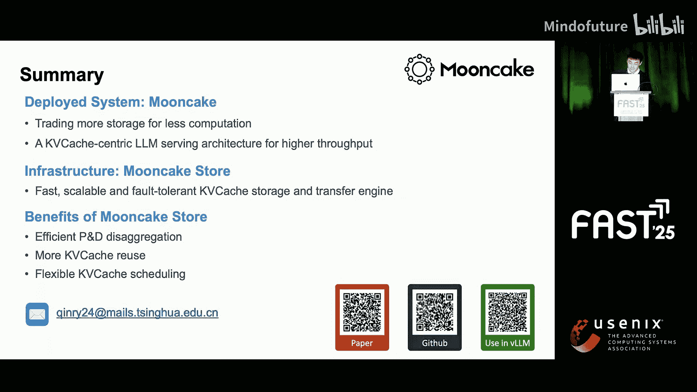
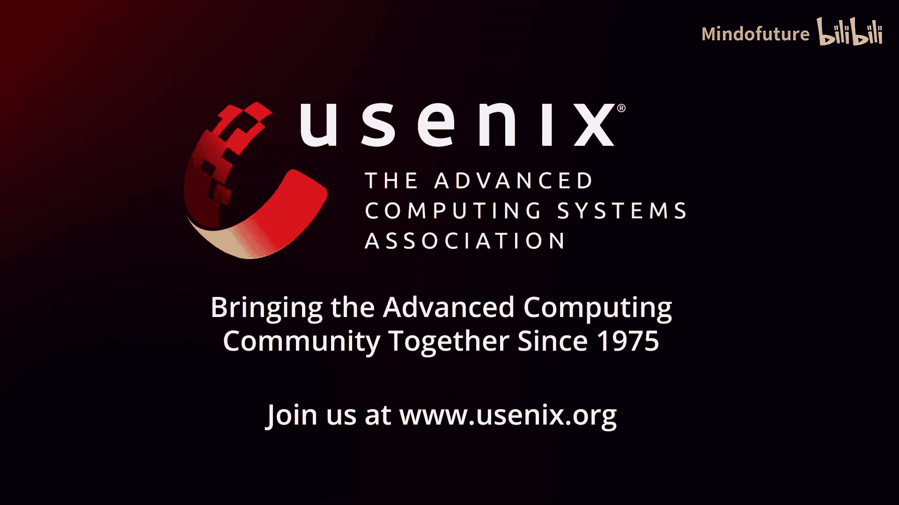

# 011：Mooncake - 用存储换计算，一种以KV缓存为中心的架构

在本节课中，我们将学习Mooncake系统。这是一个为大型语言模型（LLM）推理服务设计的、以KV缓存为中心的高效架构。它通过“用更多存储换取更少计算”的核心思想，显著降低了长上下文场景下的服务成本。

## 背景：LLM推理的挑战

首先，让我们了解基于Transformer的大语言模型推理过程。请求处理分为两个阶段：**预填充阶段**和**解码阶段**。

*   **预填充阶段**：处理所有输入令牌，并生成第一个输出令牌。
*   **解码阶段**：以自回归方式，一次处理一个令牌，生成后续所有输出令牌。

我们使用两个延迟指标来衡量推理性能：
*   **TTFT**：从输入到生成第一个输出令牌的时间，即预填充时间。
*   **TBT**：生成每个输出令牌之间的时间间隔，即解码时间。

预填充阶段一次性完成所有计算，计算量随输入长度快速增长。例如，处理128K的输入，获得第一个响应令牌可能需要超过5秒。解码阶段则对带宽更敏感，计算资源利用率较低，但其延迟必须满足用户的阅读速度（例如每秒10个令牌）。

因此，LLM服务面临巨大挑战：冗长的上下文预填充消耗大量GPU计算时间，同时严格的TBT限制限制了预填充与解码混合批处理中请求的计算效率。

## 系统概览与核心问题

当我们跨多个实例应用推理过程，并引入一个中央调度器（称为指挥器）时，就得到了一个在线LLM服务系统。该系统提供流式API，每个生成的令牌都会实时返回给用户。作为服务质量保证，TTFT和TBT延迟不应超过预定义的阈值。

Mooncake正是为Kimi提供动力的在线LLM服务系统。目前，Kimi为数百万用户服务，每日处理超过千亿令牌，并提供流畅的实时响应。

Kimi最受欢迎的功能之一是支持高达100万令牌的上下文长度。根据缩放定律，更大的模型和更长的上下文可以带来更高的智能。然而，这也增加了推理成本和响应延迟，尤其是在使用高峰期。因此，一个自然的问题产生了：**如何在大规模长上下文服务场景中，在不损害用户体验的前提下，提高计算资源利用率和系统整体吞吐量？**

## 关键洞察：前缀缓存的潜力与挑战

针对长上下文LLM推理的一个重要优化是**前缀缓存**。KV缓存可以在具有相同前缀的请求之间共享，以减少计算。例如，如果有一个之前的请求是“今天星期几？”，那么后续的请求“昨天星期几？明天星期几？”就只需要计算最后两个令牌的KV缓存，可以复用前四个令牌的缓存。

我们对Kimi的在线工作负载进行了分析，结果令人惊讶：**在真实世界的工作负载中，大约50%的令牌其KV缓存可以被重用**。这意味着，如果我们有足够的空间来存储所有的KV缓存，就可以节省近一半的GPU计算。

然而，当我们只使用单个节点的本地缓存（容量约为300万令牌）时，缓存命中率会显著下降。这表明，我们应该扩展KV缓存容量，以“用更多存储换取更少计算”。

## Mooncake的设计理念

尽管想法简单，但与传统缓存相比，KV缓存对存储系统提出了更大的挑战。每个令牌可能只有几个字节，但经过大模型处理后，可能会膨胀数千倍，达到数十甚至数百KB。此外，KV缓存随序列长度线性增长。例如，对于Llama 3 70B模型，即使采用分组查询注意力等技术来减少KV缓存，一个100万令牌上下文的K缓存体积仍会达到320GB。

因此，为了充分利用前缀缓存来降低计算成本，所需的KV缓存存储量将远远超过单个节点的可用容量。更重要的是，KV缓存的传输速度要求非常高。如果I/O成为瓶颈，将导致宝贵的GPU计算资源闲置。

为了构建一个高效的LLM服务系统，我们需要实现**大容量KV缓存存储、低延迟和高带宽的KV缓存传输**。在系统层面，我们还需要实现**KV缓存感知的调度**，以平衡缓存局部性和实例负载。

总而言之，**以KV缓存为中心的架构是你所需要的全部**。基于此，我们设计并构建了Mooncake——一个以KV缓存为中心的LLM服务架构。

## Mooncake架构详解

Mooncake构建了底层基础设施**Mooncake Store**，它提供了一个快速、可扩展且容错的KV缓存存储与传输引擎。在此基础上，我们构建了一个大规模预填充-解码分离的推理集群，在保持实时响应的同时，极大地提高了吞吐量。

### 工作流程：预填充与解码分离

首先，让我介绍Mooncake中处理请求的工作流程。LLM推理有许多调度算法，例如预填充优先、解码优先和分块预填充（将预填充执行分段以减少对解码阶段的干扰）。然而，所有这些方法在同时满足高模型浮点利用率（MFU）和TBT要求方面都面临挑战。

因此，我们采用了**预填充-解码分离架构**，将两个阶段分离到两个不同的实例上，如右图所示。在预填充实例完成增量预填充后，KV缓存被传输到另一个实例进行解码阶段。

这种分离架构避免了混合批处理中预填充和解码之间的干扰。同时，每个阶段可以根据自身的计算特性使用不同的资源和并行方法，从而进一步提高MFU和吞吐量。在大规模部署中，预填充与解码分离被扩展到两个节点池：预填充池和解码池。来自任何节点的KV缓存都可以被快速传输，从而实现更灵活的请求调度。支持这一切的基础设施就是Mooncake Store。

### 核心组件：Mooncake Store

Mooncake Store在推理节点的GPU显存和SSD上构建了一个全局缓存池，并支持推理引擎与存储之间的高带宽KV缓存传输。作为一个已部署的系统，Mooncake Store提供了高可扩展性和容错性，支持在线推理系统的弹性伸缩。

在设计上，Mooncake Store独立于推理引擎，并提供灵活的API结构。推理引擎（如最广泛使用的开源LLM推理框架vLLM）可以自行实现前缀缓存卸载和预填充-解码分离功能。

在内部，Mooncake Store使用基于前缀哈希的对象存储来管理KV缓存，其中每个块由16到512个令牌组成。每个块附加一个哈希键，该键由其自身哈希及其前缀决定，用于去重。

当新请求到达时，系统会逐个匹配令牌块，直到出现不匹配，从而识别出可重用的KV缓存块和新的KV缓存块。预填充实例生成增量的KV缓存块，然后将其传输到解码实例。当节点上的KV缓存块数量达到容量限制时，我们使用LRU策略来驱逐旧的缓存块。

Mooncake Store提供了一个高性能、容错的KV缓存传输引擎，支持多种传输方法，如GPU Direct RDMA、TCP和基于fabric的NVMe。它针对多RDMA网卡场景进行了优化，与其他协议（如NCCL）相比，能更高效地利用网卡带宽。此外，该传输引擎更加灵活，因为它不需要构建精确的通信组，从而支持部署节点的弹性伸缩。

作为上层LLM引擎和下层硬件之间的中间层，Mooncake Store在外部集成方面表现出色。对于上层，Mooncake Store提供零拷贝的对象`put`和`get`接口，不仅支持vLLM等推理引擎，还支持Megatron等训练引擎用于其检查点的加载和传输。对于下层，Mooncake Store支持本地内存、远程内存、SSD以及其他第三方内存存储。

## 性能评估

根据我们对Kimi的历史统计，Mooncake使Kimi在H800和A800 GPU集群上分别能多处理115%和107%的请求。为了在实验部分验证这些结果，我们在Mooncake上进行了一系列端到端和消融实验，以解答以下问题：
1.  Mooncake在真实场景中是否优于现有的推理系统？
2.  与传统的仅限本地的前缀缓存方法相比，Mooncake Store的设计是否显著提高了Mooncake的性能？

为了模拟在线请求分布，我们从在线请求中采样构建了三个跟踪数据集：对话、代理和合成。这些数据集的平均输入长度约为10K令牌，与常用的短请求数据集不同，更接近真实世界的分布。

为了比较Mooncake和其他推理系统在真实场景中的性能，我们选择了**有效请求容量**这一指标，它指的是在给定工作负载中满足延迟要求的请求数量。这个指标反映了系统的真实有效吞吐量，也称为“良吞吐”。

结果显示，三个基线系统无法避免混合批处理中预填充和解码之间的干扰，导致大量延迟违规。另一方面，Mooncake通过预填充-解码分离和KV缓存内存池化，实现了灵活的分离调度，从而避免了上述干扰。因此，Mooncake的有效请求容量要高得多，提升高达498%。

接下来，我们测量了预填充阶段的GPU计算时间，这反映了MFU和前缀缓存的实际利用率。更低的GPU成本意味着更高的MFU和更高的可重用KV缓存比例。从柱状图中可以看出，与Mooncake相比，vLLM和采用分块预填充的vLLM的GPU成本要高出两到三倍。而采用前缀缓存的vLLM虽然可以重用缓存，但其缓存仅限于单个节点，仅适用于缓存热度高度集中的场景（如对话和代理负载）。Mooncake通过实现KV缓存池化，在所有跟踪数据集上极大地提高了前缀缓存利用率。因此，我们可以在预填充阶段节省29%到61%的GPU计算成本。

由于时间限制，我没有详细介绍Mooncake推理引擎和调度部分的实现细节。更多信息，请参阅我们的论文。我们也欢迎您阅读论文中的消融实验，以获得对Mooncake系统更全面的理解。

## 未来路线图

在最后，我想介绍一下我们将Mooncake Store集成到vLLM中的路线图，我们计划分为两个阶段。
*   **第一阶段**：我们使用Mooncake传输引擎实现vLLM的分离推理，目前仅支持一个预填充实例和一个解码实例。这部分代码已经合并到vLLM中，您可以参考我们的代码库获取教程。
*   **第二阶段**：我们将基于Mooncake的分布式KV缓存和中央调度服务，支持任意数量的预填充和解码实例进行分离推理。我们正在努力实现这一点，以使vLLM支持更灵活的分离推理。

## 总结

本节课我们一起学习了Mooncake系统。我们对论文进行了总结：我们提出了“用更多存储换取更少计算”的理念，以降低为Kimi提供大规模长上下文LLM服务的成本。基于此，我们构建了Mooncake——一个以KV缓存为中心的LLM服务架构，在我们的实际部署中节省了一半以上的成本。

Mooncake的核心基础设施是Mooncake Store，它提供了一个快速、可扩展且容错的KV缓存存储与传输引擎。基于Mooncake Store，Mooncake实现了高效的预填充-解码分离、大容量KV缓存存储和灵活的KV缓存调度，从而在保证实时响应的同时，显著提高了LLM服务吞吐量。

欢迎您查看我们的论文和GitHub代码库以获取更多细节。感谢聆听。

