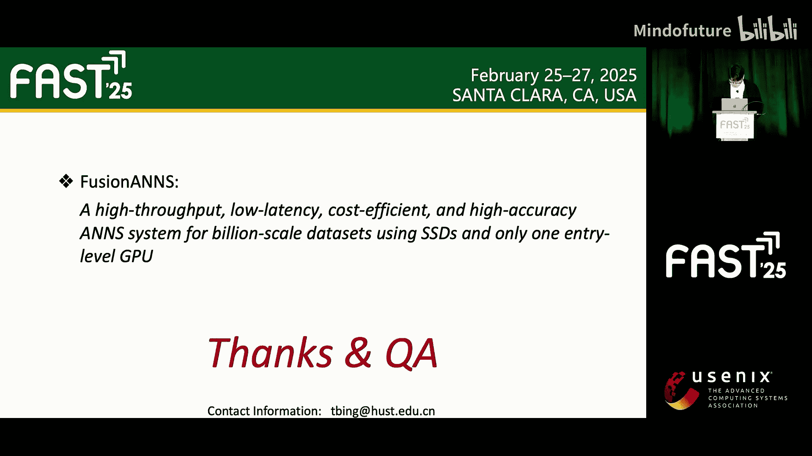

# 012：面向高吞吐与低延迟的十亿级向量搜索

## 概述

在本节课中，我们将学习一种面向十亿级向量数据库的高吞吐、低延迟近似最近邻搜索方法。该方法通过CPU与GPU协同处理，结合分层索引、乘积量化与启发式重排序等技术，在保证高精度的同时，显著提升了搜索性能并降低了成本。

---

## 背景介绍

向量搜索，也称为Top-K最近邻搜索，其目标是在一个包含N个向量的数据集中，为给定的查询向量找到距离最近的K个向量。每个向量是一个D维的表示。

给定查询向量 `q`，目标是找到数据集 `X = {x1, x2, ..., xN}` 中的Top-K向量，使得它们与 `q` 的距离最小。距离通常使用欧几里得距离或余弦相似度等度量。

由于“维度灾难”问题，精确的最近邻搜索在大规模高维数据上计算成本极高。因此，研究者提出了多种近似最近邻搜索算法，主要分为四类：暴力搜索、基于哈希、基于树和基于图的方法。其中，基于图的方法在精度和性能上表现出了显著优势。

基于图的ANN方法构建一个近邻图，其中向量被抽象为节点，边代表两个节点向量之间的距离。对于每个查询，算法从给定节点开始导航图，顺序遍历可能包含近似最近邻的相邻节点。

---

## 动机与挑战

随着大语言模型的快速发展，向量搜索在检索增强生成中扮演着关键角色，用于扩展模型的知识库。然而，嵌入向量数据的爆炸式增长，要求ANN算法能够处理包含数十亿向量的数据集。

基于图的ANN方法通常需要将整个索引加载到内存中，这导致了高昂的内存成本。为了降低内存消耗，微软的商业系统SPANN引入了分层索引，将大部分索引存储在SSD上。

具体来说，在离线阶段，SPANN使用聚类算法将数据划分为多个分区。为确保聚类质量，它会将边界向量复制到相邻分区的倒排列表中。然后，它将所有倒排列表存储在SSD上，同时在内存中使用一个基于分区中心构建的图索引。查询时，SPANN遍历内存中的图以找到最接近的M个倒排列表，将它们加载到内存，然后在这些列表中通过精确计算找到Top-K最近邻。

尽管SPANN实现了与内存方法相当的低延迟，但其吞吐量受限。我们发现，其查询延迟主要来自两个阶段：内存中的图遍历和处理来自SSD的倒排列表。当并发查询增多时，多个查询会竞争读取SSD上的倒排列表，导致I/O拥塞和高延迟。

乘积量化是一种有前景的压缩原始高维向量为低维码字的技术，能有效减少I/O请求的大小。然而，PQ将向量间的距离计算转换为多次内存查找操作，这对传统CPU架构构成了挑战，因为CPU的访存带宽有限且并行度不足。因此，PQ通常由GPU加速，以利用其大规模并行核心和高带宽内存。

一个直观的想法是将分层索引、乘积量化和GPU加速技术结合起来，以实现最优的ANN解决方案。但我们发现这并非易事。

---

## 初步方案与存在的问题

我们首先讨论一个结合了PQ和分层索引的GPU加速ANN方案。查询时，ANN引擎首先遍历导航图以确定最接近的M个倒排列表，然后将这些列表的原始或压缩数据加载到CPU主存或GPU的HBM中进行距离计算。

由于PQ会对查询精度产生负面影响，我们增加了一个重排序过程来提升精度。在重排序阶段，需要对Top-N个候选向量的原始表示与查询向量进行比较，以找到最终的Top-K最近邻。

令人失望的是，上述方案并未达到预期的高性能，无论是单线程延迟还是多线程峰值吞吐量。

我们面临三个主要挑战：
1.  **跨设备的大量数据传输**：PQ技术虽然能将倒排列表的总大小从多个页面减少到一个页面粒度，但由于重排序的需要，I/O请求数量反而增加了17%。更重要的是，大量倒排列表数据需要在CPU和GPU之间传输，这抵消了GPU加速带来的收益。根本原因在于，即使经过PQ压缩，GPU的HBM仍然无法容纳所有数据，导致CPU-GPU间的数据传输成为新的性能瓶颈。
2.  **重排序数量的不确定性**：为了达到相同的查询精度，通常需要重排序过程来优化中间结果。但我们发现，不同查询所需的最小重排序数量差异很大。如果为所有查询固定重排序的向量数量，会导致不必要的I/O操作和距离计算。
3.  **重排序的I/O粒度不匹配**：重排序过程需要从SSD读取原始向量，但一个原始向量的大小通常只有几百字节，而现代SSD的最小操作单位是一个页面（例如4KB）。这种粒度不匹配导致了显著的读放大，使得重排序阶段的I/O效率极低。

---

## FusionANN：我们的解决方案

为了应对上述挑战，我们提出了FusionANN，这是一个用于十亿级ANN搜索的CPU与GPU协同处理架构。

FusionANN包含三个关键设计，分别针对一个特定挑战：
1.  多层索引与CPU-GPU协同过滤机制，减少数据传输。
2.  基于轻量级反馈控制模型的启发式重排序，减少不必要的计算。
3.  基于优化存储的I/O感知去重，提升I/O效率。

### 1. 多层索引与协同过滤

首先，我们采用分层平衡聚类算法迭代地将数据集划分为多个倒排列表。每个列表包含多个向量ID及其对应的向量内容。

数据集聚类后，我们使用所有分区的中心点构建一个导航图索引，并将其存储在内存中。

更重要的是，与SPANN存储所有倒排列表ID不同，我们仅提取每个倒排列表的向量ID作为合并数据存储在内存中。

当图数据和合并数据生成后，中间的倒排列表就可以被丢弃。由于图和合并数据的内存占用相对较小，我们可以使用通用服务器以内存高效的方式支持十亿级向量。

由于PQ能显著减少高维向量的内存占用，即使是中端GPU的HBM也能容纳十亿级数据集的全部压缩向量。

在FusionANN中，我们将所有压缩向量预加载到GPU的HBM中，避免了GPU和CPU之间的数据交换。

**在线查询流程如下：**
1.  CPU遍历内存中的导航图，识别出与查询向量最接近的Top-M个倒排列表。
2.  CPU查询合并数据，收集这些候选列表中的所有向量ID。
3.  CPU将这些向量ID发送给GPU，并调用GPU内核进行进一步处理。
4.  GPU收到向量ID后，首先从HBM中读取每个ID对应的PQ压缩向量，并计算其与查询向量的PQ距离。
5.  GPU对所有距离进行排序，并将Top-N个向量ID返回给CPU。
6.  由于使用PQ向量得到的中间结果不够精确，CPU根据这些向量ID从SSD读取原始向量进行进一步的重排序。
7.  CPU返回最终的Top-K最近邻。

这种CPU-GPU协同过滤机制可以在避免向量数据在CPU和GPU间传输的同时，过滤掉最不相关的向量。

### 2. 启发式重排序

为了减少不必要的I/O操作和计算，我们提出了启发式重排序机制。

核心思想是：当当前Top-K结果已经稳定时，后续的重排序将不会改变最终结果。

我们将重排序过程划分为多个小批次顺序执行。在此过程中，我们使用一个优先队列来维护当前的Top-K最近邻。当一个小批次完成后，我们计算优先队列的变化率。如果连续多个小批次的变化率都小于给定阈值，则提前终止重排序过程。

### 3. I/O感知去重

为了进一步提高I/O效率，我们首先将高相似度的向量存储在同一SSD页面上，以提升空间局部性。

我们设计了两种I/O去重机制：
*   **合并小批次内的I/O**：将映射到同一SSD页面的I/O请求进行合并。
*   **利用缓冲区消除冗余**：利用读缓冲区消除后续小批次中的冗余I/O操作。

**举例说明：**
假设重排序过程有两个小批次：
*   批次0任务：重排序向量2、4、6。
*   批次1任务：重排序向量5、8、9。

执行批次0时，查询映射表得到向量对应的SSD页面ID。发现向量2和6都存储在页面0上，因此合并这两个I/O请求，只读取一次页面0。假设页面0和页面2不在读缓冲区中，则通过两次I/O操作读取它们。

执行批次1时，虽然向量5、8、9存储在不同页面，但读缓冲区中已包含存有向量5的页面2。因此，批次1只需读取页面1和页面3，共两次I/O操作。

---

## 实验评估

我们在配备V100 GPU和三星SSD的服务器上进行了实验，使用了三个十亿级别的真实世界向量数据集。

我们将FusionANN与三种代表性的十亿级ANN解决方案进行了比较，包括两种基于SSD的解决方案和一种GPU加速的内存解决方案。

**关键结果如下：**
*   与SPANN相比，FusionANN在达到相同低延迟的同时，吞吐量提升了高达3倍。
*   与DiskANN相比，FusionANN在吞吐量上提升了高达4倍。
*   更重要的是，与GPU加速的内存解决方案相比，FusionANN在保持相似低延迟的同时，吞吐量提升了高达5倍。
*   在性能可扩展性方面，随着线程数增加，FusionANN表现出了最佳的扩展性。
*   在成本和内存效率方面，FusionANN也表现最佳。

---

## 总结

本节课我们一起学习了FusionANN，一个用于十亿级近似最近邻搜索的CPU与GPU协同处理架构。它通过多层索引、协同过滤、启发式重排序和I/O感知去重等关键技术，仅使用一块中端GPU，就同时实现了高吞吐、低延迟、高成本效益和高精度。

FusionANN为解决大规模向量搜索中的性能与成本平衡问题提供了一个有效的设计范例。

---

