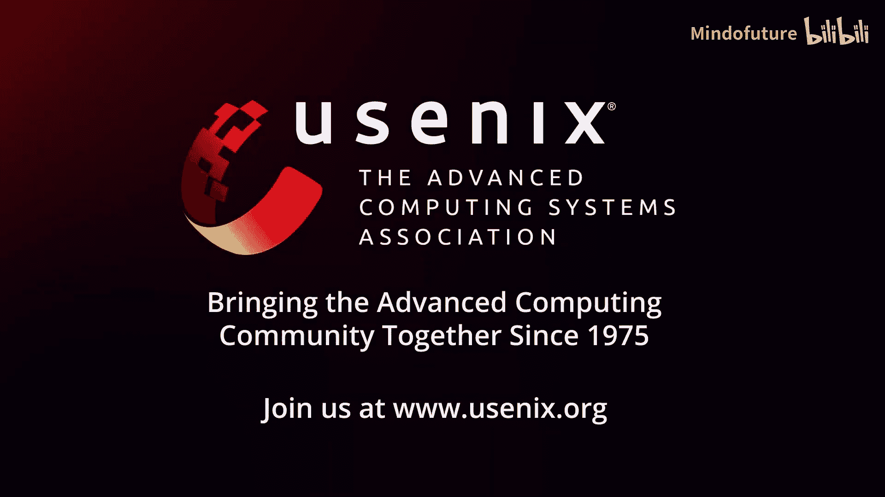

# 013：IMPRESS - 面向大语言模型推理的基于重要性的多层级前缀KV存储系统

## 概述

在本节课程中，我们将学习一篇来自FAST'25存储大会的研究工作：IMPRESS。这是一个专为大语言模型推理设计的、基于重要性感知的多层级前缀键值存储系统。我们将了解大语言模型推理中共享前缀KV缓存带来的性能瓶颈，以及IMPRESS如何通过创新的技术来优化存储和缓存，从而显著降低推理延迟。

---

## 背景与动机

大家好，我是魏建辰，来自佐治亚大学，导师是许冰河教授。

很荣幸介绍我们的工作IMPRESS，这是一个面向大语言模型推理的、基于重要性感知的多层级前缀KV存储系统。这是与华为云合作完成的工作。

大语言模型获得了广泛关注，并已应用于聊天机器人和搜索引擎等多个领域。现代LLM应用通常在将用户查询发送给模型进行推理之前，会附加信息丰富的内容前缀。

许多请求共享相同的前缀标记，例如GPT插件中的系统提示，或RAG系统中检索相同文档的相似问题。

由于共享的前缀标记在先前阶段会生成相同的KV缓存，近期研究提出将这些共享的前缀KV缓存存储在GPU或CPU内存中。

当具有相同前缀标记的新请求到达时，KV缓存可以被异步加载和复用，从而减少冗余计算时间。

右图展示了一个简单3层LLM推理的“首词元时间”。这表明，与重新计算相比，该方法显著降低了TTFT。

如左下角图所示，在我们的测试中，从128个标记到8000个标记的各种前缀长度下，这种优势都存在。

然而，随着请求数量的增加，GPU和CPU内存变得不足，KV缓存必须存储在SSD等磁盘上。

不幸的是，从SSD加载KV缓存会引入显著的I/O延迟，这无法再通过异步加载完全隐藏，并暴露在关键路径上。

我们的测试表明，I/O时间占TTFT的50%以上，使得从SSD到GPU的KV加载成为新的性能瓶颈。

为了解决这个问题，先前的工作可以分为两类。第一类仅依赖GPU/CPU，受限于缓存大小，在大规模场景下仍需要大量重新计算。第二类利用调度信息，在任务到达前将不必要的KV前缀从SSD预取到CPU内存。然而，在高请求负载或抢占式调度下，这种方法效率低下。

我们思考，是否有可能减少需要加载的可复用KV数据量，从而减少I/O时间。

近期研究表明，在解码阶段仅保留重要的KV可以达到相似的推理精度，如H2O和InGen所示。这启发我们在前缀阶段仅加载重要的KV，以缓解I/O瓶颈并降低TTFT。

---

## 面临的挑战

然而，这种方法面临挑战。

**挑战一：识别重要KV会引入显著的I/O开销。**

例如，对于一个有N个标记的请求和模型某一层的三个注意力头，前缀K和V存储在SSD中。我们需要将所有前缀键加载到GPU内存中以生成注意力矩阵，然后识别每个头中最重要的KV，最后仅从SSD加载重要的值。

我们发现，KV的减少仅限于步骤2，因为在每个头中识别重要KV需要大量的I/O。

有人可能认为，既然KV是共享的，可以根据历史信息静态预判哪些KV是重要的，并仅加载这些。然而，我们在两个开源模型上的测试表明，虽然这种静态方法减少了I/O数据量，但与动态识别重要KV相比，会导致高达5%的精度损失，这是不可接受的。

**挑战二：现有的存储和缓存系统并非最优，因为它们没有考虑标记KV的重要性。**

具体来说，存储系统存在读取放大问题，因为一个标记的KV被打包到同一个数据块中，混合了重要和不重要的KV。左图显示了当仅加载重要KV时，每个数据块中重要KV的比例，不重要的KV也被加载到内存中。

另一方面，缓存系统基于最近最少使用或访问频率。右图显示，重要性与频率之间没有直接关联。一个访问频率高的数据块可能具有较低比例的重要KV。

接下来，我们将介绍我们的观察和设计，以克服上述两个挑战。

---

## IMPRESS系统架构

这是IMPRESS的整体架构。它包括一个**重要标记识别模块**来应对挑战一，以及**KV重排序和缓存替换**来优化存储和缓存以应对挑战二。

### 挑战一解决方案：相似性引导的重要标记识别

为了减少前缀K的加载，我们观察到在LLM的同一层内，不同注意力头之间的重要标记索引集合具有高度相似性。

这是一个例子。假设两个头的重要K索引分别是{0, 2}和{0, 1}。我们使用Jaccard索引来衡量相似性，在本例中是1/3。第二张图显示了OPT 300亿参数模型中某一层任意两个头之间的真实相似性，均高于0.9。右图表明，这种相似性存在于不同的LLM规模和重要KV比例下。

基于这一观察，我们提出了**相似性引导的重要标记识别**。核心思想是使用少数选定头的重要标记索引集合来近似其余头的重要标记索引集合。

让我们看一个例子。左图展示了没有我们方法的过程，右图展示了启用我们方法后的过程。它首先仅加载少数头（例如一个头）的前缀键，然后识别该头中的重要标记分布。接着，我们近似其他头中的重要K分布，并仅加载这些重要的键和值。与左侧的现有方法相比，我们的方法显著减少了步骤一中加载的前缀键数量。

由于并非所有层都具有足够高的相似性，我们选择性地应用此方法。仅对高相似性层使用此方法；对于低相似性层，我们仍使用左侧的现有方法，以确保推理精度保持在相似水平。

### 挑战二解决方案：KV重排序与基于分数的缓存管理

为了解决存储读取放大的挑战，我们**基于标记重要性对KV进行重排序**，将重要和不重要的KV分离到不同的数据块中。这减少了需要加载的块数，缓解了读取放大。

然而，重排序会影响前缀树结构。图A展示了一个包含两个请求的例子。一个请求有标记t0到t7，另一个有t0到t3，然后是t8到t11。其中，橙色标记t0、t3、t4和t9是重要标记。我们不能直接重排序以将这四个橙色标记聚集到一个节点中，因为这会破坏树结构，例如t4和t9不是共享标记。

因此，我们避免跨节点重排序，并在每个节点中添加映射列表。映射列表（如m0）用于记录重排序前后标记索引的映射关系，以便在推理期间可以恢复原始的标记序列。

对于缓存挑战，我们引入了**基于分数的缓存准入和替换方法**。

我们不仅依赖访问频率，还考虑每个数据块中重要标记的比例。例如，假设块1和块2的访问频率分别为1.5和1，重要KV比例分别为50%和100%。LRU会优先缓存块1，而我们的方法会优先缓存块2，因为块2的分数高于块1。这将缓存未命中次数从20次减少到15次。

---

## 实验评估

我们的实验在一台配备80GB显存的A100 GPU、128GB CPU内存和2TB SSD的服务器上进行。我们测试了四个公开数据集，前缀大小从55GB到65GB不等。

我们将IMPRESS与四个系统进行比较：`Recomp`（不使用前缀KV缓存）、`Async`（执行异步KV加载，无调度信息，适用于更通用的场景），以及另外两个在`Async`基础上添加H2O并使用LRU或LFU进行缓存管理的系统。

为了防止运行时内存不足，我们将GPU HBM的缓存空间设置为10GB，CPU内存设置为32GB。默认情况下，每个数据块包含64个标记的键或值。

由于我们的第一项技术使用近似方法来识别重要KV，我们进行了精度测试。结果显示，IMPRESS达到了与H2O相当的精度，与重新计算相比，平均精度损失小于0.2%。

我们还测试了TTFT结果。IMPRESS优于其他方案，比现有最优解决方案有1.2倍到2.8倍的提升。这主要归功于I/O时间的减少，如左下角图所示。右下角图展示了启用每项技术后TTFT的变化，显示每项技术都进一步降低了TTFT。

此外，我们在不同的块大小、数据集规模和流行的Llama模型上测试了IMPRESS。结果表明，在各种条件下，IMPRESS始终优于现有最优系统。更多实验结果，请参阅我们的论文。

---

## 总结

在本节课中，我们一起学习了IMPRESS系统。我们认识到，当从SSD加载共享前缀KV用于LLM推理时，I/O成为瓶颈。我们的核心思想是在前缀阶段仅加载重要的KV。然而，识别重要KV会引入I/O开销，且现有的存储和缓存系统并非最优。

为了解决这些问题，IMPRESS采用了三项技术：相似性引导的重要标记识别、KV重排序和基于分数的缓存管理。实验结果表明，IMPRESS在保持相同推理精度的同时，性能优于其他方案。

感谢大家的关注。我很乐意回答任何问题和评论。