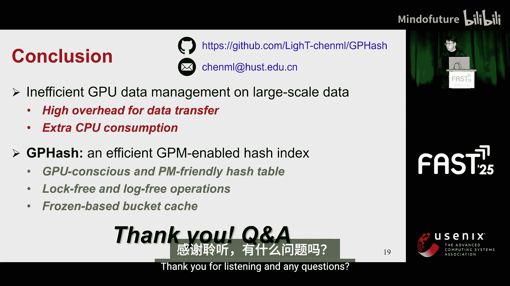

# 014：GPHash - 一种支持字节粒度持久内存的高效GPU哈希索引

在本教程中，我们将学习GPHash，这是一种专为GPU持久内存系统设计的高效哈希索引。我们将了解其设计动机、核心挑战、关键技术以及性能优势。

## 概述

随着计算吞吐量和内存带宽的显著提升，GPU已被广泛应用于深度学习、科学计算和自动驾驶等领域以提升性能。这些GPU应用通常由大规模数据驱动，例如，为了获得更高的推荐精度，深度推荐系统需要存储数十亿规模的嵌入向量来表示更丰富的特征。

为了容纳不断增长的数据规模并确保数据可靠性，GPU应用通常将数据存储在大容量的持久存储设备中，例如SSD，并依赖CPU来管理数据。具体来说，数据首先被传输到CPU内存，然后再传输到GPU。虽然这种数据管理方式实现了大容量和持久性，但也带来了高昂的数据传输开销和额外的CPU消耗。

为了缓解数据传输开销并消除额外的CPU消耗，GPU直接存储技术提供了GPU内存与存储设备之间的直接路径，提供了块粒度的读写接口。数据可以直接传输到GPU。这种直接数据访问方式提供了更高效的数据传输。然而，使用GDS编程数据结构很困难。此外，由于其块粒度特性，可能导致外部数据传输。

近年来，字节粒度持久内存已经出现，它提供了包括大容量、字节粒度、持久性和高性能在内的诱人特性。配备持久内存的GPU系统提供了字节粒度的加载和存储指令，从而实现了从GPU到PM的直接数据访问。GPU-PM系统可以通过利用统一虚拟寻址技术将PM映射到GPU的虚拟地址空间来实现。GPU-PM系统不仅提供了大容量和持久性，还提供了成本效益高且细粒度的数据传输。此外，使用GPU-PM编程数据结构很容易。

哈希索引被广泛用于管理数据，它提供了恒定时间复杂度的点查询，并且非常适合并行访问。因此，支持GPU-PM的哈希索引有望提升GPU应用中的数据管理性能。

然而，由于以下挑战，实现一个高效的GPU-PM哈希索引并非易事。

## 核心挑战

以下是实现高效GPU-PM哈希索引面临的主要挑战：

1.  **GPU并行特性**：GPU通过使用数千个线程实现高并行度，这表现出独特的特性。GPU中最小的调度单位是线程束，它由32个线程组成。当遇到分支指令时，同一线程束中的线程如果执行不同的指令，则会发生线程束分化。此外，当一个线程束加载和存储的数据落在同一个GPU缓存行时，GPU硬件会将它们合并为一次缓存访问，称为合并内存访问。然而，在哈希索引中，线程访问的键的地址是分散的，因此会导致未合并的内存访问。总体而言，严重的线程束分化和未合并的内存访问会导致性能下降。

2.  **数据一致性**：由于GPU-PM哈希索引直接在PM中管理数据，因此在发生崩溃时保证数据一致性非常重要。PM的低原子性内存写入大小受内存总线宽度限制，例如，64位CPU为8字节。因此，当写入大小超过8字节的数据时，可能导致部分更新。如果发生系统故障，数据将被损坏。通过使用日志等技术，可以从崩溃中恢复数据。然而，这会引入双写开销。通常，崩溃一致性保证会带来很高的开销。

3.  **带宽差距**：在执行索引操作时，GPU需要并发访问PM。虽然GPU内存的带宽很高，例如NVIDIA V100可以达到900 GB/s，但PM的读写带宽通常只有数十GB/s。因此，存在显著的带宽差距。带宽有限的PM无法高效处理来自GPU内核的大量并发访问。这种巨大的带宽差距限制了GPU高并行度的利用。

## GPHash设计

为了应对这些挑战，我们提出了GPHash，这是一种用于GPU-PM系统的高效哈希索引。

为了应对挑战1和2，我们提出了一种GPU感知且PM友好的哈希表结构，它支持无日志的插入和查询操作。为了进一步缓解带宽差距，我们利用基于冻结桶的缓存，将热桶缓存在GPU内存中，从而减少对PM的访问。

### GPU-PM友好哈希表结构

在GPHash中，每个桶包含多个槽，每个槽存储一个键值对。GPHash利用桶内共享来处理更多的哈希冲突，以提高内存效率。

此外，GPHash具有多哈希收集和单次线程束访问的特性。它利用线程束的并行性，使得GPHash可以一次性访问给定键的所有候选桶的所有槽。

除了传统的基于指针的键放置方案会导致地址分散外，GPHash利用就地键放置来促进合并内存访问。

GPHash的结构在GPU系统上简单高效，展现出GPU友好、写入优化和内存高效等优势。

### 无日志崩溃一致性操作

基于这个哈希表结构，GPHash支持无日志的插入和查询操作。这里简要介绍插入操作。

一个线程束中的线程协作执行一次插入操作。每个线程首先检查对应的槽，查看键是否存在。然后，在负载较轻的桶中找到一个空槽作为目标槽。

一个专用线程尝试使用`compare-and-swap`原语将槽状态设置为“插入中”。如果失败，线程束需要回到第一步。如果成功，该专用线程继续写入键和值指针。写入完成后，该线程再次使用`compare-and-swap`原语将槽状态设置为该键的哈希值。

崩溃后，GPHash会检测状态为“插入中”的槽，并通过将槽状态设置为“空”来恢复它们。

### 基于冻结桶的缓存

为了弥合GPU和PM之间的带宽差距，GPHash将热桶缓存在GPU内存中。

执行索引操作时，线程会检查桶是否被缓存。如果命中，线程直接从缓存中读取键值。否则，线程访问PM来读取键值。

为了避免严重的线程争用，GPHash定期识别热桶并将其加载到桶缓存中。缓存桶的成员是冻结的，即在两个相邻的加载阶段之间不会改变。

为了减少缓存加载的开销，GPHash并发地加载热桶，包括首先使旧缓存桶失效，然后获取新桶，最后验证新缓存桶。

关于GPHash的更多细节，包括线程束协作方式和更多索引操作，请参阅我们的论文。

## 性能评估

我们在配备两个Intel 26核CPU、1个NVIDIA V100 GPU和768 GB Intel Optane DCPM的服务器上评估GPHash。

我们将GPHash与以下方案进行比较：
*   **传统的CPU辅助方案**：使用CPU通过持久化哈希索引来管理数据。
*   **GPU-PM启用的方案**：利用GPU-PM哈希索引来管理数据。

我们使用YCSB基准测试和多个真实世界工作负载来评估GPHash和对比方案。

下图显示了不同方案在YCSB A和C工作负载下的吞吐量和延迟。

结果表明，在YCSB A和C工作负载下，GPHash的性能分别比CPU辅助基线方案高出4.7倍和3.7倍。这是因为GPHash通过在字节粒度直接访问数据，减少了数据传输成本。总体而言，GPHash将吞吐量提高了1.9到6.3倍。这种改进源于GPHash能够高效利用GPU的高并行度，同时以适中的开销确保崩溃一致性。

我们进一步深入分析了不同方案的详细延迟分解。结果表明，CPU辅助方案受困于高传输开销，而简单的GPU-PM启用方案则受困于严重的线程束分化和高开销的一致性保证。GPHash充分利用了GPU的高并行度，并提供了低开销的一致性保证，从而带来了更好的性能。

## 总结

在本节课中，我们一起学习了GPHash。现有的GPU应用数据管理方法受困于高昂的数据传输开销和额外的CPU消耗。为了解决这些问题，我们提出了GPHash，这是一种高效的GPU-PM启用的哈希索引，它包含多项专为GPU-PM系统量身定制的设计。我们已在GitHub上发布了开源代码供公众使用。

感谢阅读。