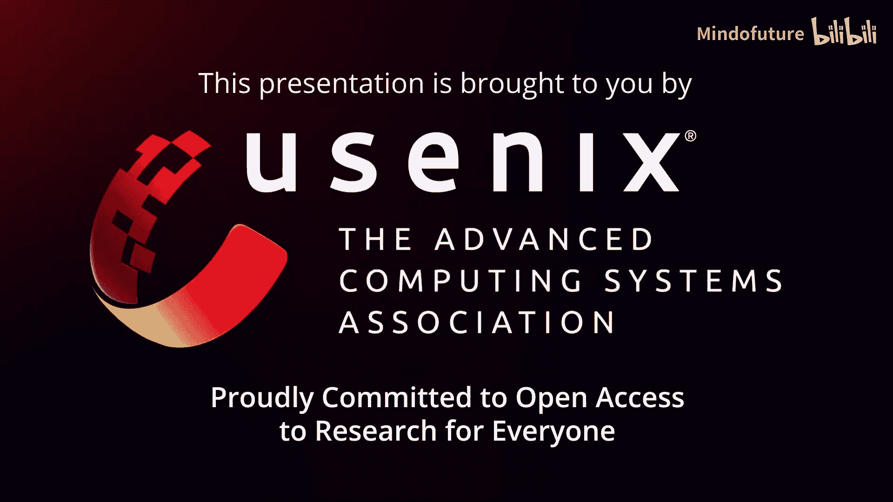
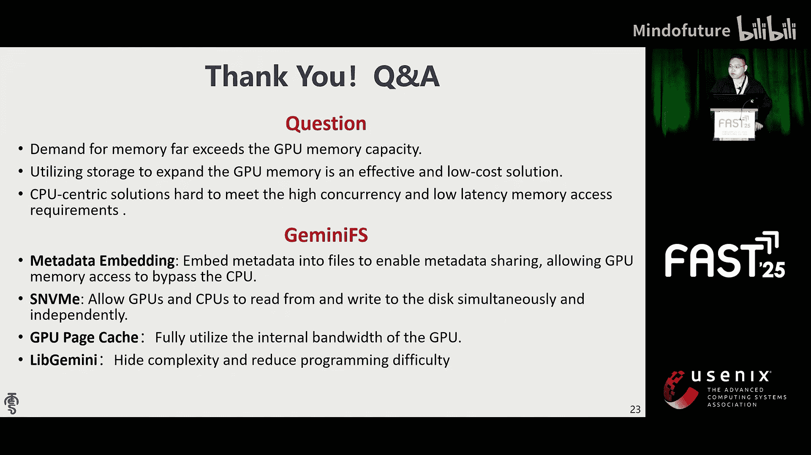
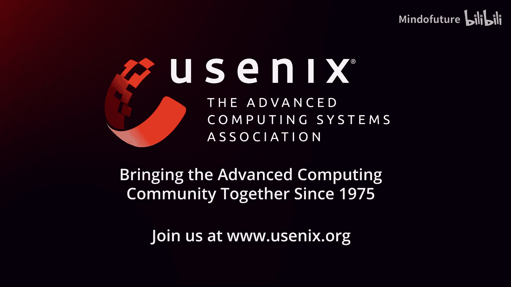

# 015：GeminiFS - 一个面向GPU的伴侣文件系统

## 概述

在本节课中，我们将学习一篇来自厦门大学的研究论文，它介绍了一种名为GeminiFS的新型文件系统。这个系统专为图形处理器设计，旨在解决GPU应用内存需求快速增长而GPU高速内存容量增长缓慢的矛盾。我们将了解传统GPU存储方案的局限性，以及GeminiFS如何通过创新的设计来提升性能、降低延迟并简化编程。

## 背景与动机

首先，让我们看看这项工作的背景。众所周知，GPU应用程序变得极其庞大，需要更多内存，例如大语言模型。然而，GPU高带宽内存的容量增长非常缓慢。

为了适应应用程序的需求，必须扩展GPU内存。一种方法是基于内存的扩展，例如使用多GPU聚合或主机直接访问。这种方式在可预见的未来成本相当高昂。另一种方法是使用存储，将GPU内存访问范围扩展到存储设备，例如NVMe。随着高性能NVMe存储的发展，例如英特尔的傲腾系列，基于存储的扩展已被证明是一种高效且廉价的方式。

## GPU存储系统的演进

上一节我们介绍了扩展GPU内存的需求，本节中我们来看看GPU存储系统的演进过程，以理解我们的设计动机。

在最初阶段，我们仅使用主机上的缓冲区将数据从CPU传输到GPU。我们首先从存储读取数据到CPU，然后调用GPU API将数据从CPU缓冲区传输到GPU缓冲区。这会增加编程复杂性、额外的内存拷贝、I/O延迟和CPU开销。

随后，一些工作如GPUFS和Direct提供了GPU内核的POSIX接口。这使得编程更容易。然而，它们仍然依赖于CPU上的守护进程来拉取GPU进程的I/O请求，并将其提交给主机文件系统。为了从NVMe获取数据，仍然需要内存拷贝来传输。额外的控制平面开销、I/O路径和内存拷贝问题仍然存在。

另一种流行的解决方案称为GPU直接存储。它利用点对点内存拷贝来跳过缓冲区，并在执行NVMe I/O时降低CPU开销。然而，它们仍然需要一个名为CUfile的专有接口，这使得编程困难。它需要修改NVMe驱动程序。这种方式仍然依赖于CPU来编排GPU I/O。

以上所有都是“以CPU为中心”的GPU解决方案。它们最终都依赖CPU来编排GPU I/O，并面临共同的问题。第一个问题是复杂的存储软件栈增加了I/O延迟。第二个问题是当执行高并发GPU I/O时，会受到有限CPU核心数的限制。

我们通过测试GPUFS和GDS来评估这个问题。左边的图表显示GPUFS的尾部延迟在GPU线程数增加并超过CPU核心数时急剧上升。右边的图表显示GDS的延迟随着I/O大小增大而降低。然而，软件开销仍然占约90%。

## 伴侣文件系统的核心理念

为了解决以CPU为中心方案的问题，一些解决方案如BEN提供了以GPU为中心的解决方案。它们在GPU高带宽内存上创建RAID，并使用进程级驱动程序进行注册。它们使用类似SPDK的设备控制平面，该平面完全由GPU进程管理。这使得编程极其简单。但它仍然面临一些问题。当使用GDS或SPDK时，第一个问题是SPDK类用法对NVMe设备的独占访问，阻止了CPU和GPU之间以及GPU进程之间的设备共享。第二个问题是由于缺乏文件系统管理，使得数据处理变得困难。第三个问题是当访问由主机文件系统管理的数据时，仍然需要许多内存拷贝。

那么，理想的解决方案是什么？结合CPU和GPU解决方案的优点。我们认为理想的GPU存储软件应具备以下特性：首先，它必须基于以GPU为中心的架构，完全避免CPU参与。其次，它还应提供文件系统管理能力。第三，它为CPU和GPU提供统一的命名空间。这些特性使得我们必须在GPU上构建一个文件系统。

然而，根本问题是GPU不适合构建文件系统。一个文件系统通常需要具备以下核心能力：第一，它需要提供目录和文件抽象，并维护相关的元数据。第二，它应提供磁盘空间管理并实现高效的地址映射，例如XFS中的extent。这需要具有复杂逻辑和分支跳转的软件。但GPU并非为此设计。GPU主要设计用于并发和简单的大规模计算。

因此，我们为GPU提出了一种新型文件系统，称为“伴侣文件系统”。我们称之为GeminiFS。我们在文件系统设计中分离了CPU和GPU的职责。

## GeminiFS的设计挑战与解决方案

基于上述理念，GeminiFS的设计面临几个关键挑战。以下是这些挑战及对应的解决方案：

**挑战一：元数据同步**
元数据由于硬件隔离而难以高效同步。主机和GPU实际上是两个不同的系统，它们需要通信。此外，文件操作总是与数据操作紧密交织。

**解决方案：元数据嵌入**
我们通过将元数据嵌入到文件本身来实现高效的数据共享。这就像虚拟化信息中使用的特定文件格式，例如QCOW2或VMDK。在我们的场景中，CPU和GPU使用一种称为GVDK的文件格式。不同之处在于，嵌入的元数据包含文件的物理布局信息。因此，GPU可以通过解析文件来获取文件数据和地址映射。此策略基于我们对AI应用的观察：短期数据（如训练中生成的激活值）无需持久化；长期数据（如检查点和键值缓存）是只写的，生成后不再更改；大多数存储访问具有可预测的模式。文件大小通常由模型大小决定，因此我们可以预分配文件及其元数据。这避免了GPU处理运行期间的元数据同步。我们只嵌入每个文件私有的特定元数据，例如文件类型、文件大小和索引结构。其他复杂结构如目录仍由CPU管理以降低复杂性。我们使用简单的两级映射表，而不是树形结构（如扩展树），以降低地址转换的复杂性。

**挑战二：设备驱动程序共享**
现有的设备驱动程序无法在多个设备（CPU和GPU）之间共享。

**解决方案：共享NVMe驱动程序**
我们提供了一个CPU-GPU共享的NVMe驱动程序。关键的洞见是GPU只需要I/O队列，而不是管理队列。我们修改驱动程序，在初始化阶段将I/O队列设置到GPU内存中，并通过GPU和驱动程序提供的接口，使得GPU和CPU可以具体地构建控制平面。

**挑战三：GPU页缓存低效**
这来自两个方面：首先，页缓存只能在GPU进程内构建；其次，GPU的高并行性导致查询页时争用更高。

**解决方案：GPU专用页缓存设计**
首先，我们启用GPU进程间的页缓存共享，以在多个GPU打开同一文件时最小化内存成本。其次，我们降低了争用：我们在warp级别而非线程级别获取页。我们还为插入、删除和查找操作设计了一个恒定时间复杂度的容器。GeminiFS还允许用户为页缓存设置页大小和预取策略，以优化其应用程序。

**挑战四：GPU编程复杂性**
此解决方案需要在CPU和GPU上进行复杂的内存和环境设置，使得编程困难。

**解决方案：LibGemini库**
GeminiFS提供了一个名为LibGemini的库，它包含一系列类似POSIX的接口，以隐藏复杂性并降低编程难度。

## 性能评估

我们评估了GeminiFS的I/O性能、页缓存性能和端到端测试。

**I/O性能**
我们与GPUFS和GDS进行了比较。GeminiFS直接从GPU提交文件系统请求，有效降低了I/O延迟，如右图所示。左图显示GeminiFS的I/O不受CPU限制，并且可以在4KB粒度下最大化设备带宽。

**页缓存性能**
我们从预取策略、并行性和页大小方面评估了页缓存性能。第一张图显示预取可以充分利用页缓存带宽。第二张图显示，随着warp数量增加，页缓存可以提供超过600 GB/s的带宽。它不会成为系统的瓶颈。最后一张图显示，如果页大小设置为256KB，页缓存带宽可以最大化。

**端到端训练评估**
我们还在GPT-2训练上评估了GeminiFS。左图显示我们禁用了训练中激活值的卸载，以展示对检查点的好处。结果表明，与原生直接拷贝写入相比，检查点延迟降低了65%；与GDS相比降低了50%。右图显示我们启用了激活值卸载，以展示对于大批次训练的好处。总训练时间分别比原生方式和GDS低94%和91%。与将激活值保留在HBM中相比，GeminiFS仅高出4倍。这个差距可以通过扩展NVMe设备数量在未来进一步缩小。

## 总结

本节课中，我们一起学习了GeminiFS，一个为GPU设计的伴侣文件系统。我们回顾了传统GPU存储方案的局限性，深入探讨了GeminiFS如何通过元数据嵌入、共享NVMe驱动、GPU专用页缓存和简化编程库这四大核心设计，有效解决了以CPU为中心方案带来的延迟、扩展性和编程复杂度问题。性能评估表明，GeminiFS能够显著降低I/O延迟，最大化存储带宽，并加速大规模AI模型的训练过程。