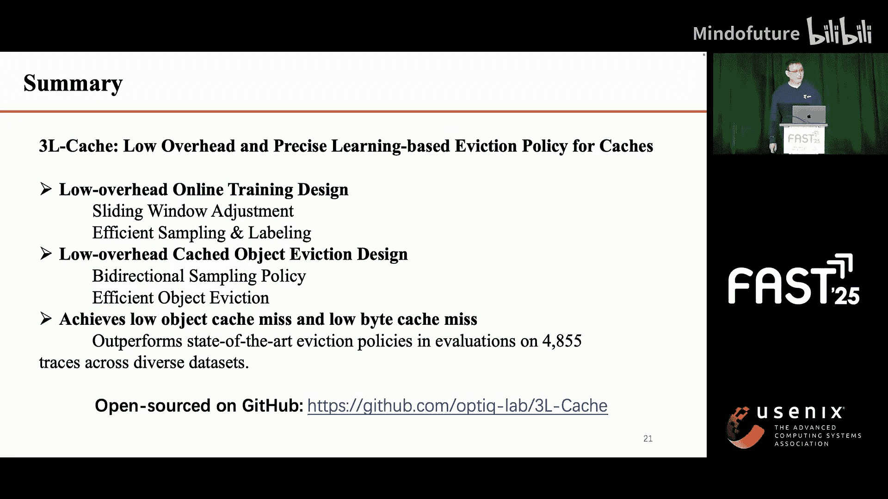

# 016：3L-Cache - 一种低开销、高精度的基于学习的缓存淘汰策略

## 概述

在本教程中，我们将学习一种名为 **3L-Cache** 的新型缓存淘汰策略。该策略旨在通过机器学习方法，在显著降低计算开销的同时，保持甚至提升缓存命中率。我们将从缓存系统的基本概念讲起，逐步深入到3L-Cache的设计原理、核心优化技术及其性能评估。

## 缓存系统与淘汰策略简介

上一节我们介绍了教程的概述，本节中我们来看看缓存系统的基本概念。

当用户发出请求时，请求首先会经过一个离用户更近的边缘缓存系统。如果请求的数据在缓存中（即缓存命中），缓存系统会直接响应该请求，而无需访问原始服务器。这不仅加快了用户的响应时间，也显著减少了网络运营商的网络流量。

然而，与互联网上的海量数据相比，缓存空间是有限的。当缓存空间已满时，**缓存淘汰策略** 就变得至关重要，它决定了应该从缓存存储中移除哪些数据。评估淘汰策略有两个关键指标：
*   **对象未命中率**：反映请求的响应速度。
*   **字节未命中率**：反映减少的网络流量。

这两个指标对于评估淘汰策略都非常重要。

## 基于学习的淘汰策略演进

上一节我们了解了缓存淘汰策略的重要性，本节中我们来看看其发展历程。

随着时间的推移，人们提出了各种方法来改进缓存淘汰策略。观察近年趋势，我们发现过去五年中，**基于学习的策略** 比传统的启发式方法获得了更多关注。

这种转变的主要原因是，基于学习的方法能够适应不同的工作负载并微调参数，从而相比启发式方法有助于降低未命中率。因此，本工作专注于基于学习的淘汰策略。

在学术界，我们根据学习粒度将基于学习的淘汰策略分为三类：
以下是三种主要的学习粒度分类：
1.  **策略级学习**：在专家策略（如LRU和LFU）之间进行选择。
2.  **组级学习**：预测组的淘汰权重，并基于组级淘汰权重来淘汰对象。
3.  **对象级学习**：对多个对象进行采样，预测每个对象的淘汰权重以做出淘汰决策。

通过从每类中选择代表性策略进行评估，我们发现策略级和组级方法在某些情况下可能表现出更差的未命中率，而**对象级学习** 在两种未命中率上都表现良好且非常稳定。

但是，对象级学习有一个很大的缺点：**计算成本最高**。以RRB为例，其计算成本可能比LRU高172倍。此外，分析HLB在Twitter数据集上的实时CPU开销时，我们看到了巨大的波动，CPU使用率可能在1.5倍到3倍之间摆动。

## 3L-Cache的设计目标与挑战

基于上述观察和分析，我们提出了核心问题：**能否在保持对象级学习未命中率优势的同时，显著降低其CPU开销？** 如果可以，它将成为理想的基于学习的淘汰策略。

我们首先分析了对象级学习策略的计算开销。结论是：**训练和预测共同主导了计算开销**，但它们的影响随缓存大小而变化。在小缓存中，较高的未命中率使得预测占开销的83%。在大缓存中，预测降至45%，而训练开销保持稳定并成为主要开销。这凸显了需要同时降低训练和预测成本以提高效率。

我们总结了面临的关键挑战：
以下是3L-Cache需要解决的三个核心挑战：
1.  如何在不降低模型准确性的情况下减少训练中的开销浪费？
2.  如何在不牺牲未命中率的情况下减少预测开销？
3.  如何提高策略在不同数据轨迹上的泛化能力？

我们的目标是实现一个具备**低开销、低字节未命中率和低对象未命中率**的策略，我们称之为 **3L-Cache**。

## 3L-Cache的核心设计

上一节我们明确了设计目标与挑战，本节中我们将深入探讨3L-Cache的具体设计。

这是3L-Cache的设计概览。首先，为了在不损害未命中率的前提下实现低频训练，我们引入了训练数据收集机制。其次，我们设计了更高效的采样和淘汰方法。第三，我们开发了高效的参数自动调整机制，以动态调整参数来增强整体系统性能。

### 1. 高效训练数据收集

我们的训练数据收集机制会过滤不必要的缓存请求，在确保高预测精度的同时降低训练频率。

我们采用滑动窗口调整，使用一个超参数滑动因子来动态快速地调整窗口大小。

高效的采样和标注包含四个步骤：
以下是采样与标注的四个步骤：
1.  **采样**：每个请求随机采样一个对象。
2.  **去重记录**：存储采样时间，并拒绝重复记录，直到该对象被再次请求。这是我们设计的关键之一。
3.  **标注**：标记被再次请求的对象，并记录其间隔时间。
4.  **更新**：在累积了M个样本后重新训练模型。在我们的实验中，发现M应在32K到128K之间。

这种方法确保了高效且轻量级的训练。

我们使用**梯度提升机（GBM）** 来预测对象的下次访问间隔时间的对数。选择GBM是因为它能有效处理缺失的历史特征，而无需昂贵的插补操作。

3L-Cache使用6个输入特征来预测未来访问时间，实验结果表明这些特征足以保持较高的模型准确性。

### 2. 双向采样策略

我们的第二个关键设计是**双向采样策略**，它通过优先处理非热门对象来提高淘汰效率，从而减少预测开销。

在LRU缓存队列中，热门和非热门对象混合在一起，但非热门对象倾向于在队列尾部积累。我们利用这种分布特点，采用两种采样策略：
以下是两种采样策略：
1.  **从尾部采样**：我们从队列最后8%的部分采样所有对象，其余对象仅在其访问频率小于或等于阈值F时才被采样。
2.  **从头部采样**：这是因为新到达的对象遵循Zipf分布，意味着它们中的大多数实际上是非热门的。由于新对象和热门对象在头部混合，我们使用一个记录队列来跟踪新到达的对象，以便更快地识别和采样。这个过程持续到新对象占缓存的比例少于2%。

通过结合这两种方法，我们通过采样非热门对象来优化淘汰决策。

为了进一步提高效率和淘汰精度，我们为未被淘汰的对象引入了**累积预测结果**。这增加了淘汰候选对象的数量，从而做出更精确的淘汰决策。

然而，累积的预测结果可能增长到很大。因此，我们还提出了一种高效的管理方法，通过结合堆和哈希表来高效处理大规模的累积数据。

通过这些优化，我们成功地将淘汰率提高到50%，显著降低了预测开销，同时保持了高淘汰精度。

### 3. 参数自动调优

为了实现策略在不同数据轨迹上的泛化，我们还设计了序列缓存中的参数自动调优机制。具体细节请参阅论文。

## 性能评估

上一节我们介绍了3L-Cache的核心设计，本节中我们来看看它的实际性能表现。

在评估中，我们使用了8个开源数据集，覆盖超过4K条轨迹，来评估策略性能。我们比较了12种缓存淘汰策略，其中6种是基于启发式的，6种是基于学习的。

**字节未命中率总结**：
在小缓存容量下，3L-Cache在约30%的测试轨迹中实现了最低的未命中率。在腾讯小容量缓存评估中，相比LRU，我们平均降低了12%的未命中率。
在大缓存容量下，如图所示，也能观察到性能收益。

**对象未命中率总结**：
在小缓存容量下，3L-Cache在66%的测试数据轨迹中实现了最低的对象未命中率。在腾讯小容量缓存评估中，3L-Cache在90分位处将LRU的对象未命中率降低了超过44.8%，平均降低22.3%。

**CPU开销总结**（这是本文的主要目标）：
在小数据量下，3L-Cache的平均CPU开销仅比LRU高2.6倍，比RHD高6.4倍。
在大数据量下，与LRU相比，3L-Cache的平均CPU开销仅为3.4倍。

## 总结

本节课中我们一起学习了3L-Cache缓存淘汰策略。总而言之，3L-Cache具备低开销的在线训练设计和低开销的淘汰设计。它实现了低对象未命中率和低字节未命中率，并在许多场景下超越了现有的先进淘汰策略。

如果您想查看代码，请访问我们的GitHub仓库。